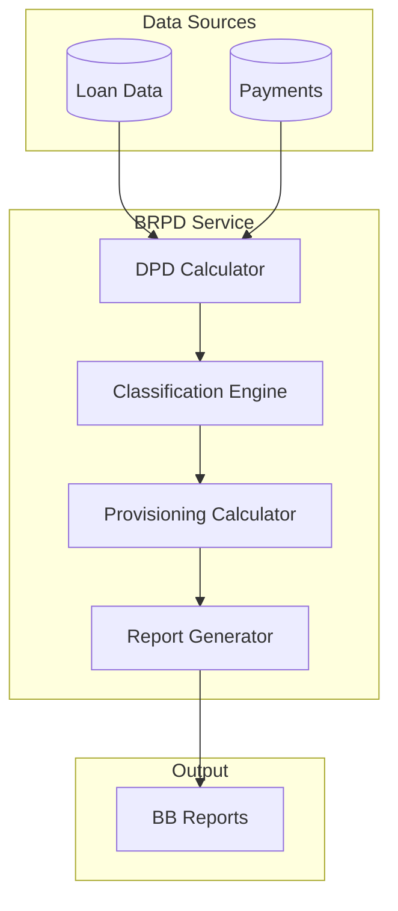

**Document Control**

| Field | Value |
|-------|-------|
| **Document Title** | BRPD Service Technical Specification |
| **Project Name** | Unisoft Loan Management System (ULMS) v2.0 |
| **Document Version** | 1.0 |
| **Date** | 2026-02-05 |
| **Prepared By** | Technical Lead |
| **Reviewed By** | Solution Architect |
| **Classification** | Confidential |
| **Status** | Draft |

---

# BRPD Service Technical Specification

## Table of Contents

1. [Introduction](#1-introduction)
2. [BRPD 15/2024 Classification](#2-brpd-152024-classification)
3. [Service Architecture](#3-service-architecture)
4. [API Specification](#4-api-specification)
5. [Data Model](#5-data-model)

---

## 1. Introduction

This document specifies the BRPD (Bangladesh Bank Banking Regulation and Policy Department) compliance service implementing loan classification as per Circular 15/2024.

## 2. BRPD 15/2024 Classification

| Stage | Classification | DPD Range | Provision Rate |
|-------|---------------|-----------|----------------|
| STD-0 | Standard (Current) | 0 days | 1% |
| STD-1 | Standard (Watch) | 1-30 days | 1% |
| STD-2 | Standard (Caution) | 31-60 days | 1% |
| SMA | Special Mention Account | 61-90 days | 5% |
| SS | Substandard | 91-180 days | 20% |
| DF | Doubtful | 181-365 days | 50% |
| BL | Bad/Loss | >365 days | 100% |

## 3. Service Architecture



## 4. API Specification

### Endpoints

| Endpoint | Method | Description |
|----------|--------|-------------|
| /brpd/classify/{loanId} | POST | Classify single loan |
| /brpd/classify/batch | POST | Batch classification |
| /brpd/provisioning | GET | Calculate provisions |
| /brpd/reports/{type} | GET | Generate reports |

## 5. Data Model

```java
@Entity
@Table(name = "ulms_loan_classification")
@Data
@Builder
public class LoanClassification {
    
    @Id
    @GeneratedValue(strategy = GenerationType.IDENTITY)
    private Long id;
    
    @Column(nullable = false)
    private Long loanId;
    
    @Enumerated(EnumType.STRING)
    @Column(nullable = false)
    private BrpdClassification classification;
    
    @Column(nullable = false)
    private Integer daysPastDue;
    
    @Column(nullable = false)
    private LocalDate effectiveDate;
    
    @Column
    private LocalDate endDate;
    
    @Column(nullable = false)
    private BigDecimal outstandingAmount;
    
    @Column(nullable = false)
    private BigDecimal provisionRequired;
    
    @Column(nullable = false)
    private BigDecimal provisionRate;
    
    @Version
    private Long version;
}

public enum BrpdClassification {
    STD_0, STD_1, STD_2, SMA, SS, DF, BL
}
```

---

*© 2026 Unisoft Systems Limited. All Rights Reserved.*
