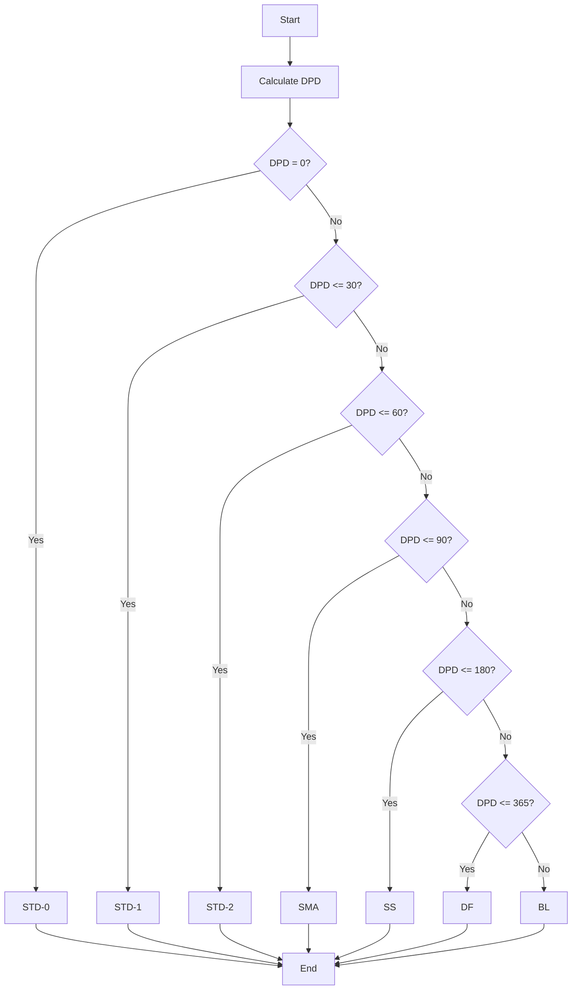

**Document Control**

| Field | Value |
|-------|-------|
| **Document Title** | Classification Algorithm Design |
| **Project Name** | Unisoft Loan Management System (ULMS) v2.0 |
| **Document Version** | 1.0 |
| **Date** | 2026-02-05 |
| **Prepared By** | Technical Lead |
| **Reviewed By** | Solution Architect |
| **Classification** | Internal |
| **Status** | Draft |

---

# Classification Algorithm Design

## Algorithm Flow



## Implementation

```java
@Component
public class ClassificationAlgorithm {
    
    public ClassificationResult classify(int dpd, BigDecimal outstanding) {
        BrpdClassification classification = classifyByDPD(dpd);
        BigDecimal provisionRate = getProvisionRate(classification);
        BigDecimal provisionAmount = outstanding
            .multiply(provisionRate)
            .divide(BigDecimal.valueOf(100), 2, RoundingMode.HALF_UP);
        
        return ClassificationResult.builder()
            .classification(classification)
            .dpd(dpd)
            .provisionRate(provisionRate)
            .provisionAmount(provisionAmount)
            .build();
    }
    
    private BrpdClassification classifyByDPD(int dpd) {
        return switch (dpd) {
            case 0 -> BrpdClassification.STD_0;
            case 1, 2, 3, 4, 5, 6, 7, 8, 9, 10,
                 11, 12, 13, 14, 15, 16, 17, 18, 19, 20,
                 21, 22, 23, 24, 25, 26, 27, 28, 29, 30 -> BrpdClassification.STD_1;
            case 31, 32, 33, 34, 35, 36, 37, 38, 39, 40,
                 41, 42, 43, 44, 45, 46, 47, 48, 49, 50,
                 51, 52, 53, 54, 55, 56, 57, 58, 59, 60 -> BrpdClassification.STD_2;
            case 61, 62, 63, 64, 65, 66, 67, 68, 69, 70,
                 71, 72, 73, 74, 75, 76, 77, 78, 79, 80,
                 81, 82, 83, 84, 85, 86, 87, 88, 89, 90 -> BrpdClassification.SMA;
            default -> {
                if (dpd <= 180) yield BrpdClassification.SS;
                if (dpd <= 365) yield BrpdClassification.DF;
                yield BrpdClassification.BL;
            }
        };
    }
}
```

---

*© 2026 Unisoft Systems Limited. All Rights Reserved.*
