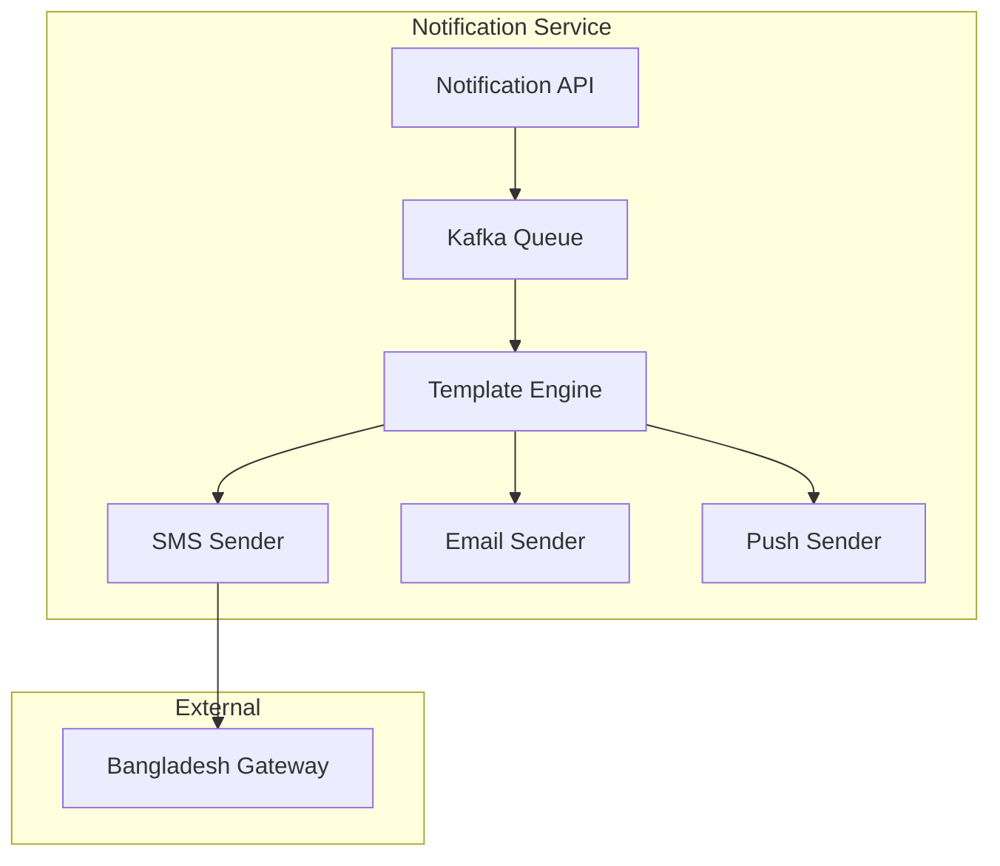

**Document Control**

| Field | Value |
|-------|-------|
| **Document Title** | Notification Service Technical Specification |
| **Project Name** | Unisoft Loan Management System (ULMS) v2.0 |
| **Document Version** | 1.0 |
| **Date** | 2026-02-05 |
| **Prepared By** | Technical Lead |
| **Reviewed By** | Solution Architect |
| **Classification** | Internal |
| **Status** | Draft |

---

# Notification Service Technical Specification

## Table of Contents

1. [Introduction](#1-introduction)
2. [Architecture](#2-architecture)
3. [Channels](#3-channels)
4. [API Specification](#4-api-specification)

---

## 1. Introduction

This document specifies the Notification Service for sending SMS, Email, and Push notifications.

## 2. Architecture



## 3. Channels

| Channel | Provider | Use Case |
|---------|----------|----------|
| SMS | bKash, SSL Wireless | OTP, Alerts |
| Email | SendGrid, AWS SES | Statements, Reports |
| Push | Firebase | App Notifications |

## 4. API Specification

### Send Notification

```http
POST /api/v1/notifications
Content-Type: application/json

{
  "channel": "SMS",
  "recipient": "01712345678",
  "template": "LOAN_APPROVED",
  "variables": {
    "customerName": "John Doe",
    "loanAmount": "500000"
  }
}
```

---

*© 2026 Unisoft Systems Limited. All Rights Reserved.*
