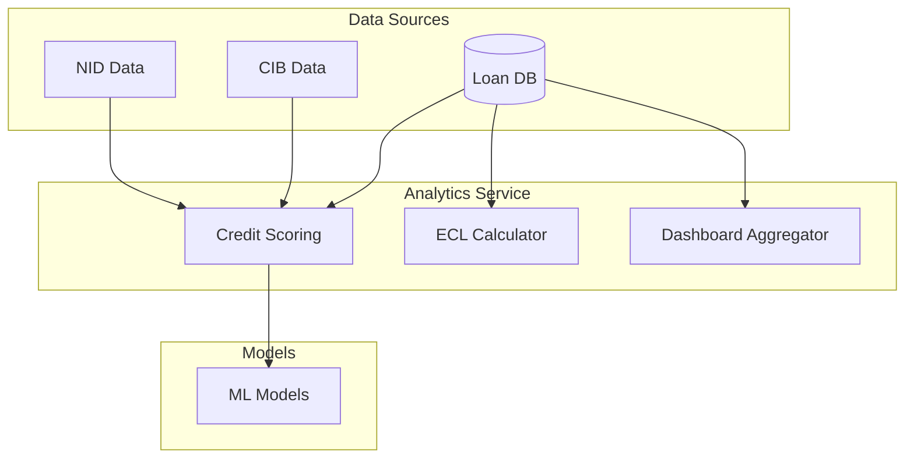

**Document Control**

| Field | Value |
|-------|-------|
| **Document Title** | Analytics Service Technical Specification |
| **Project Name** | Unisoft Loan Management System (ULMS) v2.0 |
| **Document Version** | 1.0 |
| **Date** | 2026-02-05 |
| **Prepared By** | Technical Lead |
| **Reviewed By** | Solution Architect |
| **Classification** | Confidential |
| **Status** | Draft |

---

# Analytics Service Technical Specification

## Table of Contents

1. [Introduction](#1-introduction)
2. [Architecture](#2-architecture)
3. [Components](#3-components)
4. [API Specification](#4-api-specification)

---

## 1. Introduction

This document specifies the Analytics Service for credit scoring, ECL calculation, and dashboard aggregation.

## 2. Architecture

## 3. Components

| Component | Purpose | Technology |
|-----------|---------|------------|
| Credit Scoring | Risk assessment | Python/TensorFlow |
| ECL Calculator | IFRS-9 compliance | Java/SQL |
| Dashboard Aggregator | KPI calculation | PostgreSQL |

## 4. API Specification

### Endpoints

| Endpoint | Method | Description |
|----------|--------|-------------|
| /analytics/score | POST | Calculate credit score |
| /analytics/ecl | GET | Calculate ECL |
| /analytics/dashboard | GET | Get dashboard data |
| /analytics/reports | GET | Generate reports |

---

*© 2026 Unisoft Systems Limited. All Rights Reserved.*
