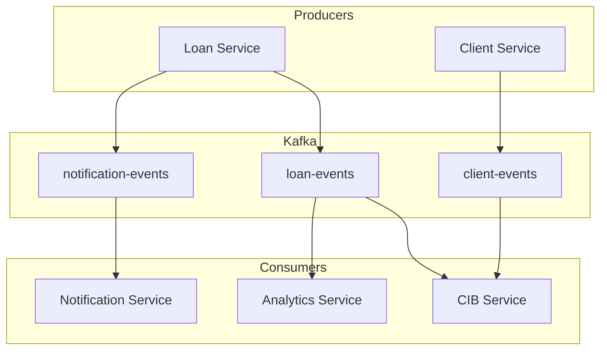

**Document Control**

| Field | Value |
|-------|-------|
| **Document Title** | Event-Driven Architecture Implementation |
| **Project Name** | Unisoft Loan Management System (ULMS) v2.0 |
| **Document Version** | 1.0 |
| **Date** | 2026-02-05 |
| **Prepared By** | Technical Lead |
| **Reviewed By** | Solution Architect |
| **Classification** | Confidential |
| **Status** | Draft |

---

# Event-Driven Architecture Implementation

## Table of Contents

1. [Architecture Overview](#1-architecture-overview)
2. [Event Types](#2-event-types)
3. [Kafka Topics](#3-kafka-topics)
4. [Event Handlers](#4-event-handlers)
5. [Event Schema](#5-event-schema)

---

## 1. Architecture Overview



## 2. Event Types

| Domain | Event | Description |
|--------|-------|-------------|
| Loan | LOAN_CREATED | New loan application |
| Loan | LOAN_APPROVED | Loan approved |
| Loan | LOAN_DISBURSED | Loan disbursed |
| Loan | LOAN_REJECTED | Loan rejected |
| Client | CLIENT_CREATED | New client onboarded |
| Client | CLIENT_UPDATED | Client info updated |
| Payment | PAYMENT_RECEIVED | Payment processed |

## 3. Kafka Topics

```yaml
kafka:
  topics:
    loan-events:
      name: ulms.loan.events
      partitions: 6
      replication-factor: 3
    client-events:
      name: ulms.client.events
      partitions: 6
      replication-factor: 3
    notification-events:
      name: ulms.notification.events
      partitions: 3
      replication-factor: 3
```

## 4. Event Handlers

### Domain Event Publisher

```java
@Component
@RequiredArgsConstructor
public class DomainEventPublisher {
    
    private final KafkaTemplate<String, DomainEvent> kafkaTemplate;
    private final ObjectMapper objectMapper;
    
    public void publish(DomainEvent event) {
        String topic = getTopicForEvent(event);
        String key = event.getAggregateId();
        
        kafkaTemplate.send(topic, key, event)
            .whenComplete((result, ex) -> {
                if (ex != null) {
                    log.error("Failed to publish event: {}", event, ex);
                }
            });
    }
    
    private String getTopicForEvent(DomainEvent event) {
        return "ulms." + event.getDomain() + ".events";
    }
}
```

### Event Listener

```java
@Component
@RequiredArgsConstructor
@Slf4j
public class LoanEventHandler {
    
    private final CibReportingService cibService;
    private final NotificationService notificationService;
    
    @KafkaListener(topics = "ulms.loan.events", groupId = "cib-integration")
    public void handleLoanEvents(ConsumerRecord<String, LoanEvent> record) {
        LoanEvent event = record.value();
        
        switch (event.getEventType()) {
            case "LOAN_APPROVED" -> 
                cibService.reportLoanApproved(event.getLoanId());
            case "LOAN_DISBURSED" ->
                cibService.reportDisbursement(event.getLoanId());
        }
    }
    
    @KafkaListener(topics = "ulms.loan.events", groupId = "notification-service")
    public void handleNotifications(ConsumerRecord<String, LoanEvent> record) {
        LoanEvent event = record.value();
        
        notificationService.sendLoanNotification(
            event.getEventType(),
            event.getLoanId()
        );
    }
}
```

## 5. Event Schema

```java
@Data
@Builder
public class DomainEvent {
    private String eventId;
    private String eventType;
    private String domain;
    private String aggregateId;
    private LocalDateTime timestamp;
    private Map<String, Object> payload;
    private String version;
}

@Data
@Builder
public class LoanEvent {
    private String eventId;
    private String eventType;  // LOAN_CREATED, LOAN_APPROVED, etc.
    private Long loanId;
    private Long clientId;
    private BigDecimal amount;
    private LocalDateTime timestamp;
    private String initiatedBy;
}
```

---

*© 2026 Unisoft Systems Limited. All Rights Reserved.*
