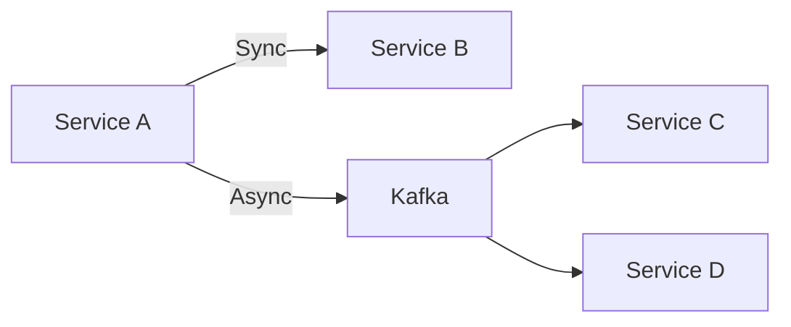

**Document Control**

| Field | Value |
|-------|-------|
| **Document Title** | Microservices Communication Patterns |
| **Project Name** | Unisoft Loan Management System (ULMS) v2.0 |
| **Document Version** | 1.0 |
| **Date** | 2026-02-05 |
| **Prepared By** | Technical Lead |
| **Reviewed By** | Solution Architect |
| **Classification** | Confidential |
| **Status** | Draft |

---

# Microservices Communication Patterns

## Table of Contents

1. [Communication Types](#1-communication-types)
2. [Synchronous Communication](#2-synchronous-communication)
3. [Asynchronous Communication](#3-asynchronous-communication)
4. [Service Discovery](#4-service-discovery)
5. [Load Balancing](#5-load-balancing)

---

## 1. Communication Types



| Type | Use Case | Technology |
|------|----------|------------|
| Sync | Query data, Validate | REST, gRPC |
| Async | Events, Notifications | Kafka, RabbitMQ |

## 2. Synchronous Communication

### REST with WebClient

```java
@Service
public class ServiceCommunication {
    
    private final WebClient webClient;
    
    public Mono<LoanDetails> getLoanDetails(Long loanId) {
        return webClient.get()
            .uri("/api/v1/loans/{id}", loanId)
            .retrieve()
            .bodyToMono(LoanDetails.class)
            .timeout(Duration.ofSeconds(5));
    }
}
```

### Resilience Patterns

```java
@CircuitBreaker(name = "loan-service")
@Retry(name = "loan-service")
@TimeLimiter(name = "loan-service")
public Mono<LoanDetails> getLoanDetails(Long loanId) {
    return webClient.get()
        .uri("/api/v1/loans/{id}", loanId)
        .retrieve()
        .bodyToMono(LoanDetails.class);
}
```

## 3. Asynchronous Communication

### Kafka Producer

```java
@Service
@RequiredArgsConstructor
public class LoanEventProducer {
    
    private final KafkaTemplate<String, LoanEvent> kafkaTemplate;
    
    public void publishLoanApproved(Loan loan) {
        LoanEvent event = LoanEvent.builder()
            .loanId(loan.getId())
            .eventType("LOAN_APPROVED")
            .timestamp(LocalDateTime.now())
            .build();
        
        kafkaTemplate.send("loan-events", loan.getId().toString(), event);
    }
}
```

### Kafka Consumer

```java
@Component
@RequiredArgsConstructor
public class LoanEventConsumer {
    
    private final CibService cibService;
    
    @KafkaListener(topics = "loan-events", groupId = "cib-service")
    public void handleLoanApproved(LoanEvent event) {
        if ("LOAN_APPROVED".equals(event.getEventType())) {
            cibService.reportToCib(event.getLoanId());
        }
    }
}
```

## 4. Service Discovery

### Consul Configuration

```yaml
spring:
  cloud:
    consul:
      host: localhost
      port: 8500
      discovery:
        service-name: ${spring.application.name}
        health-check-interval: 10s
```

## 5. Load Balancing

### Spring Cloud LoadBalancer

```java
@Configuration
public class LoadBalancerConfig {
    
    @Bean
    public ServiceInstanceListSupplier discoveryClientServiceInstanceListSupplier(
            ConfigurableApplicationContext context) {
        return ServiceInstanceListSupplier.builder()
            .withDiscoveryClient()
            .withHealthChecks()
            .build(context);
    }
}
```

---

*© 2026 Unisoft Systems Limited. All Rights Reserved.*
