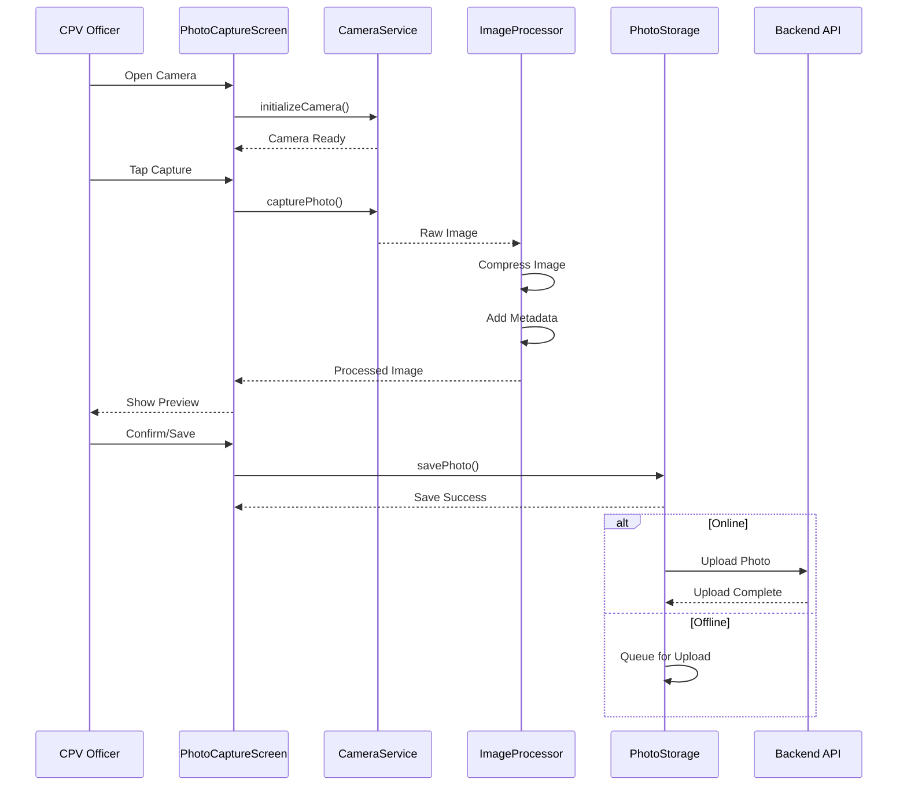

# Camera Integration Design

## Photo Capture System for ULMS CPV Mobile Application

---

**Document Control**

| Field | Value |
|-------|-------|
| **Document Title** | Camera Integration Design |
| **Project Name** | Unisoft Loan Management System (ULMS) v2.0 |
| **Document Version** | 1.0 |
| **Date** | 2026-02-05 |
| **Prepared By** | Mobile Development Team |
| **Reviewed By** | Technical Lead |
| **Classification** | Confidential |
| **Status** | Draft |

**Revision History**

| Version | Date | Author | Description |
|---------|------|--------|-------------|
| 1.0 | 2026-02-05 | Mobile Team | Initial camera integration design |

---

## Table of Contents

1. [Executive Summary](#1-executive-summary)
2. [Camera Requirements](#2-camera-requirements)
3. [Architecture Overview](#3-architecture-overview)
4. [Camera Service Implementation](#4-camera-service-implementation)
5. [Photo Capture Flow](#5-photo-capture-flow)
6. [Image Processing](#6-image-processing)
7. [Metadata Handling](#7-metadata-handling)
8. [Photo Storage and Gallery](#8-photo-storage-and-gallery)
9. [Upload Strategy](#9-upload-strategy)
10. [Error Handling](#10-error-handling)
11. [Testing Approach](#11-testing-approach)
12. [Troubleshooting](#12-troubleshooting)
13. [Related Documents](#13-related-documents)

---

## 1. Executive Summary

This document defines the camera integration design for the ULMS CPV Mobile Application, enabling CPV officers to capture high-quality verification photos with embedded metadata. The solution uses React Native Vision Camera 3.8.0 for optimal performance and supports automatic image compression, GPS tagging, and offline storage.

### Key Features

| Feature | Specification |
|---------|---------------|
| **Camera Library** | React Native Vision Camera 3.8.0 |
| **Resolution** | 1920x1080 (configurable) |
| **Compression** | JPEG quality 0.8, target <500KB |
| **Metadata** | GPS coordinates, timestamp, device ID |
| **Offline Storage** | 500+ photos capacity |
| **Batch Upload** | Automatic on WiFi, manual on cellular |

---

## 2. Camera Requirements

### 2.1 Functional Requirements

| ID | Requirement | Priority |
|----|-------------|----------|
| CAM-001 | Capture photos with auto-focus | High |
| CAM-002 | Flash control (auto/on/off) | Medium |
| CAM-003 | Camera switching (front/back) | Medium |
| CAM-004 | Real-time GPS overlay preview | Medium |
| CAM-005 | Photo review before save | High |
| CAM-006 | Multiple photos per verification | High |
| CAM-007 | Offline photo storage | High |

### 2.2 Technical Requirements

| Parameter | Minimum | Target |
|-----------|---------|--------|
| Capture Speed | <2 seconds | <1 second |
| Image Quality | 80% | 85% |
| File Size | <1MB | <500KB |
| Storage Capacity | 200 photos | 500 photos |
| Upload Speed | 30s/photo on 3G | 10s/photo on 4G |

---

## 3. Architecture Overview

### 3.1 Camera Architecture Diagram

```
┌─────────────────────────────────────────────────────────────────────────────────┐
│                         Camera Integration Architecture                          │
├─────────────────────────────────────────────────────────────────────────────────┤
│                                                                                 │
│  ┌─────────────────────────────────────────────────────────────────────────┐   │
│  │                         Application Layer                                │   │
│  │  ┌──────────────┐  ┌──────────────┐  ┌──────────────┐  ┌──────────────┐  │   │
│  │  │   Photo      │  │   Camera     │  │   Photo      │  │   Photo      │  │   │
│  │  │   Capture    │  │   Preview    │  │   Review     │  │   Gallery    │  │   │
│  │  │   Screen     │  │   Component  │  │   Screen     │  │   Screen     │  │   │
│  │  └──────┬───────┘  └──────┬───────┘  └──────┬───────┘  └──────┬───────┘  │   │
│  │         │                 │                 │                 │          │   │
│  │         └─────────────────┴────────┬────────┴─────────────────┘          │   │
│  │                                    │                                     │   │
│  │  ┌─────────────────────────────────┴─────────────────────────────────┐  │   │
│  │  │                        Camera Service Layer                        │  │   │
│  │  │  ┌──────────────┐  ┌──────────────┐  ┌──────────────┐            │  │   │
│  │  │  │   Camera     │  │   Photo      │  │   Metadata   │            │  │   │
│  │  │  │   Manager    │  │   Processor  │  │   Embedder   │            │  │   │
│  │  │  └──────────────┘  └──────────────┘  └──────────────┘            │  │   │
│  │  │  ┌──────────────┐  ┌──────────────┐  ┌──────────────┐            │  │   │
│  │  │  │   Storage    │  │   Upload     │  │   Offline    │            │  │   │
│  │  │  │   Manager    │  │   Queue      │  │   Handler    │            │  │   │
│  │  │  └──────────────┘  └──────────────┘  └──────────────┘            │  │   │
│  │  └──────────────────────────────────────────────────────────────────┘  │   │
│  └────────────────────────────────────────────────────────────────────────┘   │
│                                      │                                          │
│  ┌───────────────────────────────────┴───────────────────────────────────────┐ │
│  │                     React Native Vision Camera                             │ │
│  └───────────────────────────────────────────────────────────────────────────┘ │
│                                      │                                          │
│                                      ▼                                          │
│  ┌────────────────────────────────────────────────────────────────────────────┐│
│  │                           Device Hardware                                   ││
│  │  ┌────────────┐  ┌────────────┐  ┌────────────┐  ┌────────────┐           ││
│  │  │   Rear     │  │   Front    │  │   Flash    │  │  Storage   │           ││
│  │  │   Camera   │  │   Camera   │  │   Module   │  │   (Flash)  │           ││
│  │  └────────────┘  └────────────┘  └────────────┘  └────────────┘           ││
│  └────────────────────────────────────────────────────────────────────────────┘│
│                                                                                 │
└─────────────────────────────────────────────────────────────────────────────────┘
```

---

## 4. Camera Service Implementation

### 4.1 Camera Service

```typescript
// src/services/camera/cameraService.ts
import { Camera, useCameraDevices, PhotoFile } from 'react-native-vision-camera';
import { Platform, PermissionsAndroid } from 'react-native';

export enum CameraPosition {
  BACK = 'back',
  FRONT = 'front',
}

export enum FlashMode {
  AUTO = 'auto',
  ON = 'on',
  OFF = 'off',
}

export interface CaptureOptions {
  flash?: FlashMode;
  quality?: 'low' | 'medium' | 'high';
}

export class CameraService {
  private cameraRef: Camera | null = null;
  private currentPosition: CameraPosition = CameraPosition.BACK;

  setCameraRef(ref: Camera | null): void {
    this.cameraRef = ref;
  }

  async requestPermissions(): Promise<boolean> {
    const cameraPermission = await Camera.requestCameraPermission();
    
    if (cameraPermission !== 'granted') {
      return false;
    }

    if (Platform.OS === 'android') {
      const granted = await PermissionsAndroid.request(
        PermissionsAndroid.PERMISSIONS.WRITE_EXTERNAL_STORAGE
      );
      return granted === PermissionsAndroid.RESULTS.GRANTED;
    }

    return true;
  }

  async capturePhoto(options: CaptureOptions = {}): Promise<PhotoFile> {
    if (!this.cameraRef) {
      throw new Error('Camera not initialized');
    }

    const photo = await this.cameraRef.takePhoto({
      flash: options.flash || 'auto',
      enableShutterSound: false,
    });

    return photo;
  }

  toggleCamera(): CameraPosition {
    this.currentPosition = this.currentPosition === CameraPosition.BACK 
      ? CameraPosition.FRONT 
      : CameraPosition.BACK;
    return this.currentPosition;
  }
}

export const cameraService = new CameraService();
```

### 4.2 Image Processing

```typescript
// src/services/camera/imageProcessor.ts
import * as ImageManipulator from 'expo-image-manipulator';
import * as FileSystem from 'expo-file-system';

export interface ProcessingOptions {
  maxWidth?: number;
  maxHeight?: number;
  quality?: number;
}

export class ImageProcessor {
  async process(
    photoUri: string,
    options: ProcessingOptions = {}
  ): Promise<{ uri: string; width: number; height: number; size: number }> {
    const mergedOptions = {
      maxWidth: 1920,
      maxHeight: 1080,
      quality: 0.85,
      ...options,
    };

    const processed = await ImageManipulator.manipulateAsync(
      photoUri,
      [{ resize: { width: mergedOptions.maxWidth, height: mergedOptions.maxHeight } }],
      {
        compress: mergedOptions.quality,
        format: ImageManipulator.SaveFormat.JPEG,
      }
    );

    const fileInfo = await FileSystem.getInfoAsync(processed.uri);

    return {
      uri: processed.uri,
      width: processed.width,
      height: processed.height,
      size: fileInfo.size || 0,
    };
  }

  async compressToSize(photoUri: string, targetSizeKB: number = 500) {
    let quality = 0.9;
    let processed = await this.process(photoUri, { quality });

    while (processed.size > targetSizeKB * 1024 && quality > 0.3) {
      quality -= 0.1;
      processed = await this.process(photoUri, { quality });
    }

    return processed;
  }
}

export const imageProcessor = new ImageProcessor();
```

---

## 5. Photo Capture Flow

### 5.1 Capture Flow Diagram



---

## 6. Metadata Handling

### 6.1 Metadata Structure

```typescript
// src/services/photos/metadataService.ts
export interface PhotoMetadata {
  gpsLatitude: number;
  gpsLongitude: number;
  gpsAccuracy: number | null;
  captureTimestamp: number;
  verificationId: string;
  photoType: 'residence' | 'business' | 'landmark' | 'document';
  deviceId: string;
  deviceModel: string;
  appVersion: string;
}

export class MetadataService {
  generateMetadata(data: {
    location: { latitude: number; longitude: number; accuracy?: number } | null;
    verificationId: string;
    photoType: PhotoMetadata['photoType'];
  }): PhotoMetadata {
    return {
      gpsLatitude: data.location?.latitude ?? 0,
      gpsLongitude: data.location?.longitude ?? 0,
      gpsAccuracy: data.location?.accuracy ?? null,
      captureTimestamp: Date.now(),
      verificationId: data.verificationId,
      photoType: data.photoType,
      deviceId: 'device-id',
      deviceModel: 'unknown',
      appVersion: '2.0.0',
    };
  }
}
```

---

## 7. Photo Storage

### 7.1 Storage Service

```typescript
// src/services/photos/photoStorage.ts
import * as FileSystem from 'expo-file-system';
import { MMKV } from 'react-native-mmkv';

const PHOTO_DIRECTORY = `${FileSystem.documentDirectory}photos/`;
const metadataStorage = new MMKV({ id: 'photo-metadata' });

export interface StoredPhoto {
  id: string;
  uri: string;
  metadata: any;
  uploaded: boolean;
}

export class PhotoStorage {
  async initialize(): Promise<void> {
    const dir = await FileSystem.getInfoAsync(PHOTO_DIRECTORY);
    if (!dir.exists) {
      await FileSystem.makeDirectoryAsync(PHOTO_DIRECTORY, { intermediates: true });
    }
  }

  async savePhoto(photoUri: string, metadata: any): Promise<StoredPhoto> {
    const id = `${Date.now()}_${Math.random().toString(36).substr(2, 9)}`;
    const destinationUri = `${PHOTO_DIRECTORY}${id}.jpg`;

    await FileSystem.copyAsync({ from: photoUri, to: destinationUri });

    const storedPhoto: StoredPhoto = {
      id,
      uri: destinationUri,
      metadata,
      uploaded: false,
    };

    metadataStorage.set(id, JSON.stringify(storedPhoto));
    return storedPhoto;
  }

  getPhotosByVerification(verificationId: string): StoredPhoto[] {
    const keys = metadataStorage.getAllKeys();
    const photos: StoredPhoto[] = [];

    keys.forEach(key => {
      const data = metadataStorage.getString(key);
      if (data) {
        const photo: StoredPhoto = JSON.parse(data);
        if (photo.metadata.verificationId === verificationId) {
          photos.push(photo);
        }
      }
    });

    return photos;
  }

  markAsUploaded(photoId: string): void {
    const data = metadataStorage.getString(photoId);
    if (data) {
      const photo: StoredPhoto = JSON.parse(data);
      photo.uploaded = true;
      metadataStorage.set(photoId, JSON.stringify(photo));
    }
  }
}

export const photoStorage = new PhotoStorage();
```

---

## 8. Upload Strategy

### 8.1 Upload Queue

```typescript
// src/services/photos/uploadQueue.ts
import { SyncEngine, SyncOperationType, SyncEntityType } from '../sync/syncEngine';

export class PhotoUploadQueue {
  async queuePhotoForUpload(photoId: string, photoUri: string): Promise<void> {
    const engine = SyncEngine.getInstance();
    
    engine.enqueue({
      type: SyncOperationType.UPLOAD,
      entity: SyncEntityType.PHOTO,
      entityId: photoId,
      data: { photoId, photoUri },
      maxRetries: 5,
      priority: 3,
    });
  }
}
```

---

## 9. Error Handling

| Error Code | Description | Resolution |
|------------|-------------|------------|
| CAM-001 | Camera permission denied | Request permission, explain requirement |
| CAM-002 | Camera hardware unavailable | Show error, suggest device check |
| CAM-003 | Photo capture failed | Retry capture, check storage space |
| CAM-004 | Image processing failed | Retry with lower quality |
| CAM-005 | Storage full | Alert user, suggest clearing old photos |
| CAM-006 | Upload failed | Queue for retry, use exponential backoff |

---

## 10. Testing Approach

```typescript
// __tests__/camera/cameraService.test.ts
describe('CameraService', () => {
  let service: CameraService;

  beforeEach(() => {
    service = new CameraService();
  });

  describe('requestPermissions', () => {
    it('should return true when permission granted', async () => {
      // Mock permission granted
      const result = await service.requestPermissions();
      expect(result).toBe(true);
    });
  });

  describe('toggleCamera', () => {
    it('should toggle between front and back', () => {
      expect(service.toggleCamera()).toBe('front');
      expect(service.toggleCamera()).toBe('back');
    });
  });
});
```

---

## 11. Troubleshooting

| Issue | Cause | Solution |
|-------|-------|----------|
| Camera shows black screen | Permission denied | Check camera permission in settings |
| Photos too large | High resolution | Reduce quality setting |
| Upload fails repeatedly | Poor connection | Wait for WiFi, retry manually |
| Storage warning | Too many photos | Delete old uploaded photos |
| GPS not in metadata | Location unavailable | Ensure GPS signal before capture |

---

## 12. Related Documents

| Document | Purpose | Location |
|----------|---------|----------|
| `[MOB]_React_Native_CPV_App_Architecture_v1.0.md` | Overall mobile architecture | `01_Mobile_Architecture/` |
| `[MOB]_GPS_Integration_Design_v1.0.md` | GPS metadata integration | `01_Mobile_Architecture/` |
| `[MOB]_Field_Verification_UI_v1.0.md` | Photo capture UI | `02_Mobile_Features/` |

---

**Document End**

*© 2026 Unisoft Systems Limited. All Rights Reserved.*
