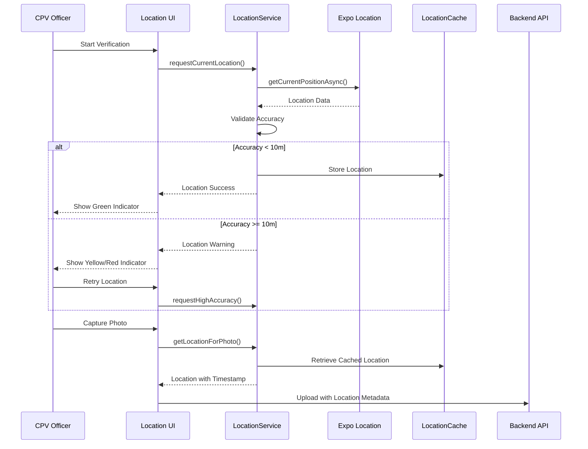

# GPS Integration Design

## GPS Location Services for ULMS CPV Mobile Application

---

**Document Control**

| Field | Value |
|-------|-------|
| **Document Title** | GPS Integration Design |
| **Project Name** | Unisoft Loan Management System (ULMS) v2.0 |
| **Document Version** | 1.0 |
| **Date** | 2026-02-05 |
| **Prepared By** | Mobile Development Team |
| **Reviewed By** | Technical Lead |
| **Classification** | Confidential |
| **Status** | Draft |

**Revision History**

| Version | Date | Author | Description |
|---------|------|--------|-------------|
| 1.0 | 2026-02-05 | Mobile Team | Initial GPS integration design |

---

## Table of Contents

1. [Executive Summary](#1-executive-summary)
2. [GPS Requirements](#2-gps-requirements)
3. [Architecture Overview](#3-architecture-overview)
4. [Location Service Implementation](#4-location-service-implementation)
5. [Permission Management](#5-permission-management)
6. [Location Caching Strategy](#6-location-caching-strategy)
7. [GPS Accuracy and Validation](#7-gps-accuracy-and-validation)
8. [Background Location Tracking](#8-background-location-tracking)
9. [Map Integration](#9-map-integration)
10. [Error Handling](#10-error-handling)
11. [Testing Approach](#11-testing-approach)
12. [Troubleshooting](#12-troubleshooting)
13. [Related Documents](#13-related-documents)

---

## 1. Executive Summary

This document defines the GPS integration design for the ULMS CPV Mobile Application, enabling precise location tracking during field verifications. The solution ensures GPS accuracy within 10 meters, supports offline location caching, and provides robust error handling for various location scenarios common in Bangladesh's diverse geographic landscape.

### Key Requirements

| Requirement | Specification |
|-------------|---------------|
| **Accuracy** | ≤10 meters for verification photos |
| **Update Frequency** | Every 5 seconds during active verification |
| **Battery Impact** | <15% additional drain per 8-hour shift |
| **Offline Support** | Cache locations, sync when online |
| **Background Tracking** | Optional tracking during verification |
| **Geofencing** | Validate location against assigned address |

---

## 2. GPS Requirements

### 2.1 Functional Requirements

| ID | Requirement | Priority |
|----|-------------|----------|
| GPS-001 | Capture GPS coordinates for each verification photo | High |
| GPS-002 | Display real-time location accuracy indicator | High |
| GPS-003 | Validate location against applicant address | Medium |
| GPS-004 | Support GPS in offline mode | High |
| GPS-005 | Background location during verification | Medium |
| GPS-006 | Location history for verification route | Low |

### 2.2 Technical Requirements

| Parameter | Minimum | Target |
|-----------|---------|--------|
| Accuracy | 15 meters | ≤10 meters |
| Time to First Fix | 60 seconds | 30 seconds |
| Update Interval | 10 seconds | 5 seconds |
| Battery per hour | 3% | 1.5% |
| Storage per day | 10 MB | 5 MB |

---

## 3. Architecture Overview

### 3.1 GPS Architecture Diagram

```
┌─────────────────────────────────────────────────────────────────────────────────┐
│                          GPS Integration Architecture                            │
├─────────────────────────────────────────────────────────────────────────────────┤
│                                                                                 │
│  ┌─────────────────────────────────────────────────────────────────────────┐   │
│  │                         Application Layer                                │   │
│  │  ┌──────────────┐  ┌──────────────┐  ┌──────────────┐  ┌──────────────┐  │   │
│  │  │  Verification │  │   Photo      │  │   Map        │  │   Report     │  │   │
│  │  │   Screen      │  │  Capture     │  │   View       │  │   Generator  │  │   │
│  │  └──────┬───────┘  └──────┬───────┘  └──────┬───────┘  └──────┬───────┘  │   │
│  │         │                 │                 │                 │          │   │
│  │         └─────────────────┴────────┬────────┴─────────────────┘          │   │
│  │                                    │                                     │   │
│  │  ┌─────────────────────────────────┴─────────────────────────────────┐  │   │
│  │  │                     Location Service Layer                         │  │   │
│  │  │  ┌──────────────┐  ┌──────────────┐  ┌──────────────┐            │  │   │
│  │  │  │  Location    │  │  Geofencing  │  │  Accuracy    │            │  │   │
│  │  │  │  Manager     │  │  Service     │  │  Validator   │            │  │   │
│  │  │  └──────────────┘  └──────────────┘  └──────────────┘            │  │   │
│  │  │  ┌──────────────┐  ┌──────────────┐  ┌──────────────┐            │  │   │
│  │  │  │  Location    │  │  Background  │  │  Distance    │            │  │   │
│  │  │  │  Cache       │  │  Tracker     │  │  Calculator  │            │  │   │
│  │  │  └──────────────┘  └──────────────┘  └──────────────┘            │  │   │
│  │  └──────────────────────────────────────────────────────────────────┘  │   │
│  └────────────────────────────────────────────────────────────────────────┘   │
│                                      │                                          │
│  ┌───────────────────────────────────┴───────────────────────────────────────┐ │
│  │                         Native GPS APIs                                    │ │
│  │  ┌──────────────────────┐        ┌──────────────────────┐                 │ │
│  │  │     Android          │        │        iOS           │                 │ │
│  │  │  FusedLocationProvider│        │   CoreLocation       │                 │ │
│  │  │  (Google Play Svcs)  │        │   (CLLocationManager)│                 │ │
│  │  └──────────────────────┘        └──────────────────────┘                 │ │
│  └───────────────────────────────────────────────────────────────────────────┘ │
│                                      │                                          │
│                                      ▼                                          │
│  ┌────────────────────────────────────────────────────────────────────────────┐│
│  │                           Device Hardware                                   ││
│  │  ┌────────────┐  ┌────────────┐  ┌────────────┐  ┌────────────┐           ││
│  │  │    GPS     │  │    WiFi    │  │  Cellular  │  │  Bluetooth │           ││
│  │  │   Chip     │  │  Position  │  │  Towers    │  │  Beacons   │           ││
│  │  └────────────┘  └────────────┘  └────────────┘  └────────────┘           ││
│  └────────────────────────────────────────────────────────────────────────────┘│
│                                                                                 │
└─────────────────────────────────────────────────────────────────────────────────┘
```

### 3.2 Location Data Flow



---

## 4. Location Service Implementation

### 4.1 Core Location Service

```typescript
// src/services/gps/locationService.ts
import * as Location from 'expo-location';
import { LocationAccuracy } from 'expo-location';
import { Alert, Platform } from 'react-native';

export interface LocationData {
  latitude: number;
  longitude: number;
  altitude: number | null;
  accuracy: number | null;
  altitudeAccuracy: number | null;
  heading: number | null;
  speed: number | null;
  timestamp: number;
  source: 'gps' | 'network' | 'passive';
}

export interface LocationOptions {
  accuracy?: LocationAccuracy;
  timeout?: number;
  maximumAge?: number;
  distanceInterval?: number;
  mayShowUserSettingsDialog?: boolean;
}

export const DEFAULT_LOCATION_OPTIONS: LocationOptions = {
  accuracy: LocationAccuracy.BestForNavigation,
  timeout: 15000,
  maximumAge: 10000,
  distanceInterval: 0,
};

export class LocationService {
  private static instance: LocationService;
  private locationSubscription: Location.LocationSubscription | null = null;
  private cachedLocation: LocationData | null = null;

  static getInstance(): LocationService {
    if (!LocationService.instance) {
      LocationService.instance = new LocationService();
    }
    return LocationService.instance;
  }

  // Request and check permissions
  async requestPermissions(): Promise<boolean> {
    const { status: foregroundStatus } = await Location.requestForegroundPermissionsAsync();
    
    if (foregroundStatus !== 'granted') {
      Alert.alert(
        'Location Permission Required',
        'CPV verification requires location access to validate field visits.',
        [
          { text: 'Cancel', style: 'cancel' },
          { text: 'Open Settings', onPress: () => Location.openSettings() }
        ]
      );
      return false;
    }

    // Request background permission for tracking
    const { status: backgroundStatus } = await Location.requestBackgroundPermissionsAsync();
    
    return foregroundStatus === 'granted';
  }

  // Check if location services are enabled
  async isLocationEnabled(): Promise<boolean> {
    const enabled = await Location.hasServicesEnabledAsync();
    return enabled;
  }

  // Get current location with high accuracy
  async getCurrentLocation(
    options: LocationOptions = {}
  ): Promise<LocationData> {
    const mergedOptions = { ...DEFAULT_LOCATION_OPTIONS, ...options };

    try {
      const location = await Location.getCurrentPositionAsync({
        accuracy: mergedOptions.accuracy,
        mayShowUserSettingsDialog: mergedOptions.mayShowUserSettingsDialog,
      });

      const locationData: LocationData = {
        latitude: location.coords.latitude,
        longitude: location.coords.longitude,
        altitude: location.coords.altitude,
        accuracy: location.coords.accuracy,
        altitudeAccuracy: location.coords.altitudeAccuracy,
        heading: location.coords.heading,
        speed: location.coords.speed,
        timestamp: location.timestamp,
        source: this.determineSource(location.coords.accuracy),
      };

      // Cache the location
      this.cachedLocation = locationData;

      return locationData;
    } catch (error) {
      console.error('Error getting location:', error);
      throw new LocationError('Failed to get current location', error);
    }
  }

  // Get location with retry logic for better accuracy
  async getAccurateLocation(
    targetAccuracy: number = 10,
    maxAttempts: number = 5,
    timeoutPerAttempt: number = 10000
  ): Promise<LocationData> {
    for (let attempt = 1; attempt <= maxAttempts; attempt++) {
      try {
        const location = await this.getCurrentLocation({
          timeout: timeoutPerAttempt,
        });

        if (location.accuracy && location.accuracy <= targetAccuracy) {
          return location;
        }

        // Wait before retry with exponential backoff
        if (attempt < maxAttempts) {
          const delay = Math.min(1000 * Math.pow(2, attempt - 1), 5000);
          await new Promise(resolve => setTimeout(resolve, delay));
        }
      } catch (error) {
        if (attempt === maxAttempts) {
          throw error;
        }
      }
    }

    // Return best available location even if accuracy doesn't meet target
    if (this.cachedLocation) {
      return this.cachedLocation;
    }

    throw new LocationError(`Could not achieve target accuracy of ${targetAccuracy}m`);
  }

  // Start watching location updates
  async startLocationTracking(
    callback: (location: LocationData) => void,
    options: LocationOptions = {}
  ): Promise<void> {
    const hasPermission = await this.requestPermissions();
    if (!hasPermission) {
      throw new LocationError('Location permission not granted');
    }

    const mergedOptions = { ...DEFAULT_LOCATION_OPTIONS, ...options };

    this.locationSubscription = await Location.watchPositionAsync(
      {
        accuracy: mergedOptions.accuracy,
        timeInterval: 5000,
        distanceInterval: mergedOptions.distanceInterval || 5,
      },
      (location) => {
        const locationData: LocationData = {
          latitude: location.coords.latitude,
          longitude: location.coords.longitude,
          altitude: location.coords.altitude,
          accuracy: location.coords.accuracy,
          altitudeAccuracy: location.coords.altitudeAccuracy,
          heading: location.coords.heading,
          speed: location.coords.speed,
          timestamp: location.timestamp,
          source: this.determineSource(location.coords.accuracy),
        };

        this.cachedLocation = locationData;
        callback(locationData);
      }
    );
  }

  // Stop watching location updates
  stopLocationTracking(): void {
    if (this.locationSubscription) {
      this.locationSubscription.remove();
      this.locationSubscription = null;
    }
  }

  // Get last cached location
  getCachedLocation(): LocationData | null {
    // Check if cache is stale (older than 5 minutes)
    if (this.cachedLocation) {
      const cacheAge = Date.now() - this.cachedLocation.timestamp;
      if (cacheAge > 5 * 60 * 1000) {
        return null;
      }
    }
    return this.cachedLocation;
  }

  // Determine location source based on accuracy
  private determineSource(accuracy: number | null): 'gps' | 'network' | 'passive' {
    if (!accuracy) return 'passive';
    if (accuracy <= 10) return 'gps';
    if (accuracy <= 50) return 'network';
    return 'passive';
  }

  // Calculate distance between two points (Haversine formula)
  calculateDistance(
    lat1: number,
    lon1: number,
    lat2: number,
    lon2: number
  ): number {
    const R = 6371e3; // Earth's radius in meters
    const φ1 = this.toRadians(lat1);
    const φ2 = this.toRadians(lat2);
    const Δφ = this.toRadians(lat2 - lat1);
    const Δλ = this.toRadians(lon2 - lon1);

    const a = Math.sin(Δφ / 2) * Math.sin(Δφ / 2) +
              Math.cos(φ1) * Math.cos(φ2) *
              Math.sin(Δλ / 2) * Math.sin(Δλ / 2);
    const c = 2 * Math.atan2(Math.sqrt(a), Math.sqrt(1 - a));

    return R * c;
  }

  private toRadians(degrees: number): number {
    return degrees * (Math.PI / 180);
  }
}

// Custom error class
export class LocationError extends Error {
  constructor(message: string, public originalError?: unknown) {
    super(message);
    this.name = 'LocationError';
  }
}
```

### 4.2 Hook for Location Access

```typescript
// src/services/gps/useLocation.ts
import { useState, useEffect, useCallback } from 'react';
import { LocationService, LocationData, LocationError } from './locationService';

interface UseLocationReturn {
  location: LocationData | null;
  accuracy: number | null;
  isLoading: boolean;
  error: LocationError | null;
  isAccurate: boolean;
  refreshLocation: () => Promise<void>;
  startTracking: () => Promise<void>;
  stopTracking: () => void;
}

export const useLocation = (targetAccuracy: number = 10): UseLocationReturn => {
  const [location, setLocation] = useState<LocationData | null>(null);
  const [isLoading, setIsLoading] = useState(false);
  const [error, setError] = useState<LocationError | null>(null);
  const [isTracking, setIsTracking] = useState(false);

  const service = LocationService.getInstance();

  const refreshLocation = useCallback(async () => {
    setIsLoading(true);
    setError(null);

    try {
      const loc = await service.getAccurateLocation(targetAccuracy);
      setLocation(loc);
    } catch (err) {
      setError(err instanceof LocationError ? err : new LocationError(String(err)));
    } finally {
      setIsLoading(false);
    }
  }, [targetAccuracy]);

  const startTracking = useCallback(async () => {
    try {
      await service.startLocationTracking((newLocation) => {
        setLocation(newLocation);
        setError(null);
      });
      setIsTracking(true);
    } catch (err) {
      setError(err instanceof LocationError ? err : new LocationError(String(err)));
    }
  }, []);

  const stopTracking = useCallback(() => {
    service.stopLocationTracking();
    setIsTracking(false);
  }, []);

  // Cleanup on unmount
  useEffect(() => {
    return () => {
      if (isTracking) {
        stopTracking();
      }
    };
  }, [isTracking, stopTracking]);

  const accuracy = location?.accuracy ?? null;
  const isAccurate = accuracy !== null && accuracy <= targetAccuracy;

  return {
    location,
    accuracy,
    isLoading,
    error,
    isAccurate,
    refreshLocation,
    startTracking,
    stopTracking,
  };
};
```

---

## 5. Permission Management

### 5.1 Permission Flow

```typescript
// src/services/gps/permissionManager.ts
import * as Location from 'expo-location';
import { Alert, Linking, Platform } from 'react-native';

export enum PermissionStatus {
  GRANTED = 'GRANTED',
  DENIED = 'DENIED',
  UNDETERMINED = 'UNDETERMINED',
  RESTRICTED = 'RESTRICTED',
}

export class LocationPermissionManager {
  // Check current permission status
  async checkPermission(): Promise<PermissionStatus> {
    const { status } = await Location.getForegroundPermissionsAsync();
    
    switch (status) {
      case 'granted':
        return PermissionStatus.GRANTED;
      case 'denied':
        return PermissionStatus.DENIED;
      default:
        return PermissionStatus.UNDETERMINED;
    }
  }

  // Request permission with explanation
  async requestPermission(): Promise<boolean> {
    const currentStatus = await this.checkPermission();

    if (currentStatus === PermissionStatus.GRANTED) {
      return true;
    }

    if (currentStatus === PermissionStatus.DENIED) {
      // Show settings dialog
      this.showSettingsDialog();
      return false;
    }

    // Request permission
    const { status } = await Location.requestForegroundPermissionsAsync();
    return status === 'granted';
  }

  // Show settings dialog for denied permissions
  private showSettingsDialog(): void {
    Alert.alert(
      'Location Access Required',
      'ULMS CPV requires location access to validate field verifications. Please enable location permissions in Settings.',
      [
        {
          text: 'Cancel',
          style: 'cancel',
        },
        {
          text: 'Open Settings',
          onPress: () => Linking.openSettings(),
        },
      ]
    );
  }

  // Check and request background permission
  async requestBackgroundPermission(): Promise<boolean> {
    if (Platform.OS === 'android') {
      const { status } = await Location.requestBackgroundPermissionsAsync();
      return status === 'granted';
    }
    
    // iOS background location is handled differently
    return true;
  }
}
```

---

## 6. Location Caching Strategy

### 6.1 Cache Implementation

```typescript
// src/services/gps/locationCache.ts
import { MMKV } from 'react-native-mmkv';
import { LocationData } from './locationService';

interface CachedLocation extends LocationData {
  verificationId: string;
  cachedAt: number;
}

const storage = new MMKV({ id: 'location-cache' });

export class LocationCache {
  private static readonly CACHE_PREFIX = 'location:';
  private static readonly MAX_CACHE_AGE_MS = 24 * 60 * 60 * 1000; // 24 hours

  // Cache location for a verification
  static save(verificationId: string, location: LocationData): void {
    const cachedLocation: CachedLocation = {
      ...location,
      verificationId,
      cachedAt: Date.now(),
    };

    storage.set(
      `${this.CACHE_PREFIX}${verificationId}`,
      JSON.stringify(cachedLocation)
    );
  }

  // Retrieve cached location
  static get(verificationId: string): CachedLocation | null {
    const data = storage.getString(`${this.CACHE_PREFIX}${verificationId}`);
    if (!data) return null;

    try {
      const cached: CachedLocation = JSON.parse(data);
      
      // Check if cache is expired
      if (Date.now() - cached.cachedAt > this.MAX_CACHE_AGE_MS) {
        this.delete(verificationId);
        return null;
      }

      return cached;
    } catch {
      return null;
    }
  }

  // Delete cached location
  static delete(verificationId: string): void {
    storage.delete(`${this.CACHE_PREFIX}${verificationId}`);
  }

  // Get all cached locations
  static getAll(): CachedLocation[] {
    const keys = storage.getAllKeys().filter(key => 
      key.startsWith(this.CACHE_PREFIX)
    );

    return keys
      .map(key => {
        const data = storage.getString(key);
        return data ? JSON.parse(data) : null;
      })
      .filter((item): item is CachedLocation => item !== null);
  }

  // Clear all cached locations
  static clear(): void {
    const keys = storage.getAllKeys().filter(key => 
      key.startsWith(this.CACHE_PREFIX)
    );
    keys.forEach(key => storage.delete(key));
  }

  // Clean up expired cache entries
  static cleanup(): number {
    const allCached = this.getAll();
    let cleanedCount = 0;

    allCached.forEach(cached => {
      if (Date.now() - cached.cachedAt > this.MAX_CACHE_AGE_MS) {
        this.delete(cached.verificationId);
        cleanedCount++;
      }
    });

    return cleanedCount;
  }
}
```

---

## 7. GPS Accuracy and Validation

### 7.1 Accuracy Validator

```typescript
// src/services/gps/accuracyValidator.ts
import { LocationData } from './locationService';

export enum AccuracyLevel {
  EXCELLENT = 'EXCELLENT', // < 5m
  GOOD = 'GOOD',           // 5-10m
  FAIR = 'FAIR',           // 10-20m
  POOR = 'POOR',           // > 20m
  UNKNOWN = 'UNKNOWN',     // No accuracy data
}

export interface AccuracyValidation {
  level: AccuracyLevel;
  isAcceptable: boolean;
  message: string;
  color: string;
}

export class AccuracyValidator {
  private static readonly THRESHOLDS = {
    EXCELLENT: 5,
    GOOD: 10,
    FAIR: 20,
  };

  static validate(location: LocationData): AccuracyValidation {
    const accuracy = location.accuracy;

    if (accuracy === null || accuracy === undefined) {
      return {
        level: AccuracyLevel.UNKNOWN,
        isAcceptable: false,
        message: 'Accuracy unknown - GPS signal weak',
        color: '#9E9E9E',
      };
    }

    if (accuracy <= this.THRESHOLDS.EXCELLENT) {
      return {
        level: AccuracyLevel.EXCELLENT,
        isAcceptable: true,
        message: `Excellent accuracy: ${accuracy.toFixed(1)}m`,
        color: '#4CAF50',
      };
    }

    if (accuracy <= this.THRESHOLDS.GOOD) {
      return {
        level: AccuracyLevel.GOOD,
        isAcceptable: true,
        message: `Good accuracy: ${accuracy.toFixed(1)}m`,
        color: '#8BC34A',
      };
    }

    if (accuracy <= this.THRESHOLDS.FAIR) {
      return {
        level: AccuracyLevel.FAIR,
        isAcceptable: false,
        message: `Fair accuracy: ${accuracy.toFixed(1)}m - Move to open area`,
        color: '#FFC107',
      };
    }

    return {
      level: AccuracyLevel.POOR,
      isAcceptable: false,
      message: `Poor accuracy: ${accuracy.toFixed(1)}m - GPS signal weak`,
      color: '#F44336',
    };
  }

  // Get recommended action based on accuracy
  static getRecommendation(accuracy: number | null): string {
    if (accuracy === null) {
      return 'Wait for GPS signal to stabilize';
    }

    if (accuracy > 20) {
      return 'Move to an open area away from buildings and trees';
    }

    if (accuracy > 10) {
      return 'Hold device steady or move slightly for better signal';
    }

    return 'GPS signal is good - ready to capture';
  }
}
```

---

## 8. Background Location Tracking

### 8.1 Background Location Service

```typescript
// src/services/gps/backgroundLocation.ts
import * as Location from 'expo-location';
import * as TaskManager from 'expo-task-manager';

const BACKGROUND_LOCATION_TASK = 'background-location-task';

// Define task handler
TaskManager.defineTask(BACKGROUND_LOCATION_TASK, ({ data, error }: any) => {
  if (error) {
    console.error('Background location task error:', error);
    return;
  }

  if (data) {
    const { locations } = data;
    // Store locations for later sync
    locations.forEach((location: Location.LocationObject) => {
      console.log('Background location:', location);
      // Save to local storage for verification route tracking
    });
  }
});

export class BackgroundLocationService {
  // Check if background tracking is enabled
  async isTrackingEnabled(): Promise<boolean> {
    return await Location.hasStartedLocationUpdatesAsync(BACKGROUND_LOCATION_TASK);
  }

  // Start background location tracking
  async startTracking(): Promise<void> {
    const hasPermission = await Location.requestBackgroundPermissionsAsync();
    
    if (!hasPermission.granted) {
      throw new Error('Background location permission not granted');
    }

    await Location.startLocationUpdatesAsync(BACKGROUND_LOCATION_TASK, {
      accuracy: LocationAccuracy.Balanced,
      timeInterval: 60000, // Every minute
      distanceInterval: 50, // Or every 50 meters
      showsBackgroundLocationIndicator: true,
      foregroundService: {
        notificationTitle: 'ULMS CPV Tracking',
        notificationBody: 'Recording verification route',
        notificationColor: '#4CAF50',
      },
    });
  }

  // Stop background tracking
  async stopTracking(): Promise<void> {
    await Location.stopLocationUpdatesAsync(BACKGROUND_LOCATION_TASK);
  }
}
```

---

## 9. Map Integration

### 9.1 Map Component

```typescript
// src/components/map/VerificationMap.tsx
import React from 'react';
import { View, StyleSheet, Dimensions } from 'react-native';
import MapView, { Marker, Circle, PROVIDER_GOOGLE } from 'react-native-maps';
import { LocationData } from '../../services/gps/locationService';

interface VerificationMapProps {
  currentLocation: LocationData;
  targetLocation?: { latitude: number; longitude: number };
  accuracy: number | null;
}

export const VerificationMap: React.FC<VerificationMapProps> = ({
  currentLocation,
  targetLocation,
  accuracy,
}) => {
  const region = {
    latitude: currentLocation.latitude,
    longitude: currentLocation.longitude,
    latitudeDelta: 0.01,
    longitudeDelta: 0.01,
  };

  return (
    <View style={styles.container}>
      <MapView
        provider={PROVIDER_GOOGLE}
        style={styles.map}
        region={region}
        showsUserLocation
        showsMyLocationButton
      >
        {/* Accuracy circle */}
        {accuracy && (
          <Circle
            center={{
              latitude: currentLocation.latitude,
              longitude: currentLocation.longitude,
            }}
            radius={accuracy}
            fillColor="rgba(76, 175, 80, 0.2)"
            strokeColor="rgba(76, 175, 80, 0.5)"
            strokeWidth={2}
          />
        )}

        {/* Target location marker */}
        {targetLocation && (
          <Marker
            coordinate={targetLocation}
            title="Applicant Location"
            pinColor="red"
          />
        )}
      </MapView>
    </View>
  );
};

const styles = StyleSheet.create({
  container: {
    height: 300,
    width: Dimensions.get('window').width - 32,
    marginHorizontal: 16,
    borderRadius: 12,
    overflow: 'hidden',
  },
  map: {
    ...StyleSheet.absoluteFillObject,
  },
});
```

---

## 10. Error Handling

| Error Code | Description | Resolution |
|------------|-------------|------------|
| LOC-001 | Permission denied | Request permission, show settings dialog |
| LOC-002 | Location services disabled | Prompt user to enable in settings |
| LOC-003 | Timeout | Retry with shorter timeout, use cached location |
| LOC-004 | Accuracy insufficient | Guide user to open area, retry |
| LOC-005 | Network unavailable | Continue with cached GPS only |
| LOC-006 | Background permission denied | Limit to foreground tracking only |

---

## 11. Testing Approach

```typescript
// __tests__/gps/locationService.test.ts
describe('LocationService', () => {
  let service: LocationService;

  beforeEach(() => {
    service = LocationService.getInstance();
  });

  describe('getCurrentLocation', () => {
    it('should return location with required fields', async () => {
      const location = await service.getCurrentLocation();
      
      expect(location).toHaveProperty('latitude');
      expect(location).toHaveProperty('longitude');
      expect(location).toHaveProperty('accuracy');
      expect(location).toHaveProperty('timestamp');
    });

    it('should cache location after retrieval', async () => {
      await service.getCurrentLocation();
      const cached = service.getCachedLocation();
      
      expect(cached).not.toBeNull();
    });
  });

  describe('calculateDistance', () => {
    it('should calculate correct distance between two points', () => {
      // Dhaka to Chittagong approximate
      const distance = service.calculateDistance(
        23.8103, 90.4125,  // Dhaka
        22.3569, 91.7832   // Chittagong
      );
      
      // Should be approximately 210 km
      expect(distance).toBeGreaterThan(200000);
      expect(distance).toBeLessThan(220000);
    });
  });
});
```

---

## 12. Troubleshooting

| Issue | Cause | Solution |
|-------|-------|----------|
| GPS accuracy > 20m | Indoor/obstructed | Move outdoors, away from buildings |
| Slow first fix | Cold start | Wait 30-60 seconds, ensure clear sky view |
| Location not updating | Power save mode | Disable battery optimization for app |
| Permission denied | User denied | Show settings dialog, explain requirement |
| Map not loading | API key missing | Configure Google Maps API key |
| Background tracking stopped | OS killed app | Implement foreground service |

---

## 13. Related Documents

| Document | Purpose | Location |
|----------|---------|----------|
| `[MOB]_React_Native_CPV_App_Architecture_v1.0.md` | Overall mobile architecture | `01_Mobile_Architecture/` |
| `[MOB]_Camera_Integration_Design_v1.0.md` | Photo capture with GPS metadata | `01_Mobile_Architecture/` |
| `[MOB]_Field_Verification_UI_v1.0.md` | Verification screen with GPS | `02_Mobile_Features/` |

---

**Document End**

*© 2026 Unisoft Systems Limited. All Rights Reserved.*
