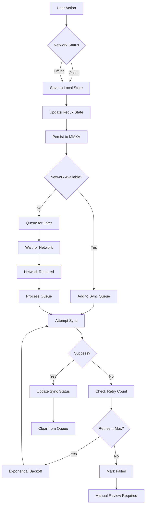

# Offline Data Sync Strategy

## Offline-First Data Synchronization for ULMS CPV Mobile

---

**Document Control**

| Field | Value |
|-------|-------|
| **Document Title** | Offline Data Sync Strategy |
| **Project Name** | Unisoft Loan Management System (ULMS) v2.0 |
| **Document Version** | 1.0 |
| **Date** | 2026-02-05 |
| **Prepared By** | Mobile Development Team |
| **Reviewed By** | Technical Lead |
| **Classification** | Confidential |
| **Status** | Draft |

**Revision History**

| Version | Date | Author | Description |
|---------|------|--------|-------------|
| 1.0 | 2026-02-05 | Mobile Team | Initial offline sync strategy |

---

## Table of Contents

1. [Executive Summary](#1-executive-summary)
2. [Offline-First Architecture](#2-offline-first-architecture)
3. [MMKV Storage Configuration](#3-mmkv-storage-configuration)
4. [Redux Persist Implementation](#4-redux-persist-implementation)
5. [Sync Engine Design](#5-sync-engine-design)
6. [Conflict Resolution](#6-conflict-resolution)
7. [Data Types and Sync Strategies](#7-data-types-and-sync-strategies)
8. [Network State Management](#8-network-state-management)
9. [Error Handling and Retry](#9-error-handling-and-retry)
10. [Testing Approach](#10-testing-approach)
11. [Troubleshooting](#11-troubleshooting)
12. [Related Documents](#12-related-documents)

---

## 1. Executive Summary

This document defines the offline-first data synchronization strategy for the ULMS CPV Mobile Application. The solution enables CPV officers to perform field verifications in areas with poor or no network connectivity, ensuring data integrity and seamless synchronization when connectivity is restored.

### Key Requirements

| Requirement | Specification |
|-------------|---------------|
| **Offline Capability** | Full functionality without network for 8+ hours |
| **Data Storage** | Minimum 100 assignments, 500 photos locally |
| **Sync Speed** | <30 seconds for 50 records on 3G network |
| **Conflict Resolution** | Automatic with manual override capability |
| **Data Integrity** | 100% - no data loss guarantee |
| **Battery Impact** | <10% additional drain per day |

---

## 2. Offline-First Architecture

### 2.1 Architecture Overview

```
┌─────────────────────────────────────────────────────────────────────────────────┐
│                           Offline-First Architecture                             │
├─────────────────────────────────────────────────────────────────────────────────┤
│                                                                                 │
│  ┌─────────────────────────────────────────────────────────────────────────┐   │
│  │                           Application Layer                              │   │
│  │  ┌──────────────┐  ┌──────────────┐  ┌──────────────┐  ┌──────────────┐ │   │
│  │  │   UI         │  │  Business    │  │  Validation  │  │  Form        │ │   │
│  │  │  Components  │  │  Logic       │  │  Service     │  │  Handlers    │ │   │
│  │  └──────┬───────┘  └──────┬───────┘  └──────┬───────┘  └──────┬───────┘ │   │
│  │         │                 │                 │                 │         │   │
│  │         └─────────────────┴────────┬────────┴─────────────────┘         │   │
│  │                                    │                                     │   │
│  │  ┌─────────────────────────────────┴─────────────────────────────────┐  │   │
│  │  │                     State Management (Redux)                       │  │   │
│  │  │  ┌──────────┐  ┌──────────┐  ┌──────────┐  ┌──────────┐          │  │   │
│  │  │  │Assignment│  │Verification│  │  Photo   │  │  Sync    │          │  │   │
│  │  │  │  Slice   │  │   Slice    │  │  Slice   │  │  Slice   │          │  │   │
│  │  │  └────┬─────┘  └─────┬─────┘  └────┬─────┘  └────┬─────┘          │  │   │
│  │  └───────┼──────────────┼─────────────┼─────────────┼──────────────────┘  │   │
│  │          │              │             │             │                       │   │
│  │  ┌───────┴──────────────┴─────────────┴─────────────┴───────────────────┐  │   │
│  │  │                     Persistence Layer (Redux Persist)                  │  │   │
│  │  │                    Transforms Data for Storage                         │  │   │
│  │  └───────────────────────────┬───────────────────────────────────────────┘  │   │
│  └──────────────────────────────┼──────────────────────────────────────────────┘   │
│                                 │                                                  │
│  ┌──────────────────────────────┼──────────────────────────────────────────────┐  │
│  │                         Storage Layer (MMKV)                                  │  │
│  │  ┌──────────┐  ┌──────────┐  ┌──────────┐  ┌──────────┐  ┌──────────────┐   │  │
│  │  │Assignment│  │Verification│  │  Photo   │  │  Auth    │  │  Sync Queue  │   │  │
│  │  │  Store   │  │   Store    │  │ Metadata │  │  Token   │  │              │   │  │
│  │  └──────────┘  └──────────┘  └──────────┘  └──────────┘  └──────────────┘   │  │
│  │                                                                             │  │
│  │  ┌─────────────────────────────────────────────────────────────────────┐   │  │
│  │  │                        File System (Expo FS)                         │   │  │
│  │  │  ┌──────────────┐  ┌──────────────┐  ┌──────────────┐              │   │  │
│  │  │  │  Photos      │  │  Documents   │  │  Temp Files  │              │   │  │
│  │  │  │  (JPEG)      │  │  (PDF)       │  │  (Cache)     │              │   │  │
│  │  │  └──────────────┘  └──────────────┘  └──────────────┘              │   │  │
│  │  └─────────────────────────────────────────────────────────────────────┘   │  │
│  └────────────────────────────────────────────────────────────────────────────┘  │
│                                                                                  │
│  ┌────────────────────────────────────────────────────────────────────────────┐  │
│  │                              Sync Engine                                     │  │
│  │  ┌──────────────┐  ┌──────────────┐  ┌──────────────┐  ┌──────────────┐    │  │
│  │  │  Queue       │  │  Network     │  │  Conflict    │  │  Batch       │    │  │
│  │  │  Manager     │  │  Manager     │  │  Resolver    │  │  Processor   │    │  │
│  │  └──────────────┘  └──────────────┘  └──────────────┘  └──────────────┘    │  │
│  └────────────────────────────────────────────────────────────────────────────┘  │
│                                      │                                           │
│                                      ▼                                           │
│  ┌────────────────────────────────────────────────────────────────────────────┐  │
│  │                           Backend API (ULMS)                                 │  │
│  └────────────────────────────────────────────────────────────────────────────┘  │
│                                                                                  │
└──────────────────────────────────────────────────────────────────────────────────┘
```

### 2.2 Data Flow Diagram



---

## 3. MMKV Storage Configuration

### 3.1 MMKV Setup

```typescript
// src/services/storage/mmkvStorage.ts
import { MMKV } from 'react-native-mmkv';
import { Storage } from 'redux-persist';

// Encryption key should be securely stored or derived
const ENCRYPTION_KEY = process.env.STORAGE_ENCRYPTION_KEY || 'default-key-change-in-prod';

// Initialize MMKV instances for different data types
export const assignmentStorage = new MMKV({
  id: 'assignments',
  encryptionKey: ENCRYPTION_KEY,
});

export const verificationStorage = new MMKV({
  id: 'verifications',
  encryptionKey: ENCRYPTION_KEY,
});

export const photoStorage = new MMKV({
  id: 'photos',
  encryptionKey: ENCRYPTION_KEY,
});

export const authStorage = new MMKV({
  id: 'auth',
  encryptionKey: ENCRYPTION_KEY,
});

export const syncStorage = new MMKV({
  id: 'sync',
  encryptionKey: ENCRYPTION_KEY,
});

// Redux Persist adapter for MMKV
export const createMMKVStorage = (instance: MMKV): Storage => {
  return {
    setItem: (key: string, value: string): Promise<void> => {
      instance.set(key, value);
      return Promise.resolve();
    },
    getItem: (key: string): Promise<string | null> => {
      const value = instance.getString(key);
      return Promise.resolve(value ?? null);
    },
    removeItem: (key: string): Promise<void> => {
      instance.delete(key);
      return Promise.resolve();
    },
  };
};

// Storage wrapper with error handling
export class StorageWrapper {
  constructor(private storage: MMKV) {}

  set<T>(key: string, value: T): void {
    try {
      const serialized = JSON.stringify(value);
      this.storage.set(key, serialized);
    } catch (error) {
      console.error(`Storage set error for key ${key}:`, error);
      throw error;
    }
  }

  get<T>(key: string): T | null {
    try {
      const value = this.storage.getString(key);
      return value ? JSON.parse(value) : null;
    } catch (error) {
      console.error(`Storage get error for key ${key}:`, error);
      return null;
    }
  }

  delete(key: string): void {
    this.storage.delete(key);
  }

  getAllKeys(): string[] {
    return this.storage.getAllKeys();
  }

  clear(): void {
    this.storage.clearAll();
  }
}
```

### 3.2 Storage Constants

```typescript
// src/services/storage/storageKeys.ts
export const StorageKeys = {
  ASSIGNMENTS: {
    LIST: 'assignments:list',
    DETAIL: (id: string) => `assignments:detail:${id}`,
    LAST_SYNC: 'assignments:lastSync',
  },
  VERIFICATIONS: {
    DRAFT: (assignmentId: string) => `verifications:draft:${assignmentId}`,
    SUBMITTED: 'verifications:submitted',
    LAST_SYNC: 'verifications:lastSync',
  },
  PHOTOS: {
    METADATA: (id: string) => `photos:metadata:${id}`,
    QUEUE: 'photos:uploadQueue',
  },
  SYNC: {
    QUEUE: 'sync:queue',
    IN_PROGRESS: 'sync:inProgress',
    LAST_ATTEMPT: 'sync:lastAttempt',
    FAILED_ITEMS: 'sync:failedItems',
  },
  AUTH: {
    TOKEN: 'auth:token',
    REFRESH_TOKEN: 'auth:refreshToken',
    USER: 'auth:user',
    LAST_LOGIN: 'auth:lastLogin',
  },
  SETTINGS: {
    OFFLINE_MODE: 'settings:offlineMode',
    SYNC_WIFI_ONLY: 'settings:syncWifiOnly',
    GPS_ACCURACY: 'settings:gpsAccuracy',
  },
} as const;
```

---

## 4. Redux Persist Implementation

### 4.1 Persist Configuration

```typescript
// src/app/persistConfig.ts
import { PersistConfig } from 'redux-persist';
import { createMMKVStorage, assignmentStorage, verificationStorage, authStorage } from '../services/storage/mmkvStorage';
import { RootState } from './store';

// Base configuration
const baseConfig = {
  timeout: 10000,
  writeFailHandler: (error: Error) => {
    console.error('Redux Persist write failed:', error);
  },
};

// Assignment persistence config
export const assignmentPersistConfig: PersistConfig<RootState['assignments']> = {
  ...baseConfig,
  key: 'assignments',
  storage: createMMKVStorage(assignmentStorage),
  whitelist: ['items', 'selectedAssignment'],
  serialize: true,
};

// Verification persistence config
export const verificationPersistConfig: PersistConfig<RootState['verification']> = {
  ...baseConfig,
  key: 'verification',
  storage: createMMKVStorage(verificationStorage),
  whitelist: ['drafts', 'pendingSubmissions'],
  serialize: true,
};

// Auth persistence config (encrypted)
export const authPersistConfig: PersistConfig<RootState['auth']> = {
  ...baseConfig,
  key: 'auth',
  storage: createMMKVStorage(authStorage),
  whitelist: ['token', 'refreshToken', 'user'],
  serialize: true,
};

// Transform for handling complex data types
import { createTransform } from 'redux-persist';

export const dateTransform = createTransform(
  // Transform state on its way to being serialized and persisted
  (inboundState: unknown) => {
    return JSON.stringify(inboundState, (key, value) => {
      if (value instanceof Date) {
        return { __type: 'Date', value: value.toISOString() };
      }
      return value;
    });
  },
  // Transform state being rehydrated
  (outboundState: string) => {
    return JSON.parse(outboundState, (key, value) => {
      if (value && value.__type === 'Date') {
        return new Date(value.value);
      }
      return value;
    });
  },
  { whitelist: ['assignments', 'verification'] }
);
```

### 4.2 Store Configuration with Persistence

```typescript
// src/app/store.ts
import { configureStore, combineReducers } from '@reduxjs/toolkit';
import { persistStore, persistReducer } from 'redux-persist';
import { assignmentPersistConfig, verificationPersistConfig, authPersistConfig } from './persistConfig';

import assignmentReducer from '../features/assignments/slices/assignmentSlice';
import verificationReducer from '../features/verification/slices/verificationSlice';
import photoReducer from '../features/photos/slices/photoSlice';
import authReducer from '../features/auth/slices/authSlice';
import syncReducer from '../services/sync/syncSlice';

// Create persisted reducers
const persistedAssignmentReducer = persistReducer(assignmentPersistConfig, assignmentReducer);
const persistedVerificationReducer = persistReducer(verificationPersistConfig, verificationReducer);
const persistedAuthReducer = persistReducer(authPersistConfig, authReducer);

// Root reducer
const rootReducer = combineReducers({
  auth: persistedAuthReducer,
  assignments: persistedAssignmentReducer,
  verification: persistedVerificationReducer,
  photos: photoReducer, // Not persisted - photos stored in file system
  sync: syncReducer,    // Not persisted - sync state ephemeral
});

// Store configuration
export const store = configureStore({
  reducer: rootReducer,
  middleware: (getDefaultMiddleware) =>
    getDefaultMiddleware({
      serializableCheck: {
        ignoredActions: [
          'persist/PERSIST',
          'persist/REHYDRATE',
          'persist/PAUSE',
          'persist/PURGE',
          'persist/REGISTER',
        ],
      },
    }),
  devTools: __DEV__,
});

export const persistor = persistStore(store);

export type RootState = ReturnType<typeof store.getState>;
export type AppDispatch = typeof store.dispatch;
```

---

## 5. Sync Engine Design

### 5.1 Sync Queue Architecture

```typescript
// src/services/sync/syncEngine.ts
import { syncStorage } from '../storage/mmkvStorage';
import { StorageKeys } from '../storage/storageKeys';

export enum SyncOperationType {
  CREATE = 'CREATE',
  UPDATE = 'UPDATE',
  DELETE = 'DELETE',
  UPLOAD = 'UPLOAD',
}

export enum SyncEntityType {
  ASSIGNMENT = 'assignment',
  VERIFICATION = 'verification',
  PHOTO = 'photo',
  DOCUMENT = 'document',
}

export enum SyncStatus {
  PENDING = 'PENDING',
  IN_PROGRESS = 'IN_PROGRESS',
  COMPLETED = 'COMPLETED',
  FAILED = 'FAILED',
  RETRYING = 'RETRYING',
}

export interface SyncOperation {
  id: string;
  type: SyncOperationType;
  entity: SyncEntityType;
  entityId: string;
  data: unknown;
  status: SyncStatus;
  timestamp: number;
  retryCount: number;
  maxRetries: number;
  lastError?: string;
  priority: number; // 1 = highest, 5 = lowest
}

export class SyncEngine {
  private static instance: SyncEngine;
  private isSyncing: boolean = false;
  private syncInterval: NodeJS.Timeout | null = null;

  static getInstance(): SyncEngine {
    if (!SyncEngine.instance) {
      SyncEngine.instance = new SyncEngine();
    }
    return SyncEngine.instance;
  }

  // Add operation to queue
  enqueue(operation: Omit<SyncOperation, 'id' | 'timestamp' | 'status' | 'retryCount'>): void {
    const queue = this.getQueue();
    const newOperation: SyncOperation = {
      ...operation,
      id: this.generateId(),
      timestamp: Date.now(),
      status: SyncStatus.PENDING,
      retryCount: 0,
    };

    // Insert by priority
    const insertIndex = queue.findIndex(op => op.priority > newOperation.priority);
    if (insertIndex === -1) {
      queue.push(newOperation);
    } else {
      queue.splice(insertIndex, 0, newOperation);
    }

    this.saveQueue(queue);
    this.triggerSync();
  }

  // Get current queue
  getQueue(): SyncOperation[] {
    const queueData = syncStorage.getString(StorageKeys.SYNC.QUEUE);
    return queueData ? JSON.parse(queueData) : [];
  }

  // Save queue
  private saveQueue(queue: SyncOperation[]): void {
    syncStorage.set(StorageKeys.SYNC.QUEUE, JSON.stringify(queue));
  }

  // Generate unique ID
  private generateId(): string {
    return `${Date.now()}-${Math.random().toString(36).substr(2, 9)}`;
  }

  // Process sync queue
  async processQueue(): Promise<void> {
    if (this.isSyncing) return;

    const networkStatus = await this.checkNetworkStatus();
    if (!networkStatus.isConnected) {
      console.log('Sync skipped: No network connection');
      return;
    }

    if (networkStatus.isExpensive && this.isWifiOnlyEnabled()) {
      console.log('Sync skipped: WiFi only mode enabled');
      return;
    }

    this.isSyncing = true;

    try {
      const queue = this.getQueue();
      const pendingOps = queue.filter(op => 
        op.status === SyncStatus.PENDING || 
        op.status === SyncStatus.RETRYING
      );

      for (const operation of pendingOps) {
        await this.processOperation(operation);
      }
    } finally {
      this.isSyncing = false;
    }
  }

  // Process single operation
  private async processOperation(operation: SyncOperation): Promise<void> {
    const queue = this.getQueue();
    const opIndex = queue.findIndex(op => op.id === operation.id);

    if (opIndex === -1) return;

    // Mark as in progress
    queue[opIndex].status = SyncStatus.IN_PROGRESS;
    this.saveQueue(queue);

    try {
      await this.executeOperation(operation);

      // Success - remove from queue
      queue.splice(opIndex, 1);
      this.saveQueue(queue);

    } catch (error) {
      const errorMessage = error instanceof Error ? error.message : 'Unknown error';
      queue[opIndex].lastError = errorMessage;
      queue[opIndex].retryCount++;

      if (queue[opIndex].retryCount >= operation.maxRetries) {
        queue[opIndex].status = SyncStatus.FAILED;
      } else {
        queue[opIndex].status = SyncStatus.RETRYING;
      }

      this.saveQueue(queue);
    }
  }

  // Execute operation based on type
  private async executeOperation(operation: SyncOperation): Promise<void> {
    const { apiClient } = await import('../api/apiClient');

    switch (operation.type) {
      case SyncOperationType.CREATE:
        await apiClient.post(`/${operation.entity}`, operation.data);
        break;
      case SyncOperationType.UPDATE:
        await apiClient.put(`/${operation.entity}/${operation.entityId}`, operation.data);
        break;
      case SyncOperationType.DELETE:
        await apiClient.delete(`/${operation.entity}/${operation.entityId}`);
        break;
      case SyncOperationType.UPLOAD:
        await this.uploadFile(operation);
        break;
    }
  }

  // Upload file with progress
  private async uploadFile(operation: SyncOperation): Promise<void> {
    const { uploadService } = await import('../api/uploadService');
    await uploadService.upload(operation.data as FileUploadData);
  }

  // Check network status
  private async checkNetworkStatus(): Promise<{ isConnected: boolean; isExpensive: boolean }> {
    const NetInfo = await import('@react-native-community/netinfo');
    const state = await NetInfo.default.fetch();
    return {
      isConnected: state.isConnected ?? false,
      isExpensive: state.details?.isConnectionExpensive ?? false,
    };
  }

  // Check WiFi only setting
  private isWifiOnlyEnabled(): boolean {
    return syncStorage.getString(StorageKeys.SETTINGS.SYNC_WIFI_ONLY) === 'true';
  }

  // Trigger sync
  private triggerSync(): void {
    // Debounce sync to batch operations
    if (this.syncInterval) {
      clearTimeout(this.syncInterval);
    }
    this.syncInterval = setTimeout(() => {
      this.processQueue();
    }, 5000);
  }

  // Start background sync
  startBackgroundSync(): void {
    // Register for background fetch
    // Implementation depends on platform
  }

  // Stop background sync
  stopBackgroundSync(): void {
    if (this.syncInterval) {
      clearTimeout(this.syncInterval);
    }
  }

  // Get sync statistics
  getSyncStats(): {
    pending: number;
    inProgress: number;
    failed: number;
    completed: number;
  } {
    const queue = this.getQueue();
    return {
      pending: queue.filter(op => op.status === SyncStatus.PENDING).length,
      inProgress: queue.filter(op => op.status === SyncStatus.IN_PROGRESS).length,
      failed: queue.filter(op => op.status === SyncStatus.FAILED).length,
      completed: queue.filter(op => op.status === SyncStatus.COMPLETED).length,
    };
  }
}
```

### 5.2 Sync Slice

```typescript
// src/services/sync/syncSlice.ts
import { createSlice, createAsyncThunk, PayloadAction } from '@reduxjs/toolkit';
import { SyncEngine, SyncOperation, SyncStatus } from './syncEngine';

interface SyncState {
  isOnline: boolean;
  isSyncing: boolean;
  lastSyncTime: number | null;
  pendingCount: number;
  failedCount: number;
  error: string | null;
}

const initialState: SyncState = {
  isOnline: true,
  isSyncing: false,
  lastSyncTime: null,
  pendingCount: 0,
  failedCount: 0,
  error: null,
};

// Async thunks
export const triggerSync = createAsyncThunk(
  'sync/triggerSync',
  async (_, { rejectWithValue }) => {
    try {
      const engine = SyncEngine.getInstance();
      await engine.processQueue();
      return { timestamp: Date.now() };
    } catch (error) {
      return rejectWithValue(error instanceof Error ? error.message : 'Sync failed');
    }
  }
);

export const getSyncStats = createAsyncThunk(
  'sync/getStats',
  async () => {
    const engine = SyncEngine.getInstance();
    return engine.getSyncStats();
  }
);

const syncSlice = createSlice({
  name: 'sync',
  initialState,
  reducers: {
    setNetworkStatus: (state, action: PayloadAction<boolean>) => {
      state.isOnline = action.payload;
    },
    updatePendingCount: (state, action: PayloadAction<number>) => {
      state.pendingCount = action.payload;
    },
    clearSyncError: (state) => {
      state.error = null;
    },
  },
  extraReducers: (builder) => {
    builder
      .addCase(triggerSync.pending, (state) => {
        state.isSyncing = true;
        state.error = null;
      })
      .addCase(triggerSync.fulfilled, (state, action) => {
        state.isSyncing = false;
        state.lastSyncTime = action.payload.timestamp;
      })
      .addCase(triggerSync.rejected, (state, action) => {
        state.isSyncing = false;
        state.error = action.payload as string;
      })
      .addCase(getSyncStats.fulfilled, (state, action) => {
        state.pendingCount = action.payload.pending;
        state.failedCount = action.payload.failed;
      });
  },
});

export const { setNetworkStatus, updatePendingCount, clearSyncError } = syncSlice.actions;
export default syncSlice.reducer;
```

---

## 6. Conflict Resolution

### 6.1 Conflict Detection Strategy

```typescript
// src/services/sync/conflictResolver.ts

export interface ConflictContext {
  localVersion: number;
  serverVersion: number;
  localTimestamp: number;
  serverTimestamp: number;
  localData: unknown;
  serverData: unknown;
}

export enum ConflictResolution {
  USE_LOCAL = 'USE_LOCAL',
  USE_SERVER = 'USE_SERVER',
  MERGE = 'MERGE',
  MANUAL = 'MANUAL',
}

export class ConflictResolver {
  // Detect conflict between local and server data
  static detectConflict(context: ConflictContext): boolean {
    // Conflict exists if versions differ and both have been modified
    return context.localVersion !== context.serverVersion &&
           context.localTimestamp > 0 &&
           context.serverTimestamp > context.localTimestamp;
  }

  // Resolve conflict based on strategy
  static resolve(
    context: ConflictContext,
    strategy: ConflictResolution = ConflictResolution.USE_SERVER
  ): { data: unknown; resolution: ConflictResolution } {
    switch (strategy) {
      case ConflictResolution.USE_LOCAL:
        return { data: context.localData, resolution: ConflictResolution.USE_LOCAL };

      case ConflictResolution.USE_SERVER:
        return { data: context.serverData, resolution: ConflictResolution.USE_SERVER };

      case ConflictResolution.MERGE:
        return { 
          data: this.mergeData(context.localData, context.serverData),
          resolution: ConflictResolution.MERGE 
        };

      case ConflictResolution.MANUAL:
        // Return both for manual resolution
        return { 
          data: { local: context.localData, server: context.serverData },
          resolution: ConflictResolution.MANUAL 
        };
    }
  }

  // Merge strategy for different data types
  private static mergeData(local: unknown, server: unknown): unknown {
    if (typeof local !== 'object' || typeof server !== 'object') {
      // For primitives, prefer server
      return server;
    }

    if (Array.isArray(local) && Array.isArray(server)) {
      // Array merge: combine unique items
      return [...new Set([...server, ...local])];
    }

    // Object merge: deep merge with server precedence for conflicts
    return {
      ...(server as object),
      ...(local as object),
    };
  }

  // Determine best resolution strategy based on data type
  static getRecommendedStrategy(entityType: string): ConflictResolution {
    const strategies: Record<string, ConflictResolution> = {
      'assignment': ConflictResolution.USE_SERVER, // Server authoritative
      'verification': ConflictResolution.MANUAL,   // Requires review
      'photo': ConflictResolution.USE_LOCAL,       // Keep local photos
      'location': ConflictResolution.USE_LOCAL,    // Local GPS more reliable
    };

    return strategies[entityType] || ConflictResolution.USE_SERVER;
  }
}
```

### 6.2 Conflict Resolution UI

```typescript
// src/features/sync/components/ConflictResolutionModal.tsx
import React from 'react';
import { View, Text, Modal, TouchableOpacity, ScrollView } from 'react-native';
import { ConflictContext, ConflictResolution } from '../../../services/sync/conflictResolver';

interface ConflictResolutionModalProps {
  visible: boolean;
  context: ConflictContext | null;
  onResolve: (resolution: ConflictResolution, data?: unknown) => void;
  onCancel: () => void;
}

export const ConflictResolutionModal: React.FC<ConflictResolutionModalProps> = ({
  visible,
  context,
  onResolve,
  onCancel,
}) => {
  if (!context) return null;

  return (
    <Modal visible={visible} animationType="slide" transparent>
      <View className="flex-1 bg-black/50 justify-center p-4">
        <View className="bg-white rounded-lg p-4 max-h-[80%]">
          <Text className="text-xl font-bold mb-4">Sync Conflict Detected</Text>
          
          <Text className="text-gray-600 mb-2">
            Both local and server versions have been modified.
          </Text>

          <ScrollView className="mb-4">
            <View className="bg-blue-50 p-3 rounded mb-2">
              <Text className="font-semibold text-blue-800">Local Version</Text>
              <Text className="text-sm text-gray-600">
                Modified: {new Date(context.localTimestamp).toLocaleString()}
              </Text>
              <Text className="text-xs text-gray-500 mt-1">
                {JSON.stringify(context.localData, null, 2)}
              </Text>
            </View>

            <View className="bg-green-50 p-3 rounded">
              <Text className="font-semibold text-green-800">Server Version</Text>
              <Text className="text-sm text-gray-600">
                Modified: {new Date(context.serverTimestamp).toLocaleString()}
              </Text>
              <Text className="text-xs text-gray-500 mt-1">
                {JSON.stringify(context.serverData, null, 2)}
              </Text>
            </View>
          </ScrollView>

          <View className="flex-row flex-wrap gap-2">
            <TouchableOpacity
              onPress={() => onResolve(ConflictResolution.USE_LOCAL)}
              className="flex-1 bg-blue-500 p-3 rounded"
            >
              <Text className="text-white text-center font-semibold">Use Local</Text>
            </TouchableOpacity>

            <TouchableOpacity
              onPress={() => onResolve(ConflictResolution.USE_SERVER)}
              className="flex-1 bg-green-500 p-3 rounded"
            >
              <Text className="text-white text-center font-semibold">Use Server</Text>
            </TouchableOpacity>

            <TouchableOpacity
              onPress={() => onResolve(ConflictResolution.MERGE)}
              className="flex-1 bg-purple-500 p-3 rounded"
            >
              <Text className="text-white text-center font-semibold">Merge</Text>
            </TouchableOpacity>

            <TouchableOpacity
              onPress={onCancel}
              className="flex-1 bg-gray-300 p-3 rounded"
            >
              <Text className="text-gray-800 text-center">Cancel</Text>
            </TouchableOpacity>
          </View>
        </View>
      </View>
    </Modal>
  );
};
```

---

## 7. Data Types and Sync Strategies

### 7.1 Data Type Matrix

| Data Type | Storage | Sync Frequency | Conflict Strategy | Priority |
|-----------|---------|----------------|-------------------|----------|
| Assignments | MMKV | On fetch | Server wins | 1 |
| Verifications | MMKV | Real-time | Manual review | 2 |
| Photos | File + Metadata | Batch (WiFi preferred) | Local wins | 3 |
| GPS Location | MMKV | Real-time | Local wins | 2 |
| Documents | File + Metadata | On demand | Server wins | 4 |
| User Settings | MMKV | On change | Merge | 5 |

### 7.2 Sync Strategy Implementation

```typescript
// src/services/sync/syncStrategies.ts
import { SyncOperationType, SyncEntityType, SyncOperation } from './syncEngine';

export interface SyncStrategy {
  type: SyncEntityType;
  operationTypes: SyncOperationType[];
  priority: number;
  batchSize: number;
  retryPolicy: {
    maxRetries: number;
    backoffMs: number;
  };
  networkRequirements: {
    requireWifi: boolean;
    minBandwidth?: number;
  };
}

export const syncStrategies: Record<SyncEntityType, SyncStrategy> = {
  [SyncEntityType.ASSIGNMENT]: {
    type: SyncEntityType.ASSIGNMENT,
    operationTypes: [SyncOperationType.CREATE, SyncOperationType.UPDATE],
    priority: 1,
    batchSize: 50,
    retryPolicy: {
      maxRetries: 3,
      backoffMs: 5000,
    },
    networkRequirements: {
      requireWifi: false,
    },
  },
  [SyncEntityType.VERIFICATION]: {
    type: SyncEntityType.VERIFICATION,
    operationTypes: [SyncOperationType.CREATE, SyncOperationType.UPDATE],
    priority: 2,
    batchSize: 10,
    retryPolicy: {
      maxRetries: 5,
      backoffMs: 10000,
    },
    networkRequirements: {
      requireWifi: false,
    },
  },
  [SyncEntityType.PHOTO]: {
    type: SyncEntityType.PHOTO,
    operationTypes: [SyncOperationType.UPLOAD],
    priority: 3,
    batchSize: 5,
    retryPolicy: {
      maxRetries: 10,
      backoffMs: 30000,
    },
    networkRequirements: {
      requireWifi: true,
      minBandwidth: 1024 * 1024, // 1 Mbps
    },
  },
  [SyncEntityType.DOCUMENT]: {
    type: SyncEntityType.DOCUMENT,
    operationTypes: [SyncOperationType.UPLOAD, SyncOperationType.DELETE],
    priority: 4,
    batchSize: 3,
    retryPolicy: {
      maxRetries: 5,
      backoffMs: 20000,
    },
    networkRequirements: {
      requireWifi: true,
    },
  },
};
```

---

## 8. Network State Management

### 8.1 Network Listener

```typescript
// src/services/network/networkListener.ts
import NetInfo, { NetInfoState } from '@react-native-community/netinfo';
import { store } from '../../app/store';
import { setNetworkStatus } from '../sync/syncSlice';
import { SyncEngine } from '../sync/syncEngine';

class NetworkListener {
  private unsubscribe: (() => void) | null = null;

  startListening(): void {
    this.unsubscribe = NetInfo.addEventListener((state: NetInfoState) => {
      const isConnected = state.isConnected ?? false;
      
      // Update Redux store
      store.dispatch(setNetworkStatus(isConnected));

      // Trigger sync when coming online
      if (isConnected) {
        console.log('Network restored - triggering sync');
        const engine = SyncEngine.getInstance();
        engine.processQueue();
      }
    });
  }

  stopListening(): void {
    if (this.unsubscribe) {
      this.unsubscribe();
      this.unsubscribe = null;
    }
  }

  async checkConnection(): Promise<boolean> {
    const state = await NetInfo.fetch();
    return state.isConnected ?? false;
  }

  async getConnectionDetails(): Promise<{
    isConnected: boolean;
    isWifi: boolean;
    isCellular: boolean;
    isExpensive: boolean;
  }> {
    const state = await NetInfo.fetch();
    return {
      isConnected: state.isConnected ?? false,
      isWifi: state.type === 'wifi',
      isCellular: state.type === 'cellular',
      isExpensive: state.details?.isConnectionExpensive ?? false,
    };
  }
}

export const networkListener = new NetworkListener();
```

---

## 9. Error Handling and Retry

### 9.1 Retry Mechanism

```typescript
// src/services/sync/retryPolicy.ts

export interface RetryConfig {
  maxRetries: number;
  baseDelayMs: number;
  maxDelayMs: number;
  exponentialBase: number;
}

export const defaultRetryConfig: RetryConfig = {
  maxRetries: 3,
  baseDelayMs: 1000,
  maxDelayMs: 30000,
  exponentialBase: 2,
};

export function calculateRetryDelay(
  attemptNumber: number,
  config: RetryConfig = defaultRetryConfig
): number {
  const exponentialDelay = config.baseDelayMs * Math.pow(config.exponentialBase, attemptNumber);
  const jitter = Math.random() * 1000; // Add randomness to prevent thundering herd
  return Math.min(exponentialDelay + jitter, config.maxDelayMs);
}

export function shouldRetry(error: unknown, attemptNumber: number, config: RetryConfig): boolean {
  if (attemptNumber >= config.maxRetries) {
    return false;
  }

  // Check if error is retryable
  if (error && typeof error === 'object') {
    const apiError = error as { status?: number; code?: string };
    
    // Don't retry client errors (4xx)
    if (apiError.status && apiError.status >= 400 && apiError.status < 500) {
      // Except for rate limiting
      if (apiError.status === 429) return true;
      return false;
    }

    // Retry server errors (5xx)
    if (apiError.status && apiError.status >= 500) return true;

    // Retry network errors
    if (apiError.code === 'NETWORK_ERROR' || 
        apiError.code === 'TIMEOUT_ERROR' ||
        apiError.code === 'CONNECTION_ERROR') {
      return true;
    }
  }

  return false;
}
```

---

## 10. Testing Approach

### 10.1 Unit Tests

```typescript
// src/services/sync/__tests__/syncEngine.test.ts
import { SyncEngine, SyncOperationType, SyncEntityType } from '../syncEngine';

describe('SyncEngine', () => {
  let engine: SyncEngine;

  beforeEach(() => {
    engine = SyncEngine.getInstance();
    // Clear storage
  });

  describe('enqueue', () => {
    it('should add operation to queue', () => {
      const operation = {
        type: SyncOperationType.CREATE,
        entity: SyncEntityType.ASSIGNMENT,
        entityId: 'test-123',
        data: { name: 'Test Assignment' },
        maxRetries: 3,
        priority: 1,
      };

      engine.enqueue(operation);

      const queue = engine.getQueue();
      expect(queue).toHaveLength(1);
      expect(queue[0].type).toBe(SyncOperationType.CREATE);
    });

    it('should prioritize high priority operations', () => {
      engine.enqueue({
        type: SyncOperationType.CREATE,
        entity: SyncEntityType.PHOTO,
        entityId: 'photo-1',
        data: {},
        maxRetries: 3,
        priority: 3,
      });

      engine.enqueue({
        type: SyncOperationType.CREATE,
        entity: SyncEntityType.ASSIGNMENT,
        entityId: 'assignment-1',
        data: {},
        maxRetries: 3,
        priority: 1,
      });

      const queue = engine.getQueue();
      expect(queue[0].entity).toBe(SyncEntityType.ASSIGNMENT);
    });
  });

  describe('processQueue', () => {
    it('should process pending operations', async () => {
      // Setup mocks and test
    });

    it('should handle network errors with retry', async () => {
      // Test retry logic
    });
  });
});
```

### 10.2 Integration Tests

```typescript
// e2e/sync/offlineSync.e2e.ts
describe('Offline Sync Flow', () => {
  beforeAll(async () => {
    await device.launchApp();
  });

  it('should work offline and sync when online', async () => {
    // Go offline
    await device.setURLBlacklist(['.*']);

    // Create verification offline
    await element(by.id('new-verification-btn')).tap();
    await element(by.id('applicant-name')).typeText('Test User');
    await element(by.id('save-draft-btn')).tap();

    // Verify offline indicator
    await expect(element(by.id('offline-indicator'))).toBeVisible();

    // Go online
    await device.setURLBlacklist([]);

    // Verify sync completion
    await waitFor(element(by.id('sync-complete-indicator')))
      .toBeVisible()
      .withTimeout(30000);
  });
});
```

---

## 11. Troubleshooting

| Issue | Cause | Solution |
|-------|-------|----------|
| Sync queue growing indefinitely | Network unavailable | Check network, implement queue size limits |
| Duplicate records on server | Race condition | Implement idempotency keys |
| Sync conflicts not resolving | Incorrect timestamps | Verify device time is synced |
| Photos not uploading | WiFi-only setting | Check settings, use cellular if allowed |
| Data not persisting | MMKV initialization | Check encryption key, storage permissions |
| Slow sync performance | Large payload | Implement pagination, compress data |

---

## 12. Related Documents

| Document | Purpose | Location |
|----------|---------|----------|
| `[MOB]_React_Native_CPV_App_Architecture_v1.0.md` | Overall mobile architecture | `01_Mobile_Architecture/` |
| `[MOB]_Background_Sync_Implementation_v1.0.md` | Background sync details | `02_Mobile_Features/` |
| `[MOB]_React_Native_Development_Guide_v1.0.md` | Development setup | `01_Mobile_Architecture/` |
| `[FE]_State_Management_Design_Redux_RTK_Query_v1.0.md` | Redux patterns | `Phase_04_Frontend_Development/01_Architecture/` |

---

**Document End**

*© 2026 Unisoft Systems Limited. All Rights Reserved.*
