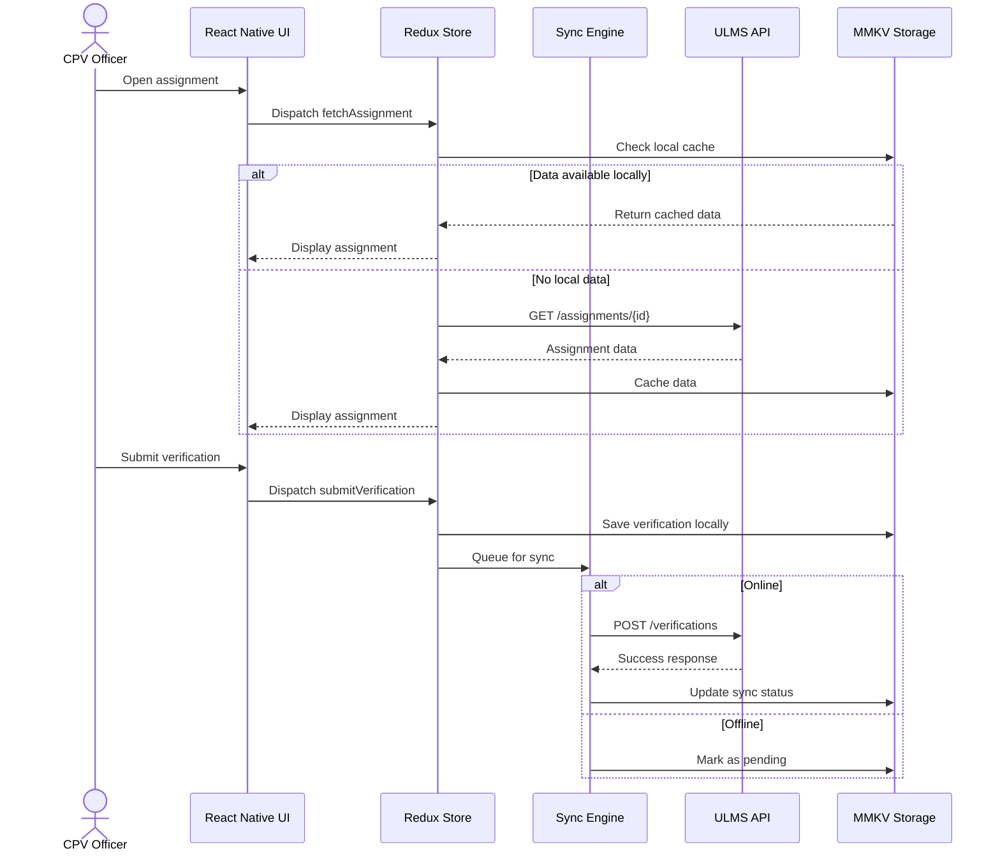
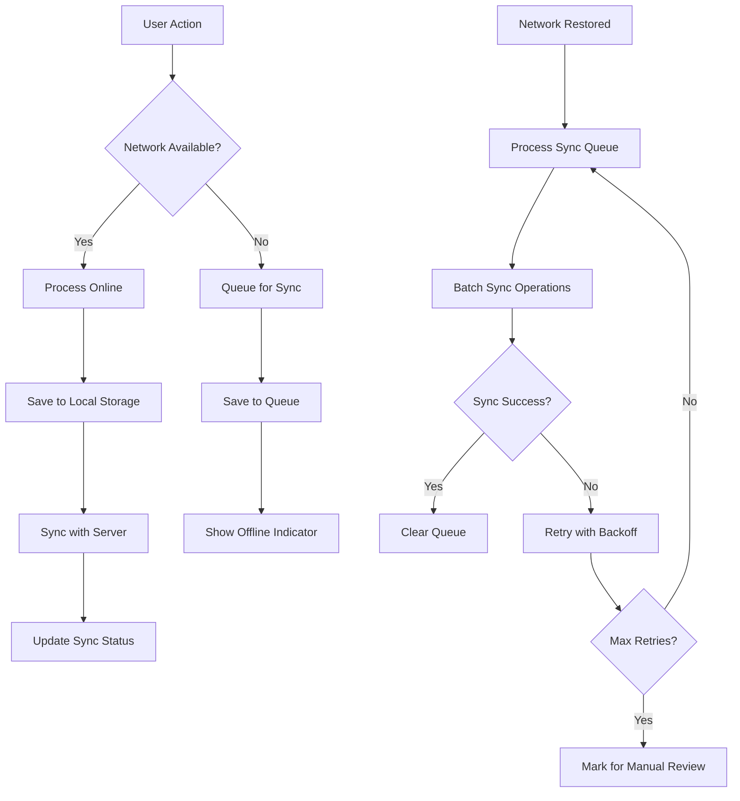
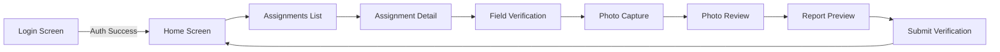

# React Native CPV App Architecture

## Mobile Application Architecture for ULMS v2.0 Contact Point Verification

---

**Document Control**

| Field | Value |
|-------|-------|
| **Document Title** | React Native CPV App Architecture |
| **Project Name** | Unisoft Loan Management System (ULMS) v2.0 |
| **Document Version** | 1.0 |
| **Date** | 2026-02-05 |
| **Prepared By** | Mobile Development Team |
| **Reviewed By** | Technical Lead |
| **Classification** | Confidential |
| **Status** | Draft |

**Revision History**

| Version | Date | Author | Description |
|---------|------|--------|-------------|
| 1.0 | 2026-02-05 | Mobile Team | Initial version for CPV mobile application |

---

## Table of Contents

1. [Executive Summary](#1-executive-summary)
2. [Architectural Overview](#2-architectural-overview)
3. [Technology Stack](#3-technology-stack)
4. [Application Architecture](#4-application-architecture)
5. [Project Structure](#5-project-structure)
6. [State Management Architecture](#6-state-management-architecture)
7. [Offline-First Design](#7-offline-first-design)
8. [Navigation Architecture](#8-navigation-architecture)
9. [Security Architecture](#9-security-architecture)
10. [Performance Architecture](#10-performance-architecture)
11. [Testing Strategy](#11-testing-strategy)
12. [Related Documents](#12-related-documents)

---

## 1. Executive Summary

This document defines the mobile application architecture for the ULMS v2.0 Contact Point Verification (CPV) module, a React Native application designed for field officers conducting physical verification of loan applicants in Bangladesh. The architecture emphasizes offline-first design, GPS tracking, and multimedia capture capabilities.

### Key Architectural Principles

| Principle | Implementation |
|-----------|----------------|
| **Offline-First** | Local storage with MMKV, automatic sync when online |
| **Performance** | Optimized image compression, lazy loading, code splitting |
| **Security** | Biometric auth, encrypted storage, secure API communication |
| **Reliability** | Background sync, retry mechanisms, conflict resolution |
| **GPS Accuracy** | <10m accuracy requirement with location validation |
| **Battery Efficient** | Optimized background tasks, batch operations |

### Target Users

- **Primary**: CPV Officers conducting field verifications
- **Secondary**: Loan officers reviewing verification reports
- **Tertiary**: Branch managers tracking verification status

---

## 2. Architectural Overview

### 2.1 High-Level Architecture Diagram

```
┌─────────────────────────────────────────────────────────────────────────────────┐
│                        ULMS CPV Mobile Application                              │
│                         React Native 0.73 + Expo SDK 50                         │
├─────────────────────────────────────────────────────────────────────────────────┤
│                                                                                 │
│  ┌─────────────────────────────────────────────────────────────────────────┐   │
│  │                         Presentation Layer                               │   │
│  │  ┌──────────┐  ┌──────────┐  ┌──────────┐  ┌──────────┐  ┌──────────┐   │   │
│  │  │   Home   │  │Assignment│  │  Field   │  │  Photo   │  │  Report  │   │   │
│  │  │  Screen  │  │  Screen  │  │  Verify  │  │  Capture │  │ Preview  │   │   │
│  │  └──────────┘  └──────────┘  └──────────┘  └──────────┘  └──────────┘   │   │
│  └─────────────────────────────────────────────────────────────────────────┘   │
│                                      │                                          │
│  ┌───────────────────────────────────┴───────────────────────────────────────┐ │
│  │                          Business Logic Layer                              │ │
│  │  ┌──────────────┐  ┌──────────────┐  ┌──────────────┐  ┌──────────────┐   │ │
│  │  │   Redux      │  │  Sync        │  │  Validation  │  │  Report      │   │ │
│  │  │   Toolkit    │  │  Engine      │  │  Service     │  │  Generator   │   │ │
│  │  └──────────────┘  └──────────────┘  └──────────────┘  └──────────────┘   │ │
│  └───────────────────────────────────────────────────────────────────────────┘ │
│                                      │                                          │
│  ┌───────────────────────────────────┴───────────────────────────────────────┐ │
│  │                          Service Layer                                     │ │
│  │  ┌──────────────┐  ┌──────────────┐  ┌──────────────┐  ┌──────────────┐   │ │
│  │  │  API Client  │  │  GPS Service │  │  Camera      │  │  Storage     │   │ │
│  │  │  (Axios)     │  │  (RN Geo)    │  │  Service     │  │  (MMKV)      │   │ │
│  │  └──────────────┘  └──────────────┘  └──────────────┘  └──────────────┘   │ │
│  │  ┌──────────────┐  ┌──────────────┐  ┌──────────────┐  ┌──────────────┐   │ │
│  │  │  Background  │  │  Network     │  │  Auth        │  │  Push        │   │ │
│  │  │  Fetch       │  │  Manager     │  │  Service     │  │  Notifications│  │ │
│  │  └──────────────┘  └──────────────┘  └──────────────┘  └──────────────┘   │ │
│  └───────────────────────────────────────────────────────────────────────────┘ │
│                                      │                                          │
│  ┌───────────────────────────────────┴───────────────────────────────────────┐ │
│  │                          Native Modules                                    │ │
│  │  ┌──────────────┐  ┌──────────────┐  ┌──────────────┐  ┌──────────────┐   │ │
│  │  │  Geolocation │  │  Vision      │  │  FileSystem  │  │  Biometric   │   │ │
│  │  │  (Android/iOS)│  │  Camera      │  │  (Expo FS)   │  │  Auth        │   │ │
│  │  └──────────────┘  └──────────────┘  └──────────────┘  └──────────────┘   │ │
│  └───────────────────────────────────────────────────────────────────────────┘ │
│                                                                                 │
└─────────────────────────────────────────────────────────────────────────────────┘
                                      │
                                      ▼
┌─────────────────────────────────────────────────────────────────────────────────┐
│                           Backend Services                                      │
│  ┌──────────────┐  ┌──────────────┐  ┌──────────────┐  ┌──────────────┐         │
│  │  ULMS API    │  │  CIB Service │  │  File        │  │  Push        │         │
│  │  Gateway     │  │  (Bangladesh │  │  Storage     │  │  Notification│         │
│  │  (Kong)      │  │   Bank)      │  │  (S3/MinIO)  │  │  Service     │         │
│  └──────────────┘  └──────────────┘  └──────────────┘  └──────────────┘         │
└─────────────────────────────────────────────────────────────────────────────────┘
```

### 2.2 Component Interaction Flow



---

## 3. Technology Stack

### 3.1 Core Technologies

| Category | Technology | Version | Purpose |
|----------|------------|---------|---------|
| **Framework** | React Native | 0.73.6 | Cross-platform mobile framework |
| **SDK** | Expo SDK | 50.0 | Development toolchain and native APIs |
| **Language** | TypeScript | 5.3 | Type safety and development experience |
| **State Management** | Redux Toolkit | 2.0 | Global state with persistence |
| **Persistence** | Redux Persist + MMKV | 2.1 | Local storage with encryption |
| **Navigation** | React Navigation | 6.x | Screen navigation and routing |
| **HTTP Client** | Axios | 1.6 | API communication |
| **Forms** | React Hook Form | 7.5 | Form handling and validation |
| **Validation** | Zod | 3.22 | Schema validation |
| **Styling** | NativeWind | 4.0 | Tailwind CSS for React Native |
| **Maps** | React Native Maps | 1.10 | Map visualization |
| **Camera** | React Native Vision Camera | 3.8 | Photo and video capture |

### 3.2 Development Dependencies

| Tool | Version | Purpose |
|------|---------|---------|
| **Bundler** | Metro | React Native bundler |
| **Testing** | Jest | Unit testing framework |
| **E2E Testing** | Detox | End-to-end testing |
| **Linting** | ESLint + Prettier | Code quality and formatting |
| **Type Checking** | TypeScript Compiler | Static type checking |

### 3.3 Package.json Configuration

```json
{
  "name": "ulms-cpv-mobile",
  "version": "2.0.0",
  "main": "expo/AppEntry.js",
  "scripts": {
    "start": "expo start",
    "android": "expo run:android",
    "ios": "expo run:ios",
    "test": "jest",
    "lint": "eslint . --ext .ts,.tsx",
    "typecheck": "tsc --noEmit"
  },
  "dependencies": {
    "@react-navigation/native": "^6.1.9",
    "@react-navigation/stack": "^6.3.20",
    "@reduxjs/toolkit": "^2.0.1",
    "axios": "^1.6.2",
    "expo": "~50.0.0",
    "expo-file-system": "~16.0.0",
    "expo-location": "~16.5.0",
    "expo-notifications": "~0.27.0",
    "nativewind": "^4.0.0",
    "react": "18.2.0",
    "react-native": "0.73.6",
    "react-native-gesture-handler": "~2.14.0",
    "react-native-maps": "1.10.0",
    "react-native-mmkv": "^2.11.0",
    "react-native-vision-camera": "^3.8.0",
    "react-redux": "^9.0.4",
    "redux-persist": "^6.0.0",
    "zod": "^3.22.4"
  },
  "devDependencies": {
    "@types/react": "~18.2.45",
    "detox": "^20.14.0",
    "jest": "^29.7.0",
    "typescript": "^5.3.3"
  }
}
```

---

## 4. Application Architecture

### 4.1 Layered Architecture

```
┌─────────────────────────────────────────────────────────────┐
│                      Presentation Layer                      │
│  - React Native Screens                                      │
│  - Reusable Components                                       │
│  - NativeWind Styling                                        │
└─────────────────────┬───────────────────────────────────────┘
                      │
┌─────────────────────▼───────────────────────────────────────┐
│                      Business Logic Layer                    │
│  - Redux Toolkit Slices                                      │
│  - Custom Hooks                                              │
│  - Form Validation                                           │
└─────────────────────┬───────────────────────────────────────┘
                      │
┌─────────────────────▼───────────────────────────────────────┐
│                      Service Layer                           │
│  - API Client                                                │
│  - GPS Service                                               │
│  - Camera Service                                            │
│  - Sync Engine                                               │
└─────────────────────┬───────────────────────────────────────┘
                      │
┌─────────────────────▼───────────────────────────────────────┐
│                      Data Layer                              │
│  - MMKV Storage                                              │
│  - Redux Persist                                             │
│  - File System                                               │
└─────────────────────────────────────────────────────────────┘
```

### 4.2 Architecture Patterns

| Pattern | Implementation | Purpose |
|---------|----------------|---------|
| **Container/Presentational** | Screen containers with UI components | Separation of concerns |
| **Redux Toolkit Pattern** | Slices with thunks | State management |
| **Repository Pattern** | Service classes for data access | Abstraction layer |
| **Observer Pattern** | Redux subscriptions | Reactive UI updates |
| **Strategy Pattern** | Sync strategies for different network conditions | Flexible sync behavior |

---

## 5. Project Structure

### 5.1 Directory Layout

```
ulms-cpv-mobile/
├── android/                          # Android native project
├── ios/                              # iOS native project
├── src/
│   ├── app/                          # App-level configuration
│   │   ├── store.ts                  # Redux store configuration
│   │   ├── persistConfig.ts          # Redux Persist configuration
│   │   └── navigation/               # Navigation configuration
│   │       ├── AppNavigator.tsx
│   │       └── AuthNavigator.tsx
│   │
│   ├── features/                     # Feature-based modules
│   │   ├── assignments/              # Assignment management
│   │   │   ├── screens/
│   │   │   ├── components/
│   │   │   ├── hooks/
│   │   │   ├── slices/
│   │   │   └── types/
│   │   ├── verification/             # Field verification
│   │   ├── photos/                   # Photo capture and management
│   │   └── reports/                  # Report generation
│   │
│   ├── components/                   # Shared UI components
│   │   ├── common/                   # Generic components
│   │   ├── forms/                    # Form components
│   │   ├── feedback/                 # Alerts, modals, toasts
│   │   └── layout/                   # Layout components
│   │
│   ├── services/                     # Service layer
│   │   ├── api/                      # API client and endpoints
│   │   ├── gps/                      # GPS location service
│   │   ├── camera/                   # Camera integration
│   │   ├── sync/                     # Offline sync engine
│   │   └── storage/                  # Storage utilities
│   │
│   ├── hooks/                        # Custom React hooks
│   ├── utils/                        # Utility functions
│   ├── types/                        # Global TypeScript types
│   ├── constants/                    # App constants
│   └── theme/                        # Theme configuration
│
├── assets/                           # Static assets
│   ├── images/
│   ├── fonts/
│   └── icons/
│
├── tests/                            # Test files
│   ├── unit/
│   ├── integration/
│   └── e2e/
│
├── app.json                          # Expo configuration
├── metro.config.js                   # Metro bundler config
├── tailwind.config.js                # Tailwind CSS config
├── tsconfig.json                     # TypeScript configuration
└── package.json
```

### 5.2 Feature Module Structure

```typescript
// Example: features/assignments/slice/assignmentSlice.ts
import { createSlice, createAsyncThunk } from '@reduxjs/toolkit';
import { assignmentApi } from '../../../services/api/assignmentApi';
import { Assignment } from '../types/assignment.types';

interface AssignmentState {
  items: Assignment[];
  selectedAssignment: Assignment | null;
  loading: boolean;
  error: string | null;
}

const initialState: AssignmentState = {
  items: [],
  selectedAssignment: null,
  loading: false,
  error: null,
};

export const fetchAssignments = createAsyncThunk(
  'assignments/fetchAll',
  async (_, { rejectWithValue }) => {
    try {
      return await assignmentApi.getAssignments();
    } catch (error) {
      return rejectWithValue(error.message);
    }
  }
);

const assignmentSlice = createSlice({
  name: 'assignments',
  initialState,
  reducers: {
    selectAssignment: (state, action) => {
      state.selectedAssignment = action.payload;
    },
  },
  extraReducers: (builder) => {
    builder
      .addCase(fetchAssignments.pending, (state) => {
        state.loading = true;
        state.error = null;
      })
      .addCase(fetchAssignments.fulfilled, (state, action) => {
        state.loading = false;
        state.items = action.payload;
      })
      .addCase(fetchAssignments.rejected, (state, action) => {
        state.loading = false;
        state.error = action.payload as string;
      });
  },
});

export const { selectAssignment } = assignmentSlice.actions;
export default assignmentSlice.reducer;
```

---

## 6. State Management Architecture

### 6.1 Redux Store Configuration

```typescript
// src/app/store.ts
import { configureStore } from '@reduxjs/toolkit';
import { persistStore, persistReducer } from 'redux-persist';
import { setupListeners } from '@reduxjs/toolkit/query';

import assignmentReducer from '../features/assignments/slices/assignmentSlice';
import verificationReducer from '../features/verification/slices/verificationSlice';
import photoReducer from '../features/photos/slices/photoSlice';
import authReducer from '../features/auth/slices/authSlice';
import syncReducer from '../services/sync/syncSlice';

import { persistConfig } from './persistConfig';

const rootReducer = {
  auth: authReducer,
  assignments: assignmentReducer,
  verification: verificationReducer,
  photos: photoReducer,
  sync: syncReducer,
};

export const store = configureStore({
  reducer: rootReducer,
  middleware: (getDefaultMiddleware) =>
    getDefaultMiddleware({
      serializableCheck: {
        ignoredActions: ['persist/PERSIST', 'persist/REHYDRATE'],
      },
    }),
});

export const persistor = persistStore(store);
export type RootState = ReturnType<typeof store.getState>;
export type AppDispatch = typeof store.dispatch;

setupListeners(store.dispatch);
```

### 6.2 State Classification

| State Type | Storage | Use Case | Persistence |
|------------|---------|----------|-------------|
| **User Auth** | Redux + MMKV | Authentication tokens | Encrypted |
| **Assignments** | Redux Persist | Assignment data | Yes |
| **Verification Draft** | Redux Persist | In-progress verification | Yes |
| **Photos** | File System + Metadata in Redux | Captured images | Yes (metadata) |
| **Sync Queue** | Redux Persist + MMKV | Pending sync operations | Yes |
| **UI State** | Redux | Loading states, modals | No |
| **Network Status** | Redux | Online/offline status | No |

---

## 7. Offline-First Design

### 7.1 Offline-First Architecture



### 7.2 Sync Queue Implementation

```typescript
// src/services/sync/syncQueue.ts
import { MMKV } from 'react-native-mmkv';

interface SyncOperation {
  id: string;
  type: 'CREATE' | 'UPDATE' | 'DELETE' | 'UPLOAD';
  entity: 'assignment' | 'verification' | 'photo';
  data: unknown;
  timestamp: number;
  retryCount: number;
  maxRetries: number;
}

const storage = new MMKV({
  id: 'sync-queue',
  encryptionKey: 'your-encryption-key',
});

export class SyncQueue {
  private static readonly QUEUE_KEY = 'pending_operations';

  static getQueue(): SyncOperation[] {
    const queue = storage.getString(this.QUEUE_KEY);
    return queue ? JSON.parse(queue) : [];
  }

  static addOperation(operation: Omit<SyncOperation, 'id' | 'timestamp' | 'retryCount'>): void {
    const queue = this.getQueue();
    const newOperation: SyncOperation = {
      ...operation,
      id: `${Date.now()}-${Math.random().toString(36).substr(2, 9)}`,
      timestamp: Date.now(),
      retryCount: 0,
    };
    queue.push(newOperation);
    storage.set(this.QUEUE_KEY, JSON.stringify(queue));
  }

  static removeOperation(id: string): void {
    const queue = this.getQueue().filter(op => op.id !== id);
    storage.set(this.QUEUE_KEY, JSON.stringify(queue));
  }

  static incrementRetry(id: string): void {
    const queue = this.getQueue().map(op =>
      op.id === id ? { ...op, retryCount: op.retryCount + 1 } : op
    );
    storage.set(this.QUEUE_KEY, JSON.stringify(queue));
  }
}
```

---

## 8. Navigation Architecture

### 8.1 Navigation Structure

```typescript
// src/app/navigation/AppNavigator.tsx
import { NavigationContainer } from '@react-navigation/native';
import { createNativeStackNavigator } from '@react-navigation/native-stack';

import { AuthNavigator } from './AuthNavigator';
import { MainNavigator } from './MainNavigator';
import { useAuth } from '../../features/auth/hooks/useAuth';

const RootStack = createNativeStackNavigator();

export const AppNavigator = () => {
  const { isAuthenticated } = useAuth();

  return (
    <NavigationContainer>
      <RootStack.Navigator screenOptions={{ headerShown: false }}>
        {isAuthenticated ? (
          <RootStack.Screen name="Main" component={MainNavigator} />
        ) : (
          <RootStack.Screen name="Auth" component={AuthNavigator} />
        )}
      </RootStack.Navigator>
    </NavigationContainer>
  );
};
```

### 8.2 Navigation Flow Diagram



---

## 9. Security Architecture

### 9.1 Security Measures

| Layer | Measure | Implementation |
|-------|---------|----------------|
| **Authentication** | Biometric + PIN | Expo LocalAuthentication |
| **Data Storage** | Encrypted storage | MMKV with encryption key |
| **API Communication** | HTTPS + Certificate pinning | Axios with SSL pinning |
| **Session Management** | JWT with refresh tokens | Secure storage |
| **Sensitive Data** | In-memory only | Redux state |

### 9.2 Biometric Authentication

```typescript
// src/features/auth/hooks/useBiometricAuth.ts
import * as LocalAuthentication from 'expo-local-authentication';
import { useState, useCallback } from 'react';

export const useBiometricAuth = () => {
  const [isAuthenticating, setIsAuthenticating] = useState(false);

  const authenticate = useCallback(async (): Promise<boolean> => {
    setIsAuthenticating(true);
    try {
      const compatible = await LocalAuthentication.hasHardwareAsync();
      if (!compatible) {
        return false;
      }

      const enrolled = await LocalAuthentication.isEnrolledAsync();
      if (!enrolled) {
        return false;
      }

      const result = await LocalAuthentication.authenticateAsync({
        promptMessage: 'Authenticate to access CPV app',
        fallbackLabel: 'Use PIN',
        disableDeviceFallback: false,
      });

      return result.success;
    } finally {
      setIsAuthenticating(false);
    }
  }, []);

  return { authenticate, isAuthenticating };
};
```

---

## 10. Performance Architecture

### 10.1 Performance Strategies

| Strategy | Implementation | Target |
|----------|----------------|--------|
| **Image Optimization** | Compression before upload | <500KB per image |
| **Lazy Loading** | Dynamic imports for heavy screens | Faster initial load |
| **Memory Management** | Image cleanup after upload | <100MB memory usage |
| **Network Optimization** | Request batching and deduplication | Minimize API calls |
| **Battery Optimization** | Background task scheduling | <5% battery per hour |

### 10.2 Image Compression

```typescript
// src/services/camera/imageCompression.ts
import * as ImageManipulator from 'expo-image-manipulator';

interface CompressionOptions {
  maxWidth?: number;
  maxHeight?: number;
  quality?: number;
}

export const compressImage = async (
  uri: string,
  options: CompressionOptions = {}
): Promise<string> => {
  const { maxWidth = 1920, maxHeight = 1080, quality = 0.8 } = options;

  const manipulatedImage = await ImageManipulator.manipulateAsync(
    uri,
    [{ resize: { width: maxWidth, height: maxHeight } }],
    { compress: quality, format: ImageManipulator.SaveFormat.JPEG }
  );

  return manipulatedImage.uri;
};
```

---

## 11. Testing Strategy

### 11.1 Testing Pyramid

```
                    /\
                   /  \
                  / E2E \          Detox - Full user flows
                 /________\
                /          \
               / Integration \    Jest + React Native Testing Library
              /______________\
             /                \
            /       Unit        \  Jest - Individual functions/components
           /______________________\
```

### 11.2 Test Configuration

```typescript
// jest.config.js
module.exports = {
  preset: 'react-native',
  setupFilesAfterEnv: ['@testing-library/jest-native/extend-expect'],
  testMatch: ['**/__tests__/**/*.test.ts?(x)'],
  moduleFileExtensions: ['ts', 'tsx', 'js', 'jsx', 'json'],
  transformIgnorePatterns: [
    'node_modules/(?!(react-native|@react-native|@react-navigation)/)',
  ],
  coverageThreshold: {
    global: {
      branches: 70,
      functions: 70,
      lines: 70,
      statements: 70,
    },
  },
};
```

---

## 12. Related Documents

| Document | Purpose | Location |
|----------|---------|----------|
| `[MOB]_React_Native_Development_Guide_v1.0.md` | Development environment setup | `01_Mobile_Architecture/` |
| `[MOB]_Offline_Data_Sync_Strategy_v1.0.md` | Offline sync implementation details | `01_Mobile_Architecture/` |
| `[MOB]_GPS_Integration_Design_v1.0.md` | GPS accuracy and location services | `01_Mobile_Architecture/` |
| `[MOB]_Camera_Integration_Design_v1.0.md` | Photo capture implementation | `01_Mobile_Architecture/` |
| `[MOB]_CPV_Assignment_Flow_v1.0.md` | Assignment workflow implementation | `02_Mobile_Features/` |
| `[MOB]_Field_Verification_UI_v1.0.md` | Field verification screen design | `02_Mobile_Features/` |
| `[STD]_CodingStandards_TypeScript_React_v1.0.md` | Coding standards and conventions | `Phase_0/` |

---

**Document End**

*© 2026 Unisoft Systems Limited. All Rights Reserved.*
