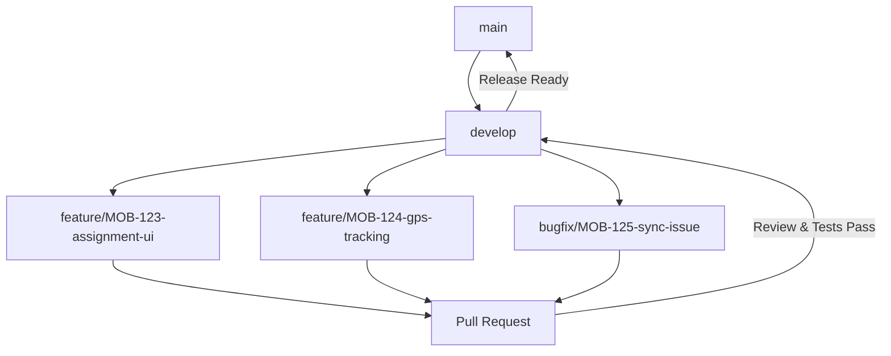

# React Native Development Guide

## Setup and Development Guide for ULMS CPV Mobile Application

---

**Document Control**

| Field | Value |
|-------|-------|
| **Document Title** | React Native Development Guide |
| **Project Name** | Unisoft Loan Management System (ULMS) v2.0 |
| **Document Version** | 1.0 |
| **Date** | 2026-02-05 |
| **Prepared By** | Mobile Development Team |
| **Reviewed By** | Technical Lead |
| **Classification** | Confidential |
| **Status** | Draft |

**Revision History**

| Version | Date | Author | Description |
|---------|------|--------|-------------|
| 1.0 | 2026-02-05 | Mobile Team | Initial development guide |

---

## Table of Contents

1. [Introduction](#1-introduction)
2. [Prerequisites](#2-prerequisites)
3. [Environment Setup](#3-environment-setup)
4. [Project Initialization](#4-project-initialization)
5. [Development Workflow](#5-development-workflow)
6. [Expo CLI Usage](#6-expo-cli-usage)
7. [Build Configuration](#7-build-configuration)
8. [Debugging and Testing](#8-debugging-and-testing)
9. [Deployment](#9-deployment)
10. [Troubleshooting](#10-troubleshooting)
11. [Related Documents](#11-related-documents)

---

## 1. Introduction

This guide provides comprehensive instructions for setting up the development environment, building, and deploying the ULMS CPV Mobile Application. The application is built with React Native 0.73 and Expo SDK 50.0, targeting field officers conducting Contact Point Verification for loan applications in Bangladesh.

### Target Platforms

| Platform | Minimum Version | Notes |
|----------|----------------|-------|
| Android | API 24 (Android 7.0) | ARM64 and ARMv7 |
| iOS | iOS 14.0 | iPhone and iPad |

---

## 2. Prerequisites

### 2.1 Required Software

| Software | Version | Purpose |
|----------|---------|---------|
| Node.js | 18.x LTS | JavaScript runtime |
| npm | 9.x+ or yarn 1.22+ | Package manager |
| Java JDK | 17 | Android compilation |
| Android Studio | Latest | Android SDK and emulator |
| Xcode | 15.0+ | iOS compilation (macOS only) |
| CocoaPods | 1.14+ | iOS dependency management |
| Git | 2.40+ | Version control |

### 2.2 Hardware Requirements

| Component | Minimum | Recommended |
|-----------|---------|-------------|
| RAM | 8 GB | 16 GB |
| Storage | 20 GB free | 50 GB free (SSD) |
| CPU | 4 cores | 8 cores |
| OS | Windows 10/macOS 12/Linux | Latest stable |

---

## 3. Environment Setup

### 3.1 Node.js Installation

```bash
# Using nvm (recommended)
curl -o- https://raw.githubusercontent.com/nvm-sh/nvm/v0.39.0/install.sh | bash
nvm install 18
nvm use 18
nvm alias default 18

# Verify installation
node --version  # v18.x.x
npm --version   # 9.x.x
```

### 3.2 Java JDK Installation

**Windows:**
```powershell
# Download Eclipse Temurin JDK 17 from Adoptium
# https://adoptium.net/temurin/releases/

# Set environment variables
[Environment]::SetEnvironmentVariable("JAVA_HOME", "C:\Program Files\Eclipse Adoptium\jdk-17", "User")
[Environment]::SetEnvironmentVariable("PATH", "$env:JAVA_HOME\bin;$env:PATH", "User")
```

**macOS/Linux:**
```bash
# Using Homebrew (macOS)
brew install --cask temurin17

# Verify
java -version
```

### 3.3 Android Studio Setup

1. Download and install Android Studio from [developer.android.com](https://developer.android.com/studio)

2. Install required SDK components:
```bash
# Via SDK Manager in Android Studio
# SDK Platforms:
#   - Android 14.0 (API 34)
#   - Android 13.0 (API 33)
#   - Android 12.0 (API 31)
#   - Android 7.0 (API 24)

# SDK Tools:
#   - Android SDK Build-Tools 34
#   - Android SDK Command-line Tools
#   - Android Emulator
#   - Android SDK Platform-Tools
```

3. Configure environment variables:

**Windows:**
```powershell
$androidSdk = "$env:LOCALAPPDATA\Android\Sdk"
[Environment]::SetEnvironmentVariable("ANDROID_HOME", $androidSdk, "User")
[Environment]::SetEnvironmentVariable("PATH", "$androidSdk\platform-tools;$androidSdk\cmdline-tools\latest\bin;$env:PATH", "User")
```

**macOS/Linux:**
```bash
# Add to ~/.zshrc or ~/.bashrc
export ANDROID_HOME=$HOME/Library/Android/sdk
export PATH=$PATH:$ANDROID_HOME/emulator
export PATH=$PATH:$ANDROID_HOME/platform-tools
export PATH=$PATH:$ANDROID_HOME/cmdline-tools/latest/bin
```

4. Create Android Virtual Device (AVD):
```bash
# List available system images
sdkmanager "system-images;android-34;google_apis;x86_64"

# Create AVD
avdmanager create avd -n Pixel_7_API_34 -k "system-images;android-34;google_apis;x86_64" -d pixel_7
```

### 3.4 Xcode Setup (macOS only)

```bash
# Install Xcode from App Store or Apple Developer Portal
# Install Xcode Command Line Tools
xcode-select --install

# Accept license
sudo xcodebuild -license accept

# Install CocoaPods
sudo gem install cocoapods
```

### 3.5 Watchman Installation (macOS/Linux)

```bash
# macOS
brew install watchman

# Linux
sudo apt-get install watchman  # Ubuntu/Debian
```

---

## 4. Project Initialization

### 4.1 Clone Repository

```bash
# Clone the ULMS mobile repository
git clone https://github.com/unisoft/ulms-cpv-mobile.git
cd ulms-cpv-mobile

# Install dependencies
npm install
# or
yarn install
```

### 4.2 Environment Configuration

Create environment files:

```bash
# Development environment
cp .env.example .env.development

# Production environment
cp .env.example .env.production
```

Configure environment variables:

```bash
# .env.development
ENV=development
API_BASE_URL=https://api-dev.ulms.unisoft.com.bd
API_TIMEOUT=30000
ENABLE_LOGGING=true
ENABLE_MOCK_DATA=false

# GPS Configuration
GPS_ACCURACY_THRESHOLD=10
GPS_TIMEOUT=10000

# Camera Configuration
CAMERA_MAX_PHOTOS=20
IMAGE_COMPRESSION_QUALITY=0.8
IMAGE_MAX_WIDTH=1920
IMAGE_MAX_HEIGHT=1080

# Sync Configuration
SYNC_INTERVAL=300000
SYNC_BATCH_SIZE=10
MAX_RETRY_ATTEMPTS=3
RETRY_BACKOFF_MS=5000

# Security
ENABLE_BIOMETRIC=true
TOKEN_REFRESH_INTERVAL=300000
```

### 4.3 iOS Setup (macOS only)

```bash
# Install iOS dependencies
cd ios
pod install
cd ..

# Verify iOS build
npx react-native run-ios
```

### 4.4 Android Setup

```bash
# Verify Android build
npx react-native run-android

# Or with specific variant
npx react-native run-android --variant=debug
```

---

## 5. Development Workflow

### 5.1 Branch Strategy



### 5.2 Feature Development Workflow

1. **Create Feature Branch**
```bash
git checkout develop
git pull origin develop
git checkout -b feature/MOB-XXX-feature-name
```

2. **Development Cycle**
```bash
# Start Metro bundler
npm start

# Run on Android
npm run android

# Run on iOS (macOS only)
npm run ios

# Run tests
npm test

# Type checking
npm run typecheck

# Linting
npm run lint
```

3. **Commit Changes**
```bash
# Stage changes
git add .

# Commit with conventional commits
git commit -m "feat(MOB-XXX): add assignment list screen

- Implement assignment list UI
- Add pull-to-refresh functionality
- Include offline indicator"

# Push branch
git push origin feature/MOB-XXX-feature-name
```

### 5.3 Code Quality Checks

```bash
# Run all checks before committing
npm run validate

# Individual checks
npm run lint          # ESLint
npm run lint:fix      # ESLint with auto-fix
npm run format        # Prettier formatting
npm run typecheck     # TypeScript type checking
npm run test          # Jest unit tests
npm run test:coverage # Test with coverage report
```

---

## 6. Expo CLI Usage

### 6.1 Expo Development Build

```bash
# Install Expo CLI globally
npm install -g @expo/cli

# Start Expo development server
npx expo start

# Start with tunnel (for external device access)
npx expo start --tunnel

# Start with clear cache
npx expo start --clear
```

### 6.2 Development Client

```bash
# Build development client for Android
npx expo run:android

# Build development client for iOS
npx expo run:ios

# Build for specific device
npx expo run:ios --device "iPhone 15 Pro"
```

### 6.3 Prebuild Configuration

```json
// app.json
{
  "expo": {
    "name": "ULMS CPV",
    "slug": "ulms-cpv-mobile",
    "version": "2.0.0",
    "orientation": "portrait",
    "icon": "./assets/icon.png",
    "userInterfaceStyle": "light",
    "splash": {
      "image": "./assets/splash.png",
      "resizeMode": "contain",
      "backgroundColor": "#ffffff"
    },
    "assetBundlePatterns": ["**/*"],
    "ios": {
      "supportsTablet": true,
      "bundleIdentifier": "com.unisoft.ulms.cpv",
      "buildNumber": "2.0.0.1",
      "infoPlist": {
        "NSLocationWhenInUseUsageDescription": "This app needs access to location for CPV verification.",
        "NSCameraUsageDescription": "This app needs access to camera for capturing verification photos."
      }
    },
    "android": {
      "adaptiveIcon": {
        "foregroundImage": "./assets/adaptive-icon.png",
        "backgroundColor": "#ffffff"
      },
      "package": "com.unisoft.ulms.cpv",
      "versionCode": 200001,
      "permissions": [
        "ACCESS_FINE_LOCATION",
        "ACCESS_COARSE_LOCATION",
        "CAMERA",
        "READ_EXTERNAL_STORAGE",
        "WRITE_EXTERNAL_STORAGE"
      ]
    },
    "plugins": [
      [
        "expo-location",
        {
          "locationAlwaysAndWhenInUsePermission": "Allow ULMS CPV to use your location."
        }
      ],
      [
        "expo-camera",
        {
          "cameraPermission": "Allow ULMS CPV to access your camera."
        }
      ]
    ]
  }
}
```

---

## 7. Build Configuration

### 7.1 Android Build

#### Debug Build

```bash
# Clean build
cd android && ./gradlew clean

# Build debug APK
cd android && ./gradlew assembleDebug

# Install on connected device
cd android && ./gradlew installDebug

# Or combined
npx react-native run-android
```

#### Release Build

```bash
# Generate signing key (one-time setup)
keytool -genkey -v -keystore ulms-cpv-release.keystore -alias ulms-cpv -keyalg RSA -keysize 2048 -validity 10000

# Configure signing in android/app/build.gradle
```

```gradle
// android/app/build.gradle
android {
    ...
    signingConfigs {
        release {
            if (project.hasProperty('MYAPP_UPLOAD_STORE_FILE')) {
                storeFile file(MYAPP_UPLOAD_STORE_FILE)
                storePassword MYAPP_UPLOAD_STORE_PASSWORD
                keyAlias MYAPP_UPLOAD_KEY_ALIAS
                keyPassword MYAPP_UPLOAD_KEY_PASSWORD
            }
        }
    }
    buildTypes {
        release {
            signingConfig signingConfigs.release
            minifyEnabled true
            proguardFiles getDefaultProguardFile('proguard-android-optimize.txt'), 'proguard-rules.pro'
        }
    }
}
```

```bash
# Create gradle.properties for signing
# ~/.gradle/gradle.properties
MYAPP_UPLOAD_STORE_FILE=ulms-cpv-release.keystore
MYAPP_UPLOAD_KEY_ALIAS=ulms-cpv
MYAPP_UPLOAD_STORE_PASSWORD=*****
MYAPP_UPLOAD_KEY_PASSWORD=*****

# Build release APK
cd android && ./gradlew assembleRelease

# Build release AAB (for Play Store)
cd android && ./gradlew bundleRelease
```

### 7.2 iOS Build (macOS only)

```bash
# Clean build
 cd ios && xcodebuild clean

# Build for simulator
cd ios && xcodebuild -workspace ULMSCPV.xcworkspace -scheme ULMSCPV -configuration Debug -sdk iphonesimulator

# Build for device (requires signing)
cd ios && xcodebuild -workspace ULMSCPV.xcworkspace -scheme ULMSCPV -configuration Release -sdk iphoneos

# Archive for distribution
cd ios && xcodebuild -workspace ULMSCPV.xcworkspace -scheme ULMSCPV -configuration Release archive -archivePath build/ULMSCPV.xcarchive
```

### 7.3 EAS Build (Expo Application Services)

```bash
# Install EAS CLI
npm install -g eas-cli

# Login to Expo
eas login

# Configure EAS
eas build:configure

# Build for Android
eas build --platform android

# Build for iOS
 eas build --platform ios

# Build for both platforms
eas build --platform all
```

```json
// eas.json
{
  "cli": {
    "version": ">= 7.0.0"
  },
  "build": {
    "development": {
      "developmentClient": true,
      "distribution": "internal"
    },
    "preview": {
      "distribution": "internal",
      "android": {
        "buildType": "apk"
      }
    },
    "production": {
      "android": {
        "buildType": "app-bundle"
      }
    }
  },
  "submit": {
    "production": {}
  }
}
```

---

## 8. Debugging and Testing

### 8.1 Debugging Tools

| Tool | Platform | Usage |
|------|----------|-------|
| Flipper | Android/iOS | Network inspection, layout, logs |
| React DevTools | Android/iOS | Component tree, props, state |
| Redux DevTools | Android/iOS | Action/state inspection |
| Chrome DevTools | Android | JavaScript debugging |
| Safari DevTools | iOS | JavaScript debugging |

### 8.2 Flipper Configuration

```bash
# Install Flipper from https://fbflipper.com/
# Launch Flipper application
# App will automatically connect when running in debug mode
```

### 8.3 React Native Debugger

```bash
# Install RN debugger
brew install --cask react-native-debugger

# Launch before running app
open "React Native Debugger.app"

# Configure app to use debugger
# Press Cmd+D (iOS) or Cmd+M (Android) in simulator
# Select "Debug with Chrome"
```

### 8.4 Testing Commands

```bash
# Run all tests
npm test

# Run tests in watch mode
npm test -- --watch

# Run tests with coverage
npm test -- --coverage

# Run specific test file
npm test -- AssignmentList.test.tsx

# Run E2E tests with Detox
npm run e2e:build  # Build test binary
npm run e2e:test   # Run E2E tests
```

### 8.5 Logging

```typescript
// src/utils/logger.ts
import { logger } from 'react-native-logs';

const config = {
  severity: __DEV__ ? 'debug' : 'error',
  transport: __DEV__ ? console.log : () => {},
};

export const log = logger.createLogger(config);

// Usage
import { log } from '../utils/logger';

log.debug('Fetching assignments', { userId });
log.info('Assignment loaded', { assignmentId });
log.error('Failed to sync', error);
```

---

## 9. Deployment

### 9.1 Internal Distribution

```bash
# Using EAS for internal distribution
eas build --profile preview --platform android

# Share QR code or download link with testers
```

### 9.2 Google Play Store Deployment

```bash
# Build production AAB
eas build --profile production --platform android

# Or manually
cd android && ./gradlew bundleRelease

# Upload to Play Console
# 1. Go to https://play.google.com/console
# 2. Create new release
# 3. Upload AAB file
# 4. Add release notes
# 5. Submit for review
```

### 9.3 Apple App Store Deployment

```bash
# Build production archive
eas build --profile production --platform ios

# Or manually via Xcode
# 1. Open ios/ULMSCPV.xcworkspace in Xcode
# 2. Select Product > Archive
# 3. Distribute App
# 4. Upload to App Store Connect
```

### 9.4 Release Checklist

- [ ] Version bumped in `package.json`
- [ ] Version bumped in `app.json`
- [ ] iOS `buildNumber` incremented
- [ ] Android `versionCode` incremented
- [ ] Changelog updated
- [ ] All tests passing
- [ ] E2E tests passing
- [ ] Code review approved
- [ ] QA sign-off
- [ ] Security scan passed

---

## 10. Troubleshooting

### 10.1 Common Issues

| Issue | Cause | Solution |
|-------|-------|----------|
| Metro bundler won't start | Port conflict | `npx react-native start --port 8081` |
| Android build fails | Missing SDK | Run `sdkmanager --licenses` |
| iOS build fails | Pod issues | `cd ios && pod deintegrate && pod install` |
| App crashes on start | Native module error | Clean build, reinstall node_modules |
| Location not working | Permissions missing | Check AndroidManifest.xml and Info.plist |
| Camera shows black screen | Permission denied | Request runtime permissions |
| Sync not working offline | Network check | Verify NetInfo configuration |

### 10.2 Clean Build Steps

```bash
# Clean everything
rm -rf node_modules
rm -rf ios/Pods ios/Podfile.lock
rm -rf android/app/build
rm -rf android/build
watchman watch-del-all
rm -rf $TMPDIR/react-*
npm cache clean --force

# Reinstall
npm install
cd ios && pod install
cd ..

# Clear Metro cache
npx react-native start --reset-cache
```

### 10.3 Metro Configuration

```javascript
// metro.config.js
const { getDefaultConfig } = require('expo/metro-config');

const config = getDefaultConfig(__dirname);

// Add additional asset extensions
config.resolver.assetExts.push('cjs', 'ttf', 'otf');

// Increase max workers for faster builds
config.maxWorkers = 4;

// Enable Hermes
config.transformer.hermesParser = true;

module.exports = config;
```

---

## 11. Related Documents

| Document | Purpose | Location |
|----------|---------|----------|
| `[MOB]_React_Native_CPV_App_Architecture_v1.0.md` | Overall mobile architecture | `01_Mobile_Architecture/` |
| `[MOB]_Offline_Data_Sync_Strategy_v1.0.md` | Offline sync implementation | `01_Mobile_Architecture/` |
| `[MOB]_CPV_Assignment_Flow_v1.0.md` | Assignment workflow | `02_Mobile_Features/` |
| `[STD]_CodingStandards_TypeScript_React_v1.0.md` | Coding standards | `Phase_0/` |
| `[DEV]_Guide_GitWorkflowBranchingStrategy_v1.0.md` | Git workflow | `Phase_0/` |

---

**Document End**

*© 2026 Unisoft Systems Limited. All Rights Reserved.*
