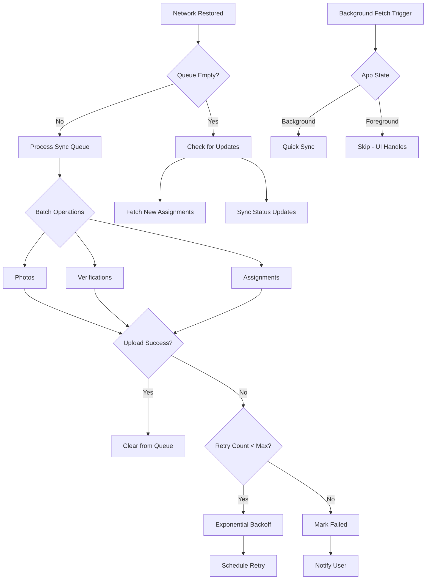

# Background Sync Implementation

## Background Data Synchronization for ULMS CPV Mobile

---

**Document Control**

| Field | Value |
|-------|-------|
| **Document Title** | Background Sync Implementation |
| **Project Name** | Unisoft Loan Management System (ULMS) v2.0 |
| **Document Version** | 1.0 |
| **Date** | 2026-02-05 |
| **Prepared By** | Mobile Development Team |
| **Reviewed By** | Technical Lead |
| **Classification** | Confidential |
| **Status** | Draft |

**Revision History**

| Version | Date | Author | Description |
|---------|------|--------|-------------|
| 1.0 | 2026-02-05 | Mobile Team | Initial background sync implementation |

---

## Table of Contents

1. [Executive Summary](#1-executive-summary)
2. [Background Sync Architecture](#2-background-sync-architecture)
3. [Background Fetch Configuration](#3-background-fetch-configuration)
4. [Auto-Sync Logic](#4-auto-sync-logic)
5. [Retry Mechanisms](#5-retry-mechanisms)
6. [Network-Aware Sync](#6-network-aware-sync)
7. [Battery Optimization](#7-battery-optimization)
8. [Error Handling](#8-error-handling)
9. [Testing Approach](#9-testing-approach)
10. [Troubleshooting](#10-troubleshooting)
11. [Related Documents](#11-related-documents)

---

## 1. Executive Summary

This document defines the background synchronization implementation for the ULMS CPV Mobile Application, ensuring data collected in the field is reliably synchronized with the backend when connectivity is available. The system implements intelligent retry mechanisms, network-aware scheduling, and battery optimization strategies.

### Key Features

| Feature | Description |
|---------|-------------|
| **Background Fetch** | Periodic sync when app is backgrounded |
| **Auto-Sync** | Automatic sync on network restoration |
| **Smart Retry** | Exponential backoff with maximum limits |
| **Network Awareness** | WiFi vs cellular preferences |
| **Battery Optimization** | Low-power sync scheduling |
| **Conflict Resolution** | Handle concurrent modifications |

---

## 2. Background Sync Architecture

### 2.1 Architecture Diagram

```
┌─────────────────────────────────────────────────────────────────────────────────┐
│                        Background Sync Architecture                              │
├─────────────────────────────────────────────────────────────────────────────────┤
│                                                                                 │
│  ┌─────────────────────────────────────────────────────────────────────────┐   │
│  │                       Application Layer                                  │   │
│  │  ┌──────────────┐  ┌──────────────┐  ┌──────────────┐  ┌──────────────┐  │   │
│  │  │   Sync       │  │   Network    │  │   Battery    │  │   App        │  │   │
│  │  │   Status UI  │  │   Listener   │  │   Monitor    │  │   Lifecycle  │  │   │
│  │  └──────┬───────┘  └──────┬───────┘  └──────┬───────┘  └──────┬───────┘  │   │
│  │         │                 │                 │                 │          │   │
│  │         └─────────────────┴────────┬────────┴─────────────────┘          │   │
│  │                                    │                                     │   │
│  │  ┌─────────────────────────────────┴─────────────────────────────────┐  │   │
│  │  │                      Background Sync Engine                        │  │   │
│  │  │  ┌──────────────┐  ┌──────────────┐  ┌──────────────┐            │  │   │
│  │  │  │   Sync       │  │   Operation  │  │   Conflict   │            │  │   │
│  │  │  │   Scheduler  │  │   Queue      │  │   Resolver   │            │  │   │
│  │  │  └──────────────┘  └──────────────┘  └──────────────┘            │  │   │
│  │  │  ┌──────────────┐  ┌──────────────┐  ┌──────────────┐            │  │   │
│  │  │  │   Retry      │  │   Batch      │  │   Progress   │            │  │   │
│  │  │  │   Manager    │  │   Processor  │  │   Tracker    │            │  │   │
│  │  │  └──────────────┘  └──────────────┘  └──────────────┘            │  │   │
│  │  └──────────────────────────────────────────────────────────────────┘  │   │
│  └────────────────────────────────────────────────────────────────────────┘   │
│                                      │                                          │
│  ┌───────────────────────────────────┴───────────────────────────────────────┐ │
│  │                      Platform Background APIs                              │ │
│  │  ┌────────────────────────┐        ┌────────────────────────┐             │ │
│  │  │   iOS                  │        │   Android              │             │ │
│  │  │   BackgroundTasks      │        │   WorkManager          │             │ │
│  │  │   - BGAppRefreshTask   │        │   - PeriodicWork       │             │ │
│  │  │   - BGProcessingTask   │        │   - OneTimeWork        │             │ │
│  │  └────────────────────────┘        └────────────────────────┘             │ │
│  └───────────────────────────────────────────────────────────────────────────┘ │
│                                      │                                          │
│                                      ▼                                          │
│  ┌────────────────────────────────────────────────────────────────────────────┐│
│  │                          ULMS Backend API                                   ││
│  └────────────────────────────────────────────────────────────────────────────┘│
│                                                                                 │
└─────────────────────────────────────────────────────────────────────────────────┘
```

### 2.2 Data Flow



---

## 3. Background Fetch Configuration

### 3.1 iOS Background Tasks

```typescript
// src/services/background/iosBackgroundTasks.ts
import * as BackgroundFetch from 'expo-background-fetch';
import * as TaskManager from 'expo-task-manager';

const BACKGROUND_SYNC_TASK = 'background-sync-task';

// Define the background task
TaskManager.defineTask(BACKGROUND_SYNC_TASK, async () => {
  try {
    const { syncEngine } = await import('../sync/syncEngine');
    const engine = syncEngine.getInstance();
    
    // Attempt sync
    await engine.processQueue();
    
    // Check if more work remains
    const stats = engine.getSyncStats();
    
    return stats.pending > 0 
      ? BackgroundFetch.BackgroundFetchResult.NewData 
      : BackgroundFetch.BackgroundFetchResult.NoData;
  } catch (error) {
    console.error('Background sync failed:', error);
    return BackgroundFetch.BackgroundFetchResult.Failed;
  }
});

export async function registerBackgroundFetchAsync(): Promise<void> {
  await BackgroundFetch.registerTaskAsync(BACKGROUND_SYNC_TASK, {
    minimumInterval: 15 * 60, // 15 minutes
    stopOnTerminate: false,
    startOnBoot: true,
  });
}

export async function unregisterBackgroundFetchAsync(): Promise<void> {
  await BackgroundFetch.unregisterTaskAsync(BACKGROUND_SYNC_TASK);
}
```

### 3.2 Android WorkManager Configuration

```typescript
// src/services/background/androidWorkManager.ts
import * as BackgroundFetch from 'expo-background-fetch';
import * as TaskManager from 'expo-task-manager';

const ANDROID_SYNC_TASK = 'android-sync-task';

TaskManager.defineTask(ANDROID_SYNC_TASK, async () => {
  try {
    const { syncEngine } = await import('../sync/syncEngine');
    const engine = syncEngine.getInstance();
    
    // Check battery level before heavy operations
    const batteryLevel = await getBatteryLevel();
    
    if (batteryLevel < 0.15) {
      console.log('Battery too low, deferring sync');
      return BackgroundFetch.BackgroundFetchResult.NoData;
    }
    
    await engine.processQueue();
    
    return BackgroundFetch.BackgroundFetchResult.NewData;
  } catch (error) {
    console.error('Android background sync failed:', error);
    return BackgroundFetch.BackgroundFetchResult.Failed;
  }
});

async function getBatteryLevel(): Promise<number> {
  const { Battery } = await import('expo-battery');
  return await Battery.getBatteryLevelAsync();
}

export async function registerAndroidBackgroundTask(): Promise<void> {
  await BackgroundFetch.registerTaskAsync(ANDROID_SYNC_TASK, {
    minimumInterval: 15 * 60,
    stopOnTerminate: false,
    startOnBoot: true,
  });
}
```

---

## 4. Auto-Sync Logic

### 4.1 Network-Aware Auto-Sync

```typescript
// src/services/sync/autoSync.ts
import NetInfo, { NetInfoState } from '@react-native-community/netinfo';
import { syncEngine, SyncEngine } from './syncEngine';

export class AutoSyncManager {
  private static instance: AutoSyncManager;
  private unsubscribe: (() => void) | null = null;
  private lastSyncAttempt: number = 0;
  private readonly SYNC_COOLDOWN_MS = 5000; // 5 seconds minimum between syncs

  static getInstance(): AutoSyncManager {
    if (!AutoSyncManager.instance) {
      AutoSyncManager.instance = new AutoSyncManager();
    }
    return AutoSyncManager.instance;
  }

  start(): void {
    // Listen for network state changes
    this.unsubscribe = NetInfo.addEventListener(this.handleNetworkChange);
  }

  stop(): void {
    if (this.unsubscribe) {
      this.unsubscribe();
      this.unsubscribe = null;
    }
  }

  private handleNetworkChange = async (state: NetInfoState) => {
    const now = Date.now();
    
    // Respect cooldown period
    if (now - this.lastSyncAttempt < this.SYNC_COOLDOWN_MS) {
      return;
    }

    if (state.isConnected) {
      console.log('Network connected - triggering auto-sync');
      
      const engine = SyncEngine.getInstance();
      const queue = engine.getQueue();
      
      if (queue.length > 0) {
        this.lastSyncAttempt = now;
        
        // Check if we should sync based on connection type
        const shouldSync = await this.shouldSyncOnConnection(state);
        
        if (shouldSync) {
          await engine.processQueue();
        }
      }
    }
  };

  private async shouldSyncOnConnection(state: NetInfoState): Promise<boolean> {
    // Get user preferences
    const wifiOnly = await this.getWifiOnlyPreference();
    
    if (wifiOnly && state.type !== 'wifi') {
      console.log('Sync deferred - waiting for WiFi');
      return false;
    }

    // Check for expensive connections
    if (state.details?.isConnectionExpensive) {
      // Only sync critical items on expensive connections
      const engine = SyncEngine.getInstance();
      const hasCriticalItems = engine.getQueue().some(
        op => op.priority <= 2
      );
      
      if (!hasCriticalItems) {
        console.log('Sync deferred - non-critical items on expensive connection');
        return false;
      }
    }

    return true;
  }

  private async getWifiOnlyPreference(): Promise<boolean> {
    const { syncStorage } = await import('../storage/mmkvStorage');
    return syncStorage.getString('sync-wifi-only') === 'true';
  }
}

export const autoSyncManager = AutoSyncManager.getInstance();
```

### 4.2 App State Handling

```typescript
// src/services/sync/appStateSync.ts
import { AppState, AppStateStatus } from 'react-native';
import { syncEngine, SyncEngine } from './syncEngine';

export class AppStateSyncManager {
  private static instance: AppStateSyncManager;
  private currentState: AppStateStatus = 'active';

  static getInstance(): AppStateSyncManager {
    if (!AppStateSyncManager.instance) {
      AppStateSyncManager.instance = new AppStateSyncManager();
    }
    return AppStateSyncManager.instance;
  }

  start(): void {
    AppState.addEventListener('change', this.handleAppStateChange);
  }

  private handleAppStateChange = async (nextAppState: AppStateStatus) => {
    const previousState = this.currentState;
    this.currentState = nextAppState;

    // App coming to foreground - quick sync
    if (previousState === 'background' && nextAppState === 'active') {
      console.log('App to foreground - triggering sync');
      const engine = SyncEngine.getInstance();
      
      // Only sync high priority items immediately
      const highPriorityItems = engine.getQueue().filter(
        op => op.priority <= 2
      );
      
      if (highPriorityItems.length > 0) {
        await engine.processQueue();
      }
    }

    // App going to background - save any pending work
    if (nextAppState === 'background') {
      console.log('App to background - ensuring data is saved');
      // Persist any in-memory state
    }
  };
}

export const appStateSyncManager = AppStateSyncManager.getInstance();
```

---

## 5. Retry Mechanisms

### 5.1 Exponential Backoff

```typescript
// src/services/sync/retryManager.ts
export interface RetryConfig {
  maxRetries: number;
  baseDelayMs: number;
  maxDelayMs: number;
  exponentialBase: number;
  jitterFactor: number;
}

export const DEFAULT_RETRY_CONFIG: RetryConfig = {
  maxRetries: 5,
  baseDelayMs: 5000,    // 5 seconds
  maxDelayMs: 300000,   // 5 minutes
  exponentialBase: 2,
  jitterFactor: 0.1,    // 10% random jitter
};

export class RetryManager {
  private retryTimeouts: Map<string, NodeJS.Timeout> = new Map();

  scheduleRetry(
    operationId: string,
    attemptNumber: number,
    retryFn: () => void,
    config: RetryConfig = DEFAULT_RETRY_CONFIG
  ): void {
    // Clear any existing retry for this operation
    this.clearRetry(operationId);

    // Calculate delay with exponential backoff
    const exponentialDelay = config.baseDelayMs * 
      Math.pow(config.exponentialBase, attemptNumber - 1);
    
    // Add jitter to prevent thundering herd
    const jitter = exponentialDelay * config.jitterFactor * Math.random();
    const delay = Math.min(exponentialDelay + jitter, config.maxDelayMs);

    console.log(`Scheduling retry for ${operationId} in ${delay}ms (attempt ${attemptNumber})`);

    const timeout = setTimeout(() => {
      this.retryTimeouts.delete(operationId);
      retryFn();
    }, delay);

    this.retryTimeouts.set(operationId, timeout);
  }

  clearRetry(operationId: string): void {
    const timeout = this.retryTimeouts.get(operationId);
    if (timeout) {
      clearTimeout(timeout);
      this.retryTimeouts.delete(operationId);
    }
  }

  clearAllRetries(): void {
    this.retryTimeouts.forEach((timeout) => clearTimeout(timeout));
    this.retryTimeouts.clear();
  }
}

export const retryManager = new RetryManager();
```

### 5.2 Retry Policies by Operation Type

```typescript
// src/services/sync/retryPolicies.ts
import { RetryConfig } from './retryManager';
import { SyncEntityType } from './syncEngine';

export const retryPolicies: Record<SyncEntityType, RetryConfig> = {
  [SyncEntityType.ASSIGNMENT]: {
    maxRetries: 3,
    baseDelayMs: 5000,
    maxDelayMs: 60000,
    exponentialBase: 2,
    jitterFactor: 0.1,
  },
  [SyncEntityType.VERIFICATION]: {
    maxRetries: 5,
    baseDelayMs: 10000,
    maxDelayMs: 300000,
    exponentialBase: 2,
    jitterFactor: 0.1,
  },
  [SyncEntityType.PHOTO]: {
    maxRetries: 10,
    baseDelayMs: 30000,
    maxDelayMs: 600000, // 10 minutes
    exponentialBase: 2,
    jitterFactor: 0.2,
  },
  [SyncEntityType.DOCUMENT]: {
    maxRetries: 5,
    baseDelayMs: 20000,
    maxDelayMs: 300000,
    exponentialBase: 2,
    jitterFactor: 0.15,
  },
};
```

---

## 6. Network-Aware Sync

### 6.1 Network Quality Detection

```typescript
// src/services/network/networkQuality.ts
import NetInfo from '@react-native-community/netinfo';

export enum NetworkQuality {
  EXCELLENT = 'EXCELLENT', // WiFi, fast cellular
  GOOD = 'GOOD',           // 4G/LTE
  FAIR = 'FAIR',           // 3G
  POOR = 'POOR',           // 2G/Edge
  OFFLINE = 'OFFLINE',
}

export class NetworkQualityDetector {
  async getNetworkQuality(): Promise<NetworkQuality> {
    const state = await NetInfo.fetch();

    if (!state.isConnected) {
      return NetworkQuality.OFFLINE;
    }

    // Check connection type
    switch (state.type) {
      case 'wifi':
        return NetworkQuality.EXCELLENT;
      case 'cellular':
        return this.getCellularQuality(state.details?.cellularGeneration);
      default:
        return NetworkQuality.FAIR;
    }
  }

  private getCellularQuality(generation?: string): NetworkQuality {
    switch (generation) {
      case '5g':
        return NetworkQuality.EXCELLENT;
      case '4g':
      case 'lte':
        return NetworkQuality.GOOD;
      case '3g':
        return NetworkQuality.FAIR;
      case '2g':
      case 'edge':
        return NetworkQuality.POOR;
      default:
        return NetworkQuality.FAIR;
    }
  }

  // Determine batch size based on network quality
  getOptimalBatchSize(quality: NetworkQuality): number {
    switch (quality) {
      case NetworkQuality.EXCELLENT:
        return 20;
      case NetworkQuality.GOOD:
        return 10;
      case NetworkQuality.FAIR:
        return 5;
      case NetworkQuality.POOR:
        return 1;
      default:
        return 0;
    }
  }
}

export const networkQualityDetector = new NetworkQualityDetector();
```

---

## 7. Battery Optimization

### 7.1 Battery-Aware Sync

```typescript
// src/services/sync/batteryAwareSync.ts
import * as Battery from 'expo-battery';

export enum BatteryLevel {
  CRITICAL = 'CRITICAL', // < 10%
  LOW = 'LOW',           // 10-20%
  MODERATE = 'MODERATE', // 20-50%
  GOOD = 'GOOD',         // > 50%
}

export class BatteryAwareSync {
  async getBatteryLevel(): Promise<BatteryLevel> {
    const level = await Battery.getBatteryLevelAsync();
    
    if (level < 0.1) return BatteryLevel.CRITICAL;
    if (level < 0.2) return BatteryLevel.LOW;
    if (level < 0.5) return BatteryLevel.MODERATE;
    return BatteryLevel.GOOD;
  }

  async shouldPerformHeavySync(): Promise<boolean> {
    const [batteryLevel, powerState] = await Promise.all([
      this.getBatteryLevel(),
      Battery.getPowerStateAsync(),
    ]);

    // Always sync if charging
    if (powerState.isPluggedIn) {
      return true;
    }

    // Reduce sync frequency on low battery
    switch (batteryLevel) {
      case BatteryLevel.CRITICAL:
        return false; // No heavy sync
      case BatteryLevel.LOW:
        // Only critical items
        return true;
      default:
        return true;
    }
  }

  getSyncIntervalForBatteryLevel(level: BatteryLevel): number {
    switch (level) {
      case BatteryLevel.CRITICAL:
        return 60 * 60 * 1000; // 1 hour
      case BatteryLevel.LOW:
        return 30 * 60 * 1000; // 30 minutes
      case BatteryLevel.MODERATE:
        return 15 * 60 * 1000; // 15 minutes
      case BatteryLevel.GOOD:
        return 5 * 60 * 1000;  // 5 minutes
    }
  }
}

export const batteryAwareSync = new BatteryAwareSync();
```

---

## 8. Error Handling

| Error Code | Description | Action |
|------------|-------------|--------|
| SYNC-001 | Network timeout | Retry with backoff |
| SYNC-002 | Server error (5xx) | Retry with longer backoff |
| SYNC-003 | Authentication failed | Refresh token, then retry |
| SYNC-004 | Conflict detected | Trigger conflict resolution |
| SYNC-005 | Payload too large | Split into smaller batches |
| SYNC-006 | Storage full | Alert user, pause sync |

---

## 9. Testing Approach

```typescript
// __tests__/sync/backgroundSync.test.ts
describe('Background Sync', () => {
  it('should process queue when network restored', async () => {
    // Test auto-sync on network change
  });

  it('should retry with exponential backoff', async () => {
    // Test retry logic
  });

  it('should respect battery constraints', async () => {
    // Test battery-aware sync
  });
});
```

---

## 10. Troubleshooting

| Issue | Cause | Solution |
|-------|-------|----------|
| Sync not starting | Background tasks not registered | Check platform-specific setup |
| Frequent failures | Poor network | Adjust retry policy |
| Battery drain | Too frequent sync | Increase sync interval |
| Data not uploading | Queue full | Clear old items, check storage |

---

## 11. Related Documents

| Document | Purpose | Location |
|----------|---------|----------|
| `[MOB]_Offline_Data_Sync_Strategy_v1.0.md` | Offline sync architecture | `01_Mobile_Architecture/` |
| `[MOB]_React_Native_CPV_App_Architecture_v1.0.md` | Overall architecture | `01_Mobile_Architecture/` |
| `[MOB]_CPV_Report_Generation_v1.0.md` | Report sync | `02_Mobile_Features/` |

---

**Document End**

*© 2026 Unisoft Systems Limited. All Rights Reserved.*
