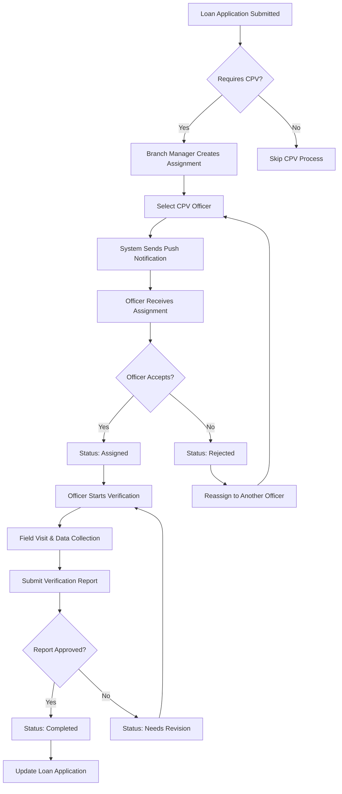
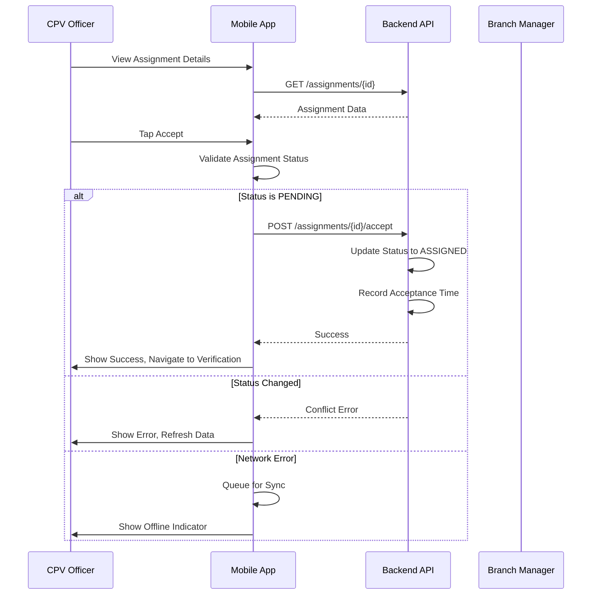

# CPV Assignment Flow

## Task Assignment and Management for ULMS CPV Mobile

---

**Document Control**

| Field | Value |
|-------|-------|
| **Document Title** | CPV Assignment Flow |
| **Project Name** | Unisoft Loan Management System (ULMS) v2.0 |
| **Document Version** | 1.0 |
| **Date** | 2026-02-05 |
| **Prepared By** | Mobile Development Team |
| **Reviewed By** | Technical Lead |
| **Classification** | Confidential |
| **Status** | Draft |

**Revision History**

| Version | Date | Author | Description |
|---------|------|--------|-------------|
| 1.0 | 2026-02-05 | Mobile Team | Initial assignment flow design |

---

## Table of Contents

1. [Executive Summary](#1-executive-summary)
2. [Assignment Workflow Overview](#2-assignment-workflow-overview)
3. [Assignment Data Model](#3-assignment-data-model)
4. [Assignment List Screen](#4-assignment-list-screen)
5. [Assignment Detail Screen](#5-assignment-detail-screen)
6. [Push Notifications](#6-push-notifications)
7. [Assignment Acceptance Flow](#7-assignment-acceptance-flow)
8. [State Management](#8-state-management)
9. [Offline Assignment Handling](#9-offline-assignment-handling)
10. [Testing Approach](#10-testing-approach)
11. [Troubleshooting](#11-troubleshooting)
12. [Related Documents](#12-related-documents)

---

## 1. Executive Summary

This document defines the CPV (Contact Point Verification) Assignment Flow for the ULMS Mobile Application, enabling field officers to receive, manage, and complete verification assignments efficiently. The system supports real-time assignment updates via push notifications, offline access to assignment details, and seamless integration with the verification workflow.

### Key Features

| Feature | Description |
|---------|-------------|
| **Assignment List** | Prioritized list with filtering and search |
| **Push Notifications** | Real-time new assignment alerts |
| **Offline Access** | View assignments without connectivity |
| **Status Tracking** | Pending, In Progress, Completed states |
| **Priority Management** | High, Medium, Low priority indicators |
| **Route Optimization** | Map view for efficient field visits |

---

## 2. Assignment Workflow Overview

### 2.1 Business Process Flow



### 2.2 Assignment States

| State | Description | Transitions |
|-------|-------------|-------------|
| **PENDING** | New assignment, awaiting acceptance | Accept -> ASSIGNED, Reject -> REJECTED |
| **ASSIGNED** | Officer accepted, ready to start | Start -> IN_PROGRESS |
| **IN_PROGRESS** | Verification actively being conducted | Submit -> SUBMITTED |
| **SUBMITTED** | Report submitted, awaiting review | Approve -> COMPLETED, Reject -> REVISION_NEEDED |
| **REVISION_NEEDED** | Report requires corrections | Update -> SUBMITTED |
| **COMPLETED** | Verification successfully completed | None |
| **REJECTED** | Officer declined assignment | Reassign -> PENDING |
| **CANCELLED** | Assignment cancelled by manager | None |

---

## 3. Assignment Data Model

### 3.1 TypeScript Interface

```typescript
// src/features/assignments/types/assignment.types.ts

export enum AssignmentStatus {
  PENDING = 'PENDING',
  ASSIGNED = 'ASSIGNED',
  IN_PROGRESS = 'IN_PROGRESS',
  SUBMITTED = 'SUBMITTED',
  REVISION_NEEDED = 'REVISION_NEEDED',
  COMPLETED = 'COMPLETED',
  REJECTED = 'REJECTED',
  CANCELLED = 'CANCELLED',
}

export enum Priority {
  HIGH = 'HIGH',
  MEDIUM = 'MEDIUM',
  LOW = 'LOW',
}

export enum VerificationType {
  RESIDENCE = 'RESIDENCE',
  BUSINESS = 'BUSINESS',
  BOTH = 'BOTH',
}

export interface Applicant {
  id: string;
  name: string;
  phone: string;
  email?: string;
  nidNumber: string;
  photoUrl?: string;
}

export interface Address {
  id: string;
  type: 'RESIDENCE' | 'BUSINESS';
  addressLine1: string;
  addressLine2?: string;
  area: string;
  city: string;
  district: string;
  postalCode: string;
  latitude?: number;
  longitude?: number;
  landmark?: string;
}

export interface LoanApplication {
  id: string;
  applicationNumber: string;
  loanType: string;
  loanAmount: number;
  tenure: number;
  applicationDate: string;
}

export interface Assignment {
  id: string;
  assignmentNumber: string;
  status: AssignmentStatus;
  priority: Priority;
  verificationType: VerificationType;
  
  // Related Data
  applicant: Applicant;
  addresses: Address[];
  loanApplication: LoanApplication;
  
  // Assignment Details
  assignedBy: string;
  assignedTo?: string;
  assignedAt?: string;
  acceptedAt?: string;
  completedAt?: string;
  dueDate: string;
  
  // Instructions
  specialInstructions?: string;
  requiredPhotos: string[];
  requiredDocuments: string[];
  
  // Metadata
  createdAt: string;
  updatedAt: string;
  version: number;
}

export interface AssignmentSummary {
  id: string;
  assignmentNumber: string;
  status: AssignmentStatus;
  priority: Priority;
  applicantName: string;
  area: string;
  dueDate: string;
  isOffline: boolean;
}
```

### 3.2 Assignment API Endpoints

```typescript
// src/features/assignments/api/assignmentApi.ts
import { createApi, fetchBaseQuery } from '@reduxjs/toolkit/query/react';
import { Assignment, AssignmentSummary } from '../types/assignment.types';

export const assignmentApi = createApi({
  reducerPath: 'assignmentApi',
  baseQuery: fetchBaseQuery({
    baseUrl: '/api/v1/cpv',
    prepareHeaders: (headers, { getState }) => {
      const token = (getState() as RootState).auth.token;
      if (token) {
        headers.set('authorization', `Bearer ${token}`);
      }
      return headers;
    },
  }),
  tagTypes: ['Assignment', 'AssignmentList'],
  endpoints: (builder) => ({
    // Get all assignments for current officer
    getAssignments: builder.query<AssignmentSummary[], void>({
      query: () => '/assignments',
      providesTags: ['AssignmentList'],
    }),

    // Get single assignment details
    getAssignment: builder.query<Assignment, string>({
      query: (id) => `/assignments/${id}`,
      providesTags: (result, error, id) => [{ type: 'Assignment', id }],
    }),

    // Accept assignment
    acceptAssignment: builder.mutation<void, string>({
      query: (id) => ({
        url: `/assignments/${id}/accept`,
        method: 'POST',
      }),
      invalidatesTags: (result, error, id) => [
        { type: 'Assignment', id },
        'AssignmentList',
      ],
    }),

    // Reject assignment
    rejectAssignment: builder.mutation<void, { id: string; reason: string }>({
      query: ({ id, reason }) => ({
        url: `/assignments/${id}/reject`,
        method: 'POST',
        body: { reason },
      }),
      invalidatesTags: ['AssignmentList'],
    }),

    // Start verification
    startVerification: builder.mutation<void, string>({
      query: (id) => ({
        url: `/assignments/${id}/start`,
        method: 'POST',
      }),
      invalidatesTags: (result, error, id) => [{ type: 'Assignment', id }],
    }),

    // Submit verification
    submitVerification: builder.mutation<void, { 
      id: string; 
      data: VerificationSubmission 
    }>({
      query: ({ id, data }) => ({
        url: `/assignments/${id}/submit`,
        method: 'POST',
        body: data,
      }),
      invalidatesTags: (result, error, { id }) => [
        { type: 'Assignment', id },
        'AssignmentList',
      ],
    }),
  }),
});

export const {
  useGetAssignmentsQuery,
  useGetAssignmentQuery,
  useAcceptAssignmentMutation,
  useRejectAssignmentMutation,
  useStartVerificationMutation,
  useSubmitVerificationMutation,
} = assignmentApi;
```

---

## 4. Assignment List Screen

### 4.1 Screen Implementation

```typescript
// src/features/assignments/screens/AssignmentListScreen.tsx
import React, { useState, useCallback } from 'react';
import {
  View,
  Text,
  FlatList,
  TouchableOpacity,
  RefreshControl,
  StyleSheet,
} from 'react-native';
import { useNavigation } from '@react-navigation/native';
import { useGetAssignmentsQuery } from '../api/assignmentApi';
import { AssignmentSummary, AssignmentStatus, Priority } from '../types/assignment.types';
import { AssignmentCard } from '../components/AssignmentCard';
import { FilterChip } from '../components/FilterChip';
import { OfflineIndicator } from '../../../components/feedback/OfflineIndicator';

const FILTERS = [
  { key: 'all', label: 'All' },
  { key: 'pending', label: 'Pending' },
  { key: 'in_progress', label: 'In Progress' },
  { key: 'completed', label: 'Completed' },
];

export const AssignmentListScreen: React.FC = () => {
  const navigation = useNavigation();
  const [activeFilter, setActiveFilter] = useState('all');
  const { data: assignments, isLoading, refetch } = useGetAssignmentsQuery();

  const filteredAssignments = React.useMemo(() => {
    if (!assignments) return [];
    if (activeFilter === 'all') return assignments;
    
    return assignments.filter((a) => {
      switch (activeFilter) {
        case 'pending':
          return a.status === AssignmentStatus.PENDING || 
                 a.status === AssignmentStatus.ASSIGNED;
        case 'in_progress':
          return a.status === AssignmentStatus.IN_PROGRESS;
        case 'completed':
          return a.status === AssignmentStatus.COMPLETED;
        default:
          return true;
      }
    });
  }, [assignments, activeFilter]);

  const handleAssignmentPress = useCallback((assignment: AssignmentSummary) => {
    navigation.navigate('AssignmentDetail', { id: assignment.id });
  }, [navigation]);

  const renderItem = useCallback(({ item }: { item: AssignmentSummary }) => (
    <AssignmentCard 
      assignment={item} 
      onPress={() => handleAssignmentPress(item)}
    />
  ), [handleAssignmentPress]);

  return (
    <View style={styles.container}>
      <OfflineIndicator />
      
      <View style={styles.header}>
        <Text style={styles.title}>My Assignments</Text>
        <Text style={styles.subtitle}>
          {filteredAssignments.length} active assignments
        </Text>
      </View>

      <View style={styles.filterContainer}>
        {FILTERS.map((filter) => (
          <FilterChip
            key={filter.key}
            label={filter.label}
            isActive={activeFilter === filter.key}
            onPress={() => setActiveFilter(filter.key)}
          />
        ))}
      </View>

      <FlatList
        data={filteredAssignments}
        renderItem={renderItem}
        keyExtractor={(item) => item.id}
        contentContainerStyle={styles.list}
        refreshControl={
          <RefreshControl refreshing={isLoading} onRefresh={refetch} />
        }
        ListEmptyComponent={
          <View style={styles.emptyState}>
            <Text style={styles.emptyText}>No assignments found</Text>
          </View>
        }
      />
    </View>
  );
};

const styles = StyleSheet.create({
  container: {
    flex: 1,
    backgroundColor: '#f5f5f5',
  },
  header: {
    padding: 16,
    backgroundColor: 'white',
  },
  title: {
    fontSize: 24,
    fontWeight: 'bold',
    color: '#333',
  },
  subtitle: {
    fontSize: 14,
    color: '#666',
    marginTop: 4,
  },
  filterContainer: {
    flexDirection: 'row',
    padding: 12,
    backgroundColor: 'white',
    borderBottomWidth: 1,
    borderBottomColor: '#e0e0e0',
  },
  list: {
    padding: 12,
  },
  emptyState: {
    flex: 1,
    justifyContent: 'center',
    alignItems: 'center',
    padding: 40,
  },
  emptyText: {
    fontSize: 16,
    color: '#999',
  },
});
```

### 4.2 Assignment Card Component

```typescript
// src/features/assignments/components/AssignmentCard.tsx
import React from 'react';
import { View, Text, TouchableOpacity, StyleSheet } from 'react-native';
import { AssignmentSummary, AssignmentStatus, Priority } from '../types/assignment.types';

interface AssignmentCardProps {
  assignment: AssignmentSummary;
  onPress: () => void;
}

export const AssignmentCard: React.FC<AssignmentCardProps> = ({
  assignment,
  onPress,
}) => {
  const getPriorityColor = (priority: Priority) => {
    switch (priority) {
      case Priority.HIGH:
        return '#F44336';
      case Priority.MEDIUM:
        return '#FF9800';
      case Priority.LOW:
        return '#4CAF50';
    }
  };

  const getStatusLabel = (status: AssignmentStatus) => {
    return status.replace('_', ' ').toLowerCase();
  };

  const isUrgent = new Date(assignment.dueDate).getTime() - Date.now() < 24 * 60 * 60 * 1000;

  return (
    <TouchableOpacity 
      style={[styles.card, isUrgent && styles.urgentCard]}
      onPress={onPress}
    >
      <View style={styles.header}>
        <View style={[styles.priorityBadge, { backgroundColor: getPriorityColor(assignment.priority) }]}>
          <Text style={styles.priorityText}>{assignment.priority}</Text>
        </View>
        {assignment.isOffline && (
          <View style={styles.offlineBadge}>
            <Text style={styles.offlineText}>OFFLINE</Text>
          </View>
        )}
      </View>

      <Text style={styles.applicantName}>{assignment.applicantName}</Text>
      <Text style={styles.area}>{assignment.area}</Text>

      <View style={styles.footer}>
        <Text style={styles.status}>{getStatusLabel(assignment.status)}</Text>
        <Text style={[styles.dueDate, isUrgent && styles.urgentDueDate]}>
          Due: {new Date(assignment.dueDate).toLocaleDateString()}
        </Text>
      </View>
    </TouchableOpacity>
  );
};

const styles = StyleSheet.create({
  card: {
    backgroundColor: 'white',
    borderRadius: 12,
    padding: 16,
    marginBottom: 12,
    shadowColor: '#000',
    shadowOffset: { width: 0, height: 2 },
    shadowOpacity: 0.1,
    shadowRadius: 4,
    elevation: 3,
  },
  urgentCard: {
    borderLeftWidth: 4,
    borderLeftColor: '#F44336',
  },
  header: {
    flexDirection: 'row',
    justifyContent: 'space-between',
    marginBottom: 8,
  },
  priorityBadge: {
    paddingHorizontal: 8,
    paddingVertical: 4,
    borderRadius: 4,
  },
  priorityText: {
    color: 'white',
    fontSize: 10,
    fontWeight: 'bold',
  },
  offlineBadge: {
    backgroundColor: '#9E9E9E',
    paddingHorizontal: 8,
    paddingVertical: 4,
    borderRadius: 4,
  },
  offlineText: {
    color: 'white',
    fontSize: 10,
    fontWeight: 'bold',
  },
  applicantName: {
    fontSize: 16,
    fontWeight: '600',
    color: '#333',
    marginBottom: 4,
  },
  area: {
    fontSize: 14,
    color: '#666',
    marginBottom: 12,
  },
  footer: {
    flexDirection: 'row',
    justifyContent: 'space-between',
    alignItems: 'center',
  },
  status: {
    fontSize: 12,
    color: '#2196F3',
    textTransform: 'capitalize',
  },
  dueDate: {
    fontSize: 12,
    color: '#666',
  },
  urgentDueDate: {
    color: '#F44336',
    fontWeight: 'bold',
  },
});
```

---

## 5. Assignment Detail Screen

```typescript
// src/features/assignments/screens/AssignmentDetailScreen.tsx
import React from 'react';
import {
  View,
  Text,
  ScrollView,
  TouchableOpacity,
  StyleSheet,
} from 'react-native';
import { useRoute, useNavigation } from '@react-navigation/native';
import { useGetAssignmentQuery, useAcceptAssignmentMutation } from '../api/assignmentApi';
import { AssignmentStatus } from '../types/assignment.types';
import { AddressCard } from '../components/AddressCard';
import { ApplicantCard } from '../components/ApplicantCard';
import { LoanDetailsCard } from '../components/LoanDetailsCard';
import { ActionButton } from '../../../components/common/ActionButton';

export const AssignmentDetailScreen: React.FC = () => {
  const route = useRoute();
  const navigation = useNavigation();
  const { id } = route.params as { id: string };

  const { data: assignment, isLoading } = useGetAssignmentQuery(id);
  const [acceptAssignment, { isLoading: isAccepting }] = useAcceptAssignmentMutation();

  const handleAccept = async () => {
    try {
      await acceptAssignment(id).unwrap();
      // Navigate to verification screen
      navigation.navigate('FieldVerification', { assignmentId: id });
    } catch (error) {
      console.error('Failed to accept assignment:', error);
    }
  };

  const handleStartVerification = () => {
    navigation.navigate('FieldVerification', { assignmentId: id });
  };

  if (isLoading || !assignment) {
    return (
      <View style={styles.loadingContainer}>
        <Text>Loading assignment...</Text>
      </View>
    );
  }

  const renderActions = () => {
    switch (assignment.status) {
      case AssignmentStatus.PENDING:
        return (
          <View style={styles.actions}>
            <ActionButton
              title="Accept Assignment"
              onPress={handleAccept}
              loading={isAccepting}
              variant="primary"
            />
            <ActionButton
              title="Reject"
              onPress={() => {/* Show reject modal */}}
              variant="danger"
            />
          </View>
        );
      case AssignmentStatus.ASSIGNED:
      case AssignmentStatus.REVISION_NEEDED:
        return (
          <View style={styles.actions}>
            <ActionButton
              title="Start Verification"
              onPress={handleStartVerification}
              variant="primary"
            />
          </View>
        );
      case AssignmentStatus.IN_PROGRESS:
        return (
          <View style={styles.actions}>
            <ActionButton
              title="Continue Verification"
              onPress={handleStartVerification}
              variant="primary"
            />
          </View>
        );
      default:
        return null;
    }
  };

  return (
    <ScrollView style={styles.container}>
      <View style={styles.header}>
        <Text style={styles.assignmentNumber}>
          Assignment #{assignment.assignmentNumber}
        </Text>
        <Text style={styles.status}>{assignment.status}</Text>
      </View>

      <ApplicantCard applicant={assignment.applicant} />
      
      <LoanDetailsCard loan={assignment.loanApplication} />

      <View style={styles.section}>
        <Text style={styles.sectionTitle}>Verification Addresses</Text>
        {assignment.addresses.map((address) => (
          <AddressCard key={address.id} address={address} />
        ))}
      </View>

      {assignment.specialInstructions && (
        <View style={styles.section}>
          <Text style={styles.sectionTitle}>Special Instructions</Text>
          <View style={styles.instructionsCard}>
            <Text style={styles.instructionsText}>
              {assignment.specialInstructions}
            </Text>
          </View>
        </View>
      )}

      <View style={styles.section}>
        <Text style={styles.sectionTitle}>Requirements</Text>
        <View style={styles.requirementsCard}>
          <Text style={styles.requirementTitle}>Required Photos:</Text>
          {assignment.requiredPhotos.map((photo, index) => (
            <Text key={index} style={styles.requirementItem}>
              • {photo}
            </Text>
          ))}
        </View>
      </View>

      {renderActions()}
    </ScrollView>
  );
};

const styles = StyleSheet.create({
  container: {
    flex: 1,
    backgroundColor: '#f5f5f5',
  },
  loadingContainer: {
    flex: 1,
    justifyContent: 'center',
    alignItems: 'center',
  },
  header: {
    backgroundColor: 'white',
    padding: 16,
    borderBottomWidth: 1,
    borderBottomColor: '#e0e0e0',
  },
  assignmentNumber: {
    fontSize: 18,
    fontWeight: 'bold',
    color: '#333',
  },
  status: {
    fontSize: 14,
    color: '#2196F3',
    marginTop: 4,
    textTransform: 'capitalize',
  },
  section: {
    marginTop: 12,
    padding: 16,
    backgroundColor: 'white',
  },
  sectionTitle: {
    fontSize: 16,
    fontWeight: '600',
    color: '#333',
    marginBottom: 12,
  },
  instructionsCard: {
    backgroundColor: '#FFF8E1',
    padding: 12,
    borderRadius: 8,
    borderLeftWidth: 4,
    borderLeftColor: '#FFC107',
  },
  instructionsText: {
    fontSize: 14,
    color: '#666',
    lineHeight: 20,
  },
  requirementsCard: {
    backgroundColor: '#E3F2FD',
    padding: 12,
    borderRadius: 8,
  },
  requirementTitle: {
    fontSize: 14,
    fontWeight: '600',
    color: '#333',
    marginBottom: 8,
  },
  requirementItem: {
    fontSize: 14,
    color: '#666',
    marginLeft: 8,
    marginBottom: 4,
  },
  actions: {
    padding: 16,
    gap: 12,
    marginBottom: 24,
  },
});
```

---

## 6. Push Notifications

### 6.1 Push Notification Configuration

```typescript
// src/services/notifications/pushNotificationService.ts
import * as Notifications from 'expo-notifications';
import * as Device from 'expo-device';
import { Platform } from 'react-native';

export class PushNotificationService {
  private static instance: PushNotificationService;
  private token: string | null = null;

  static getInstance(): PushNotificationService {
    if (!PushNotificationService.instance) {
      PushNotificationService.instance = new PushNotificationService();
    }
    return PushNotificationService.instance;
  }

  async initialize(): Promise<void> {
    // Configure notification behavior
    Notifications.setNotificationHandler({
      handleNotification: async () => ({
        shouldShowAlert: true,
        shouldPlaySound: true,
        shouldSetBadge: true,
      }),
    });

    // Request permissions
    const { status: existingStatus } = await Notifications.getPermissionsAsync();
    let finalStatus = existingStatus;

    if (existingStatus !== 'granted') {
      const { status } = await Notifications.requestPermissionsAsync();
      finalStatus = status;
    }

    if (finalStatus !== 'granted') {
      console.log('Push notification permission not granted');
      return;
    }

    // Get push token
    if (Device.isDevice) {
      const { data: token } = await Notifications.getExpoPushTokenAsync({
        projectId: 'your-project-id',
      });
      this.token = token;
      console.log('Push token:', token);

      // Register token with backend
      await this.registerTokenWithBackend(token);
    }

    // Configure Android notification channel
    if (Platform.OS === 'android') {
      await Notifications.setNotificationChannelAsync('cpv-assignments', {
        name: 'CPV Assignments',
        importance: Notifications.AndroidImportance.HIGH,
        vibrationPattern: [0, 250, 250, 250],
        lightColor: '#FF231F7C',
      });
    }
  }

  private async registerTokenWithBackend(token: string): Promise<void> {
    // API call to register token
    // await apiClient.post('/notifications/register', { token });
  }

  // Listen for incoming notifications
  addNotificationListener(
    callback: (notification: Notifications.Notification) => void
  ): () => void {
    const subscription = Notifications.addNotificationReceivedListener(callback);
    return () => subscription.remove();
  }

  // Listen for notification responses (user taps notification)
  addNotificationResponseListener(
    callback: (response: Notifications.NotificationResponse) => void
  ): () => void {
    const subscription = Notifications.addNotificationResponseReceivedListener(callback);
    return () => subscription.remove();
  }

  getToken(): string | null {
    return this.token;
  }
}

export const pushNotificationService = PushNotificationService.getInstance();
```

### 6.2 Notification Handling

```typescript
// src/features/assignments/hooks/useAssignmentNotifications.ts
import { useEffect } from 'react';
import { useNavigation } from '@react-navigation/native';
import { pushNotificationService } from '../../../services/notifications/pushNotificationService';
import { useGetAssignmentsQuery } from '../api/assignmentApi';

export const useAssignmentNotifications = () => {
  const navigation = useNavigation();
  const { refetch } = useGetAssignmentsQuery();

  useEffect(() => {
    // Handle incoming notifications
    const unsubscribeNotification = pushNotificationService.addNotificationListener(
      (notification) => {
        const { type, assignmentId } = notification.request.content.data || {};

        if (type === 'NEW_ASSIGNMENT') {
          // Refresh assignment list
          refetch();
          // Show in-app notification
        }
      }
    );

    // Handle notification taps
    const unsubscribeResponse = pushNotificationService.addNotificationResponseListener(
      (response) => {
        const { type, assignmentId } = response.notification.request.content.data || {};

        if (type === 'NEW_ASSIGNMENT' && assignmentId) {
          // Navigate to assignment detail
          navigation.navigate('AssignmentDetail', { id: assignmentId });
        }
      }
    );

    return () => {
      unsubscribeNotification();
      unsubscribeResponse();
    };
  }, [navigation, refetch]);
};
```

---

## 7. Assignment Acceptance Flow

### 7.1 Acceptance Flow Diagram



---

## 8. State Management

### 8.1 Assignment Slice

```typescript
// src/features/assignments/slices/assignmentSlice.ts
import { createSlice, PayloadAction } from '@reduxjs/toolkit';
import { Assignment, AssignmentSummary } from '../types/assignment.types';

interface AssignmentState {
  items: AssignmentSummary[];
  selectedAssignment: Assignment | null;
  loading: boolean;
  error: string | null;
}

const initialState: AssignmentState = {
  items: [],
  selectedAssignment: null,
  loading: false,
  error: null,
};

const assignmentSlice = createSlice({
  name: 'assignments',
  initialState,
  reducers: {
    setAssignments: (state, action: PayloadAction<AssignmentSummary[]>) => {
      state.items = action.payload;
    },
    selectAssignment: (state, action: PayloadAction<Assignment>) => {
      state.selectedAssignment = action.payload;
    },
    updateAssignmentStatus: (
      state,
      action: PayloadAction<{ id: string; status: string }>
    ) => {
      const assignment = state.items.find((a) => a.id === action.payload.id);
      if (assignment) {
        assignment.status = action.payload.status as any;
      }
    },
    addAssignment: (state, action: PayloadAction<AssignmentSummary>) => {
      state.items.unshift(action.payload);
    },
    clearError: (state) => {
      state.error = null;
    },
  },
});

export const {
  setAssignments,
  selectAssignment,
  updateAssignmentStatus,
  addAssignment,
  clearError,
} = assignmentSlice.actions;

export default assignmentSlice.reducer;
```

---

## 9. Offline Assignment Handling

### 9.1 Offline Strategy

| Scenario | Handling |
|----------|----------|
| Accept assignment offline | Queue action, sync when online |
| View assignment list | Show cached data with timestamp |
| Start verification offline | Allow if assignment cached locally |
| New assignment notification | Store for later, show badge |
| Status update conflict | Manual resolution on reconnection |

---

## 10. Testing Approach

```typescript
// __tests__/assignments/AssignmentList.test.tsx
describe('AssignmentListScreen', () => {
  it('should render assignment list', async () => {
    const { getByText } = render(<AssignmentListScreen />);
    expect(getByText('My Assignments')).toBeTruthy();
  });

  it('should filter assignments by status', async () => {
    // Test filter functionality
  });

  it('should navigate to detail on press', async () => {
    // Test navigation
  });
});
```

---

## 11. Troubleshooting

| Issue | Cause | Solution |
|-------|-------|----------|
| Assignments not loading | Network error | Check connection, use cached data |
| Accept fails | Assignment taken | Refresh list, check status |
| Push not received | Permission denied | Check notification settings |
| Outdated assignment data | Cache stale | Pull to refresh |

---

## 12. Related Documents

| Document | Purpose | Location |
|----------|---------|----------|
| `[MOB]_React_Native_CPV_App_Architecture_v1.0.md` | Overall architecture | `01_Mobile_Architecture/` |
| `[MOB]_Field_Verification_UI_v1.0.md` | Verification screens | `02_Mobile_Features/` |
| `[MOB]_Background_Sync_Implementation_v1.0.md` | Offline sync | `02_Mobile_Features/` |

---

**Document End**

*© 2026 Unisoft Systems Limited. All Rights Reserved.*
