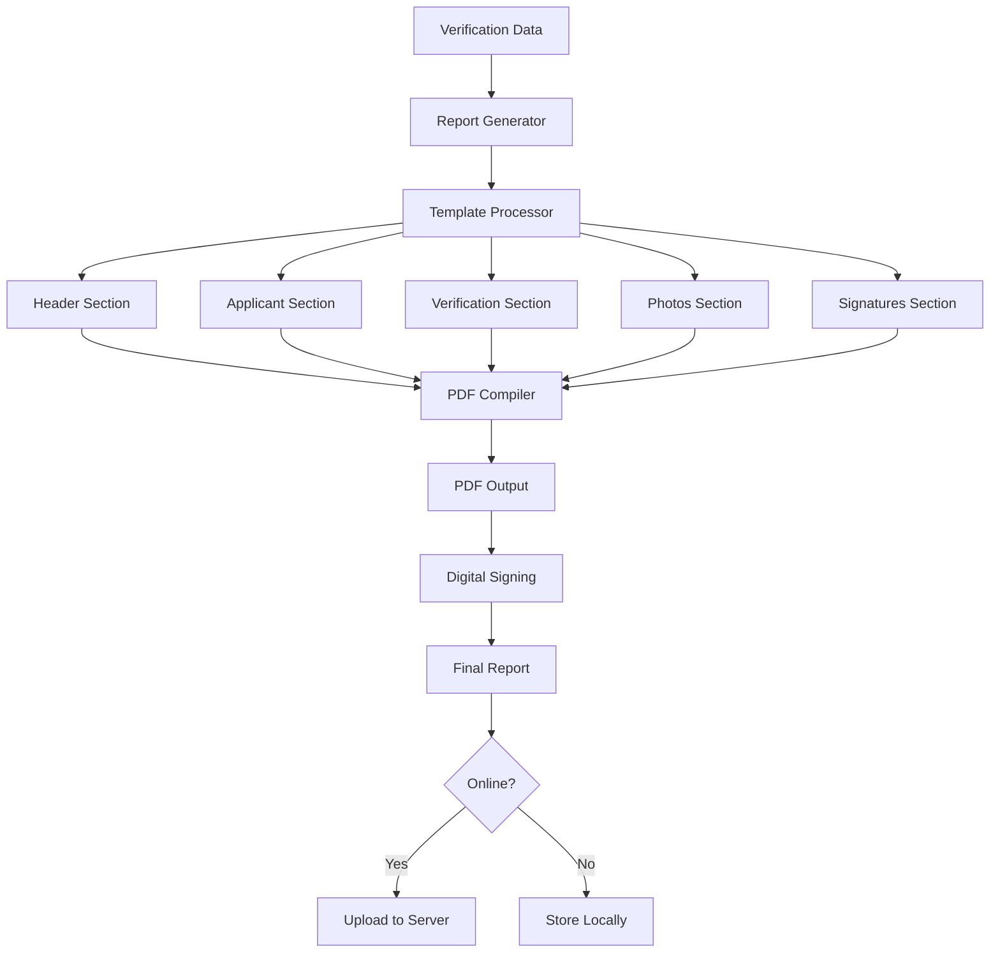

# CPV Report Generation

## Verification Report Creation and Digital Signatures

---

**Document Control**

| Field | Value |
|-------|-------|
| **Document Title** | CPV Report Generation |
| **Project Name** | Unisoft Loan Management System (ULMS) v2.0 |
| **Document Version** | 1.0 |
| **Date** | 2026-02-05 |
| **Prepared By** | Mobile Development Team |
| **Reviewed By** | Technical Lead |
| **Classification** | Confidential |
| **Status** | Draft |

**Revision History**

| Version | Date | Author | Description |
|---------|------|--------|-------------|
| 1.0 | 2026-02-05 | Mobile Team | Initial report generation design |

---

## Table of Contents

1. [Executive Summary](#1-executive-summary)
2. [Report Architecture](#2-report-architecture)
3. [Report Templates](#3-report-templates)
4. [PDF Generation](#4-pdf-generation)
5. [Digital Signature Integration](#5-digital-signature-integration)
6. [Report Review Screen](#6-report-review-screen)
7. [Offline Report Generation](#7-offline-report-generation)
8. [Report Submission](#8-report-submission)
9. [Testing Approach](#9-testing-approach)
10. [Related Documents](#10-related-documents)

---

## 1. Executive Summary

This document defines the CPV (Contact Point Verification) Report Generation system for the ULMS Mobile Application, enabling field officers to create comprehensive verification reports with embedded photos, GPS data, and digital signatures. The system supports both online and offline report generation with PDF output.

### Key Features

| Feature | Description |
|---------|-------------|
| **PDF Generation** | Professional PDF report output |
| **Digital Signatures** | Embedded officer and witness signatures |
| **Photo Gallery** | All verification photos in report |
| **GPS Coordinates** | Location data for each section |
| **Offline Capability** | Generate reports without connectivity |
| **Digital Signing** | Cryptographic signature verification |

---

## 2. Report Architecture

### 2.1 Report Generation Flow



### 2.2 Report Data Structure

```typescript
// src/features/reports/types/report.types.ts

export interface CPVReport {
  reportId: string;
  assignmentId: string;
  reportNumber: string;
  generatedAt: string;
  generatedBy: string;
  
  // Header Information
  header: {
    bankName: string;
    branchName: string;
    reportDate: string;
    reportType: string;
  };
  
  // Applicant Information
  applicant: {
    name: string;
    applicationNumber: string;
    loanType: string;
    loanAmount: number;
    nidNumber: string;
    contactNumber: string;
  };
  
  // Verification Details
  verification: {
    type: 'RESIDENCE' | 'BUSINESS' | 'BOTH';
    visitDate: string;
    visitTime: string;
    address: string;
    applicantPresent: boolean;
    findings: {
      addressConfirmed: boolean;
      residenceStability: string;
      propertyCondition: string;
      neighborhoodType: string;
    };
  };
  
  // Photos
  photos: {
    type: string;
    uri: string;
    location?: {
      latitude: number;
      longitude: number;
    };
    timestamp: string;
  }[];
  
  // Signatures
  signatures: {
    applicant?: string;
    witness?: string;
    officer: string;
    officerName: string;
    officerId: string;
  };
  
  // Metadata
  metadata: {
    deviceId: string;
    appVersion: string;
    generatedOffline: boolean;
    digitalSignature?: string;
  };
}
```

---

## 3. Report Templates

### 3.1 Report Template Structure

```typescript
// src/features/reports/templates/cpvReportTemplate.ts

export const cpvReportTemplate = {
  pageSize: 'A4',
  pageMargins: [40, 60, 40, 60],
  
  styles: {
    header: {
      fontSize: 18,
      bold: true,
      alignment: 'center',
      margin: [0, 0, 0, 20],
    },
    sectionHeader: {
      fontSize: 14,
      bold: true,
      margin: [0, 15, 0, 10],
      color: '#1a237e',
    },
    label: {
      fontSize: 10,
      bold: true,
      color: '#555',
    },
    value: {
      fontSize: 10,
      margin: [0, 0, 0, 5],
    },
    footer: {
      fontSize: 8,
      color: '#999',
      alignment: 'center',
      margin: [0, 20, 0, 0],
    },
  },

  content: (data: CPVReport) => [
    // Bank Header
    {
      text: data.header.bankName,
      style: 'header',
    },
    {
      text: `CPV Report - ${data.header.branchName}`,
      alignment: 'center',
      fontSize: 12,
      margin: [0, 0, 0, 20],
    },
    
    // Report Info
    {
      columns: [
        { text: `Report #: ${data.reportNumber}`, style: 'label' },
        { text: `Date: ${data.header.reportDate}`, style: 'label', alignment: 'right' },
      ],
      margin: [0, 0, 0, 15],
    },
    
    // Applicant Section
    {
      text: '1. Applicant Information',
      style: 'sectionHeader',
    },
    {
      table: {
        widths: ['30%', '70%'],
        body: [
          ['Applicant Name:', data.applicant.name],
          ['Application #:', data.applicant.applicationNumber],
          ['Loan Type:', data.applicant.loanType],
          ['Loan Amount:', `BDT ${data.applicant.loanAmount.toLocaleString()}`],
          ['NID Number:', data.applicant.nidNumber],
          ['Contact:', data.applicant.contactNumber],
        ],
      },
      layout: 'lightHorizontalLines',
      margin: [0, 0, 0, 15],
    },
    
    // Verification Section
    {
      text: '2. Verification Details',
      style: 'sectionHeader',
    },
    {
      table: {
        widths: ['30%', '70%'],
        body: [
          ['Verification Type:', data.verification.type],
          ['Visit Date:', data.verification.visitDate],
          ['Visit Time:', data.verification.visitTime],
          ['Address:', data.verification.address],
          ['Applicant Present:', data.verification.applicantPresent ? 'Yes' : 'No'],
          ['Address Confirmed:', data.verification.findings.addressConfirmed ? 'Yes' : 'No'],
          ['Residence Stability:', data.verification.findings.residenceStability],
          ['Property Condition:', data.verification.findings.propertyCondition],
          ['Neighborhood:', data.verification.findings.neighborhoodType],
        ],
      },
      layout: 'lightHorizontalLines',
      margin: [0, 0, 0, 15],
    },
  ],
};
```

---

## 4. PDF Generation

### 4.1 PDF Generator Service

```typescript
// src/features/reports/services/pdfGenerator.ts
import * as Print from 'expo-print';
import * as Sharing from 'expo-sharing';
import * as FileSystem from 'expo-file-system';
import { CPVReport } from '../types/report.types';
import { cpvReportTemplate } from '../templates/cpvReportTemplate';

export class PDFGenerator {
  async generateReport(reportData: CPVReport): Promise<string> {
    // Generate HTML content
    const html = this.generateHTML(reportData);

    // Create PDF
    const { uri } = await Print.printToFileAsync({
      html,
      base64: false,
    });

    // Rename with report number
    const newUri = `${FileSystem.documentDirectory}reports/${reportData.reportNumber}.pdf`;
    await FileSystem.makeDirectoryAsync(
      `${FileSystem.documentDirectory}reports`,
      { intermediates: true }
    );
    await FileSystem.moveAsync({
      from: uri,
      to: newUri,
    });

    return newUri;
  }

  private generateHTML(data: CPVReport): string {
    const photosHtml = data.photos.map((photo, index) => `
      <div class="photo-item">
        <h4>${photo.type}</h4>
        
        <p class="photo-meta">
          GPS: ${photo.location?.latitude}, ${photo.location?.longitude}<br/>
          Time: ${photo.timestamp}
        </p>
      </div>
    `).join('');

    return `
      <!DOCTYPE html>
      <html>
        <head>
          <meta charset="utf-8">
          <style>
            body {
              font-family: 'Helvetica', 'Arial', sans-serif;
              font-size: 12px;
              line-height: 1.5;
              color: #333;
              padding: 40px;
            }
            .header {
              text-align: center;
              border-bottom: 2px solid #1a237e;
              padding-bottom: 20px;
              margin-bottom: 30px;
            }
            .header h1 {
              color: #1a237e;
              margin: 0;
            }
            .section {
              margin-bottom: 25px;
            }
            .section h2 {
              color: #1a237e;
              border-bottom: 1px solid #ddd;
              padding-bottom: 5px;
            }
            table {
              width: 100%;
              border-collapse: collapse;
            }
            td {
              padding: 8px;
              border-bottom: 1px solid #eee;
            }
            td:first-child {
              font-weight: bold;
              width: 30%;
              color: #555;
            }
            .photo-grid {
              display: grid;
              grid-template-columns: repeat(2, 1fr);
              gap: 15px;
              margin-top: 15px;
            }
            .photo-item {
              border: 1px solid #ddd;
              padding: 10px;
              border-radius: 5px;
            }
            .photo-item img {
              width: 100%;
              height: auto;
              border-radius: 3px;
            }
            .photo-meta {
              font-size: 10px;
              color: #666;
              margin-top: 5px;
            }
            .signatures {
              margin-top: 30px;
              display: flex;
              justify-content: space-between;
            }
            .signature-box {
              text-align: center;
              width: 30%;
            }
            .signature-img {
              max-width: 100%;
              height: 60px;
              border-bottom: 1px solid #333;
              margin-bottom: 5px;
            }
            .footer {
              margin-top: 40px;
              padding-top: 20px;
              border-top: 1px solid #ddd;
              font-size: 10px;
              color: #666;
              text-align: center;
            }
          </style>
        </head>
        <body>
          <div class="header">
            <h1>${data.header.bankName}</h1>
            <p>Contact Point Verification Report</p>
            <p>Branch: ${data.header.branchName}</p>
          </div>

          <div class="section">
            <h2>1. Report Information</h2>
            <table>
              <tr>
                <td>Report Number:</td>
                <td>${data.reportNumber}</td>
              </tr>
              <tr>
                <td>Generated Date:</td>
                <td>${data.header.reportDate}</td>
              </tr>
              <tr>
                <td>Generated By:</td>
                <td>${data.generatedBy}</td>
              </tr>
            </table>
          </div>

          <div class="section">
            <h2>2. Applicant Information</h2>
            <table>
              <tr><td>Applicant Name:</td><td>${data.applicant.name}</td></tr>
              <tr><td>Application Number:</td><td>${data.applicant.applicationNumber}</td></tr>
              <tr><td>Loan Type:</td><td>${data.applicant.loanType}</td></tr>
              <tr><td>Loan Amount:</td><td>BDT ${data.applicant.loanAmount.toLocaleString()}</td></tr>
              <tr><td>NID Number:</td><td>${data.applicant.nidNumber}</td></tr>
            </table>
          </div>

          <div class="section">
            <h2>3. Verification Details</h2>
            <table>
              <tr><td>Verification Type:</td><td>${data.verification.type}</td></tr>
              <tr><td>Visit Date:</td><td>${data.verification.visitDate}</td></tr>
              <tr><td>Visit Time:</td><td>${data.verification.visitTime}</td></tr>
              <tr><td>Address:</td><td>${data.verification.address}</td></tr>
              <tr><td>Applicant Present:</td><td>${data.verification.applicantPresent ? 'Yes' : 'No'}</td></tr>
            </table>
          </div>

          <div class="section">
            <h2>4. Verification Photos</h2>
            <div class="photo-grid">
              ${photosHtml}
            </div>
          </div>

          <div class="section">
            <h2>5. Signatures</h2>
            <div class="signatures">
              ${data.signatures.applicant ? `
                <div class="signature-box">
                  
                  <p>Applicant Signature</p>
                </div>
              ` : ''}
              ${data.signatures.witness ? `
                <div class="signature-box">
                  
                  <p>Witness Signature</p>
                </div>
              ` : ''}
              <div class="signature-box">
                
                <p>Officer Signature<br/>${data.signatures.officerName}</p>
              </div>
            </div>
          </div>

          <div class="footer">
            <p>This report was generated electronically by ULMS CPV Mobile v${data.metadata.appVersion}</p>
            <p>Device ID: ${data.metadata.deviceId} | Report ID: ${data.reportId}</p>
            ${data.metadata.digitalSignature ? '<p>Digitally Signed: Yes</p>' : ''}
          </div>
        </body>
      </html>
    `;
  }

  async shareReport(pdfUri: string): Promise<void> {
    const isAvailable = await Sharing.isAvailableAsync();
    if (isAvailable) {
      await Sharing.shareAsync(pdfUri, {
        mimeType: 'application/pdf',
        dialogTitle: 'Share CPV Report',
      });
    }
  }
}

export const pdfGenerator = new PDFGenerator();
```

---

## 5. Digital Signature Integration

### 5.1 Digital Signature Service

```typescript
// src/features/reports/services/digitalSignature.ts
import * as Crypto from 'expo-crypto';

export interface DigitalSignature {
  signature: string;
  timestamp: number;
  certificateId: string;
  algorithm: string;
}

export class DigitalSignatureService {
  async createSignature(
    reportData: CPVReport,
    privateKey: string
  ): Promise<DigitalSignature> {
    // Create canonical representation of report
    const canonicalData = this.canonicalizeReport(reportData);
    
    // Generate hash
    const hash = await Crypto.digestStringAsync(
      Crypto.CryptoDigestAlgorithm.SHA256,
      canonicalData
    );

    // Create signature (simplified - in production use proper PKI)
    const signature = await this.signHash(hash, privateKey);

    return {
      signature,
      timestamp: Date.now(),
      certificateId: 'ULMS-CERT-001',
      algorithm: 'RSA-SHA256',
    };
  }

  private canonicalizeReport(report: CPVReport): string {
    // Create consistent string representation
    const data = {
      reportId: report.reportId,
      assignmentId: report.assignmentId,
      applicant: report.applicant,
      verification: report.verification,
      generatedAt: report.generatedAt,
      generatedBy: report.generatedBy,
    };
    return JSON.stringify(data, Object.keys(data).sort());
  }

  private async signHash(hash: string, privateKey: string): Promise<string> {
    // In production, this would use proper cryptographic signing
    // For demo purposes, creating a composite signature
    const signatureData = `${hash}:${privateKey}:${Date.now()}`;
    return await Crypto.digestStringAsync(
      Crypto.CryptoDigestAlgorithm.SHA256,
      signatureData
    );
  }

  async verifySignature(
    report: CPVReport,
    signature: DigitalSignature,
    publicKey: string
  ): Promise<boolean> {
    const canonicalData = this.canonicalizeReport(report);
    const hash = await Crypto.digestStringAsync(
      Crypto.CryptoDigestAlgorithm.SHA256,
      canonicalData
    );

    // Verify signature (simplified)
    return signature.signature.includes(hash.substring(0, 16));
  }
}

export const digitalSignatureService = new DigitalSignatureService();
```

---

## 6. Report Review Screen

### 6.1 Review Screen Implementation

```typescript
// src/features/reports/screens/ReportReviewScreen.tsx
import React, { useState, useCallback } from 'react';
import {
  View,
  Text,
  ScrollView,
  TouchableOpacity,
  StyleSheet,
  ActivityIndicator,
  Alert,
} from 'react-native';
import { useRoute, useNavigation } from '@react-navigation/native';
import { WebView } from 'react-native-webview';
import { CPVReport } from '../types/report.types';
import { pdfGenerator } from '../services/pdfGenerator';
import { digitalSignatureService } from '../services/digitalSignature';
import { useSubmitVerificationMutation } from '../../verification/api/verificationApi';

export const ReportReviewScreen: React.FC = () => {
  const route = useRoute();
  const navigation = useNavigation();
  const { assignmentId, formData } = route.params as { 
    assignmentId: string; 
    formData: any;
  };

  const [isGenerating, setIsGenerating] = useState(false);
  const [pdfUri, setPdfUri] = useState<string | null>(null);
  const [report, setReport] = useState<CPVReport | null>(null);
  const [submitVerification, { isLoading: isSubmitting }] = useSubmitVerificationMutation();

  const generateReport = useCallback(async () => {
    setIsGenerating(true);
    try {
      // Build report data from form
      const reportData: CPVReport = {
        reportId: `RPT-${Date.now()}`,
        assignmentId,
        reportNumber: `CPV-${Date.now()}`,
        generatedAt: new Date().toISOString(),
        generatedBy: 'Officer Name', // Get from auth context
        header: {
          bankName: 'ABC Bank Limited',
          branchName: 'Main Branch',
          reportDate: new Date().toLocaleDateString(),
          reportType: 'Contact Point Verification',
        },
        applicant: formData.applicant,
        verification: formData.verification,
        photos: formData.photos,
        signatures: formData.signatures,
        metadata: {
          deviceId: 'device-001',
          appVersion: '2.0.0',
          generatedOffline: false,
        },
      };

      // Add digital signature
      const signature = await digitalSignatureService.createSignature(
        reportData,
        'private-key' // Get from secure storage
      );
      reportData.metadata.digitalSignature = signature.signature;

      // Generate PDF
      const uri = await pdfGenerator.generateReport(reportData);
      
      setReport(reportData);
      setPdfUri(uri);
    } catch (error) {
      Alert.alert('Error', 'Failed to generate report');
      console.error(error);
    } finally {
      setIsGenerating(false);
    }
  }, [assignmentId, formData]);

  const handleSubmit = useCallback(async () => {
    if (!report || !pdfUri) return;

    try {
      await submitVerification({
        id: assignmentId,
        data: {
          report,
          pdfUri,
          submittedAt: new Date().toISOString(),
        },
      }).unwrap();

      Alert.alert(
        'Success',
        'Verification report submitted successfully',
        [{ text: 'OK', onPress: () => navigation.navigate('Assignments') }]
      );
    } catch (error) {
      Alert.alert('Error', 'Failed to submit report');
    }
  }, [assignmentId, navigation, pdfUri, report, submitVerification]);

  if (isGenerating) {
    return (
      <View style={styles.loadingContainer}>
        <ActivityIndicator size="large" color="#2196F3" />
        <Text style={styles.loadingText}>Generating Report...</Text>
      </View>
    );
  }

  return (
    <View style={styles.container}>
      <View style={styles.header}>
        <Text style={styles.title}>Review Verification Report</Text>
        <Text style={styles.subtitle}>
          Assignment: {assignmentId}
        </Text>
      </View>

      {!pdfUri ? (
        <View style={styles.generateContainer}>
          <Text style={styles.infoText}>
            Generate the final verification report with all collected data, 
            photos, and signatures.
          </Text>
          <TouchableOpacity 
            style={styles.generateButton}
            onPress={generateReport}
          >
            <Text style={styles.generateButtonText}>Generate Report</Text>
          </TouchableOpacity>
        </View>
      ) : (
        <>
          <View style={styles.previewContainer}>
            <WebView
              source={{ uri: pdfUri }}
              style={styles.webview}
              originWhitelist={['*']}
            />
          </View>

          <View style={styles.actions}>
            <TouchableOpacity 
              style={[styles.button, styles.secondaryButton]}
              onPress={() => pdfGenerator.shareReport(pdfUri)}
            >
              <Text style={styles.secondaryButtonText}>Share PDF</Text>
            </TouchableOpacity>

            <TouchableOpacity 
              style={[styles.button, styles.primaryButton]}
              onPress={handleSubmit}
              disabled={isSubmitting}
            >
              {isSubmitting ? (
                <ActivityIndicator color="white" />
              ) : (
                <Text style={styles.primaryButtonText}>Submit Report</Text>
              )}
            </TouchableOpacity>
          </View>
        </>
      )}
    </View>
  );
};

const styles = StyleSheet.create({
  container: {
    flex: 1,
    backgroundColor: '#f5f5f5',
  },
  loadingContainer: {
    flex: 1,
    justifyContent: 'center',
    alignItems: 'center',
  },
  loadingText: {
    marginTop: 12,
    fontSize: 16,
    color: '#666',
  },
  header: {
    backgroundColor: 'white',
    padding: 16,
    borderBottomWidth: 1,
    borderBottomColor: '#e0e0e0',
  },
  title: {
    fontSize: 20,
    fontWeight: 'bold',
    color: '#333',
  },
  subtitle: {
    fontSize: 14,
    color: '#666',
    marginTop: 4,
  },
  generateContainer: {
    flex: 1,
    justifyContent: 'center',
    alignItems: 'center',
    padding: 24,
  },
  infoText: {
    fontSize: 14,
    color: '#666',
    textAlign: 'center',
    marginBottom: 24,
    lineHeight: 20,
  },
  generateButton: {
    backgroundColor: '#2196F3',
    paddingHorizontal: 32,
    paddingVertical: 16,
    borderRadius: 8,
  },
  generateButtonText: {
    color: 'white',
    fontSize: 16,
    fontWeight: '600',
  },
  previewContainer: {
    flex: 1,
    margin: 16,
    backgroundColor: 'white',
    borderRadius: 8,
    overflow: 'hidden',
  },
  webview: {
    flex: 1,
  },
  actions: {
    flexDirection: 'row',
    padding: 16,
    gap: 12,
    backgroundColor: 'white',
    borderTopWidth: 1,
    borderTopColor: '#e0e0e0',
  },
  button: {
    flex: 1,
    paddingVertical: 14,
    borderRadius: 8,
    alignItems: 'center',
  },
  primaryButton: {
    backgroundColor: '#4CAF50',
  },
  secondaryButton: {
    backgroundColor: '#f5f5f5',
    borderWidth: 1,
    borderColor: '#ddd',
  },
  primaryButtonText: {
    color: 'white',
    fontSize: 16,
    fontWeight: '600',
  },
  secondaryButtonText: {
    color: '#666',
    fontSize: 16,
    fontWeight: '600',
  },
});
```

---

## 7. Offline Report Generation

### 7.1 Offline Report Storage

```typescript
// src/features/reports/storage/reportStorage.ts
import { MMKV } from 'react-native-mmkv';
import { CPVReport } from '../types/report.types';

const reportStorage = new MMKV({ id: 'cpv-reports' });

export class ReportStorage {
  saveReport(report: CPVReport, pdfUri: string): void {
    const data = {
      report,
      pdfUri,
      savedAt: Date.now(),
      synced: false,
    };
    reportStorage.set(report.reportId, JSON.stringify(data));
  }

  getPendingReports(): Array<{ report: CPVReport; pdfUri: string }> {
    const keys = reportStorage.getAllKeys();
    const pending: Array<{ report: CPVReport; pdfUri: string }> = [];

    keys.forEach(key => {
      const data = reportStorage.getString(key);
      if (data) {
        const item = JSON.parse(data);
        if (!item.synced) {
          pending.push({ report: item.report, pdfUri: item.pdfUri });
        }
      }
    });

    return pending;
  }

  markAsSynced(reportId: string): void {
    const data = reportStorage.getString(reportId);
    if (data) {
      const item = JSON.parse(data);
      item.synced = true;
      item.syncedAt = Date.now();
      reportStorage.set(reportId, JSON.stringify(item));
    }
  }
}

export const reportStorage = new ReportStorage();
```

---

## 8. Report Submission

### 8.1 Submission Flow

```typescript
// src/features/reports/services/reportSubmission.ts
import { CPVReport } from '../types/report.types';
import { reportStorage } from '../storage/reportStorage';
import { apiClient } from '../../../services/api/apiClient';

export class ReportSubmissionService {
  async submitReport(
    report: CPVReport,
    pdfUri: string
  ): Promise<{ success: boolean; error?: string }> {
    try {
      // Upload PDF
      const formData = new FormData();
      formData.append('report', JSON.stringify(report));
      formData.append('pdf', {
        uri: pdfUri,
        type: 'application/pdf',
        name: `${report.reportNumber}.pdf`,
      } as any);

      await apiClient.post('/cpv/reports', formData, {
        headers: {
          'Content-Type': 'multipart/form-data',
        },
      });

      // Mark as synced
      reportStorage.markAsSynced(report.reportId);

      return { success: true };
    } catch (error) {
      // Save for later retry
      reportStorage.saveReport(report, pdfUri);
      
      return { 
        success: false, 
        error: error instanceof Error ? error.message : 'Unknown error'
      };
    }
  }

  async syncPendingReports(): Promise<void> {
    const pending = reportStorage.getPendingReports();
    
    for (const { report, pdfUri } of pending) {
      await this.submitReport(report, pdfUri);
    }
  }
}

export const reportSubmissionService = new ReportSubmissionService();
```

---

## 9. Testing Approach

```typescript
// __tests__/reports/pdfGenerator.test.ts
describe('PDFGenerator', () => {
  it('should generate PDF from report data', async () => {
    const report = createMockReport();
    const uri = await pdfGenerator.generateReport(report);
    expect(uri).toContain('.pdf');
  });

  it('should include all sections in generated PDF', async () => {
    // Verify PDF content
  });
});
```

---

## 10. Related Documents

| Document | Purpose | Location |
|----------|---------|----------|
| `[MOB]_Field_Verification_UI_v1.0.md` | Form data collection | `02_Mobile_Features/` |
| `[MOB]_Background_Sync_Implementation_v1.0.md` | Report upload sync | `02_Mobile_Features/` |
| `[MOB]_Camera_Integration_Design_v1.0.md` | Photo integration | `01_Mobile_Architecture/` |

---

**Document End**

*© 2026 Unisoft Systems Limited. All Rights Reserved.*
