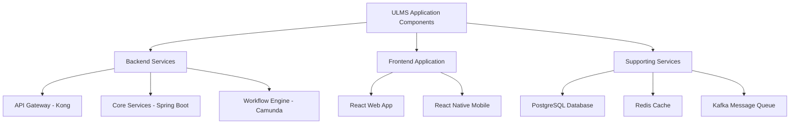
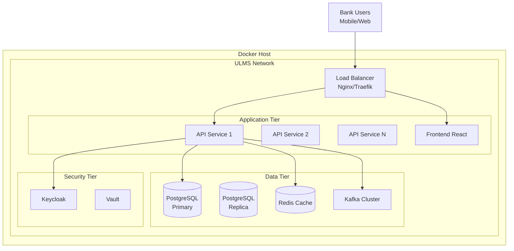

# Docker Containerization Guide

**Document Control**

| Field | Value |
|-------|-------|
| **Document Title** | Docker Containerization Guide |
| **Project Name** | Unisoft Loan Management System (ULMS) |
| **Document Version** | 1.0 |
| **Date** | 2026-02-05 |
| **Prepared By** | DevOps Engineering Team |
| **Reviewed By** | Technical Lead, Security Officer |
| **Classification** | Internal |
| **Status** | Approved |

**Revision History**

| Version | Date | Author | Description |
|---------|------|--------|-------------|
| 1.0 | 2026-02-05 | DevOps Team | Initial version for ULMS v2.0 deployment |

---

## Table of Contents

1. [Executive Summary](#1-executive-summary)
2. [Containerization Strategy](#2-containerization-strategy)
3. [Docker Architecture](#3-docker-architecture)
4. [Base Image Selection](#4-base-image-selection)
5. [Dockerfile Best Practices](#5-dockerfile-best-practices)
6. [Multi-Stage Builds](#6-multi-stage-builds)
7. [Security Hardening](#7-security-hardening)
8. [Container Orchestration Preparation](#8-container-orchestration-preparation)
9. [Troubleshooting](#9-troubleshooting)
10. [Related Documents](#10-related-documents)

---

## 1. Executive Summary

This document provides comprehensive guidelines for containerizing the Unisoft Loan Management System (ULMS) v2.0 using Docker. The containerization strategy ensures consistent deployment across development, staging, and production environments for Bangladesh banking institutions.

### 1.1 Scope

- Backend microservices containerization (Spring Boot)
- Frontend application containerization (React)
- Database initialization containers
- Supporting infrastructure services
- Development environment containers

### 1.2 Objectives

- Achieve environment parity across all deployment stages
- Reduce deployment time and complexity
- Enable horizontal scaling through container orchestration
- Implement security-first container design
- Support Bangladesh Bank compliance requirements

---

## 2. Containerization Strategy

### 2.1 Containerization Approach



### 2.2 Container Categories

| Category | Components | Base Image | Purpose |
|----------|------------|------------|---------|
| Application | API Services, Frontend | eclipse-temurin:21-jre-alpine, node:20-alpine | Core business logic |
| Data | PostgreSQL, Redis, Kafka | postgres:16-alpine, redis:7-alpine | Data persistence and messaging |
| Infrastructure | Kong, Keycloak, Vault | kong:3.5, keycloak:23 | API gateway and security |
| Tools | Flyway, pgAdmin, Monitoring | flyway/flyway:10, dpage/pgadmin4 | Database management |

---

## 3. Docker Architecture

### 3.1 High-Level Architecture



### 3.2 Network Architecture

| Network Name | Purpose | CIDR | Connected Services |
|-------------|---------|------|-------------------|
| ulms-frontend | External access | 172.20.1.0/24 | Nginx, React App |
| ulms-backend | Internal API | 172.20.2.0/24 | All microservices |
| ulms-database | Database access | 172.20.3.0/24 | PostgreSQL, Redis |
| ulms-messaging | Message queue | 172.20.4.0/24 | Kafka, Zookeeper |
| ulms-security | Auth services | 172.20.5.0/24 | Keycloak, Vault |

---

## 4. Base Image Selection

### 4.1 Java Services Base Images

```dockerfile
# Production base image - Minimal Alpine variant
FROM eclipse-temurin:21-jre-alpine

# Security updates
RUN apk update && \
    apk upgrade && \
    apk add --no-cache \
        ca-certificates \
        tzdata \
        curl && \
    rm -rf /var/cache/apk/*

# Set timezone for Bangladesh
ENV TZ=Asia/Dhaka
RUN ln -snf /usr/share/zoneinfo/$TZ /etc/localtime && echo $TZ > /etc/timezone

# Create non-root user
RUN addgroup -g 1000 ulms && \
    adduser -u 1000 -G ulms -s /bin/sh -D ulms

WORKDIR /app
USER ulms
```

### 4.2 Node.js Frontend Base Images

```dockerfile
# Build stage
FROM node:20-alpine AS builder

WORKDIR /app
COPY package*.json ./
RUN npm ci --only=production

COPY . .
RUN npm run build

# Production stage
FROM nginx:alpine

COPY --from=builder /app/dist /usr/share/nginx/html
COPY nginx.conf /etc/nginx/conf.d/default.conf

EXPOSE 80
CMD ["nginx", "-g", "daemon off;"]
```

### 4.3 Base Image Security Comparison

| Image | Size | CVE Count | Startup Time | Recommendation |
|-------|------|-----------|--------------|----------------|
| eclipse-temurin:21-jre | 220MB | Low | 2-3s | Development |
| eclipse-temurin:21-jre-alpine | 65MB | Very Low | 1-2s | **Production** |
| openjdk:21-slim | 280MB | Medium | 3-4s | Legacy |
| node:20-alpine | 180MB | Low | 1s | Frontend builds |

---

## 5. Dockerfile Best Practices

### 5.1 Backend Service Dockerfile

```dockerfile
# ============================================================================
# ULMS Backend Service - Multi-Stage Dockerfile
# ============================================================================

# ----------------------------------------------------------------------------
# Stage 1: Build
# ----------------------------------------------------------------------------
FROM eclipse-temurin:21-jdk-alpine AS builder

WORKDIR /build

# Copy Gradle wrapper and configuration
COPY gradle/ gradle/
COPY gradlew build.gradle.kts settings.gradle.kts ./
COPY gradle.properties ./

# Download dependencies (cached layer)
RUN ./gradlew dependencies --no-daemon

# Copy source code
COPY src/ src/

# Build application
RUN ./gradlew bootJar --no-daemon -x test

# ----------------------------------------------------------------------------
# Stage 2: Production
# ----------------------------------------------------------------------------
FROM eclipse-temurin:21-jre-alpine

# Metadata
LABEL maintainer="devops@unisoft-systems.com"
LABEL version="2.0.0"
LABEL description="ULMS Backend Service"

# Security: Update packages and install required tools
RUN apk update && \
    apk upgrade && \
    apk add --no-cache \
        ca-certificates \
        tzdata \
        curl \
        tini && \
    rm -rf /var/cache/apk/*

# Set Bangladesh timezone
ENV TZ=Asia/Dhaka
RUN ln -snf /usr/share/zoneinfo/$TZ /etc/localtime && echo $TZ > /etc/timezone

# Create non-root user
RUN addgroup -g 1000 ulms && \
    adduser -u 1000 -G ulms -s /bin/sh -D ulms

# Application directory
WORKDIR /app

# Copy JAR from builder
COPY --from=builder --chown=ulms:ulms /build/build/libs/*.jar app.jar

# Health check
HEALTHCHECK --interval=30s --timeout=10s --start-period=60s --retries=3 \
    CMD curl -f http://localhost:8080/actuator/health || exit 1

# Switch to non-root user
USER ulms

# JVM configuration for containers
ENV JAVA_OPTS="-XX:+UseContainerSupport \
    -XX:MaxRAMPercentage=75.0 \
    -XX:InitialRAMPercentage=50.0 \
    -XX:+UseG1GC \
    -XX:+UseStringDeduplication \
    -XX:+OptimizeStringConcat \
    -Djava.security.egd=file:/dev/./urandom \
    -Dspring.backgroundpreinitializer.ignore=true"

# Expose port
EXPOSE 8080

# Use tini for proper signal handling
ENTRYPOINT ["/sbin/tini", "--"]
CMD ["sh", "-c", "java $JAVA_OPTS -jar app.jar"]
```

### 5.2 Frontend Dockerfile

```dockerfile
# ============================================================================
# ULMS Frontend Application - Multi-Stage Dockerfile
# ============================================================================

# ----------------------------------------------------------------------------
# Stage 1: Dependencies
# ----------------------------------------------------------------------------
FROM node:20-alpine AS deps

WORKDIR /app

# Copy package files
COPY package.json package-lock.json* ./

# Install dependencies
RUN npm ci --only=production

# ----------------------------------------------------------------------------
# Stage 2: Build
# ----------------------------------------------------------------------------
FROM node:20-alpine AS builder

WORKDIR /app

# Copy dependencies
COPY --from=deps /app/node_modules ./node_modules
COPY . .

# Build arguments for environment variables
ARG VITE_API_BASE_URL
ARG VITE_KEYCLOAK_URL
ARG VITE_KEYCLOAK_REALM
ARG VITE_KEYCLOAK_CLIENT_ID

ENV VITE_API_BASE_URL=$VITE_API_BASE_URL
ENV VITE_KEYCLOAK_URL=$VITE_KEYCLOAK_URL
ENV VITE_KEYCLOAK_REALM=$VITE_KEYCLOAK_REALM
ENV VITE_KEYCLOAK_CLIENT_ID=$VITE_KEYCLOAK_CLIENT_ID

# Build application
RUN npm run build

# ----------------------------------------------------------------------------
# Stage 3: Production
# ----------------------------------------------------------------------------
FROM nginx:alpine

# Install security updates
RUN apk update && \
    apk upgrade && \
    apk add --no-cache curl && \
    rm -rf /var/cache/apk/*

# Copy custom nginx configuration
COPY nginx.conf /etc/nginx/conf.d/default.conf
COPY nginx-security.conf /etc/nginx/conf.d/security.conf

# Copy built application
COPY --from=builder /app/dist /usr/share/nginx/html

# Create non-root user for nginx
RUN addgroup -g 1000 -S ulms && \
    adduser -u 1000 -S ulms -G ulms

# Set proper permissions
RUN chown -R ulms:ulms /usr/share/nginx/html && \
    chown -R ulms:ulms /var/cache/nginx && \
    chown -R ulms:ulms /var/log/nginx && \
    touch /var/run/nginx.pid && \
    chown -R ulms:ulms /var/run/nginx.pid

# Health check
HEALTHCHECK --interval=30s --timeout=5s --start-period=10s --retries=3 \
    CMD curl -f http://localhost:80/health || exit 1

# Switch to non-root user
USER ulms

EXPOSE 80

CMD ["nginx", "-g", "daemon off;"]
```

---

## 6. Multi-Stage Builds

### 6.1 Benefits of Multi-Stage Builds

| Benefit | Description | Impact |
|---------|-------------|--------|
| Reduced Image Size | Only production artifacts in final image | 70-80% size reduction |
| Improved Security | Build tools not present in production | Reduced attack surface |
| Build Consistency | Same build environment across CI/CD | Reproducible builds |
| Layer Caching | Dependencies cached separately | Faster builds |
| Secret Management | Build secrets not in final image | Enhanced security |

### 6.2 Multi-Stage Build Patterns

```dockerfile
# Pattern 1: Simple Two-Stage
FROM builder-image AS build
# ... build steps

FROM runtime-image
COPY --from=build /app/target/output /app

# Pattern 2: Three-Stage (Dependencies, Build, Production)
FROM base AS deps
# ... install dependencies

FROM deps AS build
# ... compile/build

FROM runtime-image AS production
COPY --from=build /app/dist /app

# Pattern 3: Parallel Builds
FROM golang:alpine AS backend-builder
# ... build backend

FROM node:alpine AS frontend-builder
# ... build frontend

FROM nginx:alpine
COPY --from=backend-builder /app/api /usr/share/nginx/api
COPY --from=frontend-builder /app/dist /usr/share/nginx/html
```

---

## 7. Security Hardening

### 7.1 Container Security Checklist

| Category | Requirement | Implementation |
|----------|-------------|----------------|
| Base Image | Use minimal Alpine-based images | `eclipse-temurin:21-jre-alpine` |
| User Privileges | Run as non-root user | `USER ulms` (UID 1000) |
| Secrets | No secrets in images | Use environment variables |
| Updates | Regular security updates | `apk upgrade` in build |
| Capabilities | Drop unnecessary capabilities | Docker security opts |
| Read-Only | Read-only filesystem where possible | `--read-only` flag |
| Resources | Resource limits | CPU/Memory limits |

### 7.2 Docker Security Scanning

```bash
# Scan image with Trivy
trivy image --severity HIGH,CRITICAL ulms-backend:2.0.0

# Scan with Docker Scout
docker scout cves ulms-backend:2.0.0

# Scan with Snyk
snyk container test ulms-backend:2.0.0
```

### 7.3 Security Configuration in docker-compose

```yaml
services:
  backend:
    image: ulms-backend:2.0.0
    read_only: true
    user: "1000:1000"
    security_opt:
      - no-new-privileges:true
    cap_drop:
      - ALL
    cap_add:
      - NET_BIND_SERVICE
    deploy:
      resources:
        limits:
          cpus: '2.0'
          memory: 2G
        reservations:
          cpus: '0.5'
          memory: 512M
    tmpfs:
      - /tmp:noexec,nosuid,size=100m
```

---

## 8. Container Orchestration Preparation

### 8.1 Kubernetes-Ready Containers

```dockerfile
# Kubernetes-specific considerations

# 1. Graceful shutdown handling
STOPSIGNAL SIGTERM

# 2. Health endpoints for probes
HEALTHCHECK --interval=30s --timeout=10s --start-period=60s --retries=3 \
    CMD curl -f http://localhost:8080/actuator/health/liveness || exit 1

# 3. Log to stdout/stderr (12-factor app)
ENV LOGGING_OUTPUT=console

# 4. Externalized configuration
ENV SPRING_CONFIG_LOCATION=/config/

# 5. Configurable port
ENV SERVER_PORT=8080
EXPOSE ${SERVER_PORT}
```

### 8.2 Environment Variable Configuration

| Variable | Description | Default | Required |
|----------|-------------|---------|----------|
| `SPRING_PROFILES_ACTIVE` | Active Spring profiles | `production` | Yes |
| `DB_HOST` | PostgreSQL hostname | `postgres` | Yes |
| `DB_PORT` | PostgreSQL port | `5432` | Yes |
| `DB_NAME` | Database name | `ulms` | Yes |
| `DB_USER` | Database username | - | Yes |
| `DB_PASSWORD` | Database password | - | Yes |
| `REDIS_HOST` | Redis hostname | `redis` | Yes |
| `KAFKA_BOOTSTRAP_SERVERS` | Kafka brokers | `kafka:9092` | Yes |
| `KEYCLOAK_URL` | Keycloak auth server | - | Yes |
| `JAVA_OPTS` | JVM options | See Dockerfile | No |

---

## 9. Troubleshooting

### 9.1 Common Issues and Solutions

| Issue | Cause | Solution |
|-------|-------|----------|
| Container exits immediately | Missing required env vars | Check environment configuration |
| Permission denied | Wrong user/permissions | Verify USER directive and file ownership |
| Image build slow | No layer caching | Order Dockerfile instructions by change frequency |
| Health check failing | Application not ready | Increase start-period in HEALTHCHECK |
| Large image size | Too many layers | Combine RUN commands, use multi-stage |
| Out of memory | JVM heap too large | Set appropriate MaxRAMPercentage |

### 9.2 Debugging Commands

```bash
# Build with verbose output
docker build --progress=plain -t ulms-backend:2.0.0 .

# Inspect image layers
docker history ulms-backend:2.0.0

# Run with shell access
docker run --rm -it --entrypoint /bin/sh ulms-backend:2.0.0

# Check running container
docker exec -it <container_id> /bin/sh

# View container logs
docker logs -f <container_id>

# Inspect container details
docker inspect <container_id>
```

### 9.3 Performance Tuning

```bash
# Check image size
docker images --format "{{.Repository}}:{{.Tag}} - {{.Size}}"

# Analyze image with dive
dive ulms-backend:2.0.0

# Benchmark container startup
time docker run --rm ulms-backend:2.0.0 echo "Container started"
```

---

## 10. Related Documents

| Document | Location | Purpose |
|----------|----------|---------|
| Docker Build and Image Management | `02_[OPS]_Docker_Build_Image_Management_v1.0.md` | Image building and registry management |
| Docker Compose Configurations | `03_[OPS]_Docker_Compose_Configurations_v1.0.md` | Multi-container orchestration |
| Container Security Hardening | `05_[OPS]_Container_Security_Hardening_v1.0.md` | Security best practices |
| Kubernetes Deployment Guide | `../02_Kubernetes_Deployment/01_[K8S]_Kubernetes_Deployment_Guide_v1.0.md` | K8s deployment |
| CI/CD Pipeline Configuration | `../04_CI_CD_Pipeline/01_[CICD]_GitLab_CI_Pipeline_Configuration_v1.0.md` | Automated builds |

---

**Document Control**

- **Owner:** DevOps Engineering Team
- **Review Cycle:** Quarterly
- **Next Review Date:** 2026-05-05
- **Distribution:** Internal - Development Team

---

*© 2026 Unisoft Systems Limited. All Rights Reserved.*
