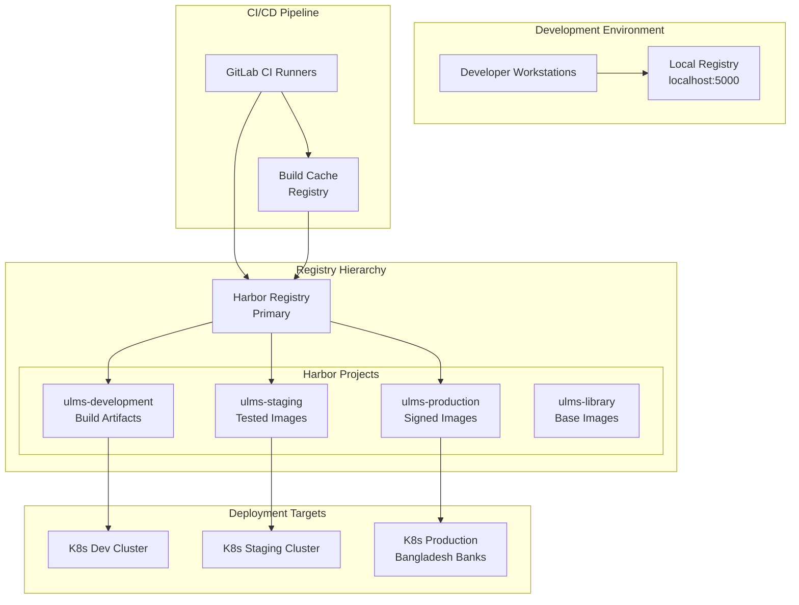
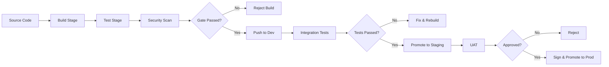

# Docker Build and Image Management

**Document Control**

| Field | Value |
|-------|-------|
| **Document Title** | Docker Build and Image Management |
| **Project Name** | Unisoft Loan Management System (ULMS) |
| **Document Version** | 1.0 |
| **Date** | 2026-02-05 |
| **Prepared By** | DevOps Engineering Team |
| **Reviewed By** | Technical Lead |
| **Classification** | Internal |
| **Status** | Approved |

**Revision History**

| Version | Date | Author | Description |
|---------|------|--------|-------------|
| 1.0 | 2026-02-05 | DevOps Team | Initial version for ULMS v2.0 |

---

## Table of Contents

1. [Executive Summary](#1-executive-summary)
2. [Image Registry Architecture](#2-image-registry-architecture)
3. [Build Pipeline Design](#3-build-pipeline-design)
4. [Image Tagging Strategy](#4-image-tagging-strategy)
5. [Build Optimization](#5-build-optimization)
6. [Image Security Scanning](#6-image-security-scanning)
7. [Registry Management](#7-registry-management)
8. [Build Automation](#8-build-automation)
9. [Troubleshooting](#9-troubleshooting)
10. [Related Documents](#10-related-documents)

---

## 1. Executive Summary

This document defines the Docker image build and management strategy for ULMS v2.0, including registry configuration, build pipelines, tagging conventions, and security scanning procedures for Bangladesh banking deployments.

---

## 2. Image Registry Architecture

### 2.1 Registry Topology



### 2.2 Registry Configuration

| Registry | URL | Purpose | Access Level |
|----------|-----|---------|--------------|
| Harbor Primary | `registry.unisoft-systems.com` | Production registry | Authenticated |
| GitLab Registry | `gitlab.unisoft-systems.com:5050` | CI/CD integration | CI Token |
| Local Development | `localhost:5000` | Developer testing | Local only |
| Backup Registry | `registry-backup.unisoft-systems.com` | Disaster recovery | Restricted |

---

## 3. Build Pipeline Design

### 3.1 Multi-Stage Build Pipeline



### 3.2 Build Configuration

```yaml
# .gitlab-ci.yml - Build Stage
stages:
  - build
  - test
  - security-scan
  - push
  - deploy

variables:
  DOCKER_DRIVER: overlay2
  DOCKER_TLS_CERTDIR: ""
  DOCKER_BUILDKIT: 1
  HARBOR_REGISTRY: "registry.unisoft-systems.com"
  IMAGE_NAME: "${HARBOR_REGISTRY}/ulms/backend"

build-backend:
  stage: build
  image: docker:24-git
  services:
    - docker:24-dind
  before_script:
    - docker login -u $HARBOR_USER -p $HARBOR_PASSWORD $HARBOR_REGISTRY
  script:
    - |
      docker build \
        --cache-from $IMAGE_NAME:latest \
        --build-arg BUILDKIT_INLINE_CACHE=1 \
        --build-arg VERSION=$CI_COMMIT_SHA \
        --build-arg BUILD_DATE=$(date -u +%Y-%m-%dT%H:%M:%SZ) \
        --build-arg VCS_REF=$CI_COMMIT_SHA \
        -t $IMAGE_NAME:$CI_COMMIT_SHA \
        -t $IMAGE_NAME:latest \
        -f Dockerfile.backend .
    - docker push $IMAGE_NAME:$CI_COMMIT_SHA
  cache:
    key: "${CI_COMMIT_REF_SLUG}"
    paths:
      - .gradle/
```

---

## 4. Image Tagging Strategy

### 4.1 Tagging Conventions

| Tag Pattern | Example | Purpose | Lifecycle |
|-------------|---------|---------|-----------|
| `latest` | `backend:latest` | Always points to newest stable | Updated on release |
| Git SHA | `backend:abc1234` | Immutable build identifier | Permanent |
| Semantic | `backend:2.1.3` | Release version | Permanent |
| Environment | `backend:production` | Environment pointer | Updated on deploy |
| Branch | `backend:feature-cib` | Branch builds | Deleted after merge |
| Build Number | `backend:build-1234` | CI build reference | 30 days retention |

### 4.2 Tagging Commands

```bash
# Tag with multiple identifiers
docker tag ulms-backend:$COMMIT_SHA ulms-backend:$VERSION
docker tag ulms-backend:$COMMIT_SHA ulms-backend:$ENVIRONMENT
docker tag ulms-backend:$COMMIT_SHA ulms-backend:latest

# Push all tags
docker push ulms-backend --all-tags

# Retag existing image for promotion
docker pull $SOURCE_REGISTRY/backend:$SOURCE_TAG
docker tag $SOURCE_REGISTRY/backend:$SOURCE_TAG $TARGET_REGISTRY/backend:$TARGET_TAG
docker push $TARGET_REGISTRY/backend:$TARGET_TAG
```

---

## 5. Build Optimization

### 5.1 Layer Caching Strategy

```dockerfile
# OPTIMAL: Order by change frequency (least to most)
FROM eclipse-temurin:21-jre-alpine

# 1. System dependencies (rarely change)
RUN apk add --no-cache ca-certificates tzdata curl

# 2. Application dependencies (change with dependency updates)
COPY gradle/ gradle/
COPY gradlew build.gradle.kts settings.gradle.kts ./
RUN ./gradlew dependencies --no-daemon

# 3. Source code (changes frequently)
COPY src/ src/
RUN ./gradlew bootJar --no-daemon

# 4. Runtime configuration (changes per environment)
COPY --from=builder /build/build/libs/*.jar app.jar
```

### 5.2 BuildKit Features

```bash
# Enable BuildKit
export DOCKER_BUILDKIT=1

# Build with cache export
docker build \
  --cache-to type=registry,ref=registry.unisoft-systems.com/ulms/cache:backend \
  --cache-from type=registry,ref=registry.unisoft-systems.com/ulms/cache:backend \
  -t ulms-backend:2.0.0 \
  .

# Parallel multi-platform builds
docker buildx build \
  --platform linux/amd64,linux/arm64 \
  --push \
  -t registry.unisoft-systems.com/ulms/backend:2.0.0 \
  .
```

---

## 6. Image Security Scanning

### 6.1 Security Scanning Pipeline

```yaml
security-scan:
  stage: security-scan
  image: aquasec/trivy:latest
  script:
    # Scan for vulnerabilities
    - trivy image --exit-code 1 --severity HIGH,CRITICAL $IMAGE_NAME:$CI_COMMIT_SHA
    
    # Generate SBOM
    - trivy image --format cyclonedx -o sbom.json $IMAGE_NAME:$CI_COMMIT_SHA
    
    # Scan for secrets
    - trivy filesystem --scanners secret --exit-code 1 .
  artifacts:
    reports:
      cyclonedx: sbom.json
    paths:
      - sbom.json
  allow_failure: false
```

### 6.2 Vulnerability Management

| Severity | Action | SLA |
|----------|--------|-----|
| Critical | Block build, immediate fix | 24 hours |
| High | Block build, fix before release | 7 days |
| Medium | Warning, schedule fix | 30 days |
| Low | Informational, backlog | Next release |

---

## 7. Registry Management

### 7.1 Harbor Project Structure

```
registry.unisoft-systems.com/
├── ulms/
│   ├── backend/              # API services
│   ├── frontend/             # React applications
│   ├── mobile/               # React Native builds
│   ├── database/             # PostgreSQL with customizations
│   └── tools/                # Utility images
├── library/
│   ├── base-java/            # Custom Java base images
│   ├── base-node/            # Custom Node.js base images
│   └── security-scanner/     # Scanning tools
└── cache/
    ├── build-cache/          # BuildKit cache
    └── dependency-cache/     # Dependency layers
```

### 7.2 Retention Policies

| Repository | Retention Rule | Cleanup Schedule |
|------------|---------------|------------------|
| Production | Keep last 10 versions + all semver tags | Manual only |
| Staging | Keep last 30 days | Weekly |
| Development | Keep last 10 builds per branch | Daily |
| Cache | LRU eviction | Continuous |

---

## 8. Build Automation

### 8.1 Automated Build Triggers

| Trigger | Action | Target Environment |
|---------|--------|-------------------|
| Push to main | Build, test, scan, push to dev | Development |
| Merge to release/* | Build, test, scan, push to staging | Staging |
| Tag v*.*.* | Build, sign, push to production | Production |
| Scheduled nightly | Rebuild base images, security scan | All |
| Manual trigger | On-demand builds | Specified |

### 8.2 Makefile for Local Builds

```makefile
# Makefile for ULMS Docker builds

REGISTRY := registry.unisoft-systems.com
PROJECT := ulms
VERSION := $(shell git describe --tags --always)
BUILD_DATE := $(shell date -u +%Y-%m-%dT%H:%M:%SZ)

.PHONY: all build push clean

all: build

build-backend:
	docker build \
		--build-arg VERSION=$(VERSION) \
		--build-arg BUILD_DATE=$(BUILD_DATE) \
		-t $(REGISTRY)/$(PROJECT)/backend:$(VERSION) \
		-t $(REGISTRY)/$(PROJECT)/backend:latest \
		-f docker/Dockerfile.backend .

build-frontend:
	docker build \
		--build-arg VITE_API_BASE_URL=http://localhost:8080 \
		-t $(REGISTRY)/$(PROJECT)/frontend:$(VERSION) \
		-f docker/Dockerfile.frontend .

push-backend:
	docker push $(REGISTRY)/$(PROJECT)/backend:$(VERSION)
	docker push $(REGISTRY)/$(PROJECT)/backend:latest

scan-backend:
	trivy image $(REGISTRY)/$(PROJECT)/backend:$(VERSION)

clean:
	docker image prune -f
	docker builder prune -f
```

---

## 9. Troubleshooting

### 9.1 Common Build Issues

| Issue | Symptoms | Solution |
|-------|----------|----------|
| Layer cache miss | Slow builds | Check file ordering in Dockerfile |
| Registry auth failure | 401 Unauthorized | Renew credentials, check robot accounts |
| Out of disk space | Build fails | Clean builder cache: `docker builder prune` |
| Network timeout | Pull/push hangs | Configure registry mirrors, retry |
| Platform mismatch | Container crashes on ARM | Use buildx for multi-platform |

### 9.2 Diagnostic Commands

```bash
# Check build cache usage
docker system df -v

# Inspect build history
docker history --no-trunc $IMAGE_NAME

# Debug build with BuildKit
docker build --progress=plain -t test .

# Verify image contents
dive $IMAGE_NAME

# Check manifest for multi-platform
docker manifest inspect $IMAGE_NAME
```

---

## 10. Related Documents

| Document | Location | Purpose |
|----------|----------|---------|
| Docker Containerization Guide | `01_[OPS]_Docker_Containerization_Guide_v1.0.md` | Container design patterns |
| GitLab CI Pipeline Configuration | `../04_CI_CD_Pipeline/01_[CICD]_GitLab_CI_Pipeline_Configuration_v1.0.md` | CI/CD integration |
| Container Security Hardening | `05_[OPS]_Container_Security_Hardening_v1.0.md` | Security practices |
| Harbor Configuration | `../07_Environment_Management/[ENV]_Environment_Configuration_Management_v1.0.md` | Registry setup |

---

*© 2026 Unisoft Systems Limited. All Rights Reserved.*
