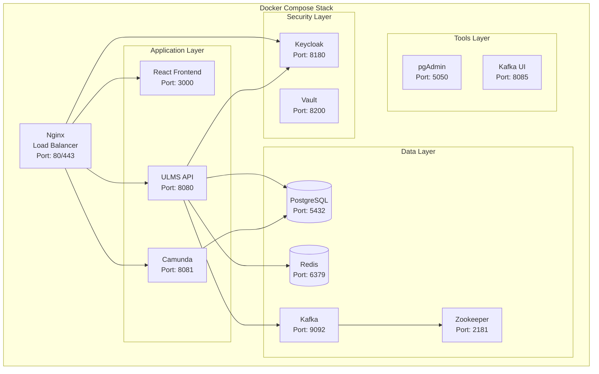

# Docker Compose Configurations

**Document Control**

| Field | Value |
|-------|-------|
| **Document Title** | Docker Compose Configurations |
| **Project Name** | Unisoft Loan Management System (ULMS) |
| **Document Version** | 1.0 |
| **Date** | 2026-02-05 |
| **Prepared By** | DevOps Engineering Team |
| **Reviewed By** | Technical Lead |
| **Classification** | Internal |
| **Status** | Approved |

**Revision History**

| Version | Date | Author | Description |
|---------|------|--------|-------------|
| 1.0 | 2026-02-05 | DevOps Team | Initial version for ULMS v2.0 |

---

## Table of Contents

1. [Executive Summary](#1-executive-summary)
2. [Compose Architecture](#2-compose-architecture)
3. [Service Definitions](#3-service-definitions)
4. [Network Configuration](#4-network-configuration)
5. [Volume Management](#5-volume-management)
6. [Environment Configuration](#6-environment-configuration)
7. [Compose Profiles](#7-compose-profiles)
8. [Production Considerations](#8-production-considerations)
9. [Troubleshooting](#9-troubleshooting)
10. [Related Documents](#10-related-documents)

---

## 1. Executive Summary

This document defines Docker Compose configurations for ULMS v2.0 development and testing environments, including multi-service orchestration, networking, persistent storage, and environment-specific overrides for Bangladesh banking deployments.

---

## 2. Compose Architecture

### 2.1 Service Topology



### 2.2 Compose File Structure

```
docker-compose/
├── docker-compose.yml              # Base configuration
├── docker-compose.override.yml     # Development overrides
├── docker-compose.prod.yml         # Production overrides
├── docker-compose.test.yml         # Testing configuration
├── docker-compose.monitoring.yml   # Monitoring stack
└── .env                            # Environment variables
```

---

## 3. Service Definitions

### 3.1 Base Compose Configuration

```yaml
# docker-compose.yml
version: '3.8'

services:
  # ============================================================================
  # Frontend Application
  # ============================================================================
  frontend:
    build:
      context: ./frontend
      dockerfile: Dockerfile
      args:
        - VITE_API_BASE_URL=${API_BASE_URL}
        - VITE_KEYCLOAK_URL=${KEYCLOAK_URL}
    container_name: ulms-frontend
    restart: unless-stopped
    ports:
      - "3000:80"
    environment:
      - NGINX_HOST=localhost
      - NGINX_PORT=80
    networks:
      - ulms-frontend
      - ulms-backend
    healthcheck:
      test: ["CMD", "curl", "-f", "http://localhost:80/health"]
      interval: 30s
      timeout: 10s
      retries: 3
      start_period: 10s

  # ============================================================================
  # Backend API Services
  # ============================================================================
  backend:
    build:
      context: ./backend
      dockerfile: Dockerfile
    container_name: ulms-backend
    restart: unless-stopped
    ports:
      - "8080:8080"
    environment:
      - SPRING_PROFILES_ACTIVE=docker
      - DB_HOST=postgres
      - DB_PORT=5432
      - DB_NAME=ulms
      - DB_USER=${DB_USER}
      - DB_PASSWORD=${DB_PASSWORD}
      - REDIS_HOST=redis
      - REDIS_PORT=6379
      - KAFKA_BOOTSTRAP_SERVERS=kafka:9092
      - KEYCLOAK_URL=http://keycloak:8080
      - JAVA_OPTS=-XX:+UseContainerSupport -XX:MaxRAMPercentage=75.0
    depends_on:
      postgres:
        condition: service_healthy
      redis:
        condition: service_started
      kafka:
        condition: service_healthy
    networks:
      - ulms-backend
      - ulms-database
      - ulms-messaging
      - ulms-security
    healthcheck:
      test: ["CMD", "curl", "-f", "http://localhost:8080/actuator/health"]
      interval: 30s
      timeout: 10s
      retries: 3
      start_period: 60s
    deploy:
      resources:
        limits:
          cpus: '2.0'
          memory: 2G
        reservations:
          cpus: '0.5'
          memory: 512M

  # ============================================================================
  # Workflow Engine - Camunda
  # ============================================================================
  camunda:
    image: camunda/camunda-bpm-platform:run-7.21.0
    container_name: ulms-camunda
    restart: unless-stopped
    ports:
      - "8081:8080"
    environment:
      - DB_DRIVER=org.postgresql.Driver
      - DB_URL=jdbc:postgresql://postgres:5432/camunda
      - DB_USERNAME=${DB_USER}
      - DB_PASSWORD=${DB_PASSWORD}
    depends_on:
      postgres:
        condition: service_healthy
    networks:
      - ulms-backend
      - ulms-database

  # ============================================================================
  # Database - PostgreSQL
  # ============================================================================
  postgres:
    image: postgres:16-alpine
    container_name: ulms-postgres
    restart: unless-stopped
    ports:
      - "5432:5432"
    environment:
      - POSTGRES_USER=${DB_USER}
      - POSTGRES_PASSWORD=${DB_PASSWORD}
      - POSTGRES_DB=ulms
      - POSTGRES_INITDB_ARGS=--encoding=UTF8 --locale=en_US.UTF-8
    volumes:
      - postgres_data:/var/lib/postgresql/data
      - ./init-scripts:/docker-entrypoint-initdb.d:ro
    networks:
      - ulms-database
    healthcheck:
      test: ["CMD-SHELL", "pg_isready -U ${DB_USER} -d ulms"]
      interval: 10s
      timeout: 5s
      retries: 5
      start_period: 10s

  # ============================================================================
  # Cache - Redis
  # ============================================================================
  redis:
    image: redis:7-alpine
    container_name: ulms-redis
    restart: unless-stopped
    ports:
      - "6379:6379"
    command: redis-server --appendonly yes --maxmemory 256mb --maxmemory-policy allkeys-lru
    volumes:
      - redis_data:/data
    networks:
      - ulms-database

  # ============================================================================
  # Message Queue - Kafka
  # ============================================================================
  zookeeper:
    image: confluentinc/cp-zookeeper:7.5.0
    container_name: ulms-zookeeper
    restart: unless-stopped
    environment:
      ZOOKEEPER_CLIENT_PORT: 2181
      ZOOKEEPER_TICK_TIME: 2000
    networks:
      - ulms-messaging

  kafka:
    image: confluentinc/cp-kafka:7.5.0
    container_name: ulms-kafka
    restart: unless-stopped
    ports:
      - "9092:9092"
    environment:
      KAFKA_BROKER_ID: 1
      KAFKA_ZOOKEEPER_CONNECT: zookeeper:2181
      KAFKA_ADVERTISED_LISTENERS: PLAINTEXT://kafka:9092
      KAFKA_OFFSETS_TOPIC_REPLICATION_FACTOR: 1
      KAFKA_AUTO_CREATE_TOPICS_ENABLE: "true"
    depends_on:
      - zookeeper
    networks:
      - ulms-messaging
    healthcheck:
      test: ["CMD", "kafka-broker-api-versions", "--bootstrap-server", "localhost:9092"]
      interval: 10s
      timeout: 5s
      retries: 5

  # ============================================================================
  # Identity Provider - Keycloak
  # ============================================================================
  keycloak:
    image: quay.io/keycloak/keycloak:23.0
    container_name: ulms-keycloak
    restart: unless-stopped
    command: start-dev --import-realm
    ports:
      - "8180:8080"
    environment:
      - KEYCLOAK_ADMIN=${KC_ADMIN}
      - KEYCLOAK_ADMIN_PASSWORD=${KC_ADMIN_PASSWORD}
      - KC_DB=postgres
      - KC_DB_URL=jdbc:postgresql://postgres:5432/keycloak
      - KC_DB_USERNAME=${DB_USER}
      - KC_DB_PASSWORD=${DB_PASSWORD}
      - KC_FEATURES=token-exchange,admin-fine-grained-authz
    volumes:
      - ./keycloak/realms:/opt/keycloak/data/import:ro
    depends_on:
      postgres:
        condition: service_healthy
    networks:
      - ulms-security
      - ulms-database

  # ============================================================================
  # Database Management Tools
  # ============================================================================
  pgadmin:
    image: dpage/pgadmin4:latest
    container_name: ulms-pgadmin
    restart: unless-stopped
    ports:
      - "5050:80"
    environment:
      - PGADMIN_DEFAULT_EMAIL=${PGADMIN_EMAIL}
      - PGADMIN_DEFAULT_PASSWORD=${PGADMIN_PASSWORD}
      - PGADMIN_CONFIG_SERVER_MODE=False
    volumes:
      - pgadmin_data:/var/lib/pgadmin
    depends_on:
      - postgres
    networks:
      - ulms-database
    profiles:
      - tools

  # ============================================================================
  # Kafka UI
  # ============================================================================
  kafka-ui:
    image: provectuslabs/kafka-ui:latest
    container_name: ulms-kafka-ui
    restart: unless-stopped
    ports:
      - "8085:8080"
    environment:
      - KAFKA_CLUSTERS_0_NAME=local
      - KAFKA_CLUSTERS_0_BOOTSTRAPSERVERS=kafka:9092
      - KAFKA_CLUSTERS_0_ZOOKEEPER=zookeeper:2181
    depends_on:
      - kafka
    networks:
      - ulms-messaging
    profiles:
      - tools

# ============================================================================
# Networks
# ============================================================================
networks:
  ulms-frontend:
    driver: bridge
    ipam:
      config:
        - subnet: 172.20.1.0/24
  ulms-backend:
    driver: bridge
    ipam:
      config:
        - subnet: 172.20.2.0/24
  ulms-database:
    driver: bridge
    internal: true
    ipam:
      config:
        - subnet: 172.20.3.0/24
  ulms-messaging:
    driver: bridge
    internal: true
    ipam:
      config:
        - subnet: 172.20.4.0/24
  ulms-security:
    driver: bridge
    ipam:
      config:
        - subnet: 172.20.5.0/24

# ============================================================================
# Volumes
# ============================================================================
volumes:
  postgres_data:
    driver: local
  redis_data:
    driver: local
  pgadmin_data:
    driver: local
```

---

## 4. Network Configuration

### 4.1 Network Security Matrix

| Network | CIDR | Internal | Connected Services | Purpose |
|---------|------|----------|-------------------|---------|
| ulms-frontend | 172.20.1.0/24 | No | Nginx, React | External access |
| ulms-backend | 172.20.2.0/24 | No | All services | Service mesh |
| ulms-database | 172.20.3.0/24 | Yes | PostgreSQL, Redis, pgAdmin | Data layer |
| ulms-messaging | 172.20.4.0/24 | Yes | Kafka, Zookeeper | Message queue |
| ulms-security | 172.20.5.0/24 | No | Keycloak, Vault | Authentication |

---

## 5. Volume Management

### 5.1 Volume Configuration

```yaml
volumes:
  postgres_data:
    driver: local
    driver_opts:
      type: none
      o: bind
      device: /data/ulms/postgres
    
  redis_data:
    driver: local
    driver_opts:
      type: none
      o: bind
      device: /data/ulms/redis
  
  postgres_backup:
    driver: local
    driver_opts:
      type: none
      o: bind
      device: /backup/ulms/postgres
```

---

## 6. Environment Configuration

### 6.1 Environment File Template

```bash
# .env file for ULMS Docker Compose

# =============================================================================
# Application Configuration
# =============================================================================
COMPOSE_PROJECT_NAME=ulms
API_BASE_URL=http://localhost:8080
FRONTEND_URL=http://localhost:3000

# =============================================================================
# Database Configuration
# =============================================================================
DB_USER=ulms_admin
DB_PASSWORD=SecurePass123!@#
DB_NAME=ulms
DB_PORT=5432

# =============================================================================
# Keycloak Configuration
# =============================================================================
KEYCLOAK_URL=http://localhost:8180
KC_ADMIN=admin
KC_ADMIN_PASSWORD=admin123

# =============================================================================
# pgAdmin Configuration
# =============================================================================
PGADMIN_EMAIL=admin@unisoft-systems.com
PGADMIN_PASSWORD=pgadmin123

# =============================================================================
# Security Configuration
# =============================================================================
JWT_SECRET=your-jwt-secret-key-min-32-characters
ENCRYPTION_KEY=your-encryption-key-32-chars

# =============================================================================
# Resource Limits
# =============================================================================
DB_MAX_CONNECTIONS=200
REDIS_MAXMEMORY=512mb
KAFKA_HEAP_OPTS=-Xmx1G -Xms1G
```

---

## 7. Compose Profiles

### 7.1 Profile Usage

| Profile | Services | Command | Use Case |
|---------|----------|---------|----------|
| default | Core services only | `docker-compose up` | Minimal dev environment |
| tools | + pgAdmin, Kafka UI | `docker-compose --profile tools up` | Database management |
| monitoring | + Prometheus, Grafana | `docker-compose --profile monitoring up` | Observability |
| full | All services | `docker-compose --profile tools --profile monitoring up` | Complete stack |

---

## 8. Production Considerations

### 8.1 Production Overrides

```yaml
# docker-compose.prod.yml
version: '3.8'

services:
  backend:
    image: registry.unisoft-systems.com/ulms/backend:2.0.0
    build: !reset null
    restart: always
    deploy:
      replicas: 3
      resources:
        limits:
          cpus: '2.0'
          memory: 4G
    environment:
      - SPRING_PROFILES_ACTIVE=production
    logging:
      driver: "json-file"
      options:
        max-size: "100m"
        max-file: "10"

  postgres:
    image: postgres:16-alpine
    restart: always
    volumes:
      - type: bind
        source: /mnt/data/postgres
        target: /var/lib/postgresql/data
    command: >
      postgres
      -c max_connections=500
      -c shared_buffers=2GB
      -c effective_cache_size=6GB
      -c maintenance_work_mem=512MB
```

---

## 9. Troubleshooting

### 9.1 Common Issues

| Issue | Symptoms | Solution |
|-------|----------|----------|
| Service unhealthy | Health check fails | Check logs: `docker-compose logs -f <service>` |
| Port conflicts | Address already in use | Change ports in .env or stop conflicting service |
| Volume permission denied | Cannot write to volume | Fix ownership: `sudo chown -R $USER:$USER /data` |
| Network not found | Container cannot connect | Recreate networks: `docker-compose down && docker-compose up` |
| Out of memory | Container killed | Increase Docker memory limit or reduce JVM heap |

### 9.2 Diagnostic Commands

```bash
# View all service logs
docker-compose logs -f

# View specific service logs
docker-compose logs -f backend

# Execute command in container
docker-compose exec backend /bin/sh

# Check service health
docker-compose ps

# Restart single service
docker-compose restart backend

# Full cleanup
docker-compose down -v --rmi all
```

---

## 10. Related Documents

| Document | Location | Purpose |
|----------|----------|---------|
| Docker Compose Local Stack Guide | `04_[OPS]_Docker_Compose_Local_Stack_Guide_v1.0.md` | Local development setup |
| Kubernetes Deployment Guide | `../02_Kubernetes_Deployment/01_[K8S]_Kubernetes_Deployment_Guide_v1.0.md` | Production deployment |
| Environment Configuration Management | `../07_Environment_Management/01_[ENV]_Environment_Configuration_Management_v1.0.md` | Environment management |

---

*© 2026 Unisoft Systems Limited. All Rights Reserved.*
