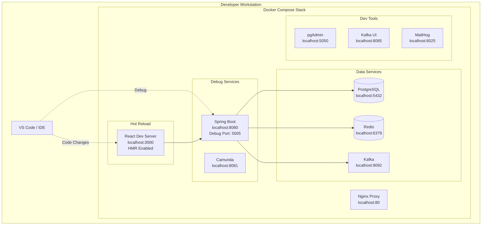

# Docker Compose Local Stack Guide

**Document Control**

| Field | Value |
|-------|-------|
| **Document Title** | Docker Compose Local Stack Guide |
| **Project Name** | Unisoft Loan Management System (ULMS) |
| **Document Version** | 1.0 |
| **Date** | 2026-02-05 |
| **Prepared By** | DevOps Engineering Team |
| **Reviewed By** | Technical Lead |
| **Classification** | Internal |
| **Status** | Approved |

**Revision History**

| Version | Date | Author | Description |
|---------|------|--------|-------------|
| 1.0 | 2026-02-05 | DevOps Team | Initial version for ULMS v2.0 |

---

## Table of Contents

1. [Executive Summary](#1-executive-summary)
2. [Prerequisites](#2-prerequisites)
3. [Quick Start](#3-quick-start)
4. [Service Architecture](#4-service-architecture)
5. [Configuration Options](#5-configuration-options)
6. [Development Workflow](#6-development-workflow)
7. [Data Persistence](#7-data-persistence)
8. [Debugging and Profiling](#8-debugging-and-profiling)
9. [Troubleshooting](#9-troubleshooting)
10. [Related Documents](#10-related-documents)

---

## 1. Executive Summary

This guide provides step-by-step instructions for setting up a complete ULMS v2.0 development environment using Docker Compose on local workstations. The local stack enables developers to work with the full application ecosystem without requiring cloud infrastructure access.

---

## 2. Prerequisites

### 2.1 System Requirements

| Component | Minimum | Recommended |
|-----------|---------|-------------|
| CPU | 4 cores | 8 cores |
| RAM | 8 GB | 16 GB |
| Disk | 20 GB free | 50 GB SSD |
| OS | Windows 10/11, macOS 12+, Ubuntu 20.04+ | Latest stable |

### 2.2 Required Software

| Software | Version | Purpose |
|----------|---------|---------|
| Docker Desktop | 4.25+ | Container runtime |
| Docker Compose | 2.23+ | Multi-container orchestration |
| Git | 2.40+ | Source control |
| Make | 4.3+ | Build automation |

### 2.3 Installation Verification

```bash
# Verify Docker installation
docker --version
docker-compose --version

# Verify Docker is running
docker info

# Test Docker functionality
docker run hello-world
```

---

## 3. Quick Start

### 3.1 One-Command Setup

```bash
# Clone repository
git clone https://gitlab.unisoft-systems.com/ulms/ulms-v2.git
cd ulms-v2

# Start complete stack
make local-up

# Or manually:
docker-compose -f docker-compose.yml -f docker-compose.override.yml up -d
```

### 3.2 Access Points

| Service | URL | Credentials |
|---------|-----|-------------|
| Frontend | http://localhost:3000 | - |
| Backend API | http://localhost:8080 | - |
| API Documentation | http://localhost:8080/swagger-ui | - |
| Keycloak Admin | http://localhost:8180/admin | admin/admin123 |
| pgAdmin | http://localhost:5050 | admin@unisoft-systems.com/pgadmin123 |
| Kafka UI | http://localhost:8085 | - |

---

## 4. Service Architecture

### 4.1 Local Stack Diagram



---

## 5. Configuration Options

### 5.1 Environment Profiles

```bash
# Minimal stack (core services only)
docker-compose up -d

# Development stack with tools
docker-compose --profile dev-tools up -d

# Full stack with monitoring
docker-compose --profile monitoring up -d

# Banking test environment
docker-compose -f docker-compose.yml -f docker-compose.banking.yml up -d
```

### 5.2 Profile Definitions

| Profile | Services Included | Memory Required |
|---------|------------------|-----------------|
| (none) | frontend, backend, postgres, redis | 4 GB |
| dev-tools | + pgAdmin, Kafka UI, MailHog | 6 GB |
| monitoring | + Prometheus, Grafana, Jaeger | 8 GB |
| banking | + CIB mock, NID mock services | 6 GB |

---

## 6. Development Workflow

### 6.1 Hot Reload Configuration

```yaml
# docker-compose.override.yml
services:
  frontend:
    volumes:
      - ./frontend/src:/app/src:ro
      - ./frontend/public:/app/public:ro
    environment:
      - CHOKIDAR_USEPOLLING=true
      - WDS_SOCKET_PORT=0
    command: npm run dev -- --host

  backend:
    volumes:
      - ./backend/src:/app/src:ro
      - ./backend/build.gradle:/app/build.gradle:ro
    environment:
      - SPRING_DEVTOOLS_RESTART_ENABLED=true
      - SPRING_PROFILES_ACTIVE=dev,docker
    ports:
      - "8080:8080"
      - "5005:5005"  # Debug port
```

### 6.2 Debug Configuration

```bash
# Start with debug enabled
docker-compose -f docker-compose.yml -f docker-compose.debug.yml up -d

# Attach debugger in VS Code
# .vscode/launch.json
{
    "version": "0.2.0",
    "configurations": [
        {
            "type": "java",
            "name": "Debug ULMS Backend",
            "request": "attach",
            "hostName": "localhost",
            "port": 5005
        }
    ]
}
```

---

## 7. Data Persistence

### 7.1 Volume Configuration

```yaml
volumes:
  # Database persistence
  postgres_data:
    driver: local
    driver_opts:
      type: none
      o: bind
      device: ${PWD}/.data/postgres

  # Redis persistence
  redis_data:
    driver: local
    driver_opts:
      type: none
      o: bind
      device: ${PWD}/.data/redis

  # pgAdmin persistence
  pgadmin_data:
    driver: local
    driver_opts:
      type: none
      o: bind
      device: ${PWD}/.data/pgadmin
```

### 7.2 Data Seeding

```bash
# Seed development data
docker-compose exec backend ./gradlew bootRun --args='--spring.profiles.active=seed'

# Import test loan data
docker-compose exec -T postgres psql -U ulms_admin ulms < seed/loans.sql

# Reset to clean state
docker-compose down -v
docker-compose up -d
```

---

## 8. Debugging and Profiling

### 8.1 Service Inspection

```bash
# View all running services
docker-compose ps

# View resource usage
docker stats

# Interactive shell in container
docker-compose exec backend /bin/sh
docker-compose exec postgres psql -U ulms_admin ulms

# View logs with follow
docker-compose logs -f backend

# View specific time range
docker-compose logs --since 5m backend
```

### 8.2 Performance Profiling

```bash
# Enable JVM profiling
docker-compose exec backend jmap -heap 1

# Database query analysis
docker-compose exec postgres psql -U ulms_admin -c "SELECT * FROM pg_stat_statements;"

# Redis slow log
docker-compose exec redis redis-cli SLOWLOG GET 10
```

---

## 9. Troubleshooting

### 9.1 Common Local Development Issues

| Issue | Cause | Solution |
|-------|-------|----------|
| Port already in use | Another service using port | Find and stop: `lsof -i :8080` |
| Out of memory | Docker memory limit too low | Increase Docker Desktop memory to 8GB+ |
| Hot reload not working | Volume mount issue | Check Docker file sharing settings |
| Database connection refused | Container not ready | Wait for health check: `docker-compose ps` |
| Build context too large | .dockerignore missing | Ensure .git and node_modules are ignored |

### 9.2 Reset Commands

```bash
# Soft reset (keep data)
docker-compose restart

# Hard reset (remove containers)
docker-compose down
docker-compose up -d

# Complete reset (remove all data)
docker-compose down -v --rmi local
docker-compose up -d

# Factory reset (nuclear option)
docker system prune -a --volumes
```

---

## 10. Related Documents

| Document | Location | Purpose |
|----------|----------|---------|
| Docker Compose Configurations | `03_[OPS]_Docker_Compose_Configurations_v1.0.md` | Full compose reference |
| Developer Setup Guide | `../../02-setup/[SETUP]_Developer_Environment_Setup_v1.0.md` | IDE and tool setup |
| Troubleshooting Guide | `../../07-operations/[OPS]_Troubleshooting_Guide_v1.0.md` | Issue resolution |

---

*© 2026 Unisoft Systems Limited. All Rights Reserved.*
