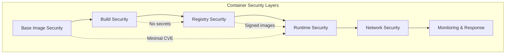
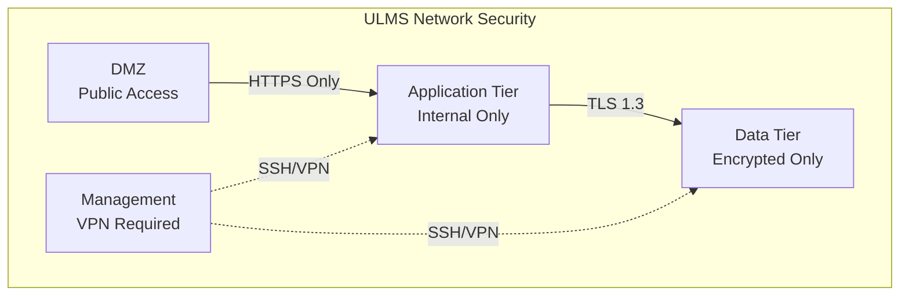

# Container Security Hardening

**Document Control**

| Field | Value |
|-------|-------|
| **Document Title** | Container Security Hardening |
| **Project Name** | Unisoft Loan Management System (ULMS) |
| **Document Version** | 1.0 |
| **Date** | 2026-02-05 |
| **Prepared By** | Security & DevOps Team |
| **Reviewed By** | CISO, Technical Lead |
| **Classification** | Confidential |
| **Status** | Approved |

**Revision History**

| Version | Date | Author | Description |
|---------|------|--------|-------------|
| 1.0 | 2026-02-05 | Security Team | Initial security hardening guide |

---

## Table of Contents

1. [Executive Summary](#1-executive-summary)
2. [Security Framework](#2-security-framework)
3. [Image Security](#3-image-security)
4. [Runtime Security](#4-runtime-security)
5. [Network Security](#5-network-security)
6. [Secret Management](#6-secret-management)
7. [Compliance Requirements](#7-compliance-requirements)
8. [Security Scanning](#8-security-scanning)
9. [Incident Response](#9-incident-response)
10. [Related Documents](#10-related-documents)

---

## 1. Executive Summary

This document establishes comprehensive security hardening standards for ULMS v2.0 containerized deployments, ensuring compliance with Bangladesh Bank ICT Security Guidelines V4.0 and international banking security standards.

---

## 2. Security Framework

### 2.1 Defense in Depth



### 2.2 Security Standards

| Standard | Requirement | Implementation |
|----------|-------------|----------------|
| Bangladesh Bank ICT V4.0 | Data encryption, access control | Container encryption at rest |
| PCI DSS | Secure coding, vulnerability management | Image scanning pipeline |
| ISO 27001 | Risk management | Security assessment checklist |
| NIST SP 800-190 | Container security | CIS Docker Benchmark |

---

## 3. Image Security

### 3.1 Base Image Requirements

```dockerfile
# SECURITY: Use minimal, verified base images
FROM eclipse-temurin:21-jre-alpine@sha256:abcdef123456...

# SECURITY: Update system packages
RUN apk update && \
    apk upgrade && \
    apk add --no-cache ca-certificates tzdata && \
    rm -rf /var/cache/apk/*

# SECURITY: Create non-root user
RUN addgroup -g 1000 ulms && \
    adduser -u 1000 -G ulms -s /bin/sh -D ulms

# SECURITY: Set proper permissions
COPY --chown=ulms:ulms --chmod=755 app.jar /app/

USER ulms
```

### 3.2 Image Security Checklist

| Check | Requirement | Verification |
|-------|-------------|--------------|
| Base Image | Official, minimal image | Docker Hub verification |
| CVE Scan | Zero critical/high vulnerabilities | Trivy/Snyk scan |
| No Secrets | No credentials in layers | Secret scanning |
| Non-root User | UID >= 1000 | Dockerfile inspection |
| Read-only FS | /tmp only writable | Security testing |
| Minimal Capabilities | CAP_DROP ALL | Runtime inspection |

---

## 4. Runtime Security

### 4.1 Docker Security Options

```yaml
services:
  backend:
    image: ulms-backend:2.0.0
    
    # Security: Run as non-root
    user: "1000:1000"
    
    # Security: Prevent privilege escalation
    security_opt:
      - no-new-privileges:true
    
    # Security: Read-only root filesystem
    read_only: true
    
    # Security: Drop all capabilities, add only required
    cap_drop:
      - ALL
    cap_add:
      - NET_BIND_SERVICE
    
    # Security: Resource limits
    deploy:
      resources:
        limits:
          cpus: '2.0'
          memory: 2G
          pids: 100
    
    # Security: Temporary writable directories
    tmpfs:
      - /tmp:noexec,nosuid,size=100m,uid=1000,gid=1000
      - /var/log:noexec,nosuid,size=50m,uid=1000,gid=1000
```

### 4.2 Kubernetes Security Context

```yaml
apiVersion: apps/v1
kind: Deployment
spec:
  template:
    spec:
      securityContext:
        runAsNonRoot: true
        runAsUser: 1000
        runAsGroup: 1000
        fsGroup: 1000
        seccompProfile:
          type: RuntimeDefault
      containers:
        - name: backend
          securityContext:
            allowPrivilegeEscalation: false
            readOnlyRootFilesystem: true
            capabilities:
              drop:
                - ALL
            seccompProfile:
              type: RuntimeDefault
```

---

## 5. Network Security

### 5.1 Network Segmentation



### 5.2 Network Policies

```yaml
apiVersion: networking.k8s.io/v1
kind: NetworkPolicy
metadata:
  name: backend-network-policy
spec:
  podSelector:
    matchLabels:
      app: ulms-backend
  policyTypes:
    - Ingress
    - Egress
  ingress:
    - from:
        - podSelector:
            matchLabels:
              app: ulms-frontend
        - podSelector:
            matchLabels:
              app: ulms-gateway
      ports:
        - protocol: TCP
          port: 8080
  egress:
    - to:
        - podSelector:
            matchLabels:
              app: ulms-postgres
      ports:
        - protocol: TCP
          port: 5432
    - to:
        - podSelector:
            matchLabels:
              app: ulms-redis
      ports:
        - protocol: TCP
          port: 6379
```

---

## 6. Secret Management

### 6.1 Secret Handling Principles

| Principle | Implementation | Example |
|-----------|----------------|---------|
| No Secrets in Images | Build-time exclusion | .dockerignore secrets/ |
| Runtime Injection | Environment or volume mounts | Kubernetes Secrets |
| Encryption at Rest | Sealed Secrets / Vault | HashiCorp Vault |
| Rotation | Automated secret rotation | External Secrets Operator |
| Audit | Access logging | Vault audit logs |

### 6.2 HashiCorp Vault Integration

```yaml
apiVersion: secrets-store.csi.x-k8s.io/v1
kind: SecretProviderClass
metadata:
  name: ulms-vault-provider
spec:
  provider: vault
  parameters:
    vaultAddress: "https://vault.unisoft-systems.com:8200"
    roleName: "ulms-backend"
    objects: |
      - objectName: "db-password"
        secretPath: "ulms/data/backend"
        secretKey: "db_password"
      - objectName: "jwt-secret"
        secretPath: "ulms/data/backend"
        secretKey: "jwt_secret"
```

---

## 7. Compliance Requirements

### 7.1 Bangladesh Bank ICT V4.0 Compliance

| Requirement | Control | Container Implementation |
|-------------|---------|--------------------------|
| 4.2.1 | Data Encryption | Encrypted volumes, TLS 1.3 |
| 4.2.3 | Access Control | RBAC, Network Policies |
| 4.3.1 | Audit Logging | Container audit, SIEM integration |
| 4.4.2 | Vulnerability Management | Image scanning, SBOM |
| 5.1.1 | Data Classification | Pod labels, network segmentation |

### 7.2 Security Baseline

```bash
# CIS Docker Benchmark automation
docker run --rm -v /var/run/docker.sock:/var/run/docker.sock \
  -v $(pwd):/output \
  docker/docker-bench-security -c container_images,container_runtime

# Kubernetes CIS Benchmark
kube-bench run --targets node,policies
```

---

## 8. Security Scanning

### 8.1 CI/CD Security Pipeline

```yaml
security-scan:
  stage: security
  parallel:
    matrix:
      - SCANNER: [trivy, snyk, grype]
  script:
    # Vulnerability scanning
    - $SCANNER image --severity HIGH,CRITICAL $IMAGE_NAME
    
    # Secret detection
    - $SCANNER filesystem --scanners secret .
    
    # SBOM generation
    - $SCANNER image --format spdx-json -o sbom.json $IMAGE_NAME
    
    # Compliance check
    - checkov --dockerfile Dockerfile --framework dockerfile
  artifacts:
    reports:
      dependency_scanning: dependency-scan-report.json
      container_scanning: container-scan-report.json
```

### 8.2 Vulnerability Management SLA

| Severity | Response Time | Remediation |
|----------|---------------|-------------|
| Critical | 4 hours | Immediate fix and redeploy |
| High | 24 hours | Fix within next release |
| Medium | 7 days | Schedule fix |
| Low | 30 days | Backlog |

---

## 9. Incident Response

### 9.1 Container Security Incident Playbook

| Phase | Actions | Responsible |
|-------|---------|-------------|
| Detection | Alert from SIEM/Scanning | Security Team |
| Containment | Isolate affected containers | DevOps |
| Eradication | Patch and rebuild images | Development |
| Recovery | Deploy patched containers | DevOps |
| Lessons Learned | Update security controls | Security |

### 9.2 Forensic Collection

```bash
# Capture container state
docker export compromised_container > evidence.tar

# Collect logs
docker logs compromised_container > container_logs.txt

# Network capture
docker run --net=container:compromised_container \
  tcpdump -w capture.pcap

# Memory dump (if supported)
docker checkpoint create compromised_container checkpoint1
```

---

## 10. Related Documents

| Document | Location | Purpose |
|----------|----------|---------|
| Docker Containerization Guide | `01_[OPS]_Docker_Containerization_Guide_v1.0.md` | Container design |
| Kubernetes Deployment Guide | `../02_Kubernetes_Deployment/01_[K8S]_Kubernetes_Deployment_Guide_v1.0.md` | K8s security |
| Secrets Management | `../07_Environment_Management/03_[ENV]_Secrets_Management_Implementation_Vault_v1.0.md` | Vault setup |

---

*© 2026 Unisoft Systems Limited. All Rights Reserved.*
