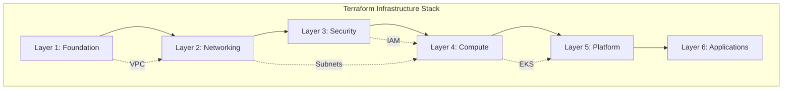

# Infrastructure as Code - Terraform

**Document Control**

| Field | Value |
|-------|-------|
| **Document Title** | Infrastructure as Code - Terraform |
| **Project Name** | Unisoft Loan Management System (ULMS) |
| **Document Version** | 1.0 |
| **Date** | 2026-02-05 |
| **Prepared By** | DevOps Engineering Team |
| **Reviewed By** | Technical Lead, Cloud Architect |
| **Classification** | Confidential |
| **Status** | Approved |

**Revision History**

| Version | Date | Author | Description |
|---------|------|--------|-------------|
| 1.0 | 2026-02-05 | DevOps Team | Initial Terraform infrastructure guide |

---

## Table of Contents

1. [Executive Summary](#1-executive-summary)
2. [Terraform Architecture](#2-terraform-architecture)
3. [Project Structure](#3-project-structure)
4. [Infrastructure Modules](#4-infrastructure-modules)
5. [State Management](#5-state-management)
6. [Environment Configuration](#6-environment-configuration)
7. [Security Implementation](#7-security-implementation)
8. [CI/CD Integration](#8-cicd-integration)
9. [Troubleshooting](#9-troubleshooting)
10. [Related Documents](#10-related-documents)

---

## 1. Executive Summary

This document defines the Infrastructure as Code (IaC) implementation for ULMS v2.0 using Terraform, enabling reproducible, version-controlled infrastructure deployment across multiple environments for Bangladesh banking institutions.

---

## 2. Terraform Architecture

### 2.1 Infrastructure Layers



### 2.2 Provider Configuration

```hcl
# terraform/providers.tf
terraform {
  required_version = ">= 1.6.0"
  
  required_providers {
    aws = {
      source  = "hashicorp/aws"
      version = "~> 5.0"
    }
    kubernetes = {
      source  = "hashicorp/kubernetes"
      version = "~> 2.23"
    }
    helm = {
      source  = "hashicorp/helm"
      version = "~> 2.11"
    }
    vault = {
      source  = "hashicorp/vault"
      version = "~> 3.20"
    }
  }
  
  backend "s3" {
    bucket         = "ulms-terraform-state"
    key            = "infrastructure/terraform.tfstate"
    region         = "ap-southeast-1"
    encrypt        = true
    dynamodb_table = "ulms-terraform-locks"
  }
}

provider "aws" {
  region = var.aws_region
  
  default_tags {
    tags = {
      Project     = "ULMS"
      Environment = var.environment
      ManagedBy   = "Terraform"
      Owner       = "Unisoft Systems"
    }
  }
}
```

---

## 3. Project Structure

### 3.1 Directory Organization

```
terraform/
├── modules/
│   ├── vpc/                    # Network infrastructure
│   ├── eks/                    # Kubernetes cluster
│   ├── rds/                    # PostgreSQL database
│   ├── elasticache/            # Redis cache
│   ├── alb/                    # Load balancer
│   ├── route53/                # DNS management
│   ├── iam/                    # Access management
│   ├── security-groups/        # Firewall rules
│   └── s3/                     # Object storage
├── environments/
│   ├── dev/
│   │   ├── main.tf
│   │   ├── variables.tf
│   │   ├── terraform.tfvars
│   │   └── outputs.tf
│   ├── staging/
│   └── production/
├── global/
│   ├── iam/                    # Cross-account IAM
│   └── route53/                # DNS zones
└── scripts/
    ├── init.sh
    ├── plan.sh
    └── apply.sh
```

---

## 4. Infrastructure Modules

### 4.1 VPC Module

```hcl
# modules/vpc/main.tf
resource "aws_vpc" "main" {
  cidr_block           = var.vpc_cidr
  enable_dns_hostnames = true
  enable_dns_support   = true
  
  tags = {
    Name = "${var.project_name}-${var.environment}-vpc"
  }
}

resource "aws_subnet" "public" {
  count                   = length(var.availability_zones)
  vpc_id                  = aws_vpc.main.id
  cidr_block              = cidrsubnet(var.vpc_cidr, 8, count.index)
  availability_zone       = var.availability_zones[count.index]
  map_public_ip_on_launch = true
  
  tags = {
    Name = "${var.project_name}-${var.environment}-public-${count.index + 1}"
    Type = "public"
  }
}

resource "aws_subnet" "private" {
  count             = length(var.availability_zones)
  vpc_id            = aws_vpc.main.id
  cidr_block        = cidrsubnet(var.vpc_cidr, 8, count.index + 10)
  availability_zone = var.availability_zones[count.index]
  
  tags = {
    Name = "${var.project_name}-${var.environment}-private-${count.index + 1}"
    Type = "private"
  }
}

resource "aws_subnet" "database" {
  count             = length(var.availability_zones)
  vpc_id            = aws_vpc.main.id
  cidr_block        = cidrsubnet(var.vpc_cidr, 8, count.index + 20)
  availability_zone = var.availability_zones[count.index]
  
  tags = {
    Name = "${var.project_name}-${var.environment}-database-${count.index + 1}"
    Type = "database"
  }
}

# Internet Gateway
resource "aws_internet_gateway" "main" {
  vpc_id = aws_vpc.main.id
  
  tags = {
    Name = "${var.project_name}-${var.environment}-igw"
  }
}

# NAT Gateway for private subnets
resource "aws_nat_gateway" "main" {
  count         = length(var.availability_zones)
  allocation_id = aws_eip.nat[count.index].id
  subnet_id     = aws_subnet.public[count.index].id
  
  tags = {
    Name = "${var.project_name}-${var.environment}-nat-${count.index + 1}"
  }
}

resource "aws_eip" "nat" {
  count  = length(var.availability_zones)
  domain = "vpc"
  
  tags = {
    Name = "${var.project_name}-${var.environment}-eip-${count.index + 1}"
  }
}
```

### 4.2 EKS Module

```hcl
# modules/eks/main.tf
resource "aws_eks_cluster" "main" {
  name     = "${var.project_name}-${var.environment}"
  version  = var.kubernetes_version
  role_arn = aws_iam_role.eks_cluster.arn
  
  vpc_config {
    subnet_ids              = var.private_subnet_ids
    endpoint_private_access = true
    endpoint_public_access  = var.environment != "production"
    public_access_cidrs     = var.allowed_cidr_blocks
    security_group_ids      = [aws_security_group.eks_cluster.id]
  }
  
  encryption_config {
    provider {
      key_arn = aws_kms_key.eks.arn
    }
    resources = ["secrets"]
  }
  
  enabled_cluster_log_types = ["api", "audit", "authenticator", "controllerManager", "scheduler"]
  
  depends_on = [
    aws_iam_role_policy_attachment.eks_cluster_policy,
    aws_iam_role_policy_attachment.eks_vpc_resource_controller,
  ]
}

resource "aws_eks_node_group" "general" {
  cluster_name    = aws_eks_cluster.main.name
  node_group_name = "general-workloads"
  node_role_arn   = aws_iam_role.eks_node.arn
  subnet_ids      = var.private_subnet_ids
  
  instance_types = var.node_instance_types
  capacity_type  = var.environment == "production" ? "ON_DEMAND" : "SPOT"
  
  scaling_config {
    desired_size = var.node_desired_size
    min_size     = var.node_min_size
    max_size     = var.node_max_size
  }
  
  update_config {
    max_unavailable_percentage = 25
  }
  
  labels = {
    workload = "general"
    environment = var.environment
  }
  
  tags = {
    Name = "${var.project_name}-${var.environment}-general-nodes"
  }
  
  depends_on = [
    aws_iam_role_policy_attachment.eks_worker_node_policy,
    aws_iam_role_policy_attachment.eks_cni_policy,
    aws_iam_role_policy_attachment.eks_container_registry,
  ]
}

resource "aws_eks_node_group" "applications" {
  cluster_name    = aws_eks_cluster.main.name
  node_group_name = "application-workloads"
  node_role_arn   = aws_iam_role.eks_node.arn
  subnet_ids      = var.private_subnet_ids
  
  instance_types = ["m6i.xlarge", "m6i.2xlarge"]
  capacity_type  = "ON_DEMAND"
  
  scaling_config {
    desired_size = 3
    min_size     = 2
    max_size     = 10
  }
  
  taint {
    key    = "dedicated"
    value  = "applications"
    effect = "NO_SCHEDULE"
  }
  
  labels = {
    workload = "applications"
    environment = var.environment
  }
}
```

### 4.3 RDS PostgreSQL Module

```hcl
# modules/rds/main.tf
resource "aws_db_subnet_group" "main" {
  name       = "${var.project_name}-${var.environment}-db-subnet"
  subnet_ids = var.database_subnet_ids
  
  tags = {
    Name = "${var.project_name}-${var.environment}-db-subnet"
  }
}

resource "aws_security_group" "rds" {
  name_prefix = "${var.project_name}-${var.environment}-rds-"
  vpc_id      = var.vpc_id
  
  ingress {
    from_port       = 5432
    to_port         = 5432
    protocol        = "tcp"
    security_groups = var.allowed_security_groups
  }
  
  tags = {
    Name = "${var.project_name}-${var.environment}-rds-sg"
  }
}

resource "aws_db_instance" "main" {
  identifier = "${var.project_name}-${var.environment}"
  
  engine         = "postgres"
  engine_version = "16.1"
  instance_class = var.instance_class
  
  allocated_storage     = var.allocated_storage
  max_allocated_storage = var.max_allocated_storage
  storage_type          = "gp3"
  storage_encrypted     = true
  kms_key_id           = aws_kms_key.rds.arn
  
  db_name  = var.database_name
  username = var.master_username
  password = var.master_password
  
  vpc_security_group_ids = [aws_security_group.rds.id]
  db_subnet_group_name   = aws_db_subnet_group.main.name
  
  multi_az               = var.environment == "production"
  publicly_accessible    = false
  
  backup_retention_period = var.environment == "production" ? 30 : 7
  backup_window          = "03:00-04:00"
  maintenance_window     = "Mon:04:00-Mon:05:00"
  
  enabled_cloudwatch_logs_exports = ["postgresql", "upgrade"]
  
  deletion_protection = var.environment == "production"
  skip_final_snapshot = var.environment != "production"
  
  tags = {
    Name = "${var.project_name}-${var.environment}-postgres"
  }
}

resource "aws_db_instance" "replica" {
  count = var.environment == "production" ? 1 : 0
  
  identifier = "${var.project_name}-${var.environment}-replica"
  
  replicate_source_db = aws_db_instance.main.arn
  instance_class      = var.instance_class
  
  storage_encrypted = true
  kms_key_id       = aws_kms_key.rds.arn
  
  vpc_security_group_ids = [aws_security_group.rds.id]
  
  publicly_accessible = false
  
  tags = {
    Name = "${var.project_name}-${var.environment}-postgres-replica"
  }
}
```

---

## 5. State Management

### 5.1 Remote State Configuration

```hcl
# Backend configuration for S3 with DynamoDB locking
terraform {
  backend "s3" {
    bucket         = "ulms-terraform-state"
    key            = "infrastructure/${var.environment}/terraform.tfstate"
    region         = "ap-southeast-1"
    encrypt        = true
    kms_key_id     = "arn:aws:kms:ap-southeast-1:ACCOUNT:key/KEY-ID"
    dynamodb_table = "ulms-terraform-locks"
  }
}

# State locking with DynamoDB
resource "aws_dynamodb_table" "terraform_locks" {
  name         = "ulms-terraform-locks"
  billing_mode = "PAY_PER_REQUEST"
  hash_key     = "LockID"
  
  attribute {
    name = "LockID"
    type = "S"
  }
  
  tags = {
    Name = "Terraform State Lock Table"
  }
}
```

---

## 6. Environment Configuration

### 6.1 Environment Variables

```hcl
# environments/production/terraform.tfvars
environment = "production"
aws_region  = "ap-southeast-1"

# VPC Configuration
vpc_cidr            = "10.0.0.0/16"
availability_zones  = ["ap-southeast-1a", "ap-southeast-1b", "ap-southeast-1c"]

# EKS Configuration
kubernetes_version = "1.28"
node_instance_types = ["m6i.2xlarge", "m6i.xlarge"]
node_desired_size   = 5
node_min_size       = 3
node_max_size       = 15

# RDS Configuration
instance_class       = "db.r6g.xlarge"
allocated_storage    = 500
max_allocated_storage = 2000

# Security
allowed_cidr_blocks = ["203.0.113.0/24", "198.51.100.0/24"]
enable_waf          = true
enable_shield       = true
```

---

## 7. Security Implementation

### 7.1 KMS Key Management

```hcl
resource "aws_kms_key" "main" {
  description             = "KMS key for ULMS ${var.environment}"
  deletion_window_in_days = 30
  enable_key_rotation     = true
  multi_region           = var.environment == "production"
  
  policy = jsonencode({
    Version = "2012-10-17"
    Statement = [
      {
        Sid    = "Enable IAM User Permissions"
        Effect = "Allow"
        Principal = {
          AWS = "arn:aws:iam::${data.aws_caller_identity.current.account_id}:root"
        }
        Action   = "kms:*"
        Resource = "*"
      },
      {
        Sid    = "Allow EKS Service"
        Effect = "Allow"
        Principal = {
          Service = "eks.amazonaws.com"
        }
        Action = [
          "kms:Encrypt",
          "kms:Decrypt",
          "kms:GenerateDataKey*"
        ]
        Resource = "*"
      }
    ]
  })
  
  tags = {
    Name = "${var.project_name}-${var.environment}-kms"
  }
}
```

---

## 8. CI/CD Integration

### 8.1 GitLab CI Pipeline

```yaml
.terraform:
  image: hashicorp/terraform:1.6
  before_script:
    - terraform --version
    - terraform init -backend-config="bucket=$TF_STATE_BUCKET"

terraform-plan:
  extends: .terraform
  stage: plan
  script:
    - terraform plan -out=tfplan
  artifacts:
    paths:
      - tfplan

terraform-apply:
  extends: .terraform
  stage: deploy
  script:
    - terraform apply -auto-approve tfplan
  when: manual
  only:
    - main
```

---

## 9. Troubleshooting

### 9.1 Common Issues

| Issue | Cause | Solution |
|-------|-------|----------|
| State lock timeout | Concurrent runs | Check DynamoDB, force unlock |
| Provider version conflict | Lock file outdated | Run `terraform init -upgrade` |
| Resource already exists | Manual creation | Import resource or destroy |
| Permission denied | IAM policies | Verify role permissions |

### 9.2 Useful Commands

```bash
# Format and validate
terraform fmt -recursive
terraform validate

# Plan with detailed output
terraform plan -out=tfplan -detailed-exitcode

# Target specific resource
terraform apply -target=aws_eks_cluster.main

# State management
terraform state list
terraform state show aws_vpc.main
terraform state rm aws_instance.example
terraform import aws_instance.example i-abc123
```

---

## 10. Related Documents

| Document | Location | Purpose |
|----------|----------|---------|
| Kubernetes Deployment Guide | `../02_Kubernetes_Deployment/01_[K8S]_Kubernetes_Deployment_Guide_v1.0.md` | K8s on AWS |
| Environment Configuration | `../07_Environment_Management/01_[ENV]_Environment_Configuration_Management_v1.0.md` | Env management |

---

*© 2026 Unisoft Systems Limited. All Rights Reserved.*
