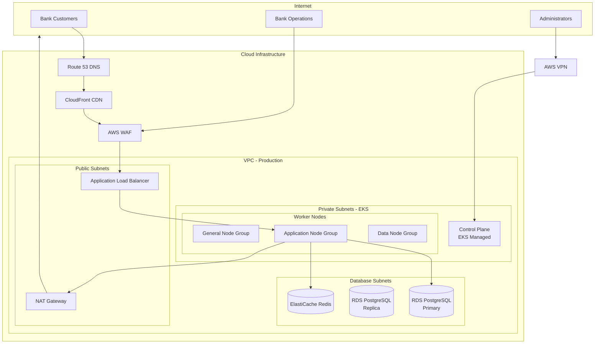
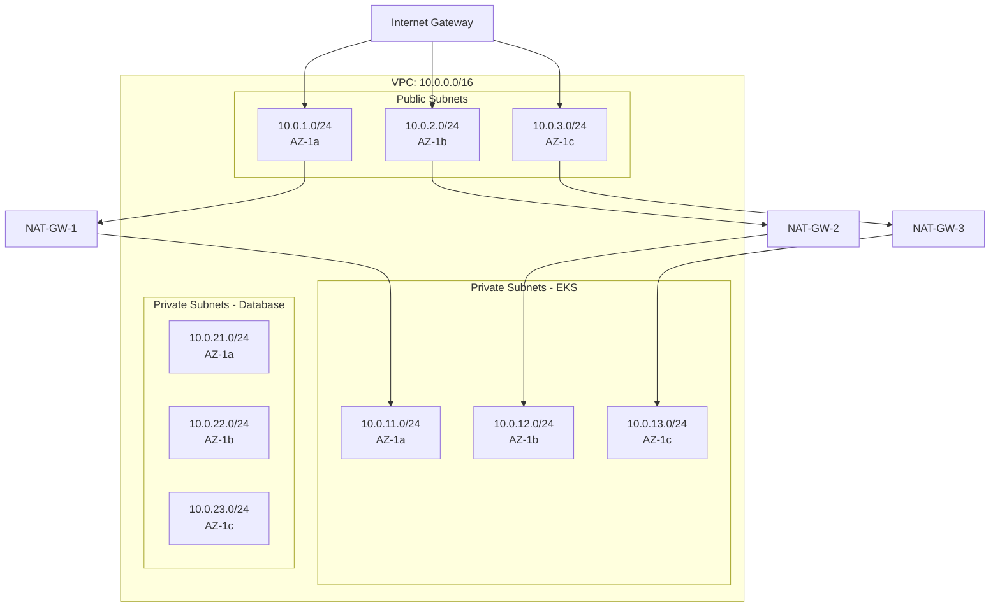
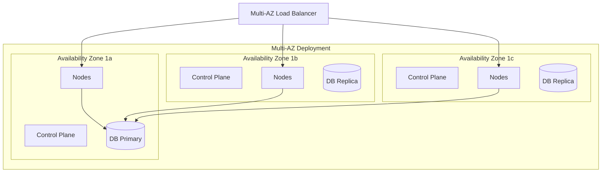
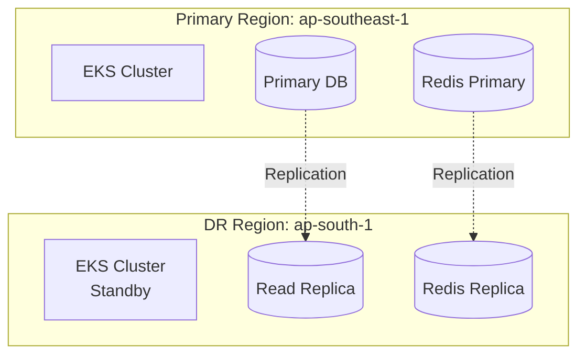

# Kubernetes Cluster Architecture

**Document Control**

| Field | Value |
|-------|-------|
| **Document Title** | Kubernetes Cluster Architecture |
| **Project Name** | Unisoft Loan Management System (ULMS) |
| **Document Version** | 1.0 |
| **Date** | 2026-02-05 |
| **Prepared By** | DevOps Engineering Team |
| **Reviewed By** | Cloud Architect, Technical Lead |
| **Classification** | Confidential |
| **Status** | Approved |

**Revision History**

| Version | Date | Author | Description |
|---------|------|--------|-------------|
| 1.0 | 2026-02-05 | DevOps Team | Initial K8s architecture for ULMS v2.0 |

---

## Table of Contents

1. [Executive Summary](#1-executive-summary)
2. [Architecture Overview](#2-architecture-overview)
3. [Cluster Design](#3-cluster-design)
4. [Network Architecture](#4-network-architecture)
5. [Node Configuration](#5-node-configuration)
6. [High Availability](#6-high-availability)
7. [Security Architecture](#7-security-architecture)
8. [Storage Architecture](#8-storage-architecture)
9. [Multi-Region Considerations](#9-multi-region-considerations)
10. [Related Documents](#10-related-documents)

---

## 1. Executive Summary

This document defines the Kubernetes cluster architecture for ULMS v2.0, designed for high availability, security, and scalability to support Bangladesh banking operations with strict compliance requirements.

---

## 2. Architecture Overview

### 2.1 High-Level Architecture



---

## 3. Cluster Design

### 3.1 EKS Cluster Configuration

```hcl
# Terraform EKS Module Configuration
module "eks" {
  source  = "terraform-aws-modules/eks/aws"
  version = "19.0"

  cluster_name    = "ulms-${var.environment}"
  cluster_version = "1.28"

  cluster_endpoint_public_access  = var.environment != "production"
  cluster_endpoint_private_access = true

  vpc_id     = module.vpc.vpc_id
  subnet_ids = module.vpc.private_subnets

  # EKS Managed Node Groups
  eks_managed_node_groups = {
    general = {
      name           = "general-workloads"
      instance_types = ["m6i.xlarge"]
      
      min_size     = 2
      max_size     = 10
      desired_size = 3

      capacity_type = var.environment == "production" ? "ON_DEMAND" : "SPOT"
      
      labels = {
        workload = "general"
      }

      taints = []

      update_config = {
        max_unavailable_percentage = 25
      }

      block_device_mappings = {
        xvda = {
          device_name = "/dev/xvda"
          ebs = {
            volume_size           = 100
            volume_type           = "gp3"
            encrypted             = true
            delete_on_termination = true
          }
        }
      }
    }

    applications = {
      name           = "application-workloads"
      instance_types = ["m6i.2xlarge", "m6i.xlarge"]
      
      min_size     = 3
      max_size     = 20
      desired_size = 5

      capacity_type = "ON_DEMAND"
      
      labels = {
        workload = "applications"
      }

      taints = [{
        key    = "dedicated"
        value  = "applications"
        effect = "NO_SCHEDULE"
      }]

      update_config = {
        max_unavailable_percentage = 25
      }
    }

    data_processing = {
      name           = "data-workloads"
      instance_types = ["r6i.xlarge"]
      
      min_size     = 2
      max_size     = 8
      desired_size = 3

      capacity_type = "ON_DEMAND"
      
      labels = {
        workload = "data"
      }

      taints = [{
        key    = "dedicated"
        value  = "data"
        effect = "NO_SCHEDULE"
      }]
    }
  }

  # Cluster Addons
  cluster_addons = {
    coredns = {
      most_recent = true
      configuration_values = jsonencode({
        computeType = "Fargate"
        resources = {
          limits = {
            cpu    = "1"
            memory = "512Mi"
          }
        }
      })
    }
    kube-proxy = { most_recent = true }
    vpc-cni = { most_recent = true }
    aws-ebs-csi-driver = { most_recent = true }
    aws-efs-csi-driver = { most_recent = true }
  }

  # Encryption
  cluster_encryption_config = {
    provider_key_arn = aws_kms_key.eks.arn
    resources        = ["secrets"]
  }

  tags = {
    Environment = var.environment
    Project     = "ULMS"
  }
}
```

### 3.2 Cluster Specifications

| Component | Development | Staging | Production |
|-----------|-------------|---------|------------|
| Kubernetes Version | 1.28 | 1.28 | 1.28 |
| Control Plane | 1 AZ | 3 AZs | 3 AZs |
| Node Groups | 1 | 2 | 3 |
| Total Nodes | 2-5 | 5-15 | 10-30 |
| Pod CIDR | 10.0.0.0/16 | 10.0.0.0/16 | 10.0.0.0/16 |
| Service CIDR | 172.20.0.0/16 | 172.20.0.0/16 | 172.20.0.0/16 |

---

## 4. Network Architecture

### 4.1 VPC and Subnet Design



### 4.2 CNI Configuration

```yaml
# AWS VPC CNI Configuration
apiVersion: v1
kind: ConfigMap
metadata:
  name: amazon-vpc-cni
  namespace: kube-system
data:
  ENABLE_PREFIX_DELEGATION: "true"
  WARM_PREFIX_TARGET: "1"
  MINIMUM_IP_TARGET: "10"
  WARM_IP_TARGET: "5"
  ENABLE_POD_ENI: "true"
  ENABLE_PREFIX_DELEGATION: "true"
  AWS_VPC_K8S_CNI_EXTERNALSNAT: "true"
  AWS_VPC_K8S_CNI_LOGLEVEL: "INFO"
```

---

## 5. Node Configuration

### 5.1 Node Group Specifications

| Node Group | Instance Types | Min | Max | Purpose |
|------------|---------------|-----|-----|---------|
| general | m6i.xlarge | 2 | 10 | System pods, monitoring |
| applications | m6i.2xlarge | 3 | 20 | ULMS microservices |
| data | r6i.xlarge | 2 | 8 | CIB processing, reports |
| spot-workloads | m6i.large | 0 | 20 | Batch jobs, non-critical |

### 5.2 Node Labels and Taints

```yaml
# Node configuration example
apiVersion: v1
kind: Node
metadata:
  labels:
    workload: applications
    environment: production
    compliance: bank-grade
  taints:
    - key: dedicated
      value: applications
      effect: NoSchedule
```

---

## 6. High Availability

### 6.1 HA Architecture



### 6.2 Pod Disruption Budgets

```yaml
apiVersion: policy/v1
kind: PodDisruptionBudget
metadata:
  name: ulms-backend-pdb
spec:
  minAvailable: 2
  selector:
    matchLabels:
      app: ulms-backend
---
apiVersion: policy/v1
kind: PodDisruptionBudget
metadata:
  name: ulms-frontend-pdb
spec:
  minAvailable: 2
  selector:
    matchLabels:
      app: ulms-frontend
```

---

## 7. Security Architecture

### 7.1 Defense Layers

| Layer | Control | Implementation |
|-------|---------|----------------|
| Network | Security Groups | AWS VPC |
| Network | Network Policies | Calico/Native |
| Pod | Security Context | Non-root, read-only FS |
| Identity | IRSA | AWS IAM Roles |
| Secrets | Encryption | KMS, Sealed Secrets |
| Audit | Logging | CloudWatch, Falco |

### 7.2 Pod Security Standards

```yaml
apiVersion: v1
kind: Pod
metadata:
  name: secure-pod
spec:
  securityContext:
    runAsNonRoot: true
    runAsUser: 1000
    runAsGroup: 1000
    fsGroup: 1000
    seccompProfile:
      type: RuntimeDefault
  containers:
    - name: app
      securityContext:
        allowPrivilegeEscalation: false
        readOnlyRootFilesystem: true
        capabilities:
          drop:
            - ALL
        seccompProfile:
          type: RuntimeDefault
```

---

## 8. Storage Architecture

### 8.1 Storage Classes

```yaml
apiVersion: storage.k8s.io/v1
kind: StorageClass
metadata:
  name: gp3-encrypted
provisioner: ebs.csi.aws.com
volumeBindingMode: WaitForFirstConsumer
allowVolumeExpansion: true
parameters:
  type: gp3
  encrypted: "true"
  kmsKeyId: "arn:aws:kms:ap-southeast-1:ACCOUNT:key/KEY-ID"
---
apiVersion: storage.k8s.io/v1
kind: StorageClass
metadata:
  name: efs-sc
provisioner: efs.csi.aws.com
parameters:
  provisioningMode: efs-ap
  fileSystemId: fs-xxxx
  directoryPerms: "700"
```

---

## 9. Multi-Region Considerations

### 9.1 DR Architecture



---

## 10. Related Documents

| Document | Location | Purpose |
|----------|----------|---------|
| Kubernetes Deployment Guide | `02_[K8S]_Kubernetes_Deployment_Guide_v1.0.md` | Deployment procedures |
| Kubernetes Resource Manifests | `03_[K8S]_Kubernetes_Resource_Manifests_v1.0.md` | YAML manifests |
| Container Security Hardening | `../01_Containerization/05_[OPS]_Container_Security_Hardening_v1.0.md` | Security |

---

*© 2026 Unisoft Systems Limited. All Rights Reserved.*
