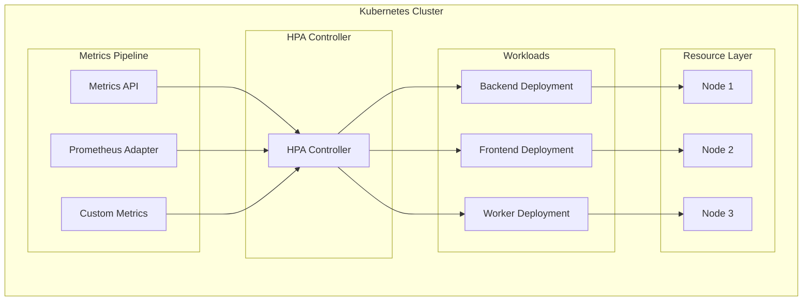
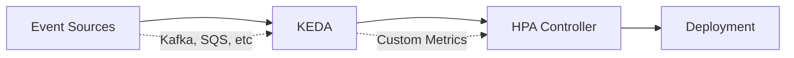

# Horizontal Pod Autoscaler Configuration

**Document Control**

| Field | Value |
|-------|-------|
| **Document Title** | Horizontal Pod Autoscaler Configuration |
| **Project Name** | Unisoft Loan Management System (ULMS) |
| **Document Version** | 1.0 |
| **Date** | 2026-02-05 |
| **Prepared By** | DevOps Engineering Team |
| **Reviewed By** | Technical Lead |
| **Classification** | Internal |
| **Status** | Approved |

**Revision History**

| Version | Date | Author | Description |
|---------|------|--------|-------------|
| 1.0 | 2026-02-05 | DevOps Team | Initial HPA configuration guide |

---

## Table of Contents

1. [Executive Summary](#1-executive-summary)
2. [HPA Architecture](#2-hpa-architecture)
3. [HPA Configuration](#3-hpa-configuration)
4. [Metrics Configuration](#4-metrics-configuration)
5. [Custom Metrics](#5-custom-metrics)
6. [Scaling Policies](#6-scaling-policies)
7. [KEDA Integration](#7-keda-integration)
8. [Performance Testing](#8-performance-testing)
9. [Troubleshooting](#9-troubleshooting)
10. [Related Documents](#10-related-documents)

---

## 1. Executive Summary

This document provides comprehensive configuration for Horizontal Pod Autoscaler (HPA) in ULMS v2.0, enabling automatic scaling based on CPU, memory, and custom metrics to handle varying loads in Bangladesh banking operations.

---

## 2. HPA Architecture

### 2.1 Autoscaling Architecture



---

## 3. HPA Configuration

### 3.1 Backend HPA

```yaml
apiVersion: autoscaling/v2
kind: HorizontalPodAutoscaler
metadata:
  name: ulms-backend-hpa
  namespace: ulms-production
  labels:
    app: ulms-backend
spec:
  scaleTargetRef:
    apiVersion: apps/v1
    kind: Deployment
    name: ulms-backend
  minReplicas: 3
  maxReplicas: 20
  metrics:
    - type: Resource
      resource:
        name: cpu
        target:
          type: Utilization
          averageUtilization: 70
    - type: Resource
      resource:
        name: memory
        target:
          type: Utilization
          averageUtilization: 80
    - type: Pods
      pods:
        metric:
          name: http_requests_per_second
        target:
          type: AverageValue
          averageValue: "1000"
  behavior:
    scaleDown:
      stabilizationWindowSeconds: 300
      policies:
        - type: Percent
          value: 10
          periodSeconds: 60
    scaleUp:
      stabilizationWindowSeconds: 0
      policies:
        - type: Percent
          value: 100
          periodSeconds: 15
        - type: Pods
          value: 4
          periodSeconds: 15
      selectPolicy: Max
```

### 3.2 Frontend HPA

```yaml
apiVersion: autoscaling/v2
kind: HorizontalPodAutoscaler
metadata:
  name: ulms-frontend-hpa
  namespace: ulms-production
spec:
  scaleTargetRef:
    apiVersion: apps/v1
    kind: Deployment
    name: ulms-frontend
  minReplicas: 2
  maxReplicas: 10
  metrics:
    - type: Resource
      resource:
        name: cpu
        target:
          type: Utilization
          averageUtilization: 60
  behavior:
    scaleDown:
      stabilizationWindowSeconds: 300
      policies:
        - type: Percent
          value: 50
          periodSeconds: 60
    scaleUp:
      stabilizationWindowSeconds: 0
      policies:
        - type: Percent
          value: 100
          periodSeconds: 15
```

### 3.3 Worker HPA (KEDA)

```yaml
apiVersion: keda.sh/v1alpha1
kind: ScaledObject
metadata:
  name: ulms-worker-scaledobject
  namespace: ulms-production
spec:
  scaleTargetRef:
    name: ulms-worker
  pollingInterval: 30
  cooldownPeriod: 300
  minReplicaCount: 2
  maxReplicaCount: 30
  triggers:
    - type: kafka
      metadata:
        bootstrapServers: ulms-kafka:9092
        consumerGroup: ulms-worker-group
        topic: loan-applications
        lagThreshold: "100"
        activationLagThreshold: "10"
    - type: cpu
      metricType: Utilization
      metadata:
        value: "70"
```

---

## 4. Metrics Configuration

### 4.1 Metrics Server

```yaml
# Metrics Server Deployment
apiVersion: apps/v1
kind: Deployment
metadata:
  name: metrics-server
  namespace: kube-system
spec:
  selector:
    matchLabels:
      k8s-app: metrics-server
  template:
    spec:
      containers:
        - name: metrics-server
          image: registry.k8s.io/metrics-server/metrics-server:v0.6.4
          args:
            - --cert-dir=/tmp
            - --secure-port=10250
            - --kubelet-preferred-address-types=InternalIP,ExternalIP,Hostname
            - --kubelet-use-node-status-port
            - --metric-resolution=15s
          resources:
            requests:
              cpu: 100m
              memory: 200Mi
            limits:
              cpu: 500m
              memory: 512Mi
```

### 4.2 Prometheus Adapter

```yaml
apiVersion: v1
kind: ConfigMap
metadata:
  name: prometheus-adapter-config
  namespace: monitoring
data:
  config.yaml: |
    rules:
      - seriesQuery: 'http_requests_total{kubernetes_namespace!="",kubernetes_pod_name!=""}'
        resources:
          overrides:
            kubernetes_namespace: {resource: "namespace"}
            kubernetes_pod_name: {resource: "pod"}
        name:
          matches: "^(.*)_total"
          as: "${1}_per_second"
        metricsQuery: 'sum(rate(<<.Series>>{<<.LabelMatchers>>}[2m])) by (<<.GroupBy>>)'
      
      - seriesQuery: 'container_cpu_usage_seconds_total{namespace!="",pod!=""}'
        resources:
          overrides:
            namespace: {resource: "namespace"}
            pod: {resource: "pod"}
        name:
          matches: "^container_(.*)_seconds_total$"
          as: ""
        metricsQuery: 'sum(rate(<<.Series>>{<<.LabelMatchers>>,container!="POD"}[2m])) by (<<.GroupBy>>)'
```

---

## 5. Custom Metrics

### 5.1 Application Metrics

```yaml
apiVersion: autoscaling/v2
kind: HorizontalPodAutoscaler
metadata:
  name: ulms-api-hpa-custom
  namespace: ulms-production
spec:
  scaleTargetRef:
    apiVersion: apps/v1
    kind: Deployment
    name: ulms-backend
  minReplicas: 3
  maxReplicas: 30
  metrics:
    - type: Object
      object:
        describedObject:
          apiVersion: networking.k8s.io/v1
          kind: Ingress
          name: ulms-ingress
        metric:
          name: nginx_ingress_controller_requests
        target:
          type: AverageValue
          averageValue: "10000"
    - type: External
      external:
        metric:
          name: kafka_consumer_lag
          selector:
            matchLabels:
              topic: loan-applications
        target:
          type: AverageValue
          averageValue: "500"
```

---

## 6. Scaling Policies

### 6.1 Policy Comparison

| Scenario | Scale Up | Scale Down | Stabilization |
|----------|----------|------------|---------------|
| Normal Load | +100% or +4 pods | -10% per minute | 5 min down, 0 min up |
| Peak Hours | +100% or +8 pods | Disabled | 0 min up |
| End of Day | +50% or +2 pods | -50% per 5 min | 10 min down |

### 6.2 Cron-based Scaling

```yaml
apiVersion: keda.sh/v1alpha1
kind: ScaledObject
metadata:
  name: ulms-banking-hours-scaler
  namespace: ulms-production
spec:
  scaleTargetRef:
    name: ulms-backend
  minReplicaCount: 3
  maxReplicaCount: 20
  triggers:
    - type: cron
      metadata:
        timezone: Asia/Dhaka
        start: 0 9 * * 1-5
        end: 0 18 * * 1-5
        desiredReplicas: "10"
    - type: cron
      metadata:
        timezone: Asia/Dhaka
        start: 0 18 * * 1-5
        end: 0 9 * * 1-5
        desiredReplicas: "3"
    - type: cpu
      metadata:
        value: "70"
```

---

## 7. KEDA Integration

### 7.1 KEDA Architecture



### 7.2 ScaledJob for Batch Processing

```yaml
apiVersion: keda.sh/v1alpha1
kind: ScaledJob
metadata:
  name: ulms-report-generator
  namespace: ulms-production
spec:
  jobTargetRef:
    template:
      spec:
        containers:
          - name: report-generator
            image: registry.unisoft-systems.com/ulms/report-generator:2.0.0
            env:
              - name: REPORT_TYPE
                value: "daily"
        restartPolicy: OnFailure
    backoffLimit: 2
  pollingInterval: 30
  maxReplicaCount: 10
  successfulJobsHistoryLimit: 3
  failedJobsHistoryLimit: 3
  triggers:
    - type: cron
      metadata:
        timezone: Asia/Dhaka
        start: 0 2 * * *
        end: 0 4 * * *
        desiredReplicas: "5"
```

---

## 8. Performance Testing

### 8.1 Load Testing Commands

```bash
# Install hey (HTTP load generator)
go install github.com/rakyll/hey@latest

# Test HPA response
hey -z 5m -c 50 -q 100 https://ulms.unisoft-systems.com/api/health

# Watch HPA status
kubectl get hpa ulms-backend-hpa -w

# Check metrics
kubectl top pods -l app=ulms-backend
kubectl top nodes
```

---

## 9. Troubleshooting

### 9.1 Common Issues

| Issue | Cause | Solution |
|-------|-------|----------|
| HPA not scaling | Missing metrics | Check metrics-server |
| Flapping | Threshold too low | Increase stabilization window |
| Scale too slow | Policy too conservative | Adjust scaleUp policies |
| No custom metrics | Adapter not configured | Check prometheus-adapter |

### 9.2 Diagnostic Commands

```bash
# Check HPA status
kubectl describe hpa ulms-backend-hpa

# View metrics
kubectl get --raw /apis/metrics.k8s.io/v1beta1/pods

# Check custom metrics
kubectl get --raw /apis/custom.metrics.k8s.io/v1beta1

# Verify KEDA
kubectl get scaledobjects
kubectl describe scaledobject ulms-worker-scaledobject
```

---

## 10. Related Documents

| Document | Location | Purpose |
|----------|----------|---------|
| Kubernetes Deployment Guide | `02_[K8S]_Kubernetes_Deployment_Guide_v1.0.md` | Deployment |
| Monitoring Setup | `../../05_Monitoring_Observability/02_[MON]_Prometheus_Monitoring_Setup_v1.0.md` | Metrics |

---

*© 2026 Unisoft Systems Limited. All Rights Reserved.*
