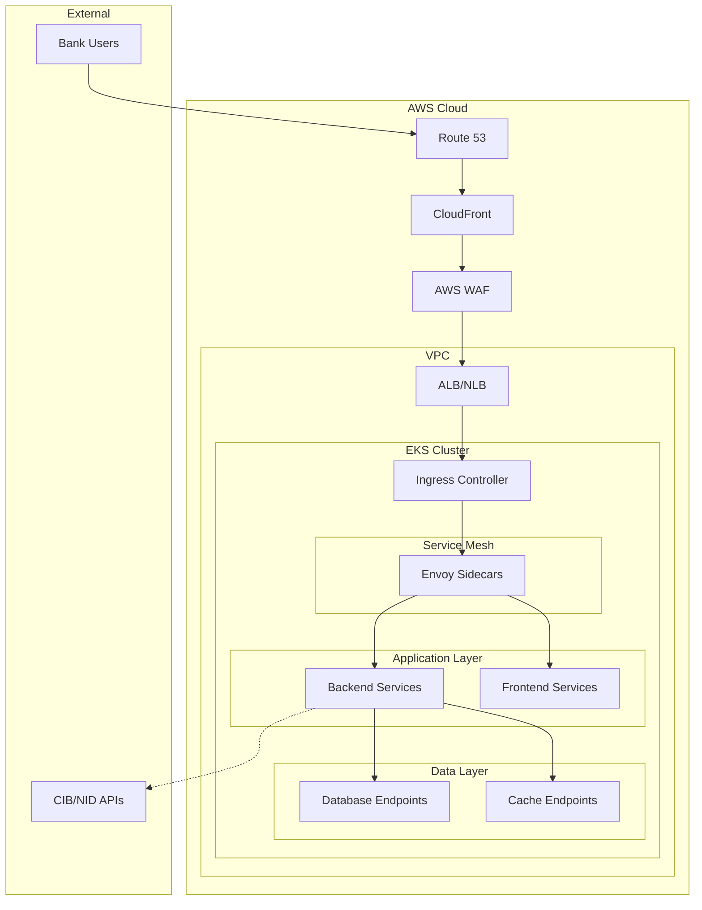

# Kubernetes Networking Design

**Document Control**

| Field | Value |
|-------|-------|
| **Document Title** | Kubernetes Networking Design |
| **Project Name** | Unisoft Loan Management System (ULMS) |
| **Document Version** | 1.0 |
| **Date** | 2026-02-05 |
| **Prepared By** | DevOps Engineering Team |
| **Reviewed By** | Network Architect, Security Officer |
| **Classification** | Confidential |
| **Status** | Approved |

**Revision History**

| Version | Date | Author | Description |
|---------|------|--------|-------------|
| 1.0 | 2026-02-05 | DevOps Team | Network design for ULMS v2.0 |

---

## Table of Contents

1. [Executive Summary](#1-executive-summary)
2. [Network Architecture](#2-network-architecture)
3. [CNI Configuration](#3-cni-configuration)
4. [Service Mesh](#4-service-mesh)
5. [Ingress Configuration](#5-ingress-configuration)
6. [Network Policies](#6-network-policies)
7. [Load Balancing](#7-load-balancing)
8. [DNS Configuration](#8-dns-configuration)
9. [Security](#9-security)
10. [Related Documents](#10-related-documents)

---

## 1. Executive Summary

This document defines the Kubernetes networking architecture for ULMS v2.0, including CNI configuration, service mesh integration, ingress controllers, and security policies for Bangladesh banking compliance.

---

## 2. Network Architecture

### 2.1 Network Topology



---

## 3. CNI Configuration

### 3.1 AWS VPC CNI

```yaml
# VPC CNI Configuration
apiVersion: v1
kind: ConfigMap
metadata:
  name: amazon-vpc-cni
  namespace: kube-system
data:
  ENABLE_PREFIX_DELEGATION: "true"
  WARM_PREFIX_TARGET: "1"
  MINIMUM_IP_TARGET: "10"
  WARM_IP_TARGET: "5"
  ENABLE_POD_ENI: "true"
  ENABLE_PREFIX_DELEGATION: "true"
  AWS_VPC_K8S_CNI_EXTERNALSNAT: "true"
  AWS_VPC_K8S_CNI_LOGLEVEL: "INFO"
  AWS_VPC_K8S_CNI_LOG_FILE: "/host/var/log/aws-routed-eni/ipamd.log"
  AWS_VPC_K8S_CNI_RANDOMIZED_SNAT: "prng"
```

### 3.2 IP Address Management

| CIDR Block | Purpose | Size |
|------------|---------|------|
| 10.0.0.0/16 | VPC | 65,536 |
| 100.64.0.0/16 | Pods | 65,536 |
| 172.20.0.0/16 | Services | 65,536 |
| 10.0.1.0/24 | Public Subnet AZ-1 | 256 |
| 10.0.11.0/24 | Private Subnet AZ-1 | 256 |

---

## 4. Service Mesh

### 4.1 Istio Configuration

```yaml
# Istio Control Plane
apiVersion: install.istio.io/v1alpha1
kind: IstioOperator
metadata:
  name: ulms-istio
spec:
  profile: default
  hub: gcr.io/istio-release
  tag: 1.20.0
  components:
    pilot:
      k8s:
        resources:
          requests:
            cpu: 500m
            memory: 1Gi
        hpaSpec:
          minReplicas: 2
          maxReplicas: 5
  meshConfig:
    defaultConfig:
      proxyMetadata:
        ISTIO_META_DNS_CAPTURE: "true"
      tracing:
        sampling: 100.0
        zipkin:
          address: jaeger-collector.monitoring:9411
    enableAutoMtls: true
  values:
    global:
      proxy:
        resources:
          requests:
            cpu: 100m
            memory: 128Mi
          limits:
            cpu: 500m
            memory: 512Mi
```

### 4.2 Istio Gateway

```yaml
apiVersion: networking.istio.io/v1beta1
kind: Gateway
metadata:
  name: ulms-gateway
  namespace: ulms-production
spec:
  selector:
    istio: ingressgateway
  servers:
    - port:
        number: 443
        name: https
        protocol: HTTPS
      tls:
        mode: SIMPLE
        credentialName: ulms-tls-secret
        minProtocolVersion: TLSV1_2
        cipherSuites:
          - TLS_AES_256_GCM_SHA384
          - TLS_CHACHA20_POLY1305_SHA256
      hosts:
        - ulms.unisoft-systems.com
        - api.unisoft-systems.com
    - port:
        number: 80
        name: http
        protocol: HTTP
      hosts:
        - "*"
      tls:
        httpsRedirect: true
```

---

## 5. Ingress Configuration

### 5.1 NGINX Ingress Controller

```yaml
# NGINX Ingress Controller Deployment
apiVersion: apps/v1
kind: Deployment
metadata:
  name: nginx-ingress-controller
  namespace: ingress-nginx
spec:
  replicas: 2
  selector:
    matchLabels:
      app: nginx-ingress
  template:
    spec:
      containers:
        - name: nginx-ingress-controller
          image: registry.k8s.io/ingress-nginx/controller:v1.9.4
          args:
            - /nginx-ingress-controller
            - --ingress-class=nginx
            - --configmap=$(POD_NAMESPACE)/nginx-configuration
            - --validating-webhook=:8443
            - --validating-webhook-certificate=/usr/local/certificates/cert
            - --validating-webhook-key=/usr/local/certificates/key
          securityContext:
            allowPrivilegeEscalation: false
            readOnlyRootFilesystem: true
            runAsNonRoot: true
          resources:
            requests:
              cpu: 500m
              memory: 512Mi
            limits:
              cpu: 1000m
              memory: 1Gi
```

### 5.2 Ingress Resource

```yaml
apiVersion: networking.k8s.io/v1
kind: Ingress
metadata:
  name: ulms-ingress
  namespace: ulms-production
  annotations:
    nginx.ingress.kubernetes.io/ssl-redirect: "true"
    nginx.ingress.kubernetes.io/proxy-body-size: "10m"
    nginx.ingress.kubernetes.io/proxy-read-timeout: "300"
    nginx.ingress.kubernetes.io/proxy-send-timeout: "300"
    nginx.ingress.kubernetes.io/rate-limit: "100"
    nginx.ingress.kubernetes.io/rate-limit-window: "1m"
    cert-manager.io/cluster-issuer: "letsencrypt-prod"
spec:
  ingressClassName: nginx
  tls:
    - hosts:
        - ulms.unisoft-systems.com
      secretName: ulms-tls
  rules:
    - host: ulms.unisoft-systems.com
      http:
        paths:
          - path: /
            pathType: Prefix
            backend:
              service:
                name: ulms-frontend
                port:
                  number: 80
          - path: /api
            pathType: Prefix
            backend:
              service:
                name: ulms-backend
                port:
                  number: 8080
          - path: /actuator
            pathType: Prefix
            backend:
              service:
                name: ulms-backend
                port:
                  number: 8081
```

---

## 6. Network Policies

### 6.1 Default Deny Policy

```yaml
apiVersion: networking.k8s.io/v1
kind: NetworkPolicy
metadata:
  name: default-deny-ingress
  namespace: ulms-production
spec:
  podSelector: {}
  policyTypes:
    - Ingress
```

### 6.2 Application Network Policies

```yaml
apiVersion: networking.k8s.io/v1
kind: NetworkPolicy
metadata:
  name: ulms-backend-policy
  namespace: ulms-production
spec:
  podSelector:
    matchLabels:
      app: ulms-backend
  policyTypes:
    - Ingress
    - Egress
  ingress:
    - from:
        - namespaceSelector:
            matchLabels:
              name: ingress-nginx
        - podSelector:
            matchLabels:
              app: ulms-frontend
      ports:
        - protocol: TCP
          port: 8080
        - protocol: TCP
          port: 8081
  egress:
    - to:
        - podSelector:
            matchLabels:
              app: ulms-postgres
      ports:
        - protocol: TCP
          port: 5432
    - to:
        - podSelector:
            matchLabels:
              app: ulms-redis
      ports:
        - protocol: TCP
          port: 6379
    - to:
        - namespaceSelector: {}
          podSelector:
            matchLabels:
              k8s-app: kube-dns
      ports:
        - protocol: UDP
          port: 53
```

---

## 7. Load Balancing

### 7.1 Service Load Balancing

```yaml
apiVersion: v1
kind: Service
metadata:
  name: ulms-backend-lb
  namespace: ulms-production
  annotations:
    service.beta.kubernetes.io/aws-load-balancer-type: "nlb"
    service.beta.kubernetes.io/aws-load-balancer-scheme: "internal"
    service.beta.kubernetes.io/aws-load-balancer-cross-zone-load-balancing-enabled: "true"
    service.beta.kubernetes.io/aws-load-balancer-ssl-ports: "443"
    service.beta.kubernetes.io/aws-load-balancer-ssl-cert: arn:aws:acm:ap-southeast-1:ACCOUNT:certificate/CERT-ID
spec:
  type: LoadBalancer
  selector:
    app: ulms-backend
  ports:
    - name: https
      port: 443
      targetPort: 8080
      protocol: TCP
  sessionAffinity: ClientIP
  sessionAffinityConfig:
    clientIP:
      timeoutSeconds: 10800
```

---

## 8. DNS Configuration

### 8.1 CoreDNS Configuration

```yaml
apiVersion: v1
kind: ConfigMap
metadata:
  name: coredns
  namespace: kube-system
data:
  Corefile: |
    .:53 {
        errors
        health {
            lameduck 5s
        }
        ready
        kubernetes cluster.local in-addr.arpa ip6.arpa {
            pods insecure
            fallthrough in-addr.arpa ip6.arpa
            ttl 30
        }
        prometheus :9153
        forward . /etc/resolv.conf {
            max_concurrent 1000
        }
        cache 30
        loop
        reload
        loadbalance
    }
    ulms.local:53 {
        errors
        cache 30
        forward . 10.0.0.2
    }
```

### 8.2 External DNS

```yaml
apiVersion: externaldns.k8s.io/v1alpha1
kind: DNSEndpoint
metadata:
  name: ulms-dns
  namespace: ulms-production
spec:
  endpoints:
    - dnsName: ulms.unisoft-systems.com
      recordType: A
      targets:
        - ALB_DNS_NAME
```

---

## 9. Security

### 9.1 TLS Configuration

```yaml
apiVersion: cert-manager.io/v1
kind: Certificate
metadata:
  name: ulms-tls
  namespace: ulms-production
spec:
  secretName: ulms-tls-secret
  issuerRef:
    name: letsencrypt-prod
    kind: ClusterIssuer
  dnsNames:
    - ulms.unisoft-systems.com
    - api.unisoft-systems.com
  privateKey:
    algorithm: RSA
    encoding: PKCS1
    size: 4096
  usages:
    - server auth
    - client auth
```

---

## 10. Related Documents

| Document | Location | Purpose |
|----------|----------|---------|
| Container Security Hardening | `../01_Containerization/05_[OPS]_Container_Security_Hardening_v1.0.md` | Security |
| Kubernetes Resource Manifests | `03_[K8S]_Kubernetes_Resource_Manifests_v1.0.md` | YAML configs |

---

*© 2026 Unisoft Systems Limited. All Rights Reserved.*
