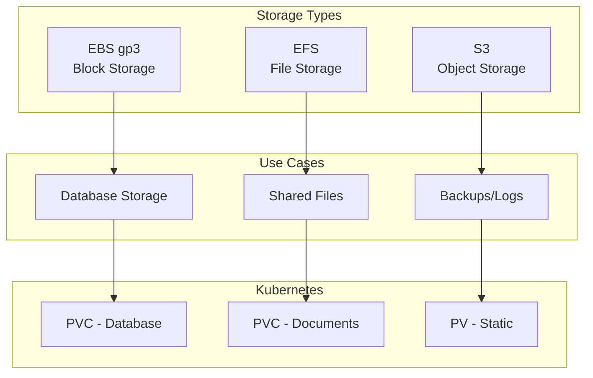

# Persistent Volume Configuration

**Document Control**

| Field | Value |
|-------|-------|
| **Document Title** | Persistent Volume Configuration |
| **Project Name** | Unisoft Loan Management System (ULMS) |
| **Document Version** | 1.0 |
| **Date** | 2026-02-05 |
| **Prepared By** | DevOps Engineering Team |
| **Reviewed By** | Technical Lead |
| **Classification** | Internal |
| **Status** | Approved |

**Revision History**

| Version | Date | Author | Description |
|---------|------|--------|-------------|
| 1.0 | 2026-02-05 | DevOps Team | Storage configuration guide |

---

## Table of Contents

1. [Executive Summary](#1-executive-summary)
2. [Storage Architecture](#2-storage-architecture)
3. [Storage Classes](#3-storage-classes)
4. [EBS Configuration](#4-ebs-configuration)
5. [EFS Configuration](#5-efs-configuration)
6. [Volume Snapshots](#6-volume-snapshots)
7. [Backup Strategy](#7-backup-strategy)
8. [Performance Tuning](#8-performance-tuning)
9. [Troubleshooting](#9-troubleshooting)
10. [Related Documents](#10-related-documents)

---

## 1. Executive Summary

This document defines persistent storage configuration for ULMS v2.0 on Kubernetes, including EBS, EFS, and backup strategies for Bangladesh banking data compliance.

---

## 2. Storage Architecture

### 2.1 Storage Topology



---

## 3. Storage Classes

### 3.1 EBS Storage Classes

```yaml
---
apiVersion: storage.k8s.io/v1
kind: StorageClass
metadata:
  name: gp3-encrypted
  annotations:
    storageclass.kubernetes.io/is-default-class: "true"
provisioner: ebs.csi.aws.com
volumeBindingMode: WaitForFirstConsumer
allowVolumeExpansion: true
parameters:
  type: gp3
  encrypted: "true"
  kmsKeyId: "arn:aws:kms:ap-southeast-1:ACCOUNT:key/KEY-ID"
  iops: "3000"
  throughput: "125"
reclaimPolicy: Retain
allowVolumeExpansion: true
mountOptions:
  - debug
---
apiVersion: storage.k8s.io/v1
kind: StorageClass
metadata:
  name: io2-encrypted
provisioner: ebs.csi.aws.com
volumeBindingMode: WaitForFirstConsumer
allowVolumeExpansion: true
parameters:
  type: io2
  encrypted: "true"
  kmsKeyId: "arn:aws:kms:ap-southeast-1:ACCOUNT:key/KEY-ID"
  iopsPerGB: "50"
reclaimPolicy: Retain
---
apiVersion: storage.k8s.io/v1
kind: StorageClass
metadata:
  name: sc1-cold
provisioner: ebs.csi.aws.com
volumeBindingMode: WaitForFirstConsumer
allowVolumeExpansion: true
parameters:
  type: sc1
  encrypted: "true"
reclaimPolicy: Retain
```

### 3.2 EFS Storage Class

```yaml
apiVersion: storage.k8s.io/v1
kind: StorageClass
metadata:
  name: efs-sc
provisioner: efs.csi.aws.com
parameters:
  provisioningMode: efs-ap
  fileSystemId: fs-12345678
  directoryPerms: "700"
  gidRangeStart: "1000"
  gidRangeEnd: "2000"
  basePath: "/dynamic_provisioning"
reclaimPolicy: Retain
volumeBindingMode: Immediate
```

---

## 4. EBS Configuration

### 4.1 Persistent Volume Claim

```yaml
apiVersion: v1
kind: PersistentVolumeClaim
metadata:
  name: postgres-data
  namespace: ulms-production
  labels:
    app: postgres
spec:
  accessModes:
    - ReadWriteOnce
  storageClassName: gp3-encrypted
  resources:
    requests:
      storage: 500Gi
```

### 4.2 StatefulSet with PVC

```yaml
apiVersion: apps/v1
kind: StatefulSet
metadata:
  name: postgres
  namespace: ulms-production
spec:
  serviceName: postgres
  replicas: 1
  selector:
    matchLabels:
      app: postgres
  template:
    metadata:
      labels:
        app: postgres
    spec:
      containers:
        - name: postgres
          image: postgres:16-alpine
          volumeMounts:
            - name: data
              mountPath: /var/lib/postgresql/data
  volumeClaimTemplates:
    - metadata:
        name: data
      spec:
        accessModes: ["ReadWriteOnce"]
        storageClassName: gp3-encrypted
        resources:
          requests:
            storage: 500Gi
```

---

## 5. EFS Configuration

### 5.1 Shared Storage PVC

```yaml
apiVersion: v1
kind: PersistentVolumeClaim
metadata:
  name: ulms-shared-storage
  namespace: ulms-production
spec:
  accessModes:
    - ReadWriteMany
  storageClassName: efs-sc
  resources:
    requests:
      storage: 100Gi
```

### 5.2 Deployment with EFS

```yaml
apiVersion: apps/v1
kind: Deployment
metadata:
  name: ulms-documents
  namespace: ulms-production
spec:
  replicas: 3
  selector:
    matchLabels:
      app: ulms-documents
  template:
    spec:
      containers:
        - name: documents
          image: registry.unisoft-systems.com/ulms/documents:2.0.0
          volumeMounts:
            - name: documents
              mountPath: /app/documents
      volumes:
        - name: documents
          persistentVolumeClaim:
            claimName: ulms-shared-storage
```

---

## 6. Volume Snapshots

### 6.1 VolumeSnapshotClass

```yaml
apiVersion: snapshot.storage.k8s.io/v1
kind: VolumeSnapshotClass
metadata:
  name: ebs-snapshot-class
driver: ebs.csi.aws.com
deletionPolicy: Retain
parameters:
  tagSpecification_1: "Name=ulms-snapshot"
  tagSpecification_2: "Environment=production"
```

### 6.2 Scheduled Snapshots

```yaml
apiVersion: snapshot.storage.k8s.io/v1
kind: VolumeSnapshot
metadata:
  name: postgres-daily-snapshot
  namespace: ulms-production
spec:
  volumeSnapshotClassName: ebs-snapshot-class
  source:
    persistentVolumeClaimName: postgres-data
```

---

## 7. Backup Strategy

### 7.1 Velero Configuration

```yaml
apiVersion: velero.io/v1
kind: BackupStorageLocation
metadata:
  name: aws
  namespace: velero
spec:
  provider: aws
  objectStorage:
    bucket: ulms-backups
    prefix: velero
  config:
    region: ap-southeast-1
    s3ForcePathStyle: "false"
---
apiVersion: velero.io/v1
kind: Schedule
metadata:
  name: ulms-daily-backup
  namespace: velero
spec:
  schedule: 0 2 * * *
  template:
    includedNamespaces:
      - ulms-production
    includedResources:
      - persistentvolumeclaims
      - persistentvolumes
      - deployments
      - services
    snapshotVolumes: true
    ttl: 720h0m0s
```

---

## 8. Performance Tuning

### 8.1 Storage Performance Matrix

| Workload Type | Storage Class | IOPS | Throughput | Use Case |
|---------------|--------------|------|------------|----------|
| Database | io2 | 16,000 | 1,000 MB/s | PostgreSQL |
| General | gp3 | 3,000 | 125 MB/s | Application data |
| Archive | sc1 | 250 | 250 MB/s | Old documents |
| Shared | EFS | Burst | 3 GB/s | Multi-pod access |

### 8.2 IO Tuning

```yaml
apiVersion: v1
kind: Pod
metadata:
  name: io-tuned-app
spec:
  containers:
    - name: app
      volumeMounts:
        - name: data
          mountPath: /data
  volumes:
    - name: data
      persistentVolumeClaim:
        claimName: high-performance-pvc
  nodeSelector:
    storage-optimized: "true"
```

---

## 9. Troubleshooting

### 9.1 Common Issues

| Issue | Cause | Solution |
|-------|-------|----------|
| PVC pending | No matching PV | Check storage class |
| Mount failed | Wrong FS type | Verify volume format |
| Slow IO | Wrong storage class | Use io2 for databases |
| Attach error | Zone mismatch | Use topology constraints |

### 9.2 Diagnostic Commands

```bash
# Check PVC status
kubectl get pvc -n ulms-production

# Describe PV
kubectl describe pv pvc-xxx

# Check CSI driver logs
kubectl logs -n kube-system -l app=ebs-csi-controller

# Verify mount in pod
kubectl exec -it pod-name -- mount | grep data
```

---

## 10. Related Documents

| Document | Location | Purpose |
|----------|----------|---------|
| Database Backup Procedures | `../../06_Backup_Disaster_Recovery/02_[DR]_Database_Backup_Restore_Procedures_v1.0.md` | Backup |
| PostgreSQL Backup | `../../06_Backup_Disaster_Recovery/03_[DR]_PostgreSQL_Backup_Configuration_pgBackRest_v1.0.md` | pgBackRest |

---

*© 2026 Unisoft Systems Limited. All Rights Reserved.*
