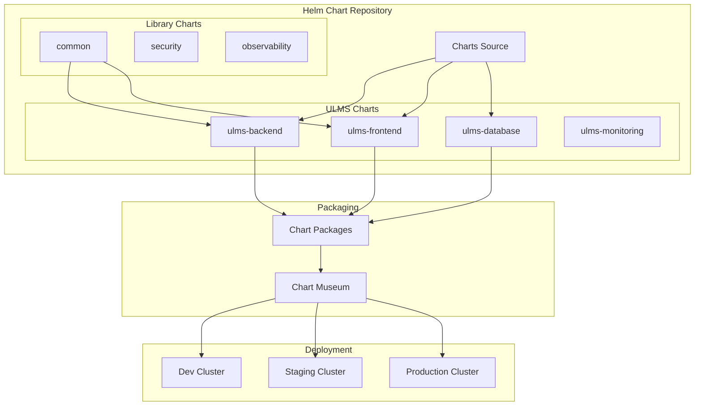

# Helm Chart Development Guide

**Document Control**

| Field | Value |
|-------|-------|
| **Document Title** | Helm Chart Development Guide |
| **Project Name** | Unisoft Loan Management System (ULMS) |
| **Document Version** | 1.0 |
| **Date** | 2026-02-05 |
| **Prepared By** | DevOps Engineering Team |
| **Reviewed By** | Technical Lead |
| **Classification** | Internal |
| **Status** | Approved |

**Revision History**

| Version | Date | Author | Description |
|---------|------|--------|-------------|
| 1.0 | 2026-02-05 | DevOps Team | Initial Helm development guide |

---

## Table of Contents

1. [Executive Summary](#1-executive-summary)
2. [Helm Architecture](#2-helm-architecture)
3. [Chart Structure](#3-chart-structure)
4. [Template Development](#4-template-development)
5. [Values Management](#5-values-management)
6. [Chart Dependencies](#6-chart-dependencies)
7. [Testing](#7-testing)
8. [Publishing](#8-publishing)
9. [Best Practices](#9-best-practices)
10. [Related Documents](#10-related-documents)

---

## 1. Executive Summary

This guide provides comprehensive instructions for developing, testing, and publishing Helm charts for ULMS v2.0 deployment on Kubernetes clusters in Bangladesh banking environments.

---

## 2. Helm Architecture

### 2.1 Chart Repository Architecture



---

## 3. Chart Structure

### 3.1 Standard Chart Layout

```
ulms-backend/
├── Chart.yaml              # Chart metadata
├── values.yaml             # Default configuration
├── values-dev.yaml         # Development overrides
├── values-prod.yaml        # Production overrides
├── .helmignore             # Files to exclude
├── charts/                 # Dependencies
├── crds/                   # Custom Resource Definitions
├── templates/              # Kubernetes manifests
│   ├── _helpers.tpl        # Named templates
│   ├── NOTES.txt           # Post-install notes
│   ├── deployment.yaml
│   ├── service.yaml
│   ├── ingress.yaml
│   ├── hpa.yaml
│   ├── pdb.yaml
│   ├── serviceaccount.yaml
│   ├── configmap.yaml
│   ├── secret.yaml
│   └── networkpolicy.yaml
└── tests/                  # Test templates
    └── test-connection.yaml
```

### 3.2 Chart.yaml

```yaml
apiVersion: v2
name: ulms-backend
description: ULMS Backend API Helm Chart
type: application
version: 2.0.0
appVersion: "2.0.0"
kubeVersion: ">=1.28.0"
home: https://unisoft-systems.com/ulms
sources:
  - https://gitlab.unisoft-systems.com/ulms/backend
maintainers:
  - name: DevOps Team
    email: devops@unisoft-systems.com
dependencies:
  - name: postgresql
    version: 13.2.0
    repository: https://charts.bitnami.com/bitnami
    condition: postgresql.enabled
  - name: redis
    version: 18.5.0
    repository: https://charts.bitnami.com/bitnami
    condition: redis.enabled
  - name: common
    version: 2.x.x
    repository: https://charts.bitnami.com/bitnami
    tags:
      - bitnami-common
annotations:
  category: FinancialServices
  licenses: Apache-2.0
```

---

## 4. Template Development

### 4.1 Helper Templates

```yaml
{{/* templates/_helpers.tpl */}}
{{/* vim: set filetype=mustache: */}}

{{/* Expand the name of the chart */}}
{{- define "ulms-backend.name" -}}
{{- default .Chart.Name .Values.nameOverride | trunc 63 | trimSuffix "-" }}
{{- end }}

{{/* Create a default fully qualified app name */}}
{{- define "ulms-backend.fullname" -}}
{{- if .Values.fullnameOverride }}
{{- .Values.fullnameOverride | trunc 63 | trimSuffix "-" }}
{{- else }}
{{- $name := default .Chart.Name .Values.nameOverride }}
{{- if contains $name .Release.Name }}
{{- .Release.Name | trunc 63 | trimSuffix "-" }}
{{- else }}
{{- printf "%s-%s" .Release.Name $name | trunc 63 | trimSuffix "-" }}
{{- end }}
{{- end }}
{{- end }}

{{/* Create chart name and version */}}
{{- define "ulms-backend.chart" -}}
{{- printf "%s-%s" .Chart.Name .Chart.Version | replace "+" "_" | trunc 63 | trimSuffix "-" }}
{{- end }}

{{/* Common labels */}}
{{- define "ulms-backend.labels" -}}
helm.sh/chart: {{ include "ulms-backend.chart" . }}
{{ include "ulms-backend.selectorLabels" . }}
{{- if .Chart.AppVersion }}
app.kubernetes.io/version: {{ .Chart.AppVersion | quote }}
{{- end }}
app.kubernetes.io/managed-by: {{ .Release.Service }}
{{- end }}

{{/* Selector labels */}}
{{- define "ulms-backend.selectorLabels" -}}
app.kubernetes.io/name: {{ include "ulms-backend.name" . }}
app.kubernetes.io/instance: {{ .Release.Name }}
{{- end }}

{{/* Service account name */}}
{{- define "ulms-backend.serviceAccountName" -}}
{{- if .Values.serviceAccount.create }}
{{- default (include "ulms-backend.fullname" .) .Values.serviceAccount.name }}
{{- else }}
{{- default "default" .Values.serviceAccount.name }}
{{- end }}
{{- end }}
```

### 4.2 Main Deployment Template

```yaml
{{/* templates/deployment.yaml */}}
apiVersion: apps/v1
kind: Deployment
metadata:
  name: {{ include "ulms-backend.fullname" . }}
  labels:
    {{- include "ulms-backend.labels" . | nindent 4 }}
spec:
  {{- if not .Values.autoscaling.enabled }}
  replicas: {{ .Values.replicaCount }}
  {{- end }}
  revisionHistoryLimit: {{ .Values.revisionHistoryLimit }}
  strategy:
    type: {{ .Values.deploymentStrategy.type }}
    {{- if eq .Values.deploymentStrategy.type "RollingUpdate" }}
    rollingUpdate:
      maxSurge: {{ .Values.deploymentStrategy.rollingUpdate.maxSurge }}
      maxUnavailable: {{ .Values.deploymentStrategy.rollingUpdate.maxUnavailable }}
    {{- end }}
  selector:
    matchLabels:
      {{- include "ulms-backend.selectorLabels" . | nindent 6 }}
  template:
    metadata:
      annotations:
        checksum/config: {{ include (print $.Template.BasePath "/configmap.yaml") . | sha256sum }}
        checksum/secrets: {{ include (print $.Template.BasePath "/secret.yaml") . | sha256sum }}
        prometheus.io/scrape: "{{ .Values.metrics.enabled }}"
        prometheus.io/port: "{{ .Values.metrics.port }}"
        prometheus.io/path: "{{ .Values.metrics.path }}"
        {{- with .Values.podAnnotations }}
        {{- toYaml . | nindent 8 }}
        {{- end }}
      labels:
        {{- include "ulms-backend.selectorLabels" . | nindent 8 }}
    spec:
      {{- with .Values.imagePullSecrets }}
      imagePullSecrets:
        {{- toYaml . | nindent 8 }}
      {{- end }}
      serviceAccountName: {{ include "ulms-backend.serviceAccountName" . }}
      securityContext:
        {{- toYaml .Values.podSecurityContext | nindent 8 }}
      containers:
        - name: {{ .Chart.Name }}
          securityContext:
            {{- toYaml .Values.securityContext | nindent 12 }}
          image: "{{ .Values.image.repository }}:{{ .Values.image.tag | default .Chart.AppVersion }}"
          imagePullPolicy: {{ .Values.image.pullPolicy }}
          ports:
            - name: http
              containerPort: {{ .Values.service.port }}
              protocol: TCP
            - name: management
              containerPort: {{ .Values.service.managementPort }}
              protocol: TCP
          env:
            - name: SPRING_PROFILES_ACTIVE
              value: {{ .Values.spring.profiles | quote }}
            {{- range .Values.extraEnv }}
            - name: {{ .name }}
              value: {{ .value | quote }}
            {{- end }}
          envFrom:
            - configMapRef:
                name: {{ include "ulms-backend.fullname" . }}-config
            - secretRef:
                name: {{ include "ulms-backend.fullname" . }}-secrets
                optional: true
          livenessProbe:
            {{- toYaml .Values.livenessProbe | nindent 12 }}
          readinessProbe:
            {{- toYaml .Values.readinessProbe | nindent 12 }}
          resources:
            {{- toYaml .Values.resources | nindent 12 }}
          volumeMounts:
            - name: tmp
              mountPath: /tmp
            {{- with .Values.extraVolumeMounts }}
            {{- toYaml . | nindent 12 }}
            {{- end }}
      volumes:
        - name: tmp
          emptyDir:
            sizeLimit: {{ .Values.tmpSizeLimit }}
        {{- with .Values.extraVolumes }}
        {{- toYaml . | nindent 8 }}
        {{- end }}
      {{- with .Values.nodeSelector }}
      nodeSelector:
        {{- toYaml . | nindent 8 }}
      {{- end }}
      {{- with .Values.affinity }}
      affinity:
        {{- toYaml . | nindent 8 }}
      {{- end }}
      {{- with .Values.tolerations }}
      tolerations:
        {{- toYaml . | nindent 8 }}
      {{- end }}
```

---

## 5. Values Management

### 5.1 Default Values (values.yaml)

```yaml
# Default values for ulms-backend
# This is a YAML-formatted file.

replicaCount: 3
revisionHistoryLimit: 10

deploymentStrategy:
  type: RollingUpdate
  rollingUpdate:
    maxSurge: 25%
    maxUnavailable: 25%

image:
  repository: registry.unisoft-systems.com/ulms/backend
  pullPolicy: IfNotPresent
  tag: ""

imagePullSecrets:
  - name: regcred

nameOverride: ""
fullnameOverride: ""

spring:
  profiles: "kubernetes,production"

serviceAccount:
  create: true
  annotations: {}
  name: ""

podAnnotations: {}

podSecurityContext:
  runAsNonRoot: true
  runAsUser: 1000
  runAsGroup: 1000
  fsGroup: 1000

securityContext:
  allowPrivilegeEscalation: false
  readOnlyRootFilesystem: true
  capabilities:
    drop:
      - ALL

service:
  type: ClusterIP
  port: 8080
  managementPort: 8081

ingress:
  enabled: true
  className: nginx
  annotations:
    nginx.ingress.kubernetes.io/ssl-redirect: "true"
    nginx.ingress.kubernetes.io/proxy-body-size: "10m"
    cert-manager.io/cluster-issuer: "letsencrypt-prod"
  hosts:
    - host: api.unisoft-systems.com
      paths:
        - path: /
          pathType: Prefix
  tls:
    - secretName: ulms-api-tls
      hosts:
        - api.unisoft-systems.com

resources:
  limits:
    cpu: 2000m
    memory: 4Gi
  requests:
    cpu: 500m
    memory: 1Gi

livenessProbe:
  httpGet:
    path: /actuator/health/liveness
    port: management
  initialDelaySeconds: 60
  periodSeconds: 10
  timeoutSeconds: 5
  failureThreshold: 3

readinessProbe:
  httpGet:
    path: /actuator/health/readiness
    port: management
  initialDelaySeconds: 30
  periodSeconds: 5
  timeoutSeconds: 3
  failureThreshold: 3

autoscaling:
  enabled: true
  minReplicas: 3
  maxReplicas: 20
  targetCPUUtilizationPercentage: 70
  targetMemoryUtilizationPercentage: 80

pdb:
  enabled: true
  minAvailable: 2

metrics:
  enabled: true
  port: 8080
  path: /actuator/prometheus

nodeSelector:
  workload: applications

tolerations: []

affinity:
  podAntiAffinity:
    preferredDuringSchedulingIgnoredDuringExecution:
      - weight: 100
        podAffinityTerm:
          labelSelector:
            matchExpressions:
              - key: app.kubernetes.io/name
                operator: In
                values:
                  - ulms-backend
          topologyKey: kubernetes.io/hostname

tmpSizeLimit: 100Mi

extraEnv: []
extraVolumes: []
extraVolumeMounts: []

postgresql:
  enabled: false

redis:
  enabled: false
```

---

## 6. Chart Dependencies

### 6.1 Dependency Management

```bash
# Update dependencies
helm dependency update ./ulms-backend

# Build with dependencies
helm package ./ulms-backend --sign

# Verify dependencies
helm dependency list ./ulms-backend
```

---

## 7. Testing

### 7.1 Chart Testing

```yaml
# templates/tests/test-connection.yaml
apiVersion: v1
kind: Pod
metadata:
  name: "{{ include "ulms-backend.fullname" . }}-test-connection"
  labels:
    {{- include "ulms-backend.labels" . | nindent 4 }}
  annotations:
    "helm.sh/hook": test
spec:
  containers:
    - name: wget
      image: busybox
      command: ['wget']
      args: ['{{ include "ulms-backend.fullname" . }}:{{ .Values.service.port }}/actuator/health']
  restartPolicy: Never
```

### 7.2 Test Execution

```bash
# Run tests
helm test ulms-backend

# Lint chart
helm lint ./ulms-backend

# Template validation
helm template ulms-backend ./ulms-backend --values values-prod.yaml

# Dry run
helm install ulms-backend ./ulms-backend --dry-run --debug
```

---

## 8. Publishing

### 8.1 Chart Museum Setup

```bash
# Add repository
helm repo add ulms https://charts.unisoft-systems.com

# Package chart
helm package ./ulms-backend

# Push to ChartMuseum
helm cm-push ulms-backend-2.0.0.tgz ulms

# Update index
helm repo update
```

---

## 9. Best Practices

| Practice | Implementation |
|----------|----------------|
| Versioning | Semantic versioning for charts |
| Documentation | Comprehensive README.md |
| Testing | Include test templates |
| Security | Non-root containers, security contexts |
| Flexibility | Extensive values customization |
| Validation | Schema validation (values.schema.json) |

---

## 10. Related Documents

| Document | Location | Purpose |
|----------|----------|---------|
| Helm Chart Structure | `02_[HELM]_Helm_Chart_Structure_v1.0.md` | Detailed structure |
| Helm Values Configuration | `03_[HELM]_Helm_Values_Configuration_v1.0.md` | Values deep dive |
| Helm Release Management | `04_[HELM]_Helm_Release_Management_v1.0.md` | Deployment ops |

---

*© 2026 Unisoft Systems Limited. All Rights Reserved.*
