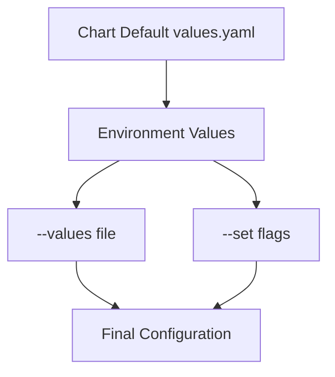

# Helm Values Configuration

**Document Control**

| Field | Value |
|-------|-------|
| **Document Title** | Helm Values Configuration |
| **Project Name** | Unisoft Loan Management System (ULMS) |
| **Document Version** | 1.0 |
| **Date** | 2026-02-05 |
| **Prepared By** | DevOps Engineering Team |
| **Reviewed By** | Technical Lead |
| **Classification** | Internal |
| **Status** | Approved |

**Revision History**

| Version | Date | Author | Description |
|---------|------|--------|-------------|
| 1.0 | 2026-02-05 | DevOps Team | Values configuration guide |

---

## Table of Contents

1. [Executive Summary](#1-executive-summary)
2. [Values Architecture](#2-values-architecture)
3. [Environment-Specific Values](#3-environment-specific-values)
4. [Configuration Patterns](#4-configuration-patterns)
5. [Secret Management](#5-secret-management)
6. [Value Overriding](#6-value-overriding)
7. [Validation](#7-validation)
8. [Best Practices](#8-best-practices)
9. [Examples](#9-examples)
10. [Related Documents](#10-related-documents)

---

## 1. Executive Summary

This document provides comprehensive guidance for configuring Helm values across different environments for ULMS v2.0 deployment in Bangladesh banking infrastructure.

---

## 2. Values Architecture

### 2.1 Value Hierarchy



### 2.2 File Organization

```
ulms-backend/
├── values.yaml              # Defaults (lowest priority)
├── values-dev.yaml          # Development overrides
├── values-staging.yaml      # Staging overrides
├── values-prod.yaml         # Production overrides
└── values-bank-*.yaml       # Bank-specific configs
```

---

## 3. Environment-Specific Values

### 3.1 Development (values-dev.yaml)

```yaml
# Development environment configuration
replicaCount: 1

deploymentStrategy:
  type: Recreate

image:
  pullPolicy: Always
  tag: "latest"

spring:
  profiles: "dev,kubernetes"

resources:
  limits:
    cpu: 500m
    memory: 1Gi
  requests:
    cpu: 100m
    memory: 256Mi

autoscaling:
  enabled: false

pdb:
  enabled: false

ingress:
  enabled: true
  hosts:
    - host: ulms-dev.unisoft-systems.com
      paths:
        - path: /
          pathType: Prefix
  tls: []

postgresql:
  enabled: true
  auth:
    username: ulms
    password: devpassword
    database: ulms
  primary:
    persistence:
      enabled: false

redis:
  enabled: true
  auth:
    enabled: false
```

### 3.2 Production (values-prod.yaml)

```yaml
# Production environment configuration
replicaCount: 5

deploymentStrategy:
  type: RollingUpdate
  rollingUpdate:
    maxSurge: 25%
    maxUnavailable: 0

image:
  pullPolicy: IfNotPresent
  tag: ""

spring:
  profiles: "production,kubernetes"

resources:
  limits:
    cpu: 4000m
    memory: 8Gi
  requests:
    cpu: 2000m
    memory: 4Gi

autoscaling:
  enabled: true
  minReplicas: 5
  maxReplicas: 30
  targetCPUUtilizationPercentage: 70
  targetMemoryUtilizationPercentage: 80
  behavior:
    scaleUp:
      stabilizationWindowSeconds: 0
      policies:
        - type: Percent
          value: 100
          periodSeconds: 15
    scaleDown:
      stabilizationWindowSeconds: 300
      policies:
        - type: Percent
          value: 10
          periodSeconds: 60

pdb:
  enabled: true
  minAvailable: 3

podDisruptionBudget:
  enabled: true
  minAvailable: 60%

ingress:
  enabled: true
  className: nginx
  annotations:
    nginx.ingress.kubernetes.io/ssl-redirect: "true"
    nginx.ingress.kubernetes.io/proxy-body-size: "50m"
    nginx.ingress.kubernetes.io/rate-limit: "1000"
    cert-manager.io/cluster-issuer: "letsencrypt-prod"
  hosts:
    - host: api.unisoft-systems.com
      paths:
        - path: /api
          pathType: Prefix
        - path: /actuator
          pathType: Prefix
  tls:
    - secretName: ulms-api-tls
      hosts:
        - api.unisoft-systems.com

networkPolicy:
  enabled: true
  ingress:
    - from:
        - namespaceSelector:
            matchLabels:
              name: ingress-nginx
      ports:
        - protocol: TCP
          port: 8080
  egress:
    - to:
        - podSelector:
            matchLabels:
              app: postgres
      ports:
        - protocol: TCP
          port: 5432

postgresql:
  enabled: false

redis:
  enabled: false

monitoring:
  enabled: true
  serviceMonitor:
    enabled: true
    interval: 30s
    scrapeTimeout: 10s
```

---

## 4. Configuration Patterns

### 4.1 Feature Flags

```yaml
# Enable/disable features
features:
  cibIntegration:
    enabled: true
    endpoint: "https://cib.bb.org.bd"
  nidVerification:
    enabled: true
    endpoint: "https://nidw.gov.bd"
  reporting:
    enabled: true
    schedule: "0 2 * * *"
  auditLogging:
    enabled: true
    retention: "90d"
```

### 4.2 External Services

```yaml
externalServices:
  cib:
    host: "cib.bb.org.bd"
    port: 443
    timeout: 30s
    retryAttempts: 3
  nid:
    host: "nidw.gov.bd"
    port: 443
    timeout: 10s
  smsGateway:
    provider: "twilio"
    enabled: true
  emailService:
    provider: "sendgrid"
    enabled: true
```

---

## 5. Secret Management

### 5.1 External Secrets

```yaml
externalSecrets:
  enabled: true
  secretStore:
    name: vault-backend
    kind: ClusterSecretStore
  data:
    - key: ulms/production/database
      name: db-credentials
    - key: ulms/production/api-keys
      name: api-keys
    - key: ulms/production/jwt
      name: jwt-config
```

### 5.2 Sealed Secrets

```yaml
sealedSecrets:
  enabled: true
  encryptedData:
    DB_PASSWORD: AgByA0H8Oe8p...
    API_KEY: AgByA0H8Oe8p...
```

---

## 6. Value Overriding

### 6.1 Command Line Overrides

```bash
# Override single value
helm install ulms-backend ./ulms-backend \
  --set replicaCount=5 \
  --set image.tag=2.0.1

# Override nested values
helm upgrade ulms-backend ./ulms-backend \
  --set resources.limits.memory=8Gi \
  --set ingress.enabled=true

# Multiple values
helm install ulms-backend ./ulms-backend \
  --set-string spring.profiles="production,kubernetes" \
  --set-json extraEnv='[{"name":"LOG_LEVEL","value":"INFO"}]'
```

### 6.2 File Overrides

```bash
# Multiple value files
helm install ulms-backend ./ulms-backend \
  -f values.yaml \
  -f values-prod.yaml \
  -f values-bank-abc.yaml
```

---

## 7. Validation

### 7.1 Schema Validation

```bash
# Validate against schema
helm lint ./ulms-backend

# Template with values
helm template ulms-backend ./ulms-backend -f values-prod.yaml

# Dry run
helm install ulms-backend ./ulms-backend \
  -f values-prod.yaml \
  --dry-run \
  --debug
```

---

## 8. Best Practices

| Practice | Description |
|----------|-------------|
| Flat structure | Prefer flat over deeply nested |
| Meaningful names | Use clear, descriptive keys |
| Defaults | Provide sensible defaults |
| Documentation | Comment complex values |
| Validation | Use JSON Schema |
| Security | Never commit secrets |

---

## 9. Examples

### 9.1 Bank-Specific Configuration

```yaml
# values-bank-abc.yaml
# Configuration for ABC Bank

bank:
  name: "ABC Bank Limited"
  code: "ABC"
  branchId: "001"
  
compliance:
  ifrs9:
    enabled: true
    reportingCurrency: "BDT"
  brpd15:
    enabled: true
    classificationMethod: "days-past-due"
    
integrations:
  coreBanking:
    system: "Temenos T24"
    endpoint: "https://t24.abcbank.com"
  cib:
    enabled: true
    testMode: false
```

---

## 10. Related Documents

| Document | Location | Purpose |
|----------|----------|---------|
| Helm Chart Development Guide | `01_[HELM]_Helm_Chart_Development_Guide_v1.0.md` | Development |
| Helm Chart Structure | `02_[HELM]_Helm_Chart_Structure_v1.0.md` | Structure |
| Helm Release Management | `04_[HELM]_Helm_Release_Management_v1.0.md` | Operations |

---

*© 2026 Unisoft Systems Limited. All Rights Reserved.*
