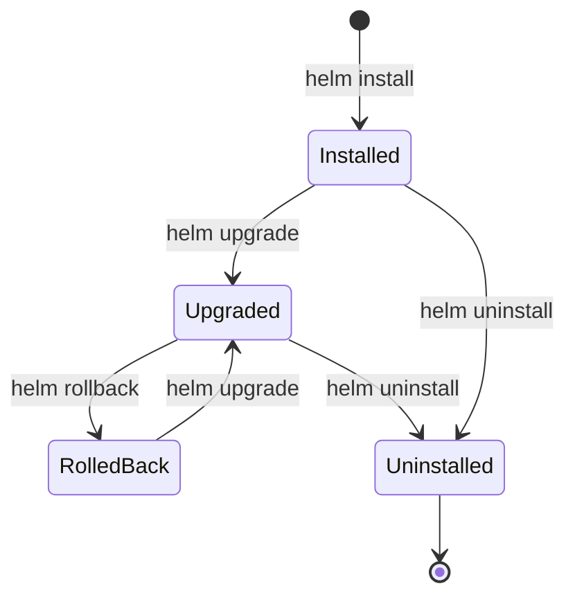

# Helm Release Management

**Document Control**

| Field | Value |
|-------|-------|
| **Document Title** | Helm Release Management |
| **Project Name** | Unisoft Loan Management System (ULMS) |
| **Document Version** | 1.0 |
| **Date** | 2026-02-05 |
| **Prepared By** | DevOps Engineering Team |
| **Reviewed By** | Technical Lead |
| **Classification** | Internal |
| **Status** | Approved |

**Revision History**

| Version | Date | Author | Description |
|---------|------|--------|-------------|
| 1.0 | 2026-02-05 | DevOps Team | Release management guide |

---

## Table of Contents

1. [Executive Summary](#1-executive-summary)
2. [Release Lifecycle](#2-release-lifecycle)
3. [Installation Procedures](#3-installation-procedures)
4. [Upgrade Procedures](#4-upgrade-procedures)
5. [Rollback Procedures](#5-rollback-procedures)
6. [Release Monitoring](#6-release-monitoring)
7. [GitOps Integration](#7-gitops-integration)
8. [Troubleshooting](#8-troubleshooting)
9. [Best Practices](#9-best-practices)
10. [Related Documents](#10-related-documents)

---

## 1. Executive Summary

This document defines procedures for managing Helm releases of ULMS v2.0 across different environments, ensuring safe and consistent deployments for Bangladesh banking operations.

---

## 2. Release Lifecycle

### 2.1 Release States



### 2.2 Release Naming Convention

| Environment | Release Name | Namespace |
|-------------|--------------|-----------|
| Development | ulms-dev | ulms-development |
| Staging | ulms-staging | ulms-staging |
| Production | ulms-prod | ulms-production |
| Bank-Specific | ulms-{bank-code} | ulms-{bank-code} |

---

## 3. Installation Procedures

### 3.1 Initial Installation

```bash
# Add Helm repository
helm repo add ulms https://charts.unisoft-systems.com
helm repo update

# Create namespace
kubectl create namespace ulms-production

# Label namespace for Istio
kubectl label namespace ulms-production istio-injection=enabled

# Install with production values
helm install ulms-prod ulms/ulms-backend \
  --namespace ulms-production \
  --version 2.0.0 \
  --values values-prod.yaml \
  --timeout 10m \
  --wait \
  --atomic
```

### 3.2 Installation Checklist

- [ ] Namespace created and labeled
- [ ] Secrets configured
- [ ] Values file validated
- [ ] Dry run successful
- [ ] Backup created (for upgrades)
- [ ] Maintenance window scheduled
- [ ] Rollback plan prepared

---

## 4. Upgrade Procedures

### 4.1 Rolling Upgrade

```bash
# Check current release
helm list -n ulms-production
helm history ulms-prod -n ulms-production

# Preview changes
helm diff upgrade ulms-prod ulms/ulms-backend \
  --version 2.0.1 \
  --values values-prod.yaml

# Perform upgrade
helm upgrade ulms-prod ulms/ulms-backend \
  --version 2.0.1 \
  --namespace ulms-production \
  --values values-prod.yaml \
  --timeout 10m \
  --wait \
  --atomic \
  --cleanup-on-fail

# Verify upgrade
helm status ulms-prod -n ulms-production
kubectl get pods -n ulms-production
```

### 4.2 Canary Upgrade with Flagger

```yaml
apiVersion: flagger.app/v1beta1
kind: Canary
metadata:
  name: ulms-backend
  namespace: ulms-production
spec:
  targetRef:
    apiVersion: apps/v1
    kind: Deployment
    name: ulms-backend
  service:
    port: 8080
  analysis:
    interval: 30s
    threshold: 5
    maxWeight: 50
    stepWeight: 10
    metrics:
      - name: request-success-rate
        thresholdRange:
          min: 99
        interval: 1m
      - name: request-duration
        thresholdRange:
          max: 500
        interval: 1m
    webhooks:
      - name: load-test
        url: http://flagger-loadtester.test/
        timeout: 5s
        metadata:
          cmd: "hey -z 1m -q 10 -c 2 http://ulms-backend-canary:8080/"
```

---

## 5. Rollback Procedures

### 5.1 Emergency Rollback

```bash
# Check revision history
helm history ulms-prod -n ulms-production

# Rollback to previous version
helm rollback ulms-prod 0 -n ulms-production

# Or rollback to specific revision
helm rollback ulms-prod 3 -n ulms-production

# Verify rollback
kubectl get pods -n ulms-production
helm status ulms-prod -n ulms-production
```

### 5.2 Rollback Decision Matrix

| Scenario | Action | Timeline |
|----------|--------|----------|
| Critical error | Immediate rollback | < 5 min |
| Performance degradation | Evaluate, then rollback | 15-30 min |
| Minor issue | Hotfix forward | Next release |
| Data inconsistency | Immediate rollback + restore | < 10 min |

---

## 6. Release Monitoring

### 6.1 Health Checks

```bash
# Check release status
helm status ulms-prod -n ulms-production

# List all releases
helm list -A

# Get release values
helm get values ulms-prod -n ulms-production

# Get release manifest
helm get manifest ulms-prod -n ulms-production
```

### 6.2 Monitoring Dashboard

| Metric | Threshold | Action |
|--------|-----------|--------|
| Pod restarts | > 3 in 10 min | Investigate |
| CPU usage | > 80% for 5 min | Scale up |
| Memory usage | > 90% | Scale up / Restart |
| Error rate | > 1% | Rollback |
| Response time | > 500ms p99 | Investigate |

---

## 7. GitOps Integration

### 7.1 ArgoCD Application

```yaml
apiVersion: argoproj.io/v1alpha1
kind: Application
metadata:
  name: ulms-production
  namespace: argocd
spec:
  project: ulms
  source:
    repoURL: https://gitlab.unisoft-systems.com/ulms/gitops.git
    targetRevision: main
    path: environments/production
    helm:
      valueFiles:
        - values.yaml
        - values-prod.yaml
  destination:
    server: https://kubernetes.default.svc
    namespace: ulms-production
  syncPolicy:
    automated:
      prune: true
      selfHeal: true
    syncOptions:
      - CreateNamespace=true
      - PrunePropagationPolicy=foreground
      - PruneLast=true
  retry:
    limit: 5
    backoff:
      duration: 5s
      factor: 2
      maxDuration: 3m
```

---

## 8. Troubleshooting

### 8.1 Common Issues

| Issue | Diagnosis | Solution |
|-------|-----------|----------|
| Failed release | `helm status` shows failed | Check pod logs, fix issue, retry |
| Pending pods | Insufficient resources | Scale nodes or reduce replicas |
| Image pull errors | Wrong tag or no access | Verify image and registry credentials |
| Hook failure | Pre/post install hook error | Check hook logs |

### 8.2 Diagnostic Commands

```bash
# Debug template rendering
helm template ulms-prod ./ulms-backend \
  --debug \
  --values values-prod.yaml

# Get detailed status
helm get notes ulms-prod -n ulms-production
helm get hooks ulms-prod -n ulms-production

# Check events
kubectl get events -n ulms-production --sort-by='.lastTimestamp'

# Pod logs
kubectl logs -l app=ulms-backend -n ulms-production --tail=100
```

---

## 9. Best Practices

| Practice | Implementation |
|----------|----------------|
| Version pinning | Always specify chart version |
| Atomic releases | Use `--atomic` flag |
| Health checks | Use `--wait` for readiness |
| Backup before upgrade | Export current values |
| Test in staging | Validate before production |
| Documentation | Update release notes |

---

## 10. Related Documents

| Document | Location | Purpose |
|----------|----------|---------|
| Helm Chart Development Guide | `01_[HELM]_Helm_Chart_Development_Guide_v1.0.md` | Development |
| ArgoCD Configuration | `../../04_CI_CD_Pipeline/06_[CICD]_ArgoCD_Configuration_GitOps_v1.0.md` | GitOps |
| Monitoring Setup | `../../05_Monitoring_Observability/02_[MON]_Prometheus_Monitoring_Setup_v1.0.md` | Observability |

---

*© 2026 Unisoft Systems Limited. All Rights Reserved.*
