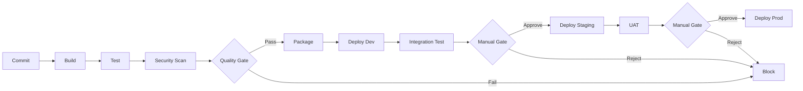

# GitLab CI Pipeline Configuration

**Document Control**

| Field | Value |
|-------|-------|
| **Document Title** | GitLab CI Pipeline Configuration |
| **Project Name** | Unisoft Loan Management System (ULMS) |
| **Document Version** | 1.0 |
| **Date** | 2026-02-05 |
| **Prepared By** | DevOps Engineering Team |
| **Reviewed By** | Technical Lead |
| **Classification** | Internal |
| **Status** | Approved |

**Revision History**

| Version | Date | Author | Description |
|---------|------|--------|-------------|
| 1.0 | 2026-02-05 | DevOps Team | Initial GitLab CI configuration |

---

## Table of Contents

1. [Executive Summary](#1-executive-summary)
2. [Pipeline Architecture](#2-pipeline-architecture)
3. [Pipeline Stages](#3-pipeline-stages)
4. [Job Configuration](#4-job-configuration)
5. [Environment Management](#5-environment-management)
6. [Security Scanning](#6-security-scanning)
7. [Artifacts and Caching](#7-artifacts-and-caching)
8. [Notifications](#8-notifications)
9. [Troubleshooting](#9-troubleshooting)
10. [Related Documents](#10-related-documents)

---

## 1. Executive Summary

This document defines the GitLab CI/CD pipeline configuration for ULMS v2.0, enabling automated build, test, security scanning, and deployment workflows for Bangladesh banking environments.

---

## 2. Pipeline Architecture

### 2.1 Pipeline Flow



---

## 3. Pipeline Stages

### 3.1 Stage Configuration

```yaml
# .gitlab-ci.yml
stages:
  - build
  - test
  - security-scan
  - package
  - deploy-dev
  - integration-test
  - deploy-staging
  - uat
  - deploy-production

variables:
  DOCKER_DRIVER: overlay2
  DOCKER_TLS_CERTDIR: ""
  DOCKER_BUILDKIT: 1
  GRADLE_OPTS: "-Dorg.gradle.daemon=false"
  MAVEN_OPTS: "-Dmaven.repo.local=$CI_PROJECT_DIR/.m2/repository"
```

---

## 4. Job Configuration

### 4.1 Build Jobs

```yaml
build-backend:
  stage: build
  image: eclipse-temurin:21-jdk
  cache:
    key: "${CI_COMMIT_REF_SLUG}-gradle"
    paths:
      - .gradle/
      - build/
  before_script:
    - chmod +x gradlew
  script:
    - ./gradlew bootJar --no-daemon -x test
    - ./gradlew jibDockerBuild --image=$CI_REGISTRY_IMAGE/backend:$CI_COMMIT_SHA
  artifacts:
    paths:
      - build/libs/*.jar
    expire_in: 1 week

build-frontend:
  stage: build
  image: node:20-alpine
  cache:
    key: "${CI_COMMIT_REF_SLUG}-npm"
    paths:
      - frontend/node_modules/
  script:
    - cd frontend
    - npm ci
    - npm run build
    - docker build -t $CI_REGISTRY_IMAGE/frontend:$CI_COMMIT_SHA .
  artifacts:
    paths:
      - frontend/dist/
    expire_in: 1 week
```

### 4.2 Test Jobs

```yaml
unit-tests:
  stage: test
  image: eclipse-temurin:21-jdk
  cache:
    key: "${CI_COMMIT_REF_SLUG}-gradle"
    paths:
      - .gradle/
  script:
    - ./gradlew test --no-daemon
    - ./gradlew jacocoTestReport
  coverage: '/Total.*?([0-9]{1,3})%/'
  artifacts:
    reports:
      junit: build/test-results/test/*.xml
      coverage_report:
        coverage_format: jacoco
        path: build/reports/jacoco/test/jacocoTestReport.xml
    paths:
      - build/reports/tests/
    expire_in: 1 week
  rules:
    - if: $CI_PIPELINE_SOURCE == "merge_request_event"
    - if: $CI_COMMIT_BRANCH == "main"

integration-tests:
  stage: test
  image: eclipse-temurin:21-jdk
  services:
    - postgres:16-alpine
    - redis:7-alpine
  variables:
    POSTGRES_DB: ulms_test
    POSTGRES_USER: test
    POSTGRES_PASSWORD: test
    REDIS_HOST: redis
  script:
    - ./gradlew integrationTest --no-daemon
  artifacts:
    reports:
      junit: build/test-results/integrationTest/*.xml
    expire_in: 1 week
```

---

## 5. Environment Management

### 5.1 Environment Definitions

```yaml
deploy-dev:
  stage: deploy-dev
  image: bitnami/kubectl:1.28
  environment:
    name: development
    url: https://ulms-dev.unisoft-systems.com
  script:
    - kubectl config use-context dev
    - helm upgrade --install ulms-dev ./charts/ulms-backend
        --namespace ulms-development
        --values values-dev.yaml
        --set image.tag=$CI_COMMIT_SHA
  rules:
    - if: $CI_COMMIT_BRANCH == "main"

deploy-staging:
  stage: deploy-staging
  image: bitnami/kubectl:1.28
  environment:
    name: staging
    url: https://ulms-staging.unisoft-systems.com
  script:
    - helm upgrade --install ulms-staging ./charts/ulms-backend
        --namespace ulms-staging
        --values values-staging.yaml
        --set image.tag=$CI_COMMIT_SHA
  when: manual
  only:
    - main

deploy-production:
  stage: deploy-production
  image: bitnami/kubectl:1.28
  environment:
    name: production
    url: https://ulms.unisoft-systems.com
  script:
    - helm upgrade --install ulms-prod ./charts/ulms-backend
        --namespace ulms-production
        --values values-prod.yaml
        --set image.tag=$CI_COMMIT_SHA
  when: manual
  only:
    - tags
```

---

## 6. Security Scanning

### 6.1 SAST Configuration

```yaml
sast:
  stage: security-scan
  image: returntocorp/semgrep:latest
  script:
    - semgrep --config=auto --error --json --output=semgrep-report.json .
  artifacts:
    reports:
      sast: semgrep-report.json
    paths:
      - semgrep-report.json
    expire_in: 1 week
  rules:
    - if: $CI_PIPELINE_SOURCE == "merge_request_event"
    - if: $CI_COMMIT_BRANCH == "main"
```

### 6.2 Container Scanning

```yaml
container-scanning:
  stage: security-scan
  image: aquasec/trivy:latest
  variables:
    TRIVY_SEVERITY: HIGH,CRITICAL
    TRIVY_EXIT_CODE: 1
  script:
    - trivy image --format template --template "@contrib/gitlab.tpl"
        -o gl-container-scanning-report.json $CI_REGISTRY_IMAGE/backend:$CI_COMMIT_SHA
  artifacts:
    reports:
      container_scanning: gl-container-scanning-report.json
    expire_in: 1 week
```

### 6.3 Dependency Scanning

```yaml
dependency-scanning:
  stage: security-scan
  image: returntocorp/semgrep:latest
  script:
    - semgrep --config=p/owasp-top-ten --error .
  artifacts:
    reports:
      dependency_scanning: dependency-scan-report.json
```

---

## 7. Artifacts and Caching

### 7.1 Cache Configuration

```yaml
.gradle-cache: &gradle-cache
  key: "${CI_COMMIT_REF_SLUG}-gradle"
  paths:
    - .gradle/
    - build/
  policy: pull-push

.npm-cache: &npm-cache
  key: "${CI_COMMIT_REF_SLUG}-npm"
  paths:
    - frontend/node_modules/
  policy: pull-push
```

### 7.2 Artifact Retention

```yaml
artifacts:
  expire_in: 30 days
  when: always
  paths:
    - build/libs/
    - build/reports/
```

---

## 8. Notifications

### 8.1 Slack Integration

```yaml
notify-success:
  stage: .post
  image: alpine:latest
  script:
    - |
      curl -X POST -H 'Content-type: application/json' \
        --data '{"text":"ULMS Deployment Successful: '$CI_COMMIT_REF_NAME'"}' \
        $SLACK_WEBHOOK_URL
  when: on_success

notify-failure:
  stage: .post
  image: alpine:latest
  script:
    - |
      curl -X POST -H 'Content-type: application/json' \
        --data '{"text":"ULMS Pipeline Failed: '$CI_COMMIT_REF_NAME'"}' \
        $SLACK_WEBHOOK_URL
  when: on_failure
```

---

## 9. Troubleshooting

### 9.1 Pipeline Debugging

```bash
# Enable debug mode
export CI_DEBUG_SERVICES=true

# Check pipeline syntax
gitlab-ci-lint .gitlab-ci.yml

# View pipeline graph
# In GitLab UI: CI/CD > Pipelines > Pipeline ID
```

---

## 10. Related Documents

| Document | Location | Purpose |
|----------|----------|---------|
| CI/CD Pipeline Configuration | `02_[CICD]_CI_CD_Pipeline_Configuration_v1.0.md` | Architecture |
| Build Stage Specification | `03_[CICD]_Build_Stage_Specification_v1.0.md` | Build details |
| ArgoCD Configuration | `06_[CICD]_ArgoCD_Configuration_GitOps_v1.0.md` | GitOps |

---

*© 2026 Unisoft Systems Limited. All Rights Reserved.*
