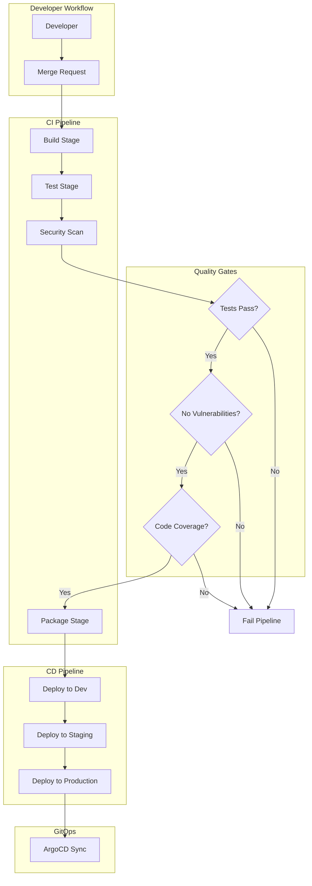
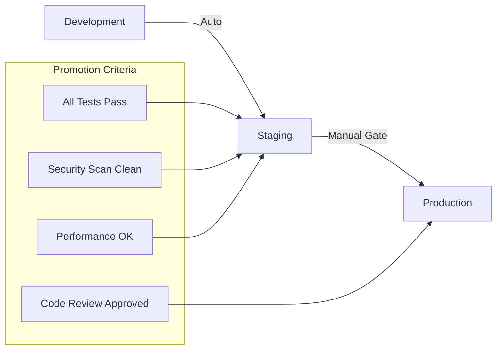

# CI/CD Pipeline Configuration

**Document Control**

| Field | Value |
|-------|-------|
| **Document Title** | CI/CD Pipeline Configuration |
| **Project Name** | Unisoft Loan Management System (ULMS) |
| **Document Version** | 1.0 |
| **Date** | 2026-02-05 |
| **Prepared By** | DevOps Engineering Team |
| **Reviewed By** | Technical Lead |
| **Classification** | Internal |
| **Status** | Approved |

**Revision History**

| Version | Date | Author | Description |
|---------|------|--------|-------------|
| 1.0 | 2026-02-05 | DevOps Team | CI/CD pipeline architecture |

---

## Table of Contents

1. [Executive Summary](#1-executive-summary)
2. [Pipeline Overview](#2-pipeline-overview)
3. [Workflow Architecture](#3-workflow-architecture)
4. [Stage Definitions](#4-stage-definitions)
5. [Quality Gates](#5-quality-gates)
6. [Deployment Patterns](#6-deployment-patterns)
7. [Environment Promotion](#7-environment-promotion)
8. [Rollback Strategy](#8-rollback-strategy)
9. [Monitoring](#9-monitoring)
10. [Related Documents](#10-related-documents)

---

## 1. Executive Summary

This document defines the comprehensive CI/CD pipeline architecture for ULMS v2.0, integrating GitLab CI, security scanning, and GitOps deployment for Bangladesh banking compliance.

---

## 2. Pipeline Overview

### 2.1 Pipeline Goals

| Goal | Metric | Target |
|------|--------|--------|
| Build Time | Time to artifact | < 10 minutes |
| Deployment Frequency | Deployments per day | > 5 |
| Lead Time | Commit to production | < 1 hour |
| Failure Rate | Failed deployments | < 2% |
| Recovery Time | Mean time to recovery | < 15 minutes |

### 2.2 Toolchain

| Category | Tool | Purpose |
|----------|------|---------|
| Source Control | GitLab | Code repository |
| CI/CD | GitLab CI | Build and test |
| Security | SonarQube, Trivy | Code quality |
| Artifact Registry | Harbor | Image storage |
| GitOps | ArgoCD | Deployment |
| Secrets | HashiCorp Vault | Secret management |

---

## 3. Workflow Architecture

### 3.1 Complete Pipeline Flow



---

## 4. Stage Definitions

### 4.1 Stage Details

| Stage | Purpose | Duration | Parallel |
|-------|---------|----------|----------|
| Build | Compile code, create images | 5-10 min | Yes |
| Test | Unit, integration tests | 10-15 min | Yes |
| Security | SAST, DAST, container scan | 5-10 min | Yes |
| Package | Create Helm charts | 2-3 min | No |
| Deploy Dev | Auto-deploy to dev | 3-5 min | No |
| Integration | Integration tests | 10-15 min | No |
| Deploy Staging | Manual deploy | 3-5 min | No |
| UAT | User acceptance tests | Variable | No |
| Deploy Production | Manual deploy | 3-5 min | No |

---

## 5. Quality Gates

### 5.1 Gate Criteria

| Gate | Criteria | Threshold |
|------|----------|-----------|
| Unit Tests | Pass rate | 100% |
| Code Coverage | Line coverage | > 80% |
| Security | Critical vulnerabilities | 0 |
| Security | High vulnerabilities | 0 |
| Performance | API response time | < 200ms |

### 5.2 Gate Implementation

```yaml
quality-gate:
  stage: quality-gate
  script:
    - |
      if [ "$TEST_PASS_RATE" -lt 100 ]; then
        echo "Tests failed"
        exit 1
      fi
    - |
      if [ "$COVERAGE" -lt 80 ]; then
        echo "Coverage below threshold"
        exit 1
      fi
    - |
      if [ "$CRITICAL_VULNS" -gt 0 ]; then
        echo "Critical vulnerabilities found"
        exit 1
      fi
  rules:
    - if: $CI_COMMIT_BRANCH == "main"
```

---

## 6. Deployment Patterns

### 6.1 Deployment Strategies

| Strategy | Use Case | Risk Level |
|----------|----------|------------|
| Rolling Update | Standard deployment | Low |
| Blue-Green | Zero-downtime required | Medium |
| Canary | Gradual rollout | Medium |
| Recreate | Development only | High |

### 6.2 Pattern Selection Matrix

| Environment | Default Strategy | Exception |
|-------------|-----------------|-----------|
| Development | Recreate | N/A |
| Staging | Rolling Update | Blue-Green |
| Production | Blue-Green | Canary for major releases |

---

## 7. Environment Promotion

### 7.1 Promotion Flow



### 7.2 Promotion Rules

| From | To | Trigger | Approver |
|------|-----|---------|----------|
| main | Dev | Auto | N/A |
| Dev | Staging | Manual | Tech Lead |
| Staging | Production | Manual | CTO/PM |

---

## 8. Rollback Strategy

### 8.1 Rollback Triggers

| Condition | Response Time | Action |
|-----------|---------------|--------|
| Error rate > 5% | Immediate | Auto-rollback |
| Latency > 1s p99 | 5 minutes | Manual rollback |
| Critical bug | Immediate | Emergency rollback |

### 8.2 Rollback Procedure

```bash
# Helm rollback
helm rollback ulms-prod 0 -n ulms-production

# Or ArgoCD sync to previous version
argocd app sync ulms-production --revision PREVIOUS_COMMIT
```

---

## 9. Monitoring

### 9.1 Pipeline Metrics

| Metric | Collection | Dashboard |
|--------|-----------|-----------|
| Build duration | GitLab API | Grafana |
| Test coverage | SonarQube | SonarQube UI |
| Security findings | Trivy | DefectDojo |
| Deployment frequency | GitLab API | Grafana |

### 9.2 Alerts

| Condition | Severity | Notification |
|-----------|----------|--------------|
| Pipeline failed | High | Slack + Email |
| Security critical | Critical | PagerDuty |
| Build time > 30 min | Medium | Slack |

---

## 10. Related Documents

| Document | Location | Purpose |
|----------|----------|---------|
| GitLab CI Pipeline | `01_[CICD]_GitLab_CI_Pipeline_Configuration_v1.0.md` | GitLab CI |
| Build Stage | `03_[CICD]_Build_Stage_Specification_v1.0.md` | Build |
| Test Stage | `04_[CICD]_Test_Stage_Specification_v1.0.md` | Testing |
| Quality Gates | `05_[CICD]_Quality_Gate_Configuration_SonarQube_v1.0.md` | SonarQube |
| ArgoCD | `06_[CICD]_ArgoCD_Configuration_GitOps_v1.0.md` | GitOps |

---

*© 2026 Unisoft Systems Limited. All Rights Reserved.*
