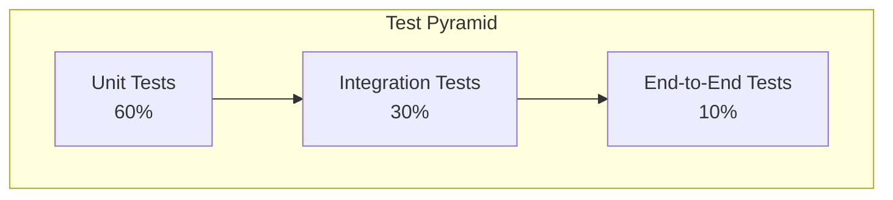

# Test Stage Specification

**Document Control**

| Field | Value |
|-------|-------|
| **Document Title** | Test Stage Specification |
| **Project Name** | Unisoft Loan Management System (ULMS) |
| **Document Version** | 1.0 |
| **Date** | 2026-02-05 |
| **Prepared By** | QA & DevOps Team |
| **Reviewed By** | QA Lead, Technical Lead |
| **Classification** | Internal |
| **Status** | Approved |

**Revision History**

| Version | Date | Author | Description |
|---------|------|--------|-------------|
| 1.0 | 2026-02-05 | QA Team | Test stage specification |

---

## Table of Contents

1. [Executive Summary](#1-executive-summary)
2. [Test Strategy](#2-test-strategy)
3. [Test Types](#3-test-types)
4. [Unit Testing](#4-unit-testing)
5. [Integration Testing](#5-integration-testing)
6. [E2E Testing](#6-e2e-testing)
7. [Performance Testing](#7-performance-testing)
8. [Security Testing](#8-security-testing)
9. [Test Automation](#9-test-automation)
10. [Related Documents](#10-related-documents)

---

## 1. Executive Summary

This document defines the comprehensive test stage specifications for ULMS v2.0, covering unit, integration, E2E, performance, and security testing requirements for Bangladesh banking deployment.

---

## 2. Test Strategy

### 2.1 Test Pyramid



### 2.2 Test Coverage Requirements

| Component | Minimum Coverage | Target Coverage |
|-----------|-----------------|-----------------|
| Backend | 70% | 85% |
| Frontend | 60% | 75% |
| Critical Paths | 90% | 95% |

---

## 3. Test Types

### 3.1 Test Type Matrix

| Test Type | Scope | Tools | When |
|-----------|-------|-------|------|
| Unit | Individual functions | JUnit, Jest | Every commit |
| Integration | Component interaction | TestContainers, Supertest | Every MR |
| E2E | Full user flows | Playwright, Cypress | Staging |
| Performance | Load/stress | k6, JMeter | Nightly |
| Security | Vulnerabilities | OWASP ZAP, Trivy | Every MR |
| Contract | API contracts | Pact | Every MR |

---

## 4. Unit Testing

### 4.1 Backend Unit Tests

```java
// Example: LoanServiceTest.java
@ExtendWith(MockitoExtension.class)
class LoanServiceTest {

    @Mock
    private LoanRepository loanRepository;
    
    @Mock
    private CibService cibService;
    
    @InjectMocks
    private LoanService loanService;

    @Test
    @DisplayName("Should approve loan when credit score is above threshold")
    void shouldApproveLoanWhenCreditScoreAboveThreshold() {
        // Given
        LoanApplication application = createLoanApplication();
        when(cibService.getCreditScore(any())).thenReturn(750);
        
        // When
        LoanDecision decision = loanService.evaluate(application);
        
        // Then
        assertThat(decision.getStatus()).isEqualTo(LoanStatus.APPROVED);
        verify(loanRepository).save(any(Loan.class));
    }

    @Test
    @DisplayName("Should reject loan when credit score is below threshold")
    void shouldRejectLoanWhenCreditScoreBelowThreshold() {
        // Given
        LoanApplication application = createLoanApplication();
        when(cibService.getCreditScore(any())).thenReturn(550);
        
        // When
        LoanDecision decision = loanService.evaluate(application);
        
        // Then
        assertThat(decision.getStatus()).isEqualTo(LoanStatus.REJECTED);
    }
}
```

### 4.2 Frontend Unit Tests

```typescript
// Example: LoanForm.test.tsx
import { render, screen, fireEvent } from '@testing-library/react'
import { LoanForm } from './LoanForm'

describe('LoanForm', () => {
  it('should render all required fields', () => {
    render(<LoanForm onSubmit={jest.fn()} />)
    
    expect(screen.getByLabelText(/loan amount/i)).toBeInTheDocument()
    expect(screen.getByLabelText(/tenure/i)).toBeInTheDocument()
    expect(screen.getByLabelText(/purpose/i)).toBeInTheDocument()
  })

  it('should validate required fields', async () => {
    const onSubmit = jest.fn()
    render(<LoanForm onSubmit={onSubmit} />)
    
    fireEvent.click(screen.getByRole('button', { name: /submit/i }))
    
    expect(await screen.findByText(/amount is required/i)).toBeInTheDocument()
    expect(onSubmit).not.toHaveBeenCalled()
  })

  it('should submit form with valid data', () => {
    const onSubmit = jest.fn()
    render(<LoanForm onSubmit={onSubmit} />)
    
    fireEvent.change(screen.getByLabelText(/loan amount/i), {
      target: { value: '500000' }
    })
    fireEvent.change(screen.getByLabelText(/tenure/i), {
      target: { value: '60' }
    })
    fireEvent.click(screen.getByRole('button', { name: /submit/i }))
    
    expect(onSubmit).toHaveBeenCalledWith({
      amount: 500000,
      tenure: 60
    })
  })
})
```

---

## 5. Integration Testing

### 5.1 TestContainers Setup

```java
@SpringBootTest
@Testcontainers
class LoanIntegrationTest {

    @Container
    static PostgreSQLContainer<?> postgres = new PostgreSQLContainer<>("postgres:16-alpine")
        .withDatabaseName("ulms_test")
        .withUsername("test")
        .withPassword("test");

    @Container
    static GenericContainer<?> redis = new GenericContainer<>("redis:7-alpine")
        .withExposedPorts(6379);

    @DynamicPropertySource
    static void configureProperties(DynamicPropertyRegistry registry) {
        registry.add("spring.datasource.url", postgres::getJdbcUrl);
        registry.add("spring.datasource.username", postgres::getUsername);
        registry.add("spring.datasource.password", postgres::getPassword);
        registry.add("spring.redis.host", redis::getHost);
        registry.add("spring.redis.port", redis::getFirstMappedPort);
    }

    @Autowired
    private MockMvc mockMvc;

    @Autowired
    private LoanRepository loanRepository;

    @Test
    @DisplayName("Should create loan application and persist to database")
    void shouldCreateLoanAndPersist() throws Exception {
        // Given
        LoanApplicationRequest request = new LoanApplicationRequest()
            .setAmount(new BigDecimal("500000"))
            .setTenure(60)
            .setPurpose("HOME_PURCHASE");

        // When & Then
        mockMvc.perform(post("/api/v1/loans")
                .contentType(MediaType.APPLICATION_JSON)
                .content(objectMapper.writeValueAsString(request)))
            .andExpect(status().isCreated())
            .andExpect(jsonPath("$.id").exists())
            .andExpect(jsonPath("$.status").value("PENDING"));

        // Verify database
        List<Loan> loans = loanRepository.findAll();
        assertThat(loans).hasSize(1);
        assertThat(loans.get(0).getAmount()).isEqualTo(new BigDecimal("500000"));
    }
}
```

---

## 6. E2E Testing

### 6.1 Playwright Configuration

```typescript
// playwright.config.ts
import { defineConfig, devices } from '@playwright/test'

export default defineConfig({
  testDir: './e2e',
  fullyParallel: true,
  forbidOnly: !!process.env.CI,
  retries: process.env.CI ? 2 : 0,
  workers: process.env.CI ? 1 : undefined,
  reporter: [
    ['html'],
    ['junit', { outputFile: 'test-results/e2e-junit.xml' }]
  ],
  use: {
    baseURL: process.env.BASE_URL || 'http://localhost:3000',
    trace: 'on-first-retry',
    screenshot: 'only-on-failure',
  },
  projects: [
    {
      name: 'chromium',
      use: { ...devices['Desktop Chrome'] },
    },
    {
      name: 'firefox',
      use: { ...devices['Desktop Firefox'] },
    },
  ],
})
```

### 6.2 E2E Test Example

```typescript
// e2e/loan-application.spec.ts
import { test, expect } from '@playwright/test'

test.describe('Loan Application Flow', () => {
  test.beforeEach(async ({ page }) => {
    await page.goto('/login')
    await page.fill('[name=username]', 'loan-officer@abcbank.com')
    await page.fill('[name=password]', 'password')
    await page.click('button[type=submit]')
    await page.waitForURL('/dashboard')
  })

  test('should complete loan application workflow', async ({ page }) => {
    // Navigate to new loan
    await page.click('text=New Loan Application')
    await page.waitForURL('/loans/new')

    // Fill applicant information
    await page.fill('[name=nid]', '1234567890123')
    await page.fill('[name=name]', 'Md. Rahman')
    await page.fill('[name=mobile]', '01712345678')

    // Fill loan details
    await page.fill('[name=amount]', '500000')
    await page.selectOption('[name=tenure]', '60')
    await page.selectOption('[name=purpose]', 'HOME_PURCHASE')

    // Submit application
    await page.click('button[type=submit]')
    
    // Verify success
    await expect(page.locator('.success-message')).toContainText('Application submitted')
    
    // Verify application appears in list
    await page.goto('/loans')
    await expect(page.locator('table')).toContainText('Md. Rahman')
  })
})
```

---

## 7. Performance Testing

### 7.1 k6 Load Test

```javascript
// performance/loan-api-load.js
import http from 'k6/http'
import { check, sleep } from 'k6'

export const options = {
  stages: [
    { duration: '2m', target: 100 },  // Ramp up
    { duration: '5m', target: 100 },  // Steady state
    { duration: '2m', target: 200 },  // Spike
    { duration: '5m', target: 200 },  // High load
    { duration: '2m', target: 0 },    // Ramp down
  ],
  thresholds: {
    http_req_duration: ['p(95)<500'],  // 95% under 500ms
    http_req_failed: ['rate<0.01'],    // Error rate < 1%
  },
}

export default function () {
  const payload = JSON.stringify({
    amount: 500000,
    tenure: 60,
    purpose: 'HOME_PURCHASE',
    applicantNid: '1234567890123',
  })

  const res = http.post('http://api.ulms.local/api/v1/loans', payload, {
    headers: { 'Content-Type': 'application/json' },
  })

  check(res, {
    'status is 201': (r) => r.status === 201,
    'response time < 500ms': (r) => r.timings.duration < 500,
  })

  sleep(1)
}
```

---

## 8. Security Testing

### 8.1 OWASP ZAP Baseline Scan

```yaml
security-scan:
  stage: security-test
  image: owasp/zap2docker-stable
  script:
    - mkdir /zap/wrk/
    - zap-baseline.py -t $TARGET_URL -r report.html -J report.json
  artifacts:
    reports:
      junit: report.json
    paths:
      - report.html
```

---

## 9. Test Automation

### 9.1 CI Integration

```yaml
test:
  stage: test
  parallel:
    matrix:
      - TEST_TYPE: [unit, integration, e2e]
  script:
    - |
      case $TEST_TYPE in
        unit)
          ./gradlew test
          ;;
        integration)
          ./gradlew integrationTest
          ;;
        e2e)
          npm run test:e2e
          ;;
      esac
  artifacts:
    reports:
      junit: "**/build/test-results/**/*.xml"
    coverage: '/Total.*?([0-9]{1,3})%/'
```

---

## 10. Related Documents

| Document | Location | Purpose |
|----------|----------|---------|
| CI/CD Pipeline | `01_[CICD]_GitLab_CI_Pipeline_Configuration_v1.0.md` | CI/CD |
| Quality Gates | `05_[CICD]_Quality_Gate_Configuration_SonarQube_v1.0.md` | SonarQube |

---

*© 2026 Unisoft Systems Limited. All Rights Reserved.*
