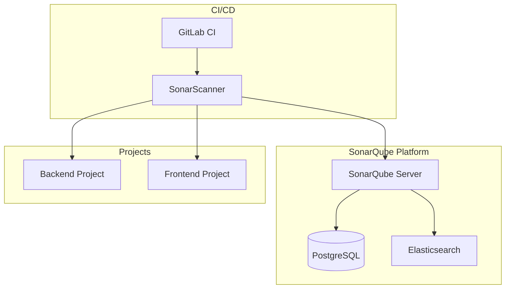

# Quality Gate Configuration - SonarQube

**Document Control**

| Field | Value |
|-------|-------|
| **Document Title** | Quality Gate Configuration - SonarQube |
| **Project Name** | Unisoft Loan Management System (ULMS) |
| **Document Version** | 1.0 |
| **Date** | 2026-02-05 |
| **Prepared By** | DevOps Engineering Team |
| **Reviewed By** | QA Lead, Technical Lead |
| **Classification** | Internal |
| **Status** | Approved |

**Revision History**

| Version | Date | Author | Description |
|---------|------|--------|-------------|
| 1.0 | 2026-02-05 | DevOps Team | SonarQube configuration |

---

## Table of Contents

1. [Executive Summary](#1-executive-summary)
2. [SonarQube Architecture](#2-sonarqube-architecture)
3. [Quality Gates](#3-quality-gates)
4. [Project Configuration](#4-project-configuration)
5. [CI Integration](#5-ci-integration)
6. [Code Coverage](#6-code-coverage)
7. [Security Analysis](#7-security-analysis)
8. [Reporting](#8-reporting)
9. [Troubleshooting](#9-troubleshooting)
10. [Related Documents](#10-related-documents)

---

## 1. Executive Summary

This document defines SonarQube configuration for ULMS v2.0 code quality management, including quality gates, CI integration, and security analysis for Bangladesh banking compliance.

---

## 2. SonarQube Architecture

### 2.1 Deployment Architecture



---

## 3. Quality Gates

### 3.1 ULMS Quality Gate Definition

| Metric | Threshold | Blocker |
|--------|-----------|---------|
| Coverage | >= 80% | Yes |
| Duplicated Lines | <= 3% | Yes |
| Maintainability Rating | >= A | Yes |
| Reliability Rating | >= A | Yes |
| Security Rating | >= A | Yes |
| Security Hotspots Reviewed | 100% | Yes |
| Critical Issues | 0 | Yes |
| Major Issues | <= 5 | No |
| Code Smells | <= 100 | No |

### 3.2 Quality Gate Configuration

```properties
# sonar-quality-gate.properties
# Backend Quality Gate
sonar.qualitygate.backend.coverage.min=80.0
sonar.qualitygate.backend.duplicated_lines.max=3.0
sonar.qualitygate.backend.critical_issues.max=0
sonar.qualitygate.backend.security_rating.min=A
sonar.qualitygate.backend.maintainability_rating.min=A

# Frontend Quality Gate
sonar.qualitygate.frontend.coverage.min=70.0
sonar.qualitygate.frontend.duplicated_lines.max=5.0
sonar.qualitygate.frontend.critical_issues.max=0
sonar.qualitygate.frontend.security_rating.min=A
```

---

## 4. Project Configuration

### 4.1 Backend Project Properties

```properties
# sonar-project-backend.properties
sonar.projectKey=ulms-backend
sonar.projectName=ULMS Backend
sonar.projectVersion=2.0.0

# Source configuration
sonar.sources=src/main/java
sonar.tests=src/test/java
sonar.java.binaries=build/classes/java/main
sonar.java.test.binaries=build/classes/java/test

# Language
sonar.language=java
sonar.java.source=21

# Coverage
sonar.coverage.jacoco.xmlReportPaths=build/reports/jacoco/test/jacocoTestReport.xml

# Exclusions
sonar.exclusions=**/model/**,**/dto/**,**/entity/**,**/config/**,**/exception/**
sonar.coverage.exclusions=**/model/**,**/dto/**,**/config/**

# Encoding
sonar.sourceEncoding=UTF-8
```

### 4.2 Frontend Project Properties

```properties
# sonar-project-frontend.properties
sonar.projectKey=ulms-frontend
sonar.projectName=ULMS Frontend
sonar.projectVersion=2.0.0

# Source configuration
sonar.sources=src
sonar.tests=src
sonar.test.inclusions=**/*.test.ts,**/*.test.tsx
sonar.typescript.lcov.reportPaths=coverage/lcov.info

# Language
sonar.language=ts

# Exclusions
sonar.exclusions=**/node_modules/**,**/dist/**,**/*.d.ts
sonar.coverage.exclusions=**/*.test.ts,**/*.test.tsx,**/mocks/**

# Encoding
sonar.sourceEncoding=UTF-8
```

---

## 5. CI Integration

### 5.1 GitLab CI Configuration

```yaml
sonarqube-check:
  stage: quality-check
  image: sonarsource/sonar-scanner-cli:latest
  variables:
    SONAR_USER_HOME: "${CI_PROJECT_DIR}/.sonar"
    GIT_DEPTH: "0"
  cache:
    key: "${CI_JOB_NAME}"
    paths:
      - .sonar/cache
  script:
    - sonar-scanner
      -Dsonar.projectKey=${SONAR_PROJECT_KEY}
      -Dsonar.host.url=${SONAR_HOST_URL}
      -Dsonar.login=${SONAR_TOKEN}
      -Dsonar.branch.name=${CI_COMMIT_REF_NAME}
  allow_failure: false
  only:
    - merge_requests
    - main
    - develop
```

### 5.2 Gradle Integration

```groovy
// build.gradle.kts
plugins {
    id("org.sonarqube") version "4.4.1.3373"
}

sonarqube {
    properties {
        property("sonar.projectKey", "ulms-backend")
        property("sonar.organization", "unisoft-systems")
        property("sonar.host.url", "https://sonar.unisoft-systems.com")
        property("sonar.coverage.jacoco.xmlReportPaths", 
            "build/reports/jacoco/test/jacocoTestReport.xml")
    }
}
```

---

## 6. Code Coverage

### 6.1 JaCoCo Configuration

```groovy
// build.gradle.kts
plugins {
    jacoco
}

jacoco {
    toolVersion = "0.8.11"
}

tasks.jacocoTestReport {
    dependsOn(tasks.test)
    reports {
        xml.required = true
        html.required = true
    }
}

tasks.jacocoTestCoverageVerification {
    violationRules {
        rule {
            limit {
                minimum = "0.80".toBigDecimal()
            }
        }
        rule {
            element = "PACKAGE"
            includes = listOf("com.unisoft.ulms.service.*")
            limit {
                minimum = "0.85".toBigDecimal()
            }
        }
    }
}
```

---

## 7. Security Analysis

### 7.1 Security Rules

| Rule Type | Priority | Action |
|-----------|----------|--------|
| SQL Injection | Blocker | Fix immediately |
| XSS | Blocker | Fix immediately |
| Hardcoded Credentials | Blocker | Fix immediately |
| CSRF | Critical | Fix in 24h |
| Weak Cryptography | Critical | Fix in 24h |

### 7.2 Security Hotspot Review

```bash
# Review security hotspots
# In SonarQube UI: Security Hotspots

# API to get hotspots
curl -u ${SONAR_TOKEN}: \
  "https://sonar.unisoft-systems.com/api/hotspots/search?projectKey=ulms-backend"
```

---

## 8. Reporting

### 8.1 Quality Report

```yaml
quality-report:
  stage: report
  script:
    - |
      curl -s -u ${SONAR_TOKEN}: \
        "${SONAR_HOST_URL}/api/qualitygates/project_status?projectKey=ulms-backend" \
        | jq '.projectStatus.status' > quality-gate-status.txt
    - |
      if [ "$(cat quality-gate-status.txt)" != "\"OK\"" ]; then
        echo "Quality gate failed!"
        exit 1
      fi
  artifacts:
    paths:
      - quality-gate-status.txt
```

---

## 9. Troubleshooting

| Issue | Solution |
|-------|----------|
| Scan fails | Check SONAR_TOKEN and project key |
| Coverage not showing | Verify report path in config |
| Timeout | Increase sonar.scanner.timeout |

---

## 10. Related Documents

| Document | Location | Purpose |
|----------|----------|---------|
| CI/CD Pipeline | `01_[CICD]_GitLab_CI_Pipeline_Configuration_v1.0.md` | CI/CD |
| Test Stage | `04_[CICD]_Test_Stage_Specification_v1.0.md` | Testing |

---

*© 2026 Unisoft Systems Limited. All Rights Reserved.*
