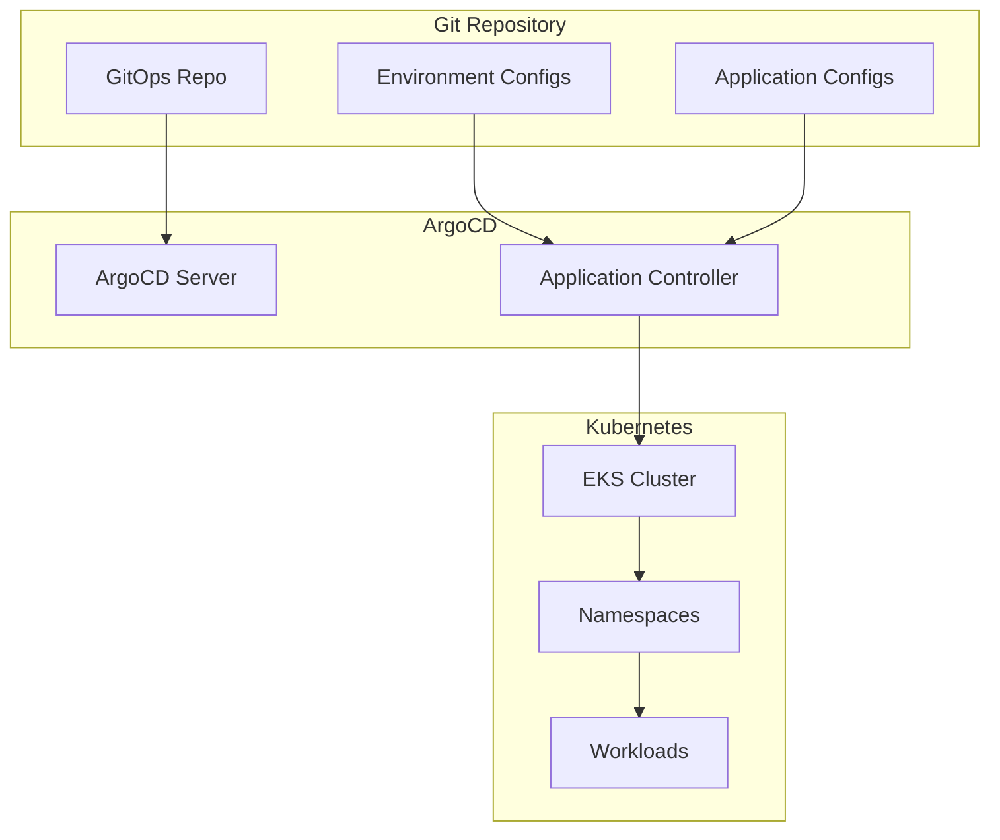

# ArgoCD Configuration - GitOps

**Document Control**

| Field | Value |
|-------|-------|
| **Document Title** | ArgoCD Configuration - GitOps |
| **Project Name** | Unisoft Loan Management System (ULMS) |
| **Document Version** | 1.0 |
| **Date** | 2026-02-05 |
| **Prepared By** | DevOps Engineering Team |
| **Reviewed By** | Technical Lead |
| **Classification** | Confidential |
| **Status** | Approved |

**Revision History**

| Version | Date | Author | Description |
|---------|------|--------|-------------|
| 1.0 | 2026-02-05 | DevOps Team | ArgoCD GitOps setup |

---

## Table of Contents

1. [Executive Summary](#1-executive-summary)
2. [GitOps Architecture](#2-gitops-architecture)
3. [ArgoCD Installation](#3-argocd-installation)
4. [Application Configuration](#4-application-configuration)
5. [Sync Policies](#5-sync-policies)
6. [Multi-Environment Setup](#6-multi-environment-setup)
7. [Notifications](#7-notifications)
8. [Disaster Recovery](#8-disaster-recovery)
9. [Troubleshooting](#9-troubleshooting)
10. [Related Documents](#10-related-documents)

---

## 1. Executive Summary

This document defines ArgoCD GitOps configuration for ULMS v2.0, enabling declarative, automated, and auditable deployments for Bangladesh banking infrastructure.

---

## 2. GitOps Architecture

### 2.1 GitOps Workflow



### 2.2 Repository Structure

```
gitops/
├── applications/
│   ├── base/
│   │   ├── kustomization.yaml
│   │   ├── deployment.yaml
│   │   ├── service.yaml
│   │   └── configmap.yaml
│   └── overlays/
│       ├── dev/
│       ├── staging/
│       └── production/
├── environments/
│   ├── dev/
│   ├── staging/
│   └── production/
├── infrastructure/
│   ├── ingress-nginx/
│   ├── cert-manager/
│   └── monitoring/
└── argocd/
    ├── projects/
    └── applications/
```

---

## 3. ArgoCD Installation

### 3.1 Helm Installation

```bash
# Add ArgoCD Helm repository
helm repo add argo https://argoproj.github.io/argo-helm
helm repo update

# Install ArgoCD
helm install argocd argo/argo-cd \
  --namespace argocd \
  --create-namespace \
  --values argocd-values.yaml

# Expose UI
kubectl port-forward svc/argocd-server -n argocd 8080:443

# Get initial password
argocd admin initial-password -n argocd
```

### 3.2 Configuration Values

```yaml
# argocd-values.yaml
server:
  extraArgs:
    - --insecure
  
  ingress:
    enabled: true
    ingressClassName: nginx
    hosts:
      - argocd.unisoft-systems.com
    tls:
      - secretName: argocd-tls
        hosts:
          - argocd.unisoft-systems.com
  
  config:
    url: https://argocd.unisoft-systems.com
    admin.enabled: "true"
    
configs:
  repositories: |
    - url: https://gitlab.unisoft-systems.com/ulms/gitops.git
      type: git
      name: ulms-gitops
      usernameSecret:
        name: git-credentials
        key: username
      passwordSecret:
        name: git-credentials
        key: password
```

---

## 4. Application Configuration

### 4.1 Application Definition

```yaml
apiVersion: argoproj.io/v1alpha1
kind: Application
metadata:
  name: ulms-production
  namespace: argocd
  finalizers:
    - resources-finalizer.argocd.argoproj.io
spec:
  project: ulms
  source:
    repoURL: https://gitlab.unisoft-systems.com/ulms/gitops.git
    targetRevision: main
    path: environments/production
    helm:
      valueFiles:
        - values.yaml
        - values-production.yaml
  destination:
    server: https://kubernetes.default.svc
    namespace: ulms-production
  syncPolicy:
    automated:
      prune: true
      selfHeal: true
      allowEmpty: false
    syncOptions:
      - CreateNamespace=true
      - PrunePropagationPolicy=foreground
      - PruneLast=true
    retry:
      limit: 5
      backoff:
        duration: 5s
        factor: 2
        maxDuration: 3m
  revisionHistoryLimit: 10
```

### 4.2 Application Set

```yaml
apiVersion: argoproj.io/v1alpha1
kind: ApplicationSet
metadata:
  name: ulms-environments
  namespace: argocd
spec:
  generators:
    - list:
        elements:
          - cluster: dev
            url: https://dev.eks.unisoft-systems.com
            namespace: ulms-development
          - cluster: staging
            url: https://staging.eks.unisoft-systems.com
            namespace: ulms-staging
          - cluster: production
            url: https://prod.eks.unisoft-systems.com
            namespace: ulms-production
  template:
    metadata:
      name: "ulms-{{cluster}}"
    spec:
      project: ulms
      source:
        repoURL: https://gitlab.unisoft-systems.com/ulms/gitops.git
        targetRevision: main
        path: "environments/{{cluster}}"
      destination:
        server: "{{url}}"
        namespace: "{{namespace}}"
      syncPolicy:
        automated:
          prune: true
          selfHeal: true
```

---

## 5. Sync Policies

### 5.1 Automated Sync

| Environment | Auto Sync | Prune | Self Heal |
|-------------|-----------|-------|-----------|
| Development | Yes | Yes | Yes |
| Staging | Yes | Yes | Yes |
| Production | No | No | No |

### 5.2 Sync Windows

```yaml
apiVersion: argoproj.io/v1alpha1
kind: AppProject
metadata:
  name: ulms
  namespace: argocd
spec:
  syncWindows:
    - kind: deny
      schedule: "0 9-17 * * 1-5"
      duration: 8h
      applications:
        - "ulms-production"
      clusters:
        - "https://prod.eks.unisoft-systems.com"
      namespaces:
        - "ulms-production"
      manualSync: true
```

---

## 6. Multi-Environment Setup

### 6.1 Kustomize Configuration

```yaml
# environments/production/kustomization.yaml
apiVersion: kustomize.config.k8s.io/v1beta1
kind: Kustomization

namespace: ulms-production

resources:
  - ../../applications/base
  - namespace.yaml
  - secrets.yaml

patchesStrategicMerge:
  - deployment-patch.yaml
  - hpa-patch.yaml

images:
  - name: ulms-backend
    newName: registry.unisoft-systems.com/ulms/backend
    newTag: "2.0.0"

replicas:
  - name: ulms-backend
    count: 5
```

---

## 7. Notifications

### 7.1 Slack Notifications

```yaml
apiVersion: v1
kind: ConfigMap
metadata:
  name: argocd-notifications-cm
  namespace: argocd
data:
  service.slack: |
    token: $slack-token
  template.app-deployed: |
    message: |
      Application {{.app.metadata.name}} deployed successfully.
      Version: {{.app.status.sync.revision}}
  trigger.on-deployed: |
    - description: Application is synced and healthy
      send:
        - app-deployed
      when: app.status.operationState.phase in ['Succeeded']
```

---

## 8. Disaster Recovery

### 8.1 Backup Configuration

```bash
# Export ArgoCD applications
argocd app list -o yaml > argocd-backup.yaml

# Backup with Velero
velero backup create argocd-backup \
  --include-namespaces argocd \
  --ttl 720h0m0s
```

---

## 9. Troubleshooting

| Issue | Command |
|-------|---------|
| Sync failed | `argocd app get ulms-production` |
| Resource diff | `argocd app diff ulms-production` |
| Logs | `kubectl logs -n argocd deployment/argocd-server` |
| Force sync | `argocd app sync ulms-production --force` |

---

## 10. Related Documents

| Document | Location | Purpose |
|----------|----------|---------|
| GitLab CI Pipeline | `01_[CICD]_GitLab_CI_Pipeline_Configuration_v1.0.md` | CI/CD |
| Helm Release Management | `../../03_Helm_Charts/04_[HELM]_Helm_Release_Management_v1.0.md` | Helm |

---

*© 2026 Unisoft Systems Limited. All Rights Reserved.*
