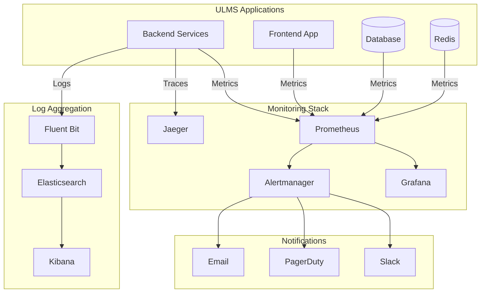

# Monitoring and Alerting Setup Guide

**Document Control**

| Field | Value |
|-------|-------|
| **Document Title** | Monitoring and Alerting Setup Guide |
| **Project Name** | Unisoft Loan Management System (ULMS) |
| **Document Version** | 1.0 |
| **Date** | 2026-02-05 |
| **Prepared By** | DevOps Engineering Team |
| **Reviewed By** | Technical Lead |
| **Classification** | Internal |
| **Status** | Approved |

**Revision History**

| Version | Date | Author | Description |
|---------|------|--------|-------------|
| 1.0 | 2026-02-05 | DevOps Team | Initial monitoring setup guide |

---

## Table of Contents

1. [Executive Summary](#1-executive-summary)
2. [Monitoring Architecture](#2-monitoring-architecture)
3. [Component Overview](#3-component-overview)
4. [Installation](#4-installation)
5. [Configuration](#5-configuration)
6. [Alerting](#6-alerting)
7. [Dashboard Setup](#7-dashboard-setup)
8. [SLA Monitoring](#8-sla-monitoring)
9. [Runbooks](#9-runbooks)
10. [Related Documents](#10-related-documents)

---

## 1. Executive Summary

This document provides comprehensive guidance for setting up monitoring and alerting infrastructure for ULMS v2.0, ensuring observability and rapid incident response for Bangladesh banking operations.

---

## 2. Monitoring Architecture

### 2.1 Architecture Diagram



---

## 3. Component Overview

| Component | Purpose | Data Type |
|-----------|---------|-----------|
| Prometheus | Metrics collection | Time-series |
| Grafana | Visualization | Dashboards |
| Alertmanager | Alert routing | Notifications |
| Jaeger | Distributed tracing | Traces |
| ELK Stack | Log aggregation | Logs |
| Fluent Bit | Log shipping | Logs |

---

## 4. Installation

### 4.1 Prometheus Operator

```bash
# Add Helm repository
helm repo add prometheus-community https://prometheus-community.github.io/helm-charts
helm repo update

# Install kube-prometheus-stack
helm install monitoring prometheus-community/kube-prometheus-stack \
  --namespace monitoring \
  --create-namespace \
  --values prometheus-values.yaml
```

### 4.2 Configuration Values

```yaml
# prometheus-values.yaml
prometheus:
  prometheusSpec:
    retention: 30d
    retentionSize: "50GB"
    resources:
      requests:
        cpu: 500m
        memory: 2Gi
      limits:
        cpu: 2000m
        memory: 8Gi
    storageSpec:
      volumeClaimTemplate:
        spec:
          storageClassName: gp3-encrypted
          resources:
            requests:
              storage: 100Gi

alertmanager:
  config:
    global:
      smtp_smarthost: 'smtp.gmail.com:587'
      smtp_from: 'alerts@unisoft-systems.com'
    route:
      receiver: 'default'
      routes:
        - match:
            severity: critical
          receiver: 'pagerduty'
        - match:
            severity: warning
          receiver: 'slack'
    receivers:
      - name: 'default'
        email_configs:
          - to: 'ops@unisoft-systems.com'
      - name: 'slack'
        slack_configs:
          - api_url: '${SLACK_WEBHOOK_URL}'
            channel: '#ulms-alerts'
      - name: 'pagerduty'
        pagerduty_configs:
          - service_key: '${PAGERDUTY_KEY}'

grafana:
  enabled: true
  adminPassword: admin
  ingress:
    enabled: true
    hosts:
      - grafana.unisoft-systems.com
```

---

## 5. Configuration

### 5.1 ServiceMonitor

```yaml
apiVersion: monitoring.coreos.com/v1
kind: ServiceMonitor
metadata:
  name: ulms-backend-metrics
  namespace: monitoring
  labels:
    release: monitoring
spec:
  namespaceSelector:
    matchNames:
      - ulms-production
  selector:
    matchLabels:
      app: ulms-backend
  endpoints:
    - port: management
      path: /actuator/prometheus
      interval: 30s
      scrapeTimeout: 10s
```

### 5.2 PodMonitor

```yaml
apiVersion: monitoring.coreos.com/v1
kind: PodMonitor
metadata:
  name: ulms-frontend-metrics
  namespace: monitoring
spec:
  namespaceSelector:
    matchNames:
      - ulms-production
  selector:
    matchLabels:
      app: ulms-frontend
  podMetricsEndpoints:
    - port: metrics
      path: /metrics
      interval: 30s
```

---

## 6. Alerting

### 6.1 PrometheusRule

```yaml
apiVersion: monitoring.coreos.com/v1
kind: PrometheusRule
metadata:
  name: ulms-alerts
  namespace: monitoring
  labels:
    release: monitoring
spec:
  groups:
    - name: ulms-backend
      rules:
        - alert: ULMSBackendDown
          expr: up{job="ulms-backend"} == 0
          for: 1m
          labels:
            severity: critical
          annotations:
            summary: "ULMS Backend is down"
            description: "ULMS Backend has been down for more than 1 minute"
            
        - alert: ULMSHighErrorRate
          expr: |
            sum(rate(http_requests_total{job="ulms-backend",status=~"5.."}[5m]))
            /
            sum(rate(http_requests_total{job="ulms-backend"}[5m])) > 0.05
          for: 5m
          labels:
            severity: critical
          annotations:
            summary: "High error rate detected"
            description: "Error rate is above 5% for 5 minutes"
            
        - alert: ULMSHighLatency
          expr: |
            histogram_quantile(0.95,
              sum(rate(http_request_duration_seconds_bucket{job="ulms-backend"}[5m])) by (le)
            ) > 0.5
          for: 5m
          labels:
            severity: warning
          annotations:
            summary: "High latency detected"
            description: "95th percentile latency is above 500ms"
            
        - alert: ULMSDatabaseConnectionsHigh
          expr: |
            pg_stat_activity_count{datname="ulms"} > 150
          for: 5m
          labels:
            severity: warning
          annotations:
            summary: "Database connections high"
            description: "Database has more than 150 active connections"
```

---

## 7. Dashboard Setup

### 7.1 Grafana Dashboard Provisioning

```yaml
apiVersion: v1
kind: ConfigMap
metadata:
  name: ulms-dashboards
  namespace: monitoring
  labels:
    grafana_dashboard: "1"
data:
  ulms-overview.json: |
    {
      "dashboard": {
        "title": "ULMS Overview",
        "panels": [
          {
            "title": "Request Rate",
            "type": "stat",
            "targets": [
              {
                "expr": "sum(rate(http_requests_total{job=\"ulms-backend\"}[5m]))"
              }
            ]
          },
          {
            "title": "Error Rate",
            "type": "graph",
            "targets": [
              {
                "expr": "sum(rate(http_requests_total{job=\"ulms-backend\",status=~\"5..\"}[5m]))"
              }
            ]
          },
          {
            "title": "Response Time",
            "type": "graph",
            "targets": [
              {
                "expr": "histogram_quantile(0.95, sum(rate(http_request_duration_seconds_bucket{job=\"ulms-backend\"}[5m])) by (le))"
              }
            ]
          }
        ]
      }
    }
```

---

## 8. SLA Monitoring

### 8.1 SLA Metrics

| Metric | Target | Alert Threshold |
|--------|--------|-----------------|
| Availability | 99.9% | < 99.5% |
| Response Time (p95) | < 500ms | > 1s |
| Error Rate | < 0.1% | > 1% |
| Database Query Time | < 100ms | > 500ms |

---

## 9. Runbooks

### 9.1 Alert Runbook Template

```markdown
# Runbook: ULMSBackendDown

## Description
ULMS Backend service is not responding.

## Impact
Users cannot access loan management features.

## Troubleshooting
1. Check pod status: `kubectl get pods -n ulms-production`
2. Check logs: `kubectl logs -l app=ulms-backend -n ulms-production`
3. Check resource usage: `kubectl top pods -n ulms-production`
4. Check events: `kubectl get events -n ulms-production`

## Resolution
1. Restart deployment: `kubectl rollout restart deployment/ulms-backend`
2. Scale up if needed: `kubectl scale deployment ulms-backend --replicas=5`
```

---

## 10. Related Documents

| Document | Location | Purpose |
|----------|----------|---------|
| Prometheus Setup | `02_[MON]_Prometheus_Monitoring_Setup_v1.0.md` | Prometheus |
| Grafana Dashboards | `03_[MON]_Grafana_Dashboard_Definitions_v1.0.md` | Grafana |
| ELK Stack | `05_[MON]_ELK_Stack_Configuration_v1.0.md` | Logging |

---

*© 2026 Unisoft Systems Limited. All Rights Reserved.*
