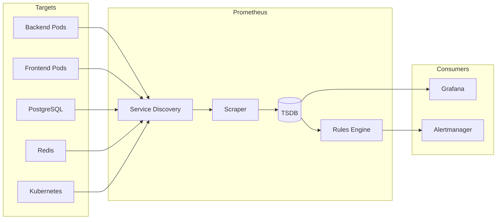

# Prometheus Monitoring Setup

**Document Control**

| Field | Value |
|-------|-------|
| **Document Title** | Prometheus Monitoring Setup |
| **Project Name** | Unisoft Loan Management System (ULMS) |
| **Document Version** | 1.0 |
| **Date** | 2026-02-05 |
| **Prepared By** | DevOps Engineering Team |
| **Reviewed By** | Technical Lead |
| **Classification** | Internal |
| **Status** | Approved |

---

## Table of Contents

1. [Executive Summary](#1-executive-summary)
2. [Prometheus Architecture](#2-prometheus-architecture)
3. [Installation](#3-installation)
4. [Configuration](#4-configuration)
5. [Service Discovery](#5-service-discovery)
6. [Recording Rules](#6-recording-rules)
7. [Metric Collection](#7-metric-collection)
8. [Storage](#8-storage)
9. [Maintenance](#9-maintenance)
10. [Related Documents](#10-related-documents)

---

## 1. Executive Summary

This document defines Prometheus setup and configuration for ULMS v2.0 metrics collection, enabling comprehensive monitoring of banking application performance and health.

---

## 2. Prometheus Architecture

### 2.1 Architecture Diagram



---

## 3. Installation

### 3.1 Helm Installation

```bash
helm repo add prometheus-community https://prometheus-community.github.io/helm-charts
helm repo update

helm install prometheus prometheus-community/prometheus \
  --namespace monitoring \
  --create-namespace \
  --set server.persistentVolume.enabled=true \
  --set server.persistentVolume.size=100Gi
```

---

## 4. Configuration

### 4.1 Prometheus Config

```yaml
# prometheus-config.yaml
global:
  scrape_interval: 15s
  evaluation_interval: 15s
  external_labels:
    cluster: ulms-production
    replica: '{{.ExternalURL}}'

alerting:
  alertmanagers:
    - static_configs:
        - targets:
          - alertmanager:9093

rule_files:
  - /etc/prometheus/rules/*.yml

scrape_configs:
  - job_name: 'prometheus'
    static_configs:
      - targets: ['localhost:9090']

  - job_name: 'kubernetes-apiservers'
    kubernetes_sd_configs:
      - role: endpoints
    scheme: https
    tls_config:
      ca_file: /var/run/secrets/kubernetes.io/serviceaccount/ca.crt
    bearer_token_file: /var/run/secrets/kubernetes.io/serviceaccount/token
    relabel_configs:
      - source_labels: [__meta_kubernetes_namespace, __meta_kubernetes_service_name, __meta_kubernetes_endpoint_port_name]
        action: keep
        regex: default;kubernetes;https

  - job_name: 'kubernetes-pods'
    kubernetes_sd_configs:
      - role: pod
    relabel_configs:
      - source_labels: [__meta_kubernetes_pod_annotation_prometheus_io_scrape]
        action: keep
        regex: true
      - source_labels: [__meta_kubernetes_pod_annotation_prometheus_io_path]
        action: replace
        target_label: __metrics_path__
        regex: (.+)
      - source_labels: [__address__, __meta_kubernetes_pod_annotation_prometheus_io_port]
        action: replace
        regex: ([^:]+)(?::\d+)?;(\d+)
        replacement: $1:$2
        target_label: __address__
      - action: labelmap
        regex: __meta_kubernetes_pod_label_(.+)
      - source_labels: [__meta_kubernetes_namespace]
        action: replace
        target_label: kubernetes_namespace
      - source_labels: [__meta_kubernetes_pod_name]
        action: replace
        target_label: kubernetes_pod_name
```

---

## 5. Service Discovery

### 5.1 Kubernetes SD

```yaml
- job_name: 'ulms-backend'
  kubernetes_sd_configs:
    - role: pod
      namespaces:
        names:
          - ulms-production
  relabel_configs:
    - source_labels: [__meta_kubernetes_pod_label_app]
      action: keep
      regex: ulms-backend
    - source_labels: [__meta_kubernetes_pod_annotation_prometheus_io_scrape]
      action: keep
      regex: true
    - source_labels: [__meta_kubernetes_pod_annotation_prometheus_io_port]
      action: replace
      target_label: __address__
      regex: ([^:]+)(?::\d+)?;(\d+)
      replacement: $1:$2
```

---

## 6. Recording Rules

### 6.1 Performance Rules

```yaml
# recording-rules.yaml
groups:
  - name: ulms_performance
    interval: 30s
    rules:
      - record: ulms:request_rate_5m
        expr: sum(rate(http_requests_total{job="ulms-backend"}[5m]))
      
      - record: ulms:error_rate_5m
        expr: |
          sum(rate(http_requests_total{job="ulms-backend",status=~"5.."}[5m]))
          /
          sum(rate(http_requests_total{job="ulms-backend"}[5m]))
      
      - record: ulms:latency_p95
        expr: |
          histogram_quantile(0.95,
            sum(rate(http_request_duration_seconds_bucket{job="ulms-backend"}[5m])) by (le)
          )
      
      - record: ulms:database_query_time_avg
        expr: avg(pg_stat_statements_mean_time / 1000)
```

---

## 7. Metric Collection

### 7.1 Custom Metrics

```java
// Micrometer metrics
@Component
public class LoanMetrics {
    private final MeterRegistry registry;
    
    public LoanMetrics(MeterRegistry registry) {
        this.registry = registry;
    }
    
    public void recordLoanApplication(String type, String status) {
        registry.counter("ulms.loan.applications",
            "type", type,
            "status", status
        ).increment();
    }
    
    public void recordProcessingTime(String operation, long milliseconds) {
        registry.timer("ulms.processing.time",
            "operation", operation
        ).record(milliseconds, TimeUnit.MILLISECONDS);
    }
}
```

---

## 8. Storage

### 8.1 Storage Configuration

| Parameter | Value | Description |
|-----------|-------|-------------|
| Retention | 30 days | Metric retention period |
| Retention Size | 50 GB | Maximum storage size |
| Block Duration | 2 hours | TSDB block duration |

---

## 9. Maintenance

### 9.1 Maintenance Tasks

| Task | Frequency | Command |
|------|-----------|---------|
| Check disk usage | Daily | `df -h` |
| Compact TSDB | Weekly | `curl -X POST localhost:9090/api/v1/admin/tsdb/snapshot` |
| Clean old data | Monthly | Automatic via retention |

---

## 10. Related Documents

| Document | Location | Purpose |
|----------|----------|---------|
| Monitoring Setup Guide | `01_[MON]_Monitoring_Alerting_Setup_Guide_v1.0.md` | Overview |
| Alerting Rules | `08_[MON]_Alerting_Rules_Configuration_v1.0.md` | Alerts |

---

*© 2026 Unisoft Systems Limited. All Rights Reserved.*
