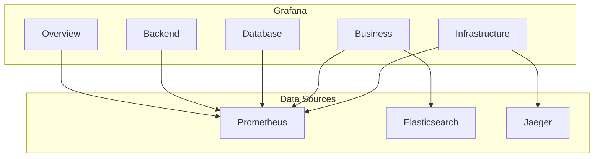

# Grafana Dashboard Definitions

**Document Control**

| Field | Value |
|-------|-------|
| **Document Title** | Grafana Dashboard Definitions |
| **Project Name** | Unisoft Loan Management System (ULMS) |
| **Document Version** | 1.0 |
| **Date** | 2026-02-05 |
| **Prepared By** | DevOps Engineering Team |
| **Reviewed By** | Technical Lead |
| **Classification** | Internal |
| **Status** | Approved |

---

## Table of Contents

1. [Executive Summary](#1-executive-summary)
2. [Dashboard Architecture](#2-dashboard-architecture)
3. [Dashboard List](#3-dashboard-list)
4. [ULMS Overview Dashboard](#4-ulms-overview-dashboard)
5. [Backend Performance Dashboard](#5-backend-performance-dashboard)
6. [Database Dashboard](#6-database-dashboard)
7. [Business Metrics Dashboard](#7-business-metrics-dashboard)
8. [Infrastructure Dashboard](#8-infrastructure-dashboard)
9. [Dashboard Provisioning](#9-dashboard-provisioning)
10. [Related Documents](#10-related-documents)

---

## 1. Executive Summary

This document defines Grafana dashboard configurations for ULMS v2.0, providing comprehensive visualization of application metrics, infrastructure health, and business KPIs for Bangladesh banking operations.

---

## 2. Dashboard Architecture



---

## 3. Dashboard List

| Dashboard | Purpose | Refresh |
|-----------|---------|---------|
| ULMS Overview | High-level health | 30s |
| Backend Performance | API metrics | 10s |
| Database | PostgreSQL metrics | 30s |
| Business Metrics | Loan KPIs | 5m |
| Infrastructure | K8s/Node metrics | 30s |
| Security | Security events | 1m |

---

## 4. ULMS Overview Dashboard

```json
{
  "dashboard": {
    "title": "ULMS Overview",
    "tags": ["ulms", "overview"],
    "timezone": "Asia/Dhaka",
    "refresh": "30s",
    "panels": [
      {
        "id": 1,
        "title": "System Health",
        "type": "stat",
        "targets": [
          {
            "expr": "up{job=\"ulms-backend\"}",
            "legendFormat": "Backend"
          },
          {
            "expr": "up{job=\"ulms-frontend\"}",
            "legendFormat": "Frontend"
          }
        ],
        "fieldConfig": {
          "defaults": {
            "mappings": [
              {"options": {"0": {"text": "DOWN", "color": "red"}}, "type": "value"},
              {"options": {"1": {"text": "UP", "color": "green"}}, "type": "value"}
            ]
          }
        }
      },
      {
        "id": 2,
        "title": "Request Rate",
        "type": "stat",
        "targets": [
          {
            "expr": "sum(rate(http_requests_total{job=\"ulms-backend\"}[5m]))",
            "legendFormat": "Requests/sec"
          }
        ]
      },
      {
        "id": 3,
        "title": "Error Rate",
        "type": "stat",
        "targets": [
          {
            "expr": "sum(rate(http_requests_total{job=\"ulms-backend\",status=~\"5..\"}[5m])) / sum(rate(http_requests_total{job=\"ulms-backend\"}[5m])) * 100",
            "legendFormat": "Error %"
          }
        ],
        "fieldConfig": {
          "defaults": {
            "thresholds": {
              "steps": [
                {"color": "green", "value": null},
                {"color": "yellow", "value": 1},
                {"color": "red", "value": 5}
              ]
            },
            "unit": "percent"
          }
        }
      },
      {
        "id": 4,
        "title": "Response Time (p95)",
        "type": "timeseries",
        "targets": [
          {
            "expr": "histogram_quantile(0.95, sum(rate(http_request_duration_seconds_bucket{job=\"ulms-backend\"}[5m])) by (le))",
            "legendFormat": "p95"
          },
          {
            "expr": "histogram_quantile(0.99, sum(rate(http_request_duration_seconds_bucket{job=\"ulms-backend\"}[5m])) by (le))",
            "legendFormat": "p99"
          }
        ],
        "fieldConfig": {
          "defaults": {
            "unit": "s"
          }
        }
      },
      {
        "id": 5,
        "title": "Active Loans",
        "type": "stat",
        "targets": [
          {
            "expr": "ulms_loans_active_total",
            "legendFormat": "Active"
          }
        ]
      },
      {
        "id": 6,
        "title": "Today's Applications",
        "type": "stat",
        "targets": [
          {
            "expr": "increase(ulms_loan_applications_total[1d])",
            "legendFormat": "Applications"
          }
        ]
      }
    ]
  }
}
```

---

## 5. Backend Performance Dashboard

```json
{
  "dashboard": {
    "title": "ULMS Backend Performance",
    "panels": [
      {
        "title": "HTTP Request Rate by Endpoint",
        "type": "timeseries",
        "targets": [
          {
            "expr": "sum(rate(http_requests_total{job=\"ulms-backend\"}[5m])) by (uri)",
            "legendFormat": "{{uri}}"
          }
        ]
      },
      {
        "title": "Error Rate by Status",
        "type": "timeseries",
        "targets": [
          {
            "expr": "sum(rate(http_requests_total{job=\"ulms-backend\",status=~\"[45]..\"}[5m])) by (status)",
            "legendFormat": "{{status}}"
          }
        ]
      },
      {
        "title": "JVM Memory",
        "type": "timeseries",
        "targets": [
          {
            "expr": "jvm_memory_used_bytes{job=\"ulms-backend\",area=\"heap\"}",
            "legendFormat": "Heap Used"
          },
          {
            "expr": "jvm_memory_max_bytes{job=\"ulms-backend\",area=\"heap\"}",
            "legendFormat": "Heap Max"
          }
        ]
      },
      {
        "title": "GC Pause Time",
        "type": "timeseries",
        "targets": [
          {
            "expr": "rate(jvm_gc_pause_seconds_sum{job=\"ulms-backend\"}[5m])",
            "legendFormat": "GC Time"
          }
        ]
      }
    ]
  }
}
```

---

## 6. Database Dashboard

```json
{
  "dashboard": {
    "title": "ULMS Database",
    "panels": [
      {
        "title": "Active Connections",
        "type": "stat",
        "targets": [
          {
            "expr": "pg_stat_activity_count{datname=\"ulms\"}",
            "legendFormat": "Connections"
          }
        ]
      },
      {
        "title": "Query Rate",
        "type": "timeseries",
        "targets": [
          {
            "expr": "rate(pg_stat_database_xact_commit{datname=\"ulms\"}[5m])",
            "legendFormat": "Commits/sec"
          },
          {
            "expr": "rate(pg_stat_database_xact_rollback{datname=\"ulms\"}[5m])",
            "legendFormat": "Rollbacks/sec"
          }
        ]
      },
      {
        "title": "Query Duration",
        "type": "timeseries",
        "targets": [
          {
            "expr": "pg_stat_statements_mean_time / 1000",
            "legendFormat": "{{queryid}}"
          }
        ]
      }
    ]
  }
}
```

---

## 7. Business Metrics Dashboard

```json
{
  "dashboard": {
    "title": "ULMS Business Metrics",
    "panels": [
      {
        "title": "Loans by Status",
        "type": "piechart",
        "targets": [
          {
            "expr": "sum by (status) (ulms_loans_total)",
            "legendFormat": "{{status}}"
          }
        ]
      },
      {
        "title": "Loan Amount by Branch",
        "type": "bar gauge",
        "targets": [
          {
            "expr": "sum by (branch) (ulms_loan_amount_total)",
            "legendFormat": "{{branch}}"
          }
        ]
      },
      {
        "title": "Applications Over Time",
        "type": "timeseries",
        "targets": [
          {
            "expr": "rate(ulms_loan_applications_total[1h])",
            "legendFormat": "Applications/hour"
          }
        ]
      }
    ]
  }
}
```

---

## 8. Infrastructure Dashboard

```json
{
  "dashboard": {
    "title": "ULMS Infrastructure",
    "panels": [
      {
        "title": "CPU Usage",
        "type": "timeseries",
        "targets": [
          {
            "expr": "avg by (node) (rate(node_cpu_seconds_total{mode!=\"idle\"}[5m]))",
            "legendFormat": "{{node}}"
          }
        ]
      },
      {
        "title": "Memory Usage",
        "type": "timeseries",
        "targets": [
          {
            "expr": "node_memory_MemTotal_bytes - node_memory_MemAvailable_bytes",
            "legendFormat": "Used"
          }
        ]
      },
      {
        "title": "Pod Status",
        "type": "table",
        "targets": [
          {
            "expr": "kube_pod_status_phase{namespace=\"ulms-production\"}",
            "format": "table"
          }
        ]
      }
    ]
  }
}
```

---

## 9. Dashboard Provisioning

### 9.1 ConfigMap

```yaml
apiVersion: v1
kind: ConfigMap
metadata:
  name: ulms-dashboards
  namespace: monitoring
  labels:
    grafana_dashboard: "1"
data:
  ulms-overview.json: |
    {...}
  ulms-backend.json: |
    {...}
```

---

## 10. Related Documents

| Document | Location | Purpose |
|----------|----------|---------|
| Monitoring Setup | `01_[MON]_Monitoring_Alerting_Setup_Guide_v1.0.md` | Overview |
| Prometheus Setup | `02_[MON]_Prometheus_Monitoring_Setup_v1.0.md` | Prometheus |

---

*© 2026 Unisoft Systems Limited. All Rights Reserved.*
