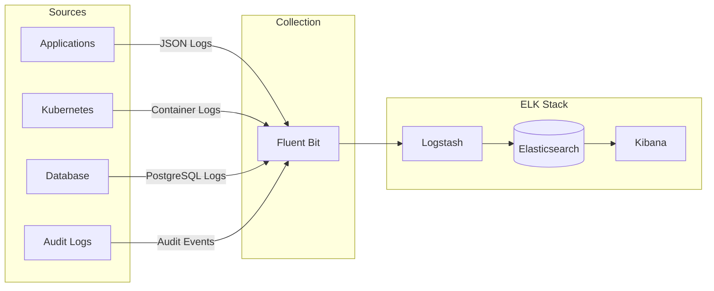

# Logging Strategy - ELK Stack Setup

**Document Control**

| Field | Value |
|-------|-------|
| **Document Title** | Logging Strategy - ELK Stack Setup |
| **Project Name** | Unisoft Loan Management System (ULMS) |
| **Document Version** | 1.0 |
| **Date** | 2026-02-05 |
| **Prepared By** | DevOps Engineering Team |
| **Reviewed By** | Technical Lead |
| **Classification** | Internal |
| **Status** | Approved |

---

## Table of Contents

1. [Executive Summary](#1-executive-summary)
2. [Logging Architecture](#2-logging-architecture)
3. [Log Types](#3-log-types)
4. [ELK Installation](#4-elk-installation)
5. [Fluent Bit Configuration](#5-fluent-bit-configuration)
6. [Log Parsing](#6-log-parsing)
7. [Retention Policy](#7-retention-policy)
8. [Security](#8-security)
9. [Troubleshooting](#9-troubleshooting)
10. [Related Documents](#10-related-documents)

---

## 1. Executive Summary

This document defines the centralized logging strategy using ELK stack for ULMS v2.0, enabling log aggregation, analysis, and compliance auditing for Bangladesh banking operations.

---

## 2. Logging Architecture

### 2.1 Architecture



---

## 3. Log Types

| Log Type | Format | Retention | Example |
|----------|--------|-----------|---------|
| Application | JSON | 90 days | API requests |
| Access | Combined | 1 year | Nginx access |
| Audit | JSON | 7 years | User actions |
| Error | Stack trace | 1 year | Exceptions |
| Performance | Metrics | 30 days | Timing data |

---

## 4. ELK Installation

### 4.1 Helm Installation

```bash
# Add Elastic Helm repository
helm repo add elastic https://helm.elastic.co
helm repo update

# Install Elasticsearch
helm install elasticsearch elastic/elasticsearch \
  --namespace logging \
  --create-namespace \
  --set replicas=3 \
  --set persistence.enabled=true \
  --set persistence.size=100Gi

# Install Kibana
helm install kibana elastic/kibana \
  --namespace logging \
  --set service.type=ClusterIP

# Install Logstash
helm install logstash elastic/logstash \
  --namespace logging \
  -f logstash-values.yaml
```

---

## 5. Fluent Bit Configuration

### 5.1 ConfigMap

```yaml
apiVersion: v1
kind: ConfigMap
metadata:
  name: fluent-bit-config
  namespace: logging
data:
  fluent-bit.conf: |
    [SERVICE]
        Flush         1
        Log_Level     info
        Daemon        off
        Parsers_File  parsers.conf
        HTTP_Server   On
        HTTP_Listen   0.0.0.0
        HTTP_Port     2020

    [INPUT]
        Name              tail
        Tag               kube.*
        Path              /var/log/containers/*.log
        Parser            docker
        DB                /var/log/flb_kube.db
        Mem_Buf_Limit     5MB
        Skip_Long_Lines   On
        Refresh_Interval  10

    [FILTER]
        Name                kubernetes
        Match               kube.*
        Kube_URL            https://kubernetes.default.svc:443
        Kube_CA_File        /var/run/secrets/kubernetes.io/serviceaccount/ca.crt
        Kube_Token_File     /var/run/secrets/kubernetes.io/serviceaccount/token
        Merge_Log           On
        Keep_Log            Off
        K8S-Logging.Parser  On
        K8S-Logging.Exclude Off

    [FILTER]
        Name                grep
        Match               kube.*
        Regex               $kubernetes['namespace_name'] ulms-production

    [OUTPUT]
        Name            es
        Match           *
        Host            elasticsearch-master
        Port            9200
        Index           ulms-logs
        Type            _doc
        Suppress_Type_Name On
        HTTP_User       elastic
        HTTP_Passwd     ${ELASTIC_PASSWORD}
        tls             On
        tls.verify      Off
        Logstash_Format On
        Logstash_Prefix ulms
```

---

## 6. Log Parsing

### 6.1 Parsers

```yaml
parsers.conf: |
  [PARSER]
      Name        docker
      Format      json
      Time_Key    time
      Time_Format %Y-%m-%dT%H:%M:%S.%L
      Time_Keep   On

  [PARSER]
      Name        ulms-json
      Format      json
      Time_Key    timestamp
      Time_Format %Y-%m-%dT%H:%M:%S.%LZ
```

---

## 7. Retention Policy

### 7.1 Index Lifecycle

| Phase | Age | Action |
|-------|-----|--------|
| Hot | 0-7 days | Read/Write |
| Warm | 7-30 days | Read-only |
| Cold | 30-90 days | Search only |
| Delete | >90 days | Delete |

---

## 8. Security

- TLS encryption in transit
- Authentication required
- Role-based access control
- Audit logging enabled

---

## 9. Troubleshooting

| Issue | Solution |
|-------|----------|
| No logs | Check Fluent Bit status |
| Parse errors | Verify parser config |
| Disk full | Check retention policy |

---

## 10. Related Documents

| Document | Location |
|----------|----------|
| ELK Configuration | `05_[MON]_ELK_Stack_Configuration_v1.0.md` |

---

*© 2026 Unisoft Systems Limited.*
