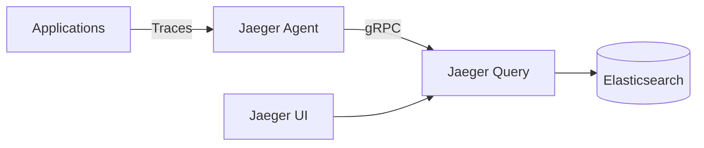

# Distributed Tracing Setup - Jaeger

**Document Control**

| Field | Value |
|-------|-------|
| **Document Title** | Distributed Tracing Setup - Jaeger |
| **Project Name** | ULMS |
| **Document Version** | 1.0 |
| **Date** | 2026-02-05 |
| **Classification** | Internal |

---

## Table of Contents

1. [Overview](#1-overview)
2. [Architecture](#2-architecture)
3. [Installation](#3-installation)
4. [Application Instrumentation](#4-application-instrumentation)
5. [Sampling Configuration](#5-sampling-configuration)
6. [Storage](#6-storage)

---

## 1. Overview

Distributed tracing configuration using Jaeger for ULMS microservices observability.

---

## 2. Architecture



---

## 3. Installation

```bash
# Helm install
helm repo add jaegertracing https://jaegertracing.github.io/helm-charts
helm repo update

helm install jaeger jaegertracing/jaeger \
  --namespace observability \
  --create-namespace \
  --values jaeger-values.yaml
```

```yaml
# jaeger-values.yaml
provisionDataStore:
  cassandra: false
  elasticsearch: true
  kafka: false

storage:
  type: elasticsearch
  elasticsearch:
    serverUrls: http://elasticsearch-master:9200

agent:
  enabled: true
  sidecar:
    enabled: true

collector:
  enabled: true
  service:
    zipkin:
      port: 9411

query:
  enabled: true
  service:
    type: ClusterIP
  ingress:
    enabled: true
    hosts:
      - jaeger.unisoft-systems.com
```

---

## 4. Application Instrumentation

### 4.1 Spring Boot

```java
@Bean
public JaegerTracer jaegerTracer() {
    Configuration.SamplerConfiguration samplerConfig = 
        Configuration.SamplerConfiguration.fromEnv()
            .withType("const")
            .withParam(1);
    
    Configuration.ReporterConfiguration reporterConfig = 
        Configuration.ReporterConfiguration.fromEnv()
            .withLogSpans(true);
    
    Configuration config = new Configuration("ulms-backend")
        .withSampler(samplerConfig)
        .withReporter(reporterConfig);
    
    return config.getTracer();
}
```

### 4.2 React

```typescript
import { initTracer } from 'jaeger-client';

const tracer = initTracer({
  serviceName: 'ulms-frontend',
  sampler: { type: 'const', param: 1 }
});
```

---

## 5. Sampling Configuration

| Environment | Sampler | Rate |
|-------------|---------|------|
| Development | Const | 100% |
| Staging | Probabilistic | 50% |
| Production | Probabilistic | 10% |

---

## 6. Storage

- Elasticsearch backend
- 7-day retention for traces
- Daily index rotation

---

*© 2026 Unisoft Systems Limited.*
