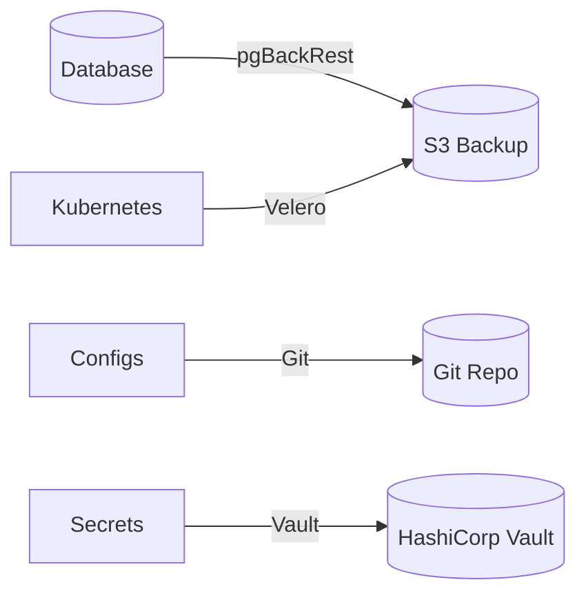

# Backup Strategy Document

**Document Control**

| Field | Value |
|-------|-------|
| **Document Title** | Backup Strategy Document |
| **Project Name** | ULMS |
| **Document Version** | 1.0 |
| **Date** | 2026-02-05 |
| **Classification** | Confidential |

---

## Table of Contents

1. [Overview](#1-overview)
2. [Backup Architecture](#2-backup-architecture)
3. [Backup Types](#3-backup-types)
4. [Retention Policy](#4-retention-policy)
5. [Encryption](#5-encryption)
6. [Testing](#6-testing)
7. [RTO/RPO](#7-rtorpo)

---

## 1. Overview

Comprehensive backup strategy for ULMS production data ensuring Bangladesh banking compliance.

---

## 2. Backup Architecture

---

## 3. Backup Types

| Type | Frequency | Tool | Retention |
|------|-----------|------|-----------|
| Full DB | Daily | pgBackRest | 30 days |
| Incremental | Hourly | pgBackRest | 7 days |
| WAL | Continuous | pgBackRest | 7 days |
| K8s Resources | Daily | Velero | 30 days |
| Config | On change | Git | Permanent |

---

## 4. Retention Policy

| Data Type | Production | Staging | Dev |
|-----------|------------|---------|-----|
| Database | 7 years | 90 days | 7 days |
| Application | 1 year | 30 days | 7 days |
| Logs | 1 year | 30 days | 7 days |

---

## 5. Encryption

- AES-256 encryption at rest
- TLS in transit
- Customer-managed keys (KMS)

---

## 6. Testing

- Monthly restore tests
- Quarterly DR drills
- Annual compliance audit

---

## 7. RTO/RPO

| Metric | Target |
|--------|--------|
| RTO | 4 hours |
| RPO | 1 hour |

---

*© 2026 Unisoft Systems Limited.*
