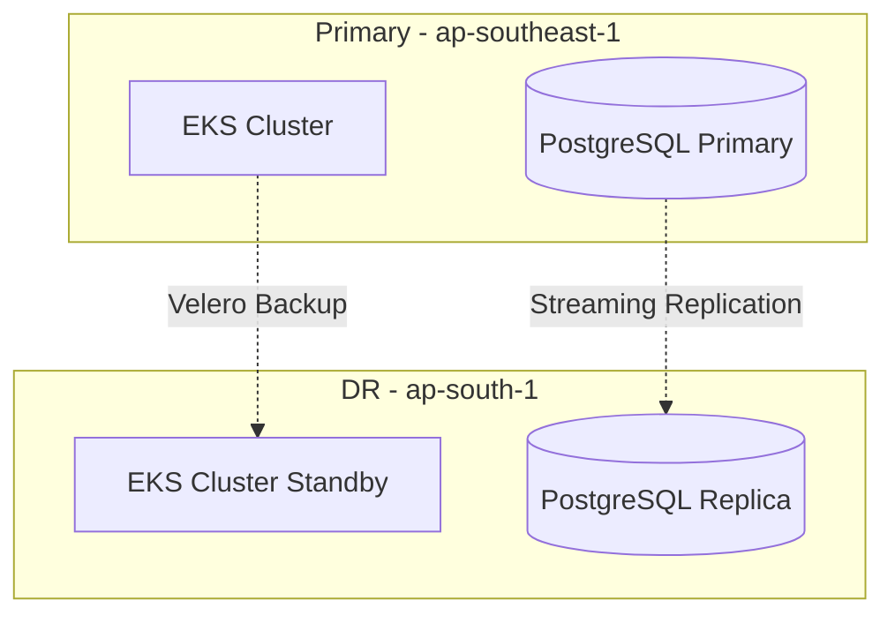

# Disaster Recovery Plan

**Document Control**

| Field | Value |
|-------|-------|
| **Document Title** | Disaster Recovery Plan |
| **Project Name** | ULMS |
| **Document Version** | 1.0 |
| **Date** | 2026-02-05 |
| **Classification** | Confidential |

---

## Table of Contents

1. [Overview](#1-overview)
2. [DR Architecture](#2-dr-architecture)
3. [Recovery Procedures](#3-recovery-procedures)
4. [Communication Plan](#4-communication-plan)
5. [Testing Schedule](#5-testing-schedule)

---

## 1. Overview

Disaster Recovery Plan for ULMS ensuring business continuity for Bangladesh banking operations.

---

## 2. DR Architecture

### 2.1 Multi-Region Setup



### 2.2 DR Tiers

| Tier | RTO | RPO | Cost |
|------|-----|-----|------|
| Pilot Light | 4 hours | 1 hour | Low |
| Warm Standby | 1 hour | 5 minutes | Medium |
| Hot Standby | 15 minutes | Near-zero | High |

---

## 3. Recovery Procedures

### 3.1 Database Failover

```bash
# Promote standby to primary
pg_ctl promote -D /var/lib/postgresql/16/main

# Update application connection strings
kubectl set env deployment/ulms-backend DB_HOST=dr-db.unisoft-systems.com
```

### 3.2 Kubernetes Recovery

```bash
# Restore from Velero backup
velero restore create --from-backup ulms-daily-backup

# Verify restoration
kubectl get pods -n ulms-production
```

---

## 4. Communication Plan

| Stakeholder | Notification | Timeline |
|-------------|--------------|----------|
| Operations Team | PagerDuty | Immediate |
| Management | Phone/Email | 15 minutes |
| Customers | Status Page | 30 minutes |
| Regulators | Formal Report | 2 hours |

---

## 5. Testing Schedule

| Test Type | Frequency | Last Test | Next Test |
|-----------|-----------|-----------|-----------|
| Tabletop | Quarterly | Q4 2025 | Q1 2026 |
| Functional | Semi-annually | Aug 2025 | Feb 2026 |
| Full DR | Annually | Jan 2025 | Jan 2026 |

---

*© 2026 Unisoft Systems Limited.*
