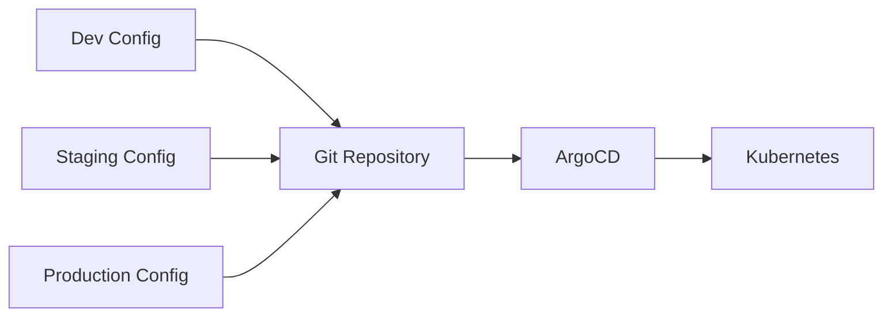

# Environment Configuration Management

**Document Control**

| Field | Value |
|-------|-------|
| **Document Title** | Environment Configuration Management |
| **Project Name** | ULMS |
| **Document Version** | 1.0 |
| **Date** | 2026-02-05 |
| **Classification** | Internal |

---

## Table of Contents

1. [Overview](#1-overview)
2. [Environment Matrix](#2-environment-matrix)
3. [Configuration Management](#3-configuration-management)
4. [GitOps Workflow](#4-gitops-workflow)
5. [Environment Promotion](#5-environment-promotion)

---

## 1. Overview

Environment configuration management strategy for ULMS across development, staging, and production.

---

## 2. Environment Matrix

| Environment | Purpose | URL | Access |
|-------------|---------|-----|--------|
| Development | Dev testing | dev.ulms.unisoft-systems.com | Internal |
| Staging | Pre-prod testing | staging.ulms.unisoft-systems.com | Internal |
| Production | Live banking | ulms.unisoft-systems.com | Restricted |
| DR | Disaster recovery | dr.ulms.unisoft-systems.com | Emergency |

---

## 3. Configuration Management

### 3.1 ConfigMap Strategy

```yaml
# Base configuration
apiVersion: v1
kind: ConfigMap
metadata:
  name: ulms-config-base
data:
  LOG_LEVEL: "INFO"
  CACHE_TTL: "300"
```

### 3.2 Environment-Specific Overrides

```yaml
# Development overrides
apiVersion: v1
kind: ConfigMap
metadata:
  name: ulms-config-dev
data:
  LOG_LEVEL: "DEBUG"
  CACHE_TTL: "60"
```

---

## 4. GitOps Workflow



---

## 5. Environment Promotion

| From | To | Trigger | Approval |
|------|-----|---------|----------|
| Feature Branch | Dev | Auto | None |
| Dev | Staging | Manual | Tech Lead |
| Staging | Production | Manual | CTO |

---

*© 2026 Unisoft Systems Limited.*
