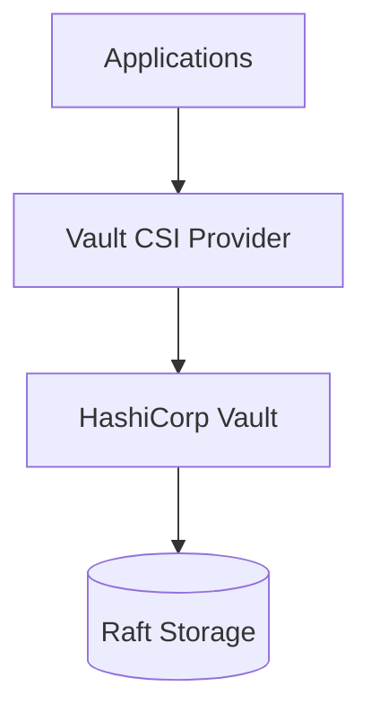

# Secrets Management Implementation - Vault

**Document Control**

| Field | Value |
|-------|-------|
| **Document Title** | Secrets Management Implementation - Vault |
| **Project Name** | ULMS |
| **Document Version** | 1.0 |
| **Date** | 2026-02-05 |
| **Classification** | Confidential |

---

## Table of Contents

1. [Overview](#1-overview)
2. [Vault Architecture](#2-vault-architecture)
3. [Installation](#3-installation)
4. [Secret Structure](#4-secret-structure)
5. [Kubernetes Integration](#5-kubernetes-integration)
6. [Rotation Policy](#6-rotation-policy)

---

## 1. Overview

HashiCorp Vault implementation for secure secrets management in ULMS.

---

## 2. Vault Architecture



---

## 3. Installation

```bash
# Install Vault via Helm
helm repo add hashicorp https://helm.releases.hashicorp.com
helm repo update

helm install vault hashicorp/vault \
  --namespace vault \
  --create-namespace \
  --set "server.ha.enabled=true" \
  --set "server.ha.raft.enabled=true"
```

---

## 4. Secret Structure

```
ulms/
├── development/
│   ├── database
│   ├── api-keys
│   └── jwt
├── staging/
│   ├── database
│   ├── api-keys
│   └── jwt
└── production/
    ├── database
    ├── api-keys
    └── jwt
```

---

## 5. Kubernetes Integration

### 5.1 SecretProviderClass

```yaml
apiVersion: secrets-store.csi.x-k8s.io/v1
kind: SecretProviderClass
metadata:
  name: ulms-vault
spec:
  provider: vault
  parameters:
    vaultAddress: https://vault.unisoft-systems.com:8200
    roleName: ulms-backend
    objects: |
      - objectName: db-password
        secretPath: ulms/production/database
        secretKey: password
```

### 5.2 Pod Integration

```yaml
apiVersion: v1
kind: Pod
spec:
  containers:
    - name: backend
      volumeMounts:
        - name: vault-secrets
          mountPath: /mnt/secrets
  volumes:
    - name: vault-secrets
      csi:
        driver: secrets-store.csi.k8s.io
        readOnly: true
        volumeAttributes:
          secretProviderClass: ulms-vault
```

---

## 6. Rotation Policy

| Secret Type | Rotation Frequency | Automation |
|-------------|-------------------|------------|
| Database passwords | 90 days | Manual |
| API keys | 180 days | Semi-automated |
| JWT signing keys | 365 days | Automated |
| TLS certificates | 365 days | Automated |

---

*© 2026 Unisoft Systems Limited.*
