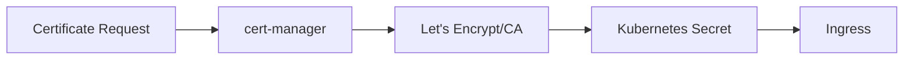

# SSL/TLS Certificate Management

**Document Control**

| Field | Value |
|-------|-------|
| **Document Title** | SSL/TLS Certificate Management |
| **Project Name** | ULMS |
| **Document Version** | 1.0 |
| **Date** | 2026-02-05 |
| **Classification** | Internal |

---

## Table of Contents

1. [Overview](#1-overview)
2. [Certificate Architecture](#2-certificate-architecture)
3. [Cert-Manager Installation](#3-cert-manager-installation)
4. [Certificate Issuance](#4-certificate-issuance)
5. [Renewal](#5-renewal)
6. [Monitoring](#6-monitoring)

---

## 1. Overview

Automated SSL/TLS certificate management using cert-manager for ULMS.

---

## 2. Certificate Architecture



---

## 3. Cert-Manager Installation

```bash
# Install cert-manager
kubectl apply -f https://github.com/cert-manager/cert-manager/releases/download/v1.13.0/cert-manager.yaml

# Verify installation
kubectl wait --for=condition=Ready pod -l app.kubernetes.io/name=cert-manager -n cert-manager
```

---

## 4. Certificate Issuance

### 4.1 ClusterIssuer

```yaml
apiVersion: cert-manager.io/v1
kind: ClusterIssuer
metadata:
  name: letsencrypt-prod
spec:
  acme:
    server: https://acme-v02.api.letsencrypt.org/directory
    email: devops@unisoft-systems.com
    privateKeySecretRef:
      name: letsencrypt-prod
    solvers:
      - http01:
          ingress:
            class: nginx
```

### 4.2 Certificate

```yaml
apiVersion: cert-manager.io/v1
kind: Certificate
metadata:
  name: ulms-tls
  namespace: ulms-production
spec:
  secretName: ulms-tls-secret
  issuerRef:
    name: letsencrypt-prod
    kind: ClusterIssuer
  dnsNames:
    - ulms.unisoft-systems.com
    - api.unisoft-systems.com
  renewBefore: 720h
```

---

## 5. Renewal

- Automatic renewal 30 days before expiry
- Email notifications on renewal
- Manual renewal if needed: `kubectl cert-manager renew ulms-tls`

---

## 6. Monitoring

```yaml
# Alert for expiring certificates
- alert: CertificateExpiringSoon
  expr: |
    certmanager_certificate_expiration_timestamp_seconds - time() < 86400 * 7
  for: 1h
  labels:
    severity: warning
  annotations:
    summary: "Certificate expiring in less than 7 days"
```

---

*© 2026 Unisoft Systems Limited.*
