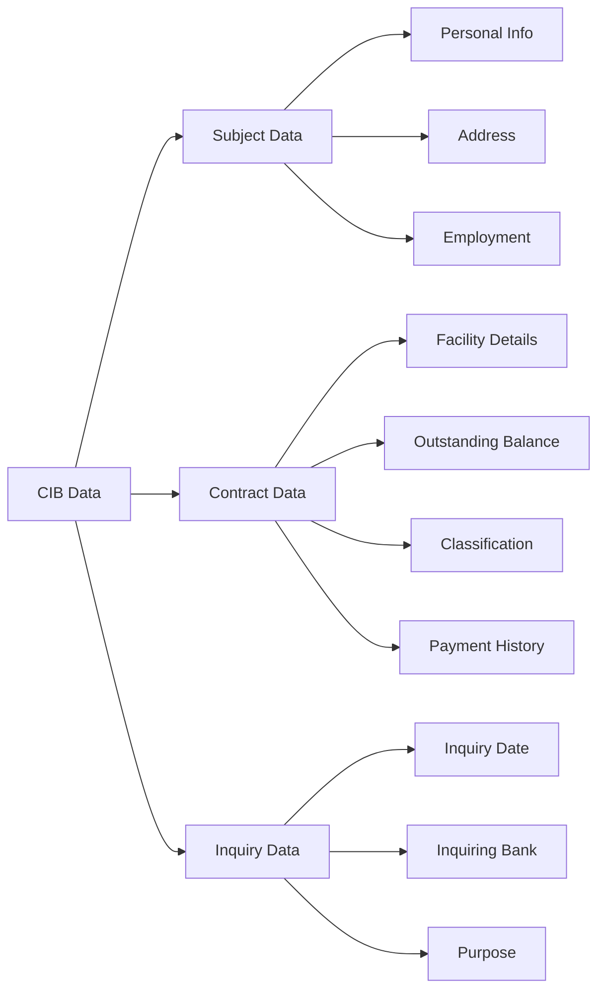
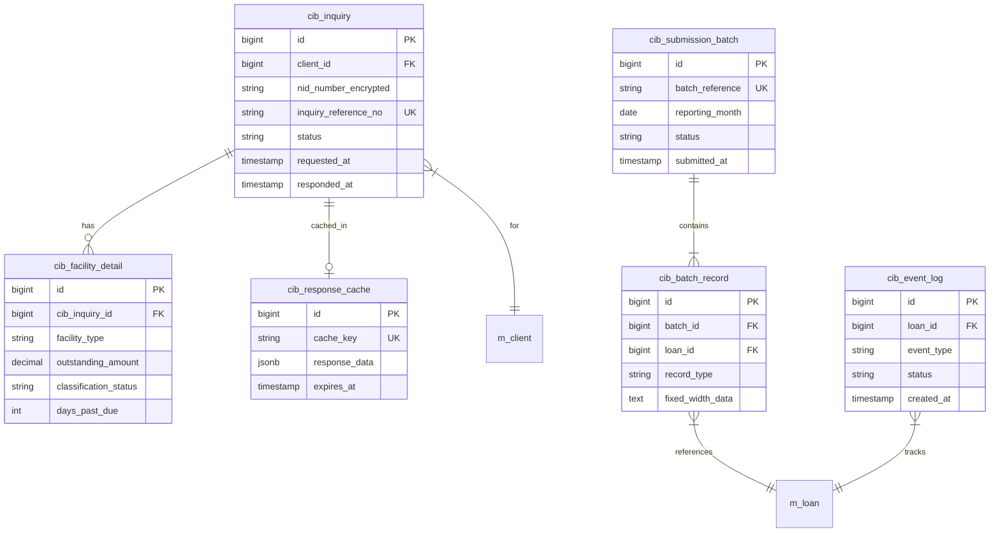
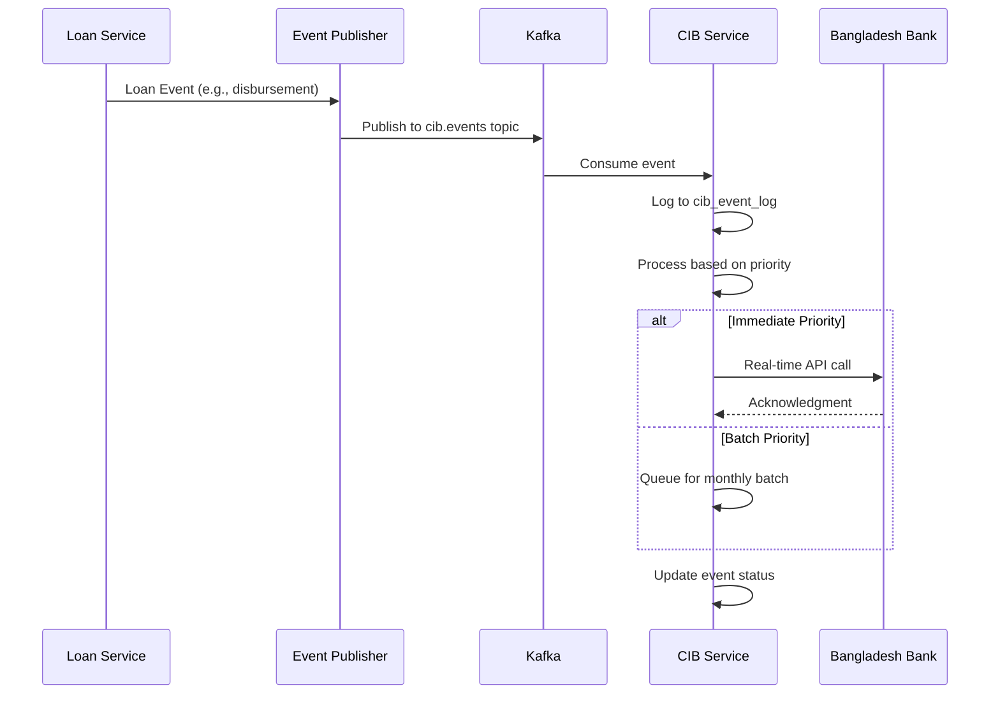

# Data Model: CIB Reports (Inquiry History)

| Document ID | ULMS-ARCH-DM-CIB-001 |
|-------------|----------------------|
| Version | 1.0 |
| Date | 2026-02-05 |
| Author | System Architect |
| Status | Draft |

---

## Revision History

| Version | Date | Author | Changes |
|---------|------|--------|---------|
| 1.0 | 2026-02-05 | System Architect | Initial document creation |

---

## Table of Contents

1. [Introduction](#1-introduction)
2. [CIB Integration Overview](#2-cib-integration-overview)
3. [Data Model Design](#3-data-model-design)
4. [Table Specifications](#4-table-specifications)
5. [CIB Response Caching Strategy](#5-cib-response-caching-strategy)
6. [Batch Reporting Data Structure](#6-batch-reporting-data-structure)
7. [NID Encryption for CIB Queries](#7-nid-encryption-for-cib-queries)
8. [Event-Driven CIB Updates](#8-event-driven-cib-updates)
9. [Error Handling & Retry Logic](#9-error-handling--retry-logic)
10. [Flyway Migration Scripts](#10-flyway-migration-scripts)
11. [Compliance Matrix](#11-compliance-matrix)
12. [Appendices](#12-appendices)

---

## 1. Introduction

### 1.1 Purpose

This document defines the data model for Credit Information Bureau (CIB) integration in the ULMS v2.0 system. It covers real-time inquiry management, response caching, batch reporting, and historical data retention for regulatory compliance.

### 1.2 Scope

- CIB real-time inquiry management
- Response caching with TTL
- 24-month inquiry history retention
- Monthly batch reporting to Bangladesh Bank
- Subject and Contract data file generation
- NID encryption for secure CIB queries

### 1.3 References

| Document | Description |
|----------|-------------|
| BRD Section 6.7 | CIB Integration Requirements |
| SRS Section 6.7 | CIB Technical Specifications |
| BRPD 15/2024 | Loan Classification Guidelines |
| Bangladesh Bank CIB API | Integration Specifications |

### 1.4 CIB Integration Context

```
┌─────────────────────────────────────────────────────────────────────┐
│                    CIB Integration Architecture                      │
├─────────────────────────────────────────────────────────────────────┤
│                                                                      │
│   ┌──────────┐     ┌──────────────┐     ┌─────────────────────┐    │
│   │   ULMS   │────▶│  CIB Service │────▶│  Bangladesh Bank    │    │
│   │  System  │◀────│   (REST)     │◀────│    CIB API          │    │
│   └──────────┘     └──────────────┘     └─────────────────────┘    │
│        │                  │                                          │
│        │                  │                                          │
│        ▼                  ▼                                          │
│   ┌──────────┐     ┌──────────────┐                                 │
│   │  Tenant  │     │  Redis Cache │                                 │
│   │ Database │     │  (1hr TTL)   │                                 │
│   └──────────┘     └──────────────┘                                 │
│                                                                      │
└─────────────────────────────────────────────────────────────────────┘
```

---

## 2. CIB Integration Overview

### 2.1 Integration Types

| Type | Description | Frequency |
|------|-------------|-----------|
| Real-time Inquiry | Credit check during loan origination | On-demand |
| Response Caching | Cache CIB responses | 1-hour TTL |
| Batch Submission | Monthly CIB data upload | Monthly |
| Event Updates | Loan lifecycle event reporting | On events |

### 2.2 CIB Data Categories



### 2.3 CIB Report Fields Summary

| Field Category | Key Fields |
|----------------|------------|
| Identity | NID, TIN, Passport, CIB Subject ID |
| Credit Summary | Total Facilities, Total Outstanding |
| Risk Indicators | Worst Classification, Max DPD |
| Inquiry History | Inquiry Count (6M, 12M, 24M) |

---

## 3. Data Model Design

### 3.1 CIB Domain ERD



### 3.2 Table Summary

| Table Name | Purpose | Est. Rows/Year/Tenant |
|------------|---------|----------------------|
| cib_inquiry | Real-time inquiry records | 50,000 |
| cib_facility_detail | Facility details from CIB | 150,000 |
| cib_response_cache | Cached CIB responses | 10,000 (active) |
| cib_submission_batch | Monthly batch headers | 12 |
| cib_batch_record | Batch submission records | 120,000 |
| cib_event_log | Event-driven CIB updates | 200,000 |

---

## 4. Table Specifications

### 4.1 CIB Inquiry Table (cib_inquiry)

Primary table for storing CIB inquiry requests and responses.

```sql
-- ============================================================================
-- Table: cib_inquiry
-- Purpose: Store CIB real-time inquiry records
-- Schema: Per-tenant (bank_XXX)
-- ============================================================================

CREATE TABLE cib_inquiry (
    -- Primary Key
    id                          BIGSERIAL PRIMARY KEY,

    -- Foreign Keys
    client_id                   BIGINT NOT NULL,
    loan_application_id         BIGINT,

    -- Inquiry Identification
    inquiry_reference_no        VARCHAR(50) NOT NULL UNIQUE,
    cib_subject_id              VARCHAR(30),

    -- Encrypted Identity Data
    nid_number_encrypted        VARCHAR(255) NOT NULL,
    nid_encryption_key_id       VARCHAR(100) NOT NULL,

    -- Request Details
    inquiry_type                VARCHAR(30) NOT NULL DEFAULT 'CREDIT_CHECK',
    inquiry_purpose             VARCHAR(100),
    requested_by                BIGINT NOT NULL,
    requested_at                TIMESTAMP WITH TIME ZONE NOT NULL DEFAULT CURRENT_TIMESTAMP,

    -- Response Details
    response_received_at        TIMESTAMP WITH TIME ZONE,
    response_status             VARCHAR(30),
    response_code               VARCHAR(20),
    response_message            TEXT,

    -- CIB Report Summary
    cib_score                   INTEGER,
    cib_risk_grade              VARCHAR(10),
    total_facilities            INTEGER,
    total_outstanding           DECIMAL(18,2),
    worst_classification        VARCHAR(10),
    max_dpd                     INTEGER,

    -- Inquiry Statistics
    inquiry_count_6m            INTEGER,
    inquiry_count_12m           INTEGER,
    inquiry_count_24m           INTEGER,

    -- Request/Response Storage
    request_payload             JSONB,
    response_payload            JSONB,

    -- Status Tracking
    status                      VARCHAR(30) NOT NULL DEFAULT 'PENDING',
    retry_count                 INTEGER DEFAULT 0,
    last_retry_at               TIMESTAMP WITH TIME ZONE,
    error_details               JSONB,

    -- Audit Fields
    created_at                  TIMESTAMP WITH TIME ZONE DEFAULT CURRENT_TIMESTAMP,
    created_by                  BIGINT NOT NULL,
    updated_at                  TIMESTAMP WITH TIME ZONE DEFAULT CURRENT_TIMESTAMP,
    updated_by                  BIGINT,

    -- Constraints
    CONSTRAINT chk_inquiry_type CHECK (inquiry_type IN (
        'CREDIT_CHECK', 'PERIODIC_REVIEW', 'COLLECTION', 'MONITORING'
    )),
    CONSTRAINT chk_inquiry_status CHECK (status IN (
        'PENDING', 'SUBMITTED', 'PROCESSING', 'COMPLETED', 'FAILED', 'TIMEOUT', 'CANCELLED'
    )),
    CONSTRAINT chk_response_status CHECK (response_status IN (
        'SUCCESS', 'NO_DATA', 'PARTIAL', 'ERROR', 'INVALID_NID'
    )),
    CONSTRAINT chk_risk_grade CHECK (cib_risk_grade IN (
        'A', 'B', 'C', 'D', 'E', 'F', 'UNRATED'
    ))
);

-- Foreign Key Constraints
ALTER TABLE cib_inquiry
    ADD CONSTRAINT fk_cib_inquiry_client
    FOREIGN KEY (client_id) REFERENCES m_client(id);

ALTER TABLE cib_inquiry
    ADD CONSTRAINT fk_cib_inquiry_loan_app
    FOREIGN KEY (loan_application_id) REFERENCES m_loan(id);

-- Indexes
CREATE INDEX idx_cib_inquiry_client ON cib_inquiry(client_id);
CREATE INDEX idx_cib_inquiry_nid ON cib_inquiry(nid_number_encrypted);
CREATE INDEX idx_cib_inquiry_status ON cib_inquiry(status);
CREATE INDEX idx_cib_inquiry_requested ON cib_inquiry(requested_at);
CREATE INDEX idx_cib_inquiry_loan_app ON cib_inquiry(loan_application_id);

-- Partial index for pending inquiries
CREATE INDEX idx_cib_inquiry_pending ON cib_inquiry(status, requested_at)
    WHERE status IN ('PENDING', 'SUBMITTED', 'PROCESSING');

-- Comments
COMMENT ON TABLE cib_inquiry IS 'CIB real-time inquiry records with request/response data';
COMMENT ON COLUMN cib_inquiry.nid_number_encrypted IS 'AES-256-CBC encrypted NID for CIB query';
COMMENT ON COLUMN cib_inquiry.cib_score IS 'Credit score from CIB (0-999)';
COMMENT ON COLUMN cib_inquiry.worst_classification IS 'Worst classification across all facilities';
```

### 4.2 CIB Facility Detail Table (cib_facility_detail)

```sql
-- ============================================================================
-- Table: cib_facility_detail
-- Purpose: Store individual facility details from CIB response
-- Schema: Per-tenant (bank_XXX)
-- ============================================================================

CREATE TABLE cib_facility_detail (
    -- Primary Key
    id                          BIGSERIAL PRIMARY KEY,

    -- Foreign Key
    cib_inquiry_id              BIGINT NOT NULL,

    -- Facility Identification
    facility_reference          VARCHAR(50),
    reporting_fi_code           VARCHAR(20) NOT NULL,
    reporting_fi_name           VARCHAR(200),

    -- Facility Type
    facility_type_code          VARCHAR(10) NOT NULL,
    facility_type_name          VARCHAR(100),
    facility_sub_type           VARCHAR(50),

    -- Amount Details
    sanctioned_limit            DECIMAL(18,2),
    outstanding_amount          DECIMAL(18,2),
    overdue_amount              DECIMAL(18,2),
    written_off_amount          DECIMAL(18,2),

    -- Dates
    facility_start_date         DATE,
    facility_maturity_date      DATE,
    last_payment_date           DATE,

    -- Classification & DPD
    classification_status       VARCHAR(10),
    days_past_due               INTEGER,
    classification_date         DATE,

    -- Interest Details
    interest_rate               DECIMAL(8,4),
    interest_suspense           DECIMAL(18,2),

    -- Collateral
    collateral_type             VARCHAR(50),
    collateral_value            DECIMAL(18,2),

    -- Guarantor Info
    has_guarantor               BOOLEAN DEFAULT FALSE,
    guarantor_count             INTEGER,

    -- Status
    facility_status             VARCHAR(30),
    is_restructured             BOOLEAN DEFAULT FALSE,
    is_rescheduled              BOOLEAN DEFAULT FALSE,

    -- Audit Fields
    created_at                  TIMESTAMP WITH TIME ZONE DEFAULT CURRENT_TIMESTAMP,

    -- Constraints
    CONSTRAINT chk_facility_classification CHECK (classification_status IN (
        'STD', 'SMA', 'SS', 'DF', 'BL'
    )),
    CONSTRAINT chk_facility_status CHECK (facility_status IN (
        'ACTIVE', 'CLOSED', 'WRITTEN_OFF', 'SETTLED', 'TRANSFERRED'
    ))
);

-- Foreign Key
ALTER TABLE cib_facility_detail
    ADD CONSTRAINT fk_facility_cib_inquiry
    FOREIGN KEY (cib_inquiry_id) REFERENCES cib_inquiry(id) ON DELETE CASCADE;

-- Indexes
CREATE INDEX idx_cib_facility_inquiry ON cib_facility_detail(cib_inquiry_id);
CREATE INDEX idx_cib_facility_fi ON cib_facility_detail(reporting_fi_code);
CREATE INDEX idx_cib_facility_type ON cib_facility_detail(facility_type_code);
CREATE INDEX idx_cib_facility_classification ON cib_facility_detail(classification_status);

-- Comments
COMMENT ON TABLE cib_facility_detail IS 'Individual credit facility details from CIB report';
COMMENT ON COLUMN cib_facility_detail.reporting_fi_code IS 'Bangladesh Bank FI code of reporting institution';
```

### 4.3 CIB Response Cache Table (cib_response_cache)

```sql
-- ============================================================================
-- Table: cib_response_cache
-- Purpose: Cache CIB responses with 1-hour TTL
-- Schema: Per-tenant (bank_XXX)
-- ============================================================================

CREATE TABLE cib_response_cache (
    -- Primary Key
    id                          BIGSERIAL PRIMARY KEY,

    -- Cache Key (NID hash + inquiry type)
    cache_key                   VARCHAR(128) NOT NULL UNIQUE,

    -- Source Reference
    cib_inquiry_id              BIGINT NOT NULL,
    client_id                   BIGINT NOT NULL,

    -- Cached Response
    response_data               JSONB NOT NULL,
    summary_data                JSONB,

    -- Cache Metadata
    cached_at                   TIMESTAMP WITH TIME ZONE NOT NULL DEFAULT CURRENT_TIMESTAMP,
    expires_at                  TIMESTAMP WITH TIME ZONE NOT NULL,
    ttl_seconds                 INTEGER NOT NULL DEFAULT 3600,

    -- Cache Hit Statistics
    hit_count                   INTEGER DEFAULT 0,
    last_hit_at                 TIMESTAMP WITH TIME ZONE,

    -- Status
    is_valid                    BOOLEAN DEFAULT TRUE,
    invalidated_at              TIMESTAMP WITH TIME ZONE,
    invalidation_reason         VARCHAR(100),

    -- Constraints
    CONSTRAINT chk_cache_expiry CHECK (expires_at > cached_at)
);

-- Foreign Keys
ALTER TABLE cib_response_cache
    ADD CONSTRAINT fk_cache_cib_inquiry
    FOREIGN KEY (cib_inquiry_id) REFERENCES cib_inquiry(id);

ALTER TABLE cib_response_cache
    ADD CONSTRAINT fk_cache_client
    FOREIGN KEY (client_id) REFERENCES m_client(id);

-- Indexes
CREATE INDEX idx_cib_cache_key ON cib_response_cache(cache_key);
CREATE INDEX idx_cib_cache_client ON cib_response_cache(client_id);
CREATE INDEX idx_cib_cache_expires ON cib_response_cache(expires_at);
CREATE INDEX idx_cib_cache_valid ON cib_response_cache(is_valid, expires_at);

-- Comments
COMMENT ON TABLE cib_response_cache IS 'CIB response cache with 1-hour TTL';
COMMENT ON COLUMN cib_response_cache.cache_key IS 'SHA-256 hash of NID + inquiry_type';
COMMENT ON COLUMN cib_response_cache.ttl_seconds IS 'Time-to-live in seconds (default 3600 = 1 hour)';
```

### 4.4 CIB Inquiry History View (24-month)

```sql
-- ============================================================================
-- View: v_cib_inquiry_history
-- Purpose: 24-month rolling window of CIB inquiries
-- Schema: Per-tenant (bank_XXX)
-- ============================================================================

CREATE OR REPLACE VIEW v_cib_inquiry_history AS
SELECT
    ci.id,
    ci.client_id,
    c.display_name AS client_name,
    ci.inquiry_reference_no,
    ci.inquiry_type,
    ci.inquiry_purpose,
    ci.requested_at,
    ci.response_received_at,
    ci.status,
    ci.cib_score,
    ci.cib_risk_grade,
    ci.total_facilities,
    ci.total_outstanding,
    ci.worst_classification,
    ci.max_dpd,
    ci.inquiry_count_6m,
    ci.inquiry_count_12m,
    ci.inquiry_count_24m,
    EXTRACT(EPOCH FROM (ci.response_received_at - ci.requested_at)) AS response_time_seconds,
    u.username AS requested_by_user
FROM cib_inquiry ci
JOIN m_client c ON ci.client_id = c.id
LEFT JOIN app_user u ON ci.requested_by = u.id
WHERE ci.requested_at >= (CURRENT_DATE - INTERVAL '24 months')
    AND ci.status = 'COMPLETED';

COMMENT ON VIEW v_cib_inquiry_history IS '24-month rolling window of completed CIB inquiries';
```

### 4.5 CIB Submission Batch Table (cib_submission_batch)

```sql
-- ============================================================================
-- Table: cib_submission_batch
-- Purpose: Track monthly CIB batch submissions to Bangladesh Bank
-- Schema: Per-tenant (bank_XXX)
-- ============================================================================

CREATE TABLE cib_submission_batch (
    -- Primary Key
    id                          BIGSERIAL PRIMARY KEY,

    -- Batch Identification
    batch_reference             VARCHAR(50) NOT NULL UNIQUE,
    reporting_month             DATE NOT NULL,
    reporting_fi_code           VARCHAR(20) NOT NULL,

    -- Batch Statistics
    total_subject_records       INTEGER DEFAULT 0,
    total_contract_records      INTEGER DEFAULT 0,
    total_records               INTEGER GENERATED ALWAYS AS
                                (total_subject_records + total_contract_records) STORED,

    -- File Information
    subject_file_name           VARCHAR(255),
    subject_file_path           VARCHAR(500),
    subject_file_checksum       VARCHAR(64),
    contract_file_name          VARCHAR(255),
    contract_file_path          VARCHAR(500),
    contract_file_checksum      VARCHAR(64),

    -- Submission Details
    submission_channel          VARCHAR(30) DEFAULT 'API',
    submitted_at                TIMESTAMP WITH TIME ZONE,
    submitted_by                BIGINT,

    -- Response from Bangladesh Bank
    acknowledgment_no           VARCHAR(50),
    acknowledged_at             TIMESTAMP WITH TIME ZONE,
    acceptance_status           VARCHAR(30),
    rejection_count             INTEGER DEFAULT 0,
    rejection_details           JSONB,

    -- Status Tracking
    status                      VARCHAR(30) NOT NULL DEFAULT 'DRAFT',
    status_changed_at           TIMESTAMP WITH TIME ZONE,
    error_message               TEXT,

    -- Audit Fields
    created_at                  TIMESTAMP WITH TIME ZONE DEFAULT CURRENT_TIMESTAMP,
    created_by                  BIGINT NOT NULL,
    updated_at                  TIMESTAMP WITH TIME ZONE DEFAULT CURRENT_TIMESTAMP,
    updated_by                  BIGINT,

    -- Constraints
    CONSTRAINT chk_batch_status CHECK (status IN (
        'DRAFT', 'GENERATING', 'GENERATED', 'VALIDATING', 'VALIDATED',
        'SUBMITTING', 'SUBMITTED', 'ACKNOWLEDGED', 'ACCEPTED',
        'PARTIALLY_ACCEPTED', 'REJECTED', 'FAILED'
    )),
    CONSTRAINT chk_submission_channel CHECK (submission_channel IN (
        'API', 'SFTP', 'MANUAL'
    )),
    CONSTRAINT uk_batch_month UNIQUE (reporting_fi_code, reporting_month)
);

-- Indexes
CREATE INDEX idx_batch_month ON cib_submission_batch(reporting_month);
CREATE INDEX idx_batch_status ON cib_submission_batch(status);
CREATE INDEX idx_batch_submitted ON cib_submission_batch(submitted_at);

-- Comments
COMMENT ON TABLE cib_submission_batch IS 'Monthly CIB batch submission tracking';
COMMENT ON COLUMN cib_submission_batch.reporting_month IS 'First day of reporting month';
```

### 4.6 CIB Batch Record Table (cib_batch_record)

```sql
-- ============================================================================
-- Table: cib_batch_record
-- Purpose: Individual records within CIB batch submission
-- Schema: Per-tenant (bank_XXX)
-- ============================================================================

CREATE TABLE cib_batch_record (
    -- Primary Key
    id                          BIGSERIAL PRIMARY KEY,

    -- Foreign Keys
    batch_id                    BIGINT NOT NULL,
    client_id                   BIGINT NOT NULL,
    loan_id                     BIGINT,

    -- Record Identification
    record_sequence             INTEGER NOT NULL,
    record_type                 VARCHAR(20) NOT NULL,
    cib_subject_id              VARCHAR(30),

    -- Fixed-Width Data (CIB Format)
    fixed_width_data            TEXT NOT NULL,
    record_length               INTEGER NOT NULL,

    -- Structured Data (for reference)
    structured_data             JSONB,

    -- Validation
    validation_status           VARCHAR(30) DEFAULT 'PENDING',
    validation_errors           JSONB,
    validated_at                TIMESTAMP WITH TIME ZONE,

    -- Submission Status
    submission_status           VARCHAR(30) DEFAULT 'PENDING',
    bb_response_code            VARCHAR(20),
    bb_response_message         TEXT,

    -- Audit Fields
    created_at                  TIMESTAMP WITH TIME ZONE DEFAULT CURRENT_TIMESTAMP,
    updated_at                  TIMESTAMP WITH TIME ZONE DEFAULT CURRENT_TIMESTAMP,

    -- Constraints
    CONSTRAINT chk_record_type CHECK (record_type IN (
        'SUBJECT', 'CONTRACT', 'COLLATERAL', 'GUARANTOR'
    )),
    CONSTRAINT chk_validation_status CHECK (validation_status IN (
        'PENDING', 'VALID', 'INVALID', 'WARNING'
    )),
    CONSTRAINT chk_submission_status CHECK (submission_status IN (
        'PENDING', 'SUBMITTED', 'ACCEPTED', 'REJECTED'
    )),
    CONSTRAINT uk_batch_record_seq UNIQUE (batch_id, record_type, record_sequence)
);

-- Foreign Keys
ALTER TABLE cib_batch_record
    ADD CONSTRAINT fk_record_batch
    FOREIGN KEY (batch_id) REFERENCES cib_submission_batch(id) ON DELETE CASCADE;

ALTER TABLE cib_batch_record
    ADD CONSTRAINT fk_record_client
    FOREIGN KEY (client_id) REFERENCES m_client(id);

ALTER TABLE cib_batch_record
    ADD CONSTRAINT fk_record_loan
    FOREIGN KEY (loan_id) REFERENCES m_loan(id);

-- Indexes
CREATE INDEX idx_batch_record_batch ON cib_batch_record(batch_id);
CREATE INDEX idx_batch_record_client ON cib_batch_record(client_id);
CREATE INDEX idx_batch_record_loan ON cib_batch_record(loan_id);
CREATE INDEX idx_batch_record_type ON cib_batch_record(record_type);
CREATE INDEX idx_batch_record_validation ON cib_batch_record(validation_status);

-- Comments
COMMENT ON TABLE cib_batch_record IS 'Individual records within CIB batch submission';
COMMENT ON COLUMN cib_batch_record.fixed_width_data IS 'Fixed-width formatted data per Bangladesh Bank spec';
```

### 4.7 CIB Event Log Table (cib_event_log)

```sql
-- ============================================================================
-- Table: cib_event_log
-- Purpose: Track loan lifecycle events for CIB reporting
-- Schema: Per-tenant (bank_XXX)
-- ============================================================================

CREATE TABLE cib_event_log (
    -- Primary Key
    id                          BIGSERIAL PRIMARY KEY,

    -- Foreign Keys
    loan_id                     BIGINT NOT NULL,
    client_id                   BIGINT NOT NULL,

    -- Event Details
    event_type                  VARCHAR(50) NOT NULL,
    event_reference             VARCHAR(50),
    event_timestamp             TIMESTAMP WITH TIME ZONE NOT NULL DEFAULT CURRENT_TIMESTAMP,

    -- Pre/Post State
    previous_state              JSONB,
    new_state                   JSONB,
    change_summary              TEXT,

    -- CIB Reporting
    requires_cib_update         BOOLEAN DEFAULT TRUE,
    cib_update_priority         VARCHAR(10) DEFAULT 'NORMAL',

    -- Processing Status
    status                      VARCHAR(30) NOT NULL DEFAULT 'PENDING',
    processed_at                TIMESTAMP WITH TIME ZONE,
    processed_by                VARCHAR(100),

    -- Batch Association
    batch_id                    BIGINT,
    batch_record_id             BIGINT,

    -- Error Handling
    retry_count                 INTEGER DEFAULT 0,
    last_error                  TEXT,

    -- Audit Fields
    created_at                  TIMESTAMP WITH TIME ZONE DEFAULT CURRENT_TIMESTAMP,
    created_by                  BIGINT,

    -- Constraints
    CONSTRAINT chk_event_type CHECK (event_type IN (
        'LOAN_DISBURSEMENT', 'PAYMENT_RECEIVED', 'MISSED_PAYMENT',
        'CLASSIFICATION_CHANGE', 'RESTRUCTURING', 'RESCHEDULING',
        'WRITE_OFF', 'RECOVERY', 'SETTLEMENT', 'LOAN_CLOSURE',
        'COLLATERAL_UPDATE', 'LIMIT_CHANGE', 'RATE_CHANGE'
    )),
    CONSTRAINT chk_event_status CHECK (status IN (
        'PENDING', 'PROCESSING', 'PROCESSED', 'FAILED', 'SKIPPED'
    )),
    CONSTRAINT chk_event_priority CHECK (cib_update_priority IN (
        'IMMEDIATE', 'HIGH', 'NORMAL', 'LOW'
    ))
);

-- Foreign Keys
ALTER TABLE cib_event_log
    ADD CONSTRAINT fk_event_loan
    FOREIGN KEY (loan_id) REFERENCES m_loan(id);

ALTER TABLE cib_event_log
    ADD CONSTRAINT fk_event_client
    FOREIGN KEY (client_id) REFERENCES m_client(id);

ALTER TABLE cib_event_log
    ADD CONSTRAINT fk_event_batch
    FOREIGN KEY (batch_id) REFERENCES cib_submission_batch(id);

ALTER TABLE cib_event_log
    ADD CONSTRAINT fk_event_batch_record
    FOREIGN KEY (batch_record_id) REFERENCES cib_batch_record(id);

-- Indexes
CREATE INDEX idx_event_loan ON cib_event_log(loan_id);
CREATE INDEX idx_event_client ON cib_event_log(client_id);
CREATE INDEX idx_event_type ON cib_event_log(event_type);
CREATE INDEX idx_event_status ON cib_event_log(status);
CREATE INDEX idx_event_timestamp ON cib_event_log(event_timestamp);
CREATE INDEX idx_event_pending ON cib_event_log(status, cib_update_priority)
    WHERE status = 'PENDING';

-- Comments
COMMENT ON TABLE cib_event_log IS 'Loan lifecycle events for CIB reporting';
COMMENT ON COLUMN cib_event_log.requires_cib_update IS 'Whether this event requires CIB notification';
```

---

## 5. CIB Response Caching Strategy

### 5.1 Cache Architecture

```
┌─────────────────────────────────────────────────────────────────────┐
│                    CIB Response Caching Flow                         │
├─────────────────────────────────────────────────────────────────────┤
│                                                                      │
│   ┌──────────┐     ┌─────────────────┐     ┌──────────────┐        │
│   │  Request │────▶│  Check Redis    │────▶│  Cache Hit?  │        │
│   └──────────┘     │  (L1 Cache)     │     └──────────────┘        │
│                    └─────────────────┘            │                  │
│                                              Yes  │  No              │
│                                                   ▼                  │
│                    ┌─────────────────┐     ┌──────────────┐        │
│                    │  Return Cached  │◀────│  Check DB    │        │
│                    │  Response       │     │  (L2 Cache)  │        │
│                    └─────────────────┘     └──────────────┘        │
│                                                   │ Miss             │
│                                                   ▼                  │
│                    ┌─────────────────┐     ┌──────────────┐        │
│                    │  Store in       │◀────│  Call CIB    │        │
│                    │  Both Caches    │     │  API         │        │
│                    └─────────────────┘     └──────────────┘        │
│                                                                      │
└─────────────────────────────────────────────────────────────────────┘
```

### 5.2 Cache Key Generation

```java
/**
 * Generate cache key for CIB response
 * Format: cib:{tenant_id}:{sha256(nid)}:{inquiry_type}
 */
public String generateCacheKey(String tenantId, String nid, String inquiryType) {
    String nidHash = DigestUtils.sha256Hex(nid);
    return String.format("cib:%s:%s:%s", tenantId, nidHash, inquiryType);
}
```

### 5.3 Cache Configuration

| Parameter | Value | Description |
|-----------|-------|-------------|
| L1 Cache (Redis) | 1 hour TTL | Primary cache |
| L2 Cache (PostgreSQL) | 1 hour TTL | Fallback cache |
| Max Cache Size | 100,000 entries | Per tenant |
| Cache Eviction | LRU | Least Recently Used |

### 5.4 Cache Invalidation Triggers

| Event | Action | Priority |
|-------|--------|----------|
| New loan disbursement | Invalidate client cache | Immediate |
| Classification change | Invalidate client cache | High |
| Manual refresh request | Invalidate specific cache | Normal |
| TTL expiry | Automatic removal | N/A |

---

## 6. Batch Reporting Data Structure

### 6.1 Subject Data File Format (Fixed-Width)

```
┌─────────────────────────────────────────────────────────────────────┐
│                    Subject Record Layout (500 bytes)                 │
├─────────────────────────────────────────────────────────────────────┤
│ Field                    │ Start │ Length │ Type    │ Mandatory     │
├─────────────────────────────────────────────────────────────────────┤
│ Record Type              │ 1     │ 2      │ AN      │ Yes (01)      │
│ CIB Subject ID           │ 3     │ 15     │ AN      │ Yes           │
│ Subject Name             │ 18    │ 100    │ AN      │ Yes           │
│ Father's Name            │ 118   │ 80     │ AN      │ Yes           │
│ Mother's Name            │ 198   │ 80     │ AN      │ Yes           │
│ Date of Birth            │ 278   │ 8      │ N       │ Yes (YYYYMMDD)│
│ Gender                   │ 286   │ 1      │ AN      │ Yes (M/F)     │
│ NID Number               │ 287   │ 17     │ AN      │ Conditional   │
│ TIN Number               │ 304   │ 12     │ AN      │ Optional      │
│ Passport Number          │ 316   │ 20     │ AN      │ Optional      │
│ Present Address          │ 336   │ 80     │ AN      │ Yes           │
│ Present District         │ 416   │ 2      │ N       │ Yes (BB Code) │
│ Permanent Address        │ 418   │ 80     │ AN      │ Yes           │
│ Permanent District       │ 498   │ 2      │ N       │ Yes (BB Code) │
└─────────────────────────────────────────────────────────────────────┘

AN = Alphanumeric, N = Numeric
```

### 6.2 Contract Data File Format (Fixed-Width)

```
┌─────────────────────────────────────────────────────────────────────┐
│                    Contract Record Layout (600 bytes)                │
├─────────────────────────────────────────────────────────────────────┤
│ Field                    │ Start │ Length │ Type    │ Mandatory     │
├─────────────────────────────────────────────────────────────────────┤
│ Record Type              │ 1     │ 2      │ AN      │ Yes (02)      │
│ CIB Subject ID           │ 3     │ 15     │ AN      │ Yes           │
│ Contract Reference       │ 18    │ 20     │ AN      │ Yes           │
│ Facility Type            │ 38    │ 3      │ AN      │ Yes (BB Code) │
│ Facility Sub-Type        │ 41    │ 3      │ AN      │ Optional      │
│ Sector Code              │ 44    │ 4      │ AN      │ Yes           │
│ Sanctioned Limit         │ 48    │ 15     │ N       │ Yes (2 dec)   │
│ Outstanding Balance      │ 63    │ 15     │ N       │ Yes (2 dec)   │
│ Overdue Amount           │ 78    │ 15     │ N       │ Yes (2 dec)   │
│ Disbursement Date        │ 93    │ 8      │ N       │ Yes (YYYYMMDD)│
│ Maturity Date            │ 101   │ 8      │ N       │ Yes (YYYYMMDD)│
│ Classification Status    │ 109   │ 3      │ AN      │ Yes           │
│ Days Past Due            │ 112   │ 4      │ N       │ Yes           │
│ Interest Rate            │ 116   │ 6      │ N       │ Yes (2 dec)   │
│ Interest Suspense        │ 122   │ 15     │ N       │ Conditional   │
│ Collateral Value         │ 137   │ 15     │ N       │ Optional      │
│ Collateral Type          │ 152   │ 2      │ AN      │ Optional      │
│ Restructure Flag         │ 154   │ 1      │ AN      │ Yes (Y/N)     │
│ Write-off Amount         │ 155   │ 15     │ N       │ Conditional   │
│ Last Payment Date        │ 170   │ 8      │ N       │ Optional      │
│ Last Payment Amount      │ 178   │ 15     │ N       │ Optional      │
│ Reserved                 │ 193   │ 408    │ AN      │ -             │
└─────────────────────────────────────────────────────────────────────┘
```

### 6.3 Batch Generation Function

```sql
-- ============================================================================
-- Function: fn_generate_cib_batch_records
-- Purpose: Generate CIB batch records for monthly submission
-- ============================================================================

CREATE OR REPLACE FUNCTION fn_generate_cib_batch_records(
    p_batch_id BIGINT,
    p_reporting_month DATE
) RETURNS INTEGER AS $$
DECLARE
    v_record_count INTEGER := 0;
    v_loan RECORD;
    v_subject_data TEXT;
    v_contract_data TEXT;
    v_sequence INTEGER := 0;
BEGIN
    -- Generate Subject Records for all active borrowers
    FOR v_loan IN
        SELECT DISTINCT
            l.id AS loan_id,
            c.id AS client_id,
            c.display_name,
            c.fathers_name,
            c.mothers_name,
            c.date_of_birth,
            c.gender,
            decrypt_aes256(c.nid_number_encrypted, c.nid_encryption_key_id) AS nid,
            c.tin_number,
            l.principal_outstanding_derived,
            l.total_overdue_derived,
            l.loan_status,
            l.disbursedon_date,
            l.maturedon_date,
            lc.classification_status,
            lc.days_past_due
        FROM m_loan l
        JOIN m_client c ON l.client_id = c.id
        LEFT JOIN loan_classification_history lc ON l.id = lc.loan_id
            AND lc.classification_date = (
                SELECT MAX(classification_date)
                FROM loan_classification_history
                WHERE loan_id = l.id
            )
        WHERE l.loan_status IN ('ACTIVE', 'CLOSED', 'WRITTEN_OFF')
            AND (l.closedon_date IS NULL OR l.closedon_date >= p_reporting_month)
    LOOP
        v_sequence := v_sequence + 1;

        -- Generate Subject Record (fixed-width)
        v_subject_data := fn_format_subject_record(
            v_loan.client_id,
            v_loan.display_name,
            v_loan.fathers_name,
            v_loan.mothers_name,
            v_loan.date_of_birth,
            v_loan.gender,
            v_loan.nid
        );

        INSERT INTO cib_batch_record (
            batch_id, client_id, loan_id, record_sequence,
            record_type, fixed_width_data, record_length
        ) VALUES (
            p_batch_id, v_loan.client_id, v_loan.loan_id, v_sequence,
            'SUBJECT', v_subject_data, 500
        );

        -- Generate Contract Record (fixed-width)
        v_contract_data := fn_format_contract_record(
            v_loan.loan_id,
            v_loan.principal_outstanding_derived,
            v_loan.total_overdue_derived,
            v_loan.disbursedon_date,
            v_loan.maturedon_date,
            v_loan.classification_status,
            v_loan.days_past_due
        );

        INSERT INTO cib_batch_record (
            batch_id, client_id, loan_id, record_sequence,
            record_type, fixed_width_data, record_length
        ) VALUES (
            p_batch_id, v_loan.client_id, v_loan.loan_id, v_sequence,
            'CONTRACT', v_contract_data, 600
        );

        v_record_count := v_record_count + 2;
    END LOOP;

    -- Update batch statistics
    UPDATE cib_submission_batch
    SET total_subject_records = v_record_count / 2,
        total_contract_records = v_record_count / 2,
        status = 'GENERATED',
        updated_at = CURRENT_TIMESTAMP
    WHERE id = p_batch_id;

    RETURN v_record_count;
END;
$$ LANGUAGE plpgsql;
```

---

## 7. NID Encryption for CIB Queries

### 7.1 Encryption Flow

```
┌─────────────────────────────────────────────────────────────────────┐
│                    NID Encryption for CIB                            │
├─────────────────────────────────────────────────────────────────────┤
│                                                                      │
│   ┌──────────┐     ┌──────────────┐     ┌─────────────────────┐    │
│   │   NID    │────▶│  HashiCorp   │────▶│  Encrypted NID      │    │
│   │  (Plain) │     │  Vault       │     │  (AES-256-CBC)      │    │
│   └──────────┘     └──────────────┘     └─────────────────────┘    │
│                           │                       │                  │
│                           │                       │                  │
│                           ▼                       ▼                  │
│                    ┌──────────────┐     ┌─────────────────────┐    │
│                    │  Key ID      │     │  Store in           │    │
│                    │  Reference   │     │  cib_inquiry        │    │
│                    └──────────────┘     └─────────────────────┘    │
│                                                                      │
│   For CIB Query:                                                    │
│   ┌──────────────┐     ┌──────────────┐     ┌──────────────┐       │
│   │  Retrieve    │────▶│  Decrypt via │────▶│  Send to     │       │
│   │  Encrypted   │     │  Vault       │     │  CIB API     │       │
│   └──────────────┘     └──────────────┘     └──────────────┘       │
│                                                                      │
└─────────────────────────────────────────────────────────────────────┘
```

### 7.2 Encryption Functions

```sql
-- ============================================================================
-- Function: encrypt_nid_for_cib
-- Purpose: Encrypt NID before storing in CIB inquiry
-- ============================================================================

CREATE OR REPLACE FUNCTION encrypt_nid_for_cib(
    p_nid VARCHAR(17),
    p_tenant_id VARCHAR(50)
) RETURNS TABLE (
    encrypted_nid VARCHAR(255),
    key_id VARCHAR(100)
) AS $$
DECLARE
    v_key_id VARCHAR(100);
    v_encrypted VARCHAR(255);
BEGIN
    -- Get current encryption key from Vault (via extension)
    v_key_id := vault_get_current_key_id(p_tenant_id, 'cib-nid');

    -- Encrypt using AES-256-CBC
    v_encrypted := vault_encrypt(p_nid, v_key_id);

    RETURN QUERY SELECT v_encrypted, v_key_id;
END;
$$ LANGUAGE plpgsql SECURITY DEFINER;

-- ============================================================================
-- Function: decrypt_nid_for_cib
-- Purpose: Decrypt NID for CIB API call
-- ============================================================================

CREATE OR REPLACE FUNCTION decrypt_nid_for_cib(
    p_encrypted_nid VARCHAR(255),
    p_key_id VARCHAR(100)
) RETURNS VARCHAR(17) AS $$
BEGIN
    -- Decrypt using Vault
    RETURN vault_decrypt(p_encrypted_nid, p_key_id);
END;
$$ LANGUAGE plpgsql SECURITY DEFINER;
```

### 7.3 Key Management Policy

| Policy | Value |
|--------|-------|
| Key Rotation | Every 90 days |
| Key Algorithm | AES-256-CBC |
| Key Storage | HashiCorp Vault |
| Old Key Retention | 2 years (for decryption) |
| Access Control | Service account only |

---

## 8. Event-Driven CIB Updates

### 8.1 Event Types and Priorities

| Event Type | CIB Action | Priority | SLA |
|------------|------------|----------|-----|
| LOAN_DISBURSEMENT | New contract report | IMMEDIATE | Same day |
| CLASSIFICATION_CHANGE | Update classification | HIGH | 24 hours |
| MISSED_PAYMENT | Update DPD | NORMAL | 48 hours |
| PAYMENT_RECEIVED | Update outstanding | NORMAL | 48 hours |
| WRITE_OFF | Report write-off | HIGH | 24 hours |
| LOAN_CLOSURE | Close contract | NORMAL | 48 hours |
| RESTRUCTURING | Report restructure | HIGH | 24 hours |

### 8.2 Event Processing Flow



### 8.3 Event Trigger Function

```sql
-- ============================================================================
-- Trigger: trg_loan_cib_event
-- Purpose: Automatically log CIB-relevant loan events
-- ============================================================================

CREATE OR REPLACE FUNCTION fn_log_loan_cib_event()
RETURNS TRIGGER AS $$
DECLARE
    v_event_type VARCHAR(50);
    v_priority VARCHAR(10);
    v_requires_update BOOLEAN := TRUE;
BEGIN
    -- Determine event type and priority based on change
    IF TG_OP = 'INSERT' AND NEW.loan_status = 'DISBURSED' THEN
        v_event_type := 'LOAN_DISBURSEMENT';
        v_priority := 'IMMEDIATE';
    ELSIF TG_OP = 'UPDATE' THEN
        -- Classification change
        IF OLD.classification_status IS DISTINCT FROM NEW.classification_status THEN
            v_event_type := 'CLASSIFICATION_CHANGE';
            v_priority := 'HIGH';
        -- Status change to closed
        ELSIF NEW.loan_status = 'CLOSED' AND OLD.loan_status != 'CLOSED' THEN
            v_event_type := 'LOAN_CLOSURE';
            v_priority := 'NORMAL';
        -- Status change to written off
        ELSIF NEW.loan_status = 'WRITTEN_OFF' AND OLD.loan_status != 'WRITTEN_OFF' THEN
            v_event_type := 'WRITE_OFF';
            v_priority := 'HIGH';
        -- Payment received (outstanding decreased)
        ELSIF NEW.principal_outstanding_derived < OLD.principal_outstanding_derived THEN
            v_event_type := 'PAYMENT_RECEIVED';
            v_priority := 'NORMAL';
        ELSE
            v_requires_update := FALSE;
        END IF;
    END IF;

    -- Log event if CIB update required
    IF v_requires_update AND v_event_type IS NOT NULL THEN
        INSERT INTO cib_event_log (
            loan_id, client_id, event_type, cib_update_priority,
            previous_state, new_state, created_by
        ) VALUES (
            NEW.id, NEW.client_id, v_event_type, v_priority,
            row_to_json(OLD)::JSONB, row_to_json(NEW)::JSONB,
            NEW.updated_by
        );
    END IF;

    RETURN NEW;
END;
$$ LANGUAGE plpgsql;

-- Create trigger
CREATE TRIGGER trg_loan_cib_event
    AFTER INSERT OR UPDATE ON m_loan
    FOR EACH ROW
    EXECUTE FUNCTION fn_log_loan_cib_event();
```

---

## 9. Error Handling & Retry Logic

### 9.1 Retry Configuration

| Error Type | Max Retries | Initial Delay | Backoff Multiplier |
|------------|-------------|---------------|-------------------|
| Connection Timeout | 3 | 5 seconds | 2x |
| API Error (5xx) | 5 | 10 seconds | 2x |
| Rate Limit (429) | 10 | 60 seconds | 1.5x |
| Invalid Response | 2 | 30 seconds | 1x |
| Authentication Error | 0 | N/A | N/A |

### 9.2 Error Status Table

```sql
-- ============================================================================
-- Table: cib_api_error_log
-- Purpose: Track CIB API errors for monitoring and retry
-- Schema: Per-tenant (bank_XXX)
-- ============================================================================

CREATE TABLE cib_api_error_log (
    -- Primary Key
    id                          BIGSERIAL PRIMARY KEY,

    -- Reference
    inquiry_id                  BIGINT,
    batch_id                    BIGINT,

    -- Error Details
    error_code                  VARCHAR(50) NOT NULL,
    error_category              VARCHAR(30) NOT NULL,
    error_message               TEXT,
    error_details               JSONB,

    -- Request Info
    api_endpoint                VARCHAR(255),
    http_method                 VARCHAR(10),
    http_status_code            INTEGER,
    request_timestamp           TIMESTAMP WITH TIME ZONE,
    response_timestamp          TIMESTAMP WITH TIME ZONE,

    -- Retry Info
    retry_attempt               INTEGER DEFAULT 0,
    next_retry_at               TIMESTAMP WITH TIME ZONE,
    is_retryable                BOOLEAN DEFAULT TRUE,

    -- Resolution
    resolved_at                 TIMESTAMP WITH TIME ZONE,
    resolution_type             VARCHAR(30),
    resolution_notes            TEXT,

    -- Audit Fields
    created_at                  TIMESTAMP WITH TIME ZONE DEFAULT CURRENT_TIMESTAMP,

    -- Constraints
    CONSTRAINT chk_error_category CHECK (error_category IN (
        'CONNECTION', 'TIMEOUT', 'AUTHENTICATION', 'RATE_LIMIT',
        'VALIDATION', 'API_ERROR', 'DATA_ERROR', 'UNKNOWN'
    )),
    CONSTRAINT chk_resolution_type CHECK (resolution_type IN (
        'RETRY_SUCCESS', 'MANUAL_FIX', 'SKIPPED', 'ESCALATED'
    ))
);

-- Indexes
CREATE INDEX idx_error_inquiry ON cib_api_error_log(inquiry_id);
CREATE INDEX idx_error_batch ON cib_api_error_log(batch_id);
CREATE INDEX idx_error_category ON cib_api_error_log(error_category);
CREATE INDEX idx_error_retry ON cib_api_error_log(next_retry_at)
    WHERE is_retryable = TRUE AND resolved_at IS NULL;

-- Comments
COMMENT ON TABLE cib_api_error_log IS 'CIB API error tracking for monitoring and retry';
```

### 9.3 Retry Processing Function

```sql
-- ============================================================================
-- Function: fn_process_cib_retries
-- Purpose: Process pending CIB inquiry retries
-- ============================================================================

CREATE OR REPLACE FUNCTION fn_process_cib_retries()
RETURNS INTEGER AS $$
DECLARE
    v_processed INTEGER := 0;
    v_inquiry RECORD;
    v_max_retries INTEGER := 5;
    v_next_delay INTERVAL;
BEGIN
    -- Find inquiries due for retry
    FOR v_inquiry IN
        SELECT ci.*
        FROM cib_inquiry ci
        WHERE ci.status = 'FAILED'
            AND ci.retry_count < v_max_retries
            AND (ci.last_retry_at IS NULL OR
                 ci.last_retry_at + (INTERVAL '1 minute' * POWER(2, ci.retry_count)) <= CURRENT_TIMESTAMP)
        ORDER BY ci.requested_at
        LIMIT 100
    LOOP
        -- Update retry tracking
        UPDATE cib_inquiry
        SET retry_count = retry_count + 1,
            last_retry_at = CURRENT_TIMESTAMP,
            status = 'PENDING',
            updated_at = CURRENT_TIMESTAMP
        WHERE id = v_inquiry.id;

        v_processed := v_processed + 1;
    END LOOP;

    -- Mark exhausted retries as permanently failed
    UPDATE cib_inquiry
    SET status = 'TIMEOUT',
        error_details = jsonb_set(
            COALESCE(error_details, '{}'::JSONB),
            '{final_status}',
            '"MAX_RETRIES_EXCEEDED"'
        ),
        updated_at = CURRENT_TIMESTAMP
    WHERE status = 'FAILED'
        AND retry_count >= v_max_retries;

    RETURN v_processed;
END;
$$ LANGUAGE plpgsql;
```

---

## 10. Flyway Migration Scripts

### 10.1 Migration: V20260205.01__create_cib_tables.sql

```sql
-- ============================================================================
-- Flyway Migration: V20260205.01__create_cib_tables.sql
-- Description: Create CIB integration tables
-- Schema: Per-tenant (bank_XXX)
-- ============================================================================

-- Create cib_inquiry table
CREATE TABLE IF NOT EXISTS cib_inquiry (
    id                          BIGSERIAL PRIMARY KEY,
    client_id                   BIGINT NOT NULL REFERENCES m_client(id),
    loan_application_id         BIGINT REFERENCES m_loan(id),
    inquiry_reference_no        VARCHAR(50) NOT NULL UNIQUE,
    cib_subject_id              VARCHAR(30),
    nid_number_encrypted        VARCHAR(255) NOT NULL,
    nid_encryption_key_id       VARCHAR(100) NOT NULL,
    inquiry_type                VARCHAR(30) NOT NULL DEFAULT 'CREDIT_CHECK',
    inquiry_purpose             VARCHAR(100),
    requested_by                BIGINT NOT NULL,
    requested_at                TIMESTAMP WITH TIME ZONE NOT NULL DEFAULT CURRENT_TIMESTAMP,
    response_received_at        TIMESTAMP WITH TIME ZONE,
    response_status             VARCHAR(30),
    response_code               VARCHAR(20),
    response_message            TEXT,
    cib_score                   INTEGER,
    cib_risk_grade              VARCHAR(10),
    total_facilities            INTEGER,
    total_outstanding           DECIMAL(18,2),
    worst_classification        VARCHAR(10),
    max_dpd                     INTEGER,
    inquiry_count_6m            INTEGER,
    inquiry_count_12m           INTEGER,
    inquiry_count_24m           INTEGER,
    request_payload             JSONB,
    response_payload            JSONB,
    status                      VARCHAR(30) NOT NULL DEFAULT 'PENDING',
    retry_count                 INTEGER DEFAULT 0,
    last_retry_at               TIMESTAMP WITH TIME ZONE,
    error_details               JSONB,
    created_at                  TIMESTAMP WITH TIME ZONE DEFAULT CURRENT_TIMESTAMP,
    created_by                  BIGINT NOT NULL,
    updated_at                  TIMESTAMP WITH TIME ZONE DEFAULT CURRENT_TIMESTAMP,
    updated_by                  BIGINT
);

-- Create cib_facility_detail table
CREATE TABLE IF NOT EXISTS cib_facility_detail (
    id                          BIGSERIAL PRIMARY KEY,
    cib_inquiry_id              BIGINT NOT NULL REFERENCES cib_inquiry(id) ON DELETE CASCADE,
    facility_reference          VARCHAR(50),
    reporting_fi_code           VARCHAR(20) NOT NULL,
    reporting_fi_name           VARCHAR(200),
    facility_type_code          VARCHAR(10) NOT NULL,
    facility_type_name          VARCHAR(100),
    facility_sub_type           VARCHAR(50),
    sanctioned_limit            DECIMAL(18,2),
    outstanding_amount          DECIMAL(18,2),
    overdue_amount              DECIMAL(18,2),
    written_off_amount          DECIMAL(18,2),
    facility_start_date         DATE,
    facility_maturity_date      DATE,
    last_payment_date           DATE,
    classification_status       VARCHAR(10),
    days_past_due               INTEGER,
    classification_date         DATE,
    interest_rate               DECIMAL(8,4),
    interest_suspense           DECIMAL(18,2),
    collateral_type             VARCHAR(50),
    collateral_value            DECIMAL(18,2),
    has_guarantor               BOOLEAN DEFAULT FALSE,
    guarantor_count             INTEGER,
    facility_status             VARCHAR(30),
    is_restructured             BOOLEAN DEFAULT FALSE,
    is_rescheduled              BOOLEAN DEFAULT FALSE,
    created_at                  TIMESTAMP WITH TIME ZONE DEFAULT CURRENT_TIMESTAMP
);

-- Create cib_response_cache table
CREATE TABLE IF NOT EXISTS cib_response_cache (
    id                          BIGSERIAL PRIMARY KEY,
    cache_key                   VARCHAR(128) NOT NULL UNIQUE,
    cib_inquiry_id              BIGINT NOT NULL REFERENCES cib_inquiry(id),
    client_id                   BIGINT NOT NULL REFERENCES m_client(id),
    response_data               JSONB NOT NULL,
    summary_data                JSONB,
    cached_at                   TIMESTAMP WITH TIME ZONE NOT NULL DEFAULT CURRENT_TIMESTAMP,
    expires_at                  TIMESTAMP WITH TIME ZONE NOT NULL,
    ttl_seconds                 INTEGER NOT NULL DEFAULT 3600,
    hit_count                   INTEGER DEFAULT 0,
    last_hit_at                 TIMESTAMP WITH TIME ZONE,
    is_valid                    BOOLEAN DEFAULT TRUE,
    invalidated_at              TIMESTAMP WITH TIME ZONE,
    invalidation_reason         VARCHAR(100)
);

-- Create cib_submission_batch table
CREATE TABLE IF NOT EXISTS cib_submission_batch (
    id                          BIGSERIAL PRIMARY KEY,
    batch_reference             VARCHAR(50) NOT NULL UNIQUE,
    reporting_month             DATE NOT NULL,
    reporting_fi_code           VARCHAR(20) NOT NULL,
    total_subject_records       INTEGER DEFAULT 0,
    total_contract_records      INTEGER DEFAULT 0,
    subject_file_name           VARCHAR(255),
    subject_file_path           VARCHAR(500),
    subject_file_checksum       VARCHAR(64),
    contract_file_name          VARCHAR(255),
    contract_file_path          VARCHAR(500),
    contract_file_checksum      VARCHAR(64),
    submission_channel          VARCHAR(30) DEFAULT 'API',
    submitted_at                TIMESTAMP WITH TIME ZONE,
    submitted_by                BIGINT,
    acknowledgment_no           VARCHAR(50),
    acknowledged_at             TIMESTAMP WITH TIME ZONE,
    acceptance_status           VARCHAR(30),
    rejection_count             INTEGER DEFAULT 0,
    rejection_details           JSONB,
    status                      VARCHAR(30) NOT NULL DEFAULT 'DRAFT',
    status_changed_at           TIMESTAMP WITH TIME ZONE,
    error_message               TEXT,
    created_at                  TIMESTAMP WITH TIME ZONE DEFAULT CURRENT_TIMESTAMP,
    created_by                  BIGINT NOT NULL,
    updated_at                  TIMESTAMP WITH TIME ZONE DEFAULT CURRENT_TIMESTAMP,
    updated_by                  BIGINT,
    CONSTRAINT uk_batch_month UNIQUE (reporting_fi_code, reporting_month)
);

-- Create cib_batch_record table
CREATE TABLE IF NOT EXISTS cib_batch_record (
    id                          BIGSERIAL PRIMARY KEY,
    batch_id                    BIGINT NOT NULL REFERENCES cib_submission_batch(id) ON DELETE CASCADE,
    client_id                   BIGINT NOT NULL REFERENCES m_client(id),
    loan_id                     BIGINT REFERENCES m_loan(id),
    record_sequence             INTEGER NOT NULL,
    record_type                 VARCHAR(20) NOT NULL,
    cib_subject_id              VARCHAR(30),
    fixed_width_data            TEXT NOT NULL,
    record_length               INTEGER NOT NULL,
    structured_data             JSONB,
    validation_status           VARCHAR(30) DEFAULT 'PENDING',
    validation_errors           JSONB,
    validated_at                TIMESTAMP WITH TIME ZONE,
    submission_status           VARCHAR(30) DEFAULT 'PENDING',
    bb_response_code            VARCHAR(20),
    bb_response_message         TEXT,
    created_at                  TIMESTAMP WITH TIME ZONE DEFAULT CURRENT_TIMESTAMP,
    updated_at                  TIMESTAMP WITH TIME ZONE DEFAULT CURRENT_TIMESTAMP,
    CONSTRAINT uk_batch_record_seq UNIQUE (batch_id, record_type, record_sequence)
);

-- Create cib_event_log table
CREATE TABLE IF NOT EXISTS cib_event_log (
    id                          BIGSERIAL PRIMARY KEY,
    loan_id                     BIGINT NOT NULL REFERENCES m_loan(id),
    client_id                   BIGINT NOT NULL REFERENCES m_client(id),
    event_type                  VARCHAR(50) NOT NULL,
    event_reference             VARCHAR(50),
    event_timestamp             TIMESTAMP WITH TIME ZONE NOT NULL DEFAULT CURRENT_TIMESTAMP,
    previous_state              JSONB,
    new_state                   JSONB,
    change_summary              TEXT,
    requires_cib_update         BOOLEAN DEFAULT TRUE,
    cib_update_priority         VARCHAR(10) DEFAULT 'NORMAL',
    status                      VARCHAR(30) NOT NULL DEFAULT 'PENDING',
    processed_at                TIMESTAMP WITH TIME ZONE,
    processed_by                VARCHAR(100),
    batch_id                    BIGINT REFERENCES cib_submission_batch(id),
    batch_record_id             BIGINT REFERENCES cib_batch_record(id),
    retry_count                 INTEGER DEFAULT 0,
    last_error                  TEXT,
    created_at                  TIMESTAMP WITH TIME ZONE DEFAULT CURRENT_TIMESTAMP,
    created_by                  BIGINT
);

-- Create cib_api_error_log table
CREATE TABLE IF NOT EXISTS cib_api_error_log (
    id                          BIGSERIAL PRIMARY KEY,
    inquiry_id                  BIGINT REFERENCES cib_inquiry(id),
    batch_id                    BIGINT REFERENCES cib_submission_batch(id),
    error_code                  VARCHAR(50) NOT NULL,
    error_category              VARCHAR(30) NOT NULL,
    error_message               TEXT,
    error_details               JSONB,
    api_endpoint                VARCHAR(255),
    http_method                 VARCHAR(10),
    http_status_code            INTEGER,
    request_timestamp           TIMESTAMP WITH TIME ZONE,
    response_timestamp          TIMESTAMP WITH TIME ZONE,
    retry_attempt               INTEGER DEFAULT 0,
    next_retry_at               TIMESTAMP WITH TIME ZONE,
    is_retryable                BOOLEAN DEFAULT TRUE,
    resolved_at                 TIMESTAMP WITH TIME ZONE,
    resolution_type             VARCHAR(30),
    resolution_notes            TEXT,
    created_at                  TIMESTAMP WITH TIME ZONE DEFAULT CURRENT_TIMESTAMP
);

-- Create all indexes
CREATE INDEX idx_cib_inquiry_client ON cib_inquiry(client_id);
CREATE INDEX idx_cib_inquiry_nid ON cib_inquiry(nid_number_encrypted);
CREATE INDEX idx_cib_inquiry_status ON cib_inquiry(status);
CREATE INDEX idx_cib_inquiry_requested ON cib_inquiry(requested_at);
CREATE INDEX idx_cib_inquiry_loan_app ON cib_inquiry(loan_application_id);
CREATE INDEX idx_cib_inquiry_pending ON cib_inquiry(status, requested_at)
    WHERE status IN ('PENDING', 'SUBMITTED', 'PROCESSING');

CREATE INDEX idx_cib_facility_inquiry ON cib_facility_detail(cib_inquiry_id);
CREATE INDEX idx_cib_facility_fi ON cib_facility_detail(reporting_fi_code);
CREATE INDEX idx_cib_facility_type ON cib_facility_detail(facility_type_code);
CREATE INDEX idx_cib_facility_classification ON cib_facility_detail(classification_status);

CREATE INDEX idx_cib_cache_key ON cib_response_cache(cache_key);
CREATE INDEX idx_cib_cache_client ON cib_response_cache(client_id);
CREATE INDEX idx_cib_cache_expires ON cib_response_cache(expires_at);
CREATE INDEX idx_cib_cache_valid ON cib_response_cache(is_valid, expires_at);

CREATE INDEX idx_batch_month ON cib_submission_batch(reporting_month);
CREATE INDEX idx_batch_status ON cib_submission_batch(status);
CREATE INDEX idx_batch_submitted ON cib_submission_batch(submitted_at);

CREATE INDEX idx_batch_record_batch ON cib_batch_record(batch_id);
CREATE INDEX idx_batch_record_client ON cib_batch_record(client_id);
CREATE INDEX idx_batch_record_loan ON cib_batch_record(loan_id);
CREATE INDEX idx_batch_record_type ON cib_batch_record(record_type);
CREATE INDEX idx_batch_record_validation ON cib_batch_record(validation_status);

CREATE INDEX idx_event_loan ON cib_event_log(loan_id);
CREATE INDEX idx_event_client ON cib_event_log(client_id);
CREATE INDEX idx_event_type ON cib_event_log(event_type);
CREATE INDEX idx_event_status ON cib_event_log(status);
CREATE INDEX idx_event_timestamp ON cib_event_log(event_timestamp);
CREATE INDEX idx_event_pending ON cib_event_log(status, cib_update_priority)
    WHERE status = 'PENDING';

CREATE INDEX idx_error_inquiry ON cib_api_error_log(inquiry_id);
CREATE INDEX idx_error_batch ON cib_api_error_log(batch_id);
CREATE INDEX idx_error_category ON cib_api_error_log(error_category);
CREATE INDEX idx_error_retry ON cib_api_error_log(next_retry_at)
    WHERE is_retryable = TRUE AND resolved_at IS NULL;

-- Add comments
COMMENT ON TABLE cib_inquiry IS 'CIB real-time inquiry records with request/response data';
COMMENT ON TABLE cib_facility_detail IS 'Individual credit facility details from CIB report';
COMMENT ON TABLE cib_response_cache IS 'CIB response cache with 1-hour TTL';
COMMENT ON TABLE cib_submission_batch IS 'Monthly CIB batch submission tracking';
COMMENT ON TABLE cib_batch_record IS 'Individual records within CIB batch submission';
COMMENT ON TABLE cib_event_log IS 'Loan lifecycle events for CIB reporting';
COMMENT ON TABLE cib_api_error_log IS 'CIB API error tracking for monitoring and retry';
```

---

## 11. Compliance Matrix

### 11.1 BRD Compliance

| BRD Requirement | Section | Implementation |
|-----------------|---------|----------------|
| BRD 6.7.1 | CIB Real-time Integration | cib_inquiry table with API integration |
| BRD 6.7.2 | CIB Response Caching | cib_response_cache with 1-hour TTL |
| BRD 6.7.3 | CIB Batch Reporting | cib_submission_batch, cib_batch_record |
| BRD 6.7.4 | CIB History Retention | 24-month history via v_cib_inquiry_history |
| BRD 6.7.5 | NID Encryption | AES-256-CBC via HashiCorp Vault |

### 11.2 SRS Compliance

| SRS Requirement | Section | Implementation |
|-----------------|---------|----------------|
| SRS 6.7.1 | API Integration | REST API with retry logic |
| SRS 6.7.2 | Data Storage | JSONB for request/response |
| SRS 6.7.3 | Fixed-Width Format | Subject/Contract file generation |
| SRS 6.7.4 | Event-Driven Updates | cib_event_log with triggers |

### 11.3 Bangladesh Bank Compliance

| Requirement | Implementation |
|-------------|----------------|
| Monthly Submission | cib_submission_batch with deadline tracking |
| Subject Data Format | 500-byte fixed-width record |
| Contract Data Format | 600-byte fixed-width record |
| NID Security | Encrypted storage, decryption only for API calls |

---

## 12. Appendices

### Appendix A: CIB Risk Grade Mapping

| Risk Grade | Score Range | Description |
|------------|-------------|-------------|
| A | 800-999 | Excellent |
| B | 700-799 | Good |
| C | 600-699 | Fair |
| D | 500-599 | Poor |
| E | 300-499 | Very Poor |
| F | 0-299 | High Risk |
| UNRATED | N/A | No history |

### Appendix B: Facility Type Codes

| Code | Description |
|------|-------------|
| TL | Term Loan |
| CC | Cash Credit |
| OD | Overdraft |
| LC | Letter of Credit |
| BG | Bank Guarantee |
| LTR | Loan against Trust Receipt |
| PAD | Payment Against Documents |
| HBL | House Building Loan |
| ABL | Auto/Vehicle Loan |
| CL | Consumer Loan |
| SME | SME Loan |
| AGR | Agriculture Loan |

### Appendix C: Bangladesh Bank District Codes

| Code | District | Code | District |
|------|----------|------|----------|
| 01 | Dhaka | 33 | Khulna |
| 02 | Chattogram | 34 | Rajshahi |
| ... | ... | ... | ... |

---

## Document Approval

| Role | Name | Signature | Date |
|------|------|-----------|------|
| Author | System Architect | | |
| Reviewer | Lead Developer | | |
| Approver | Technical Director | | |

---

*This document is part of the ULMS v2.0 Database Architecture documentation series.*
