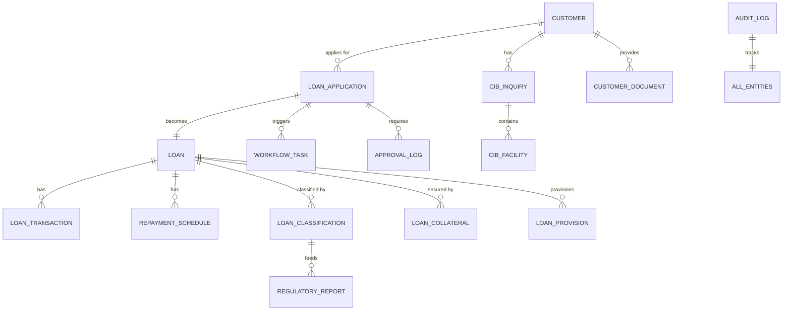
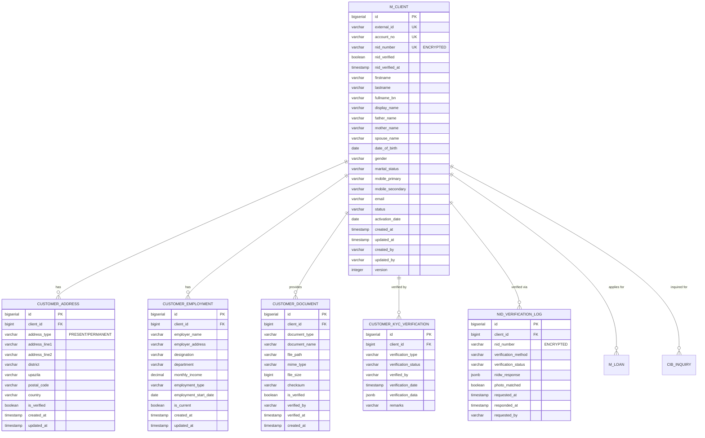
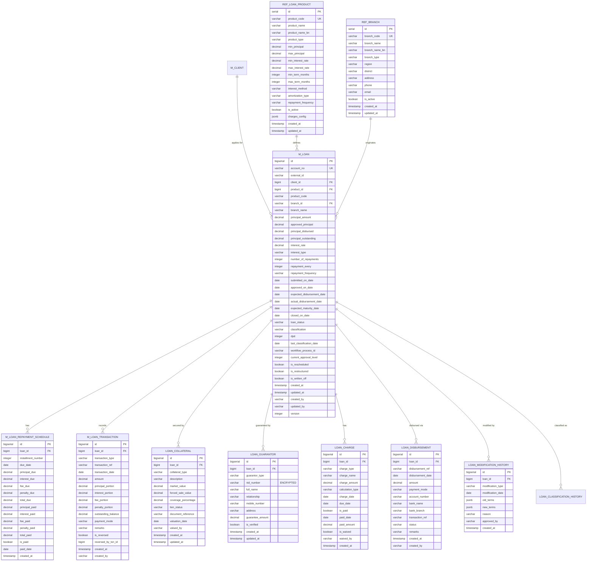
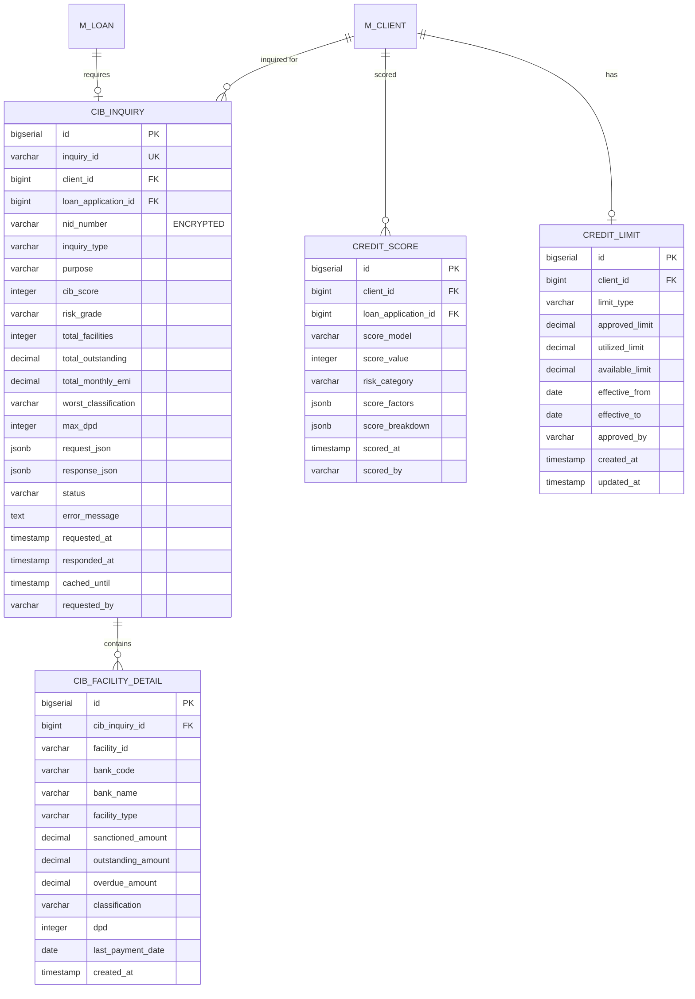
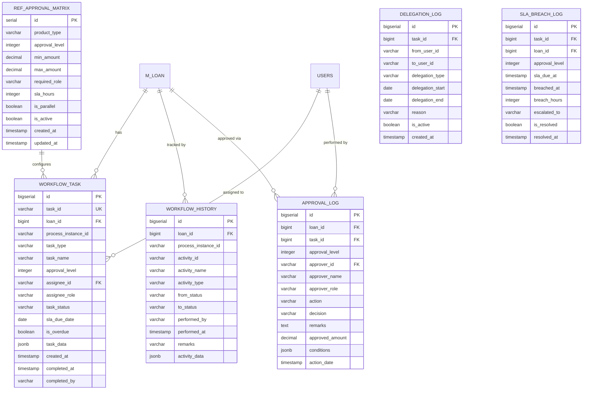
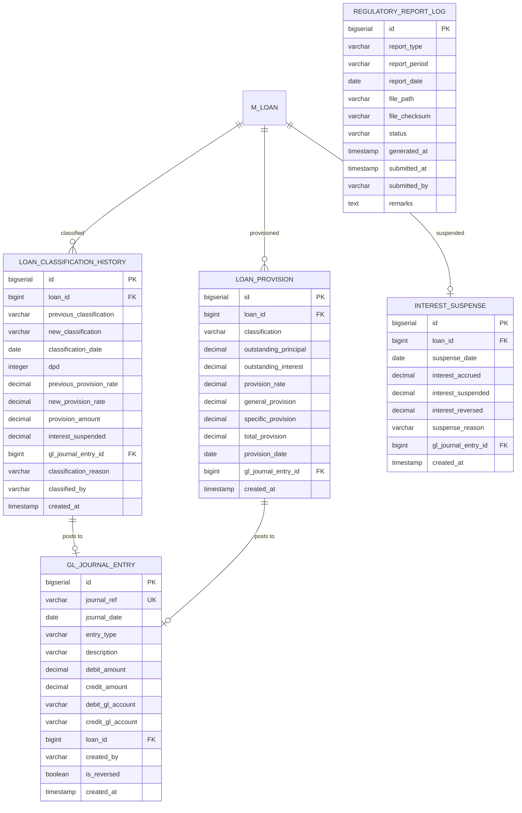
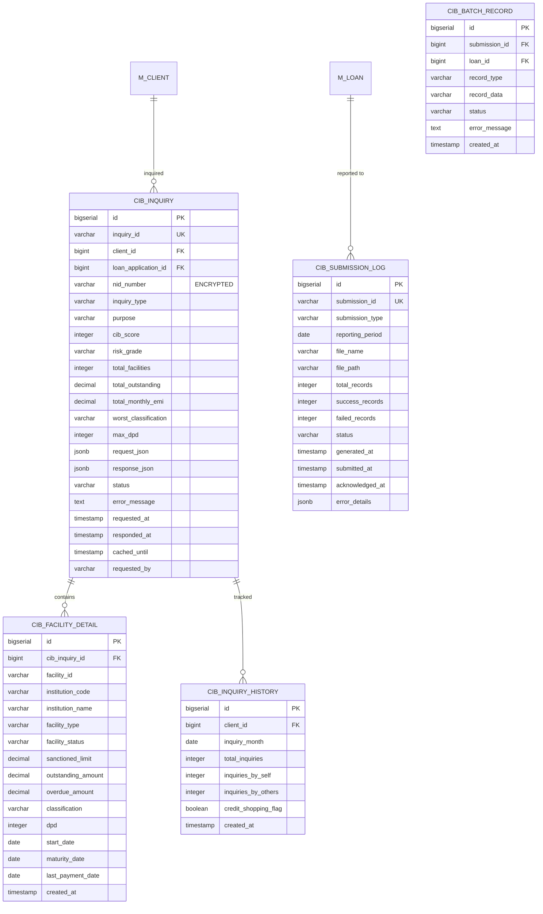
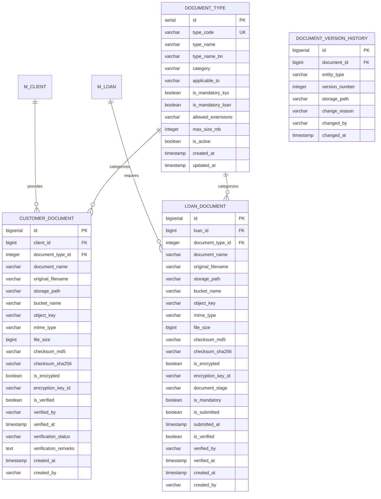
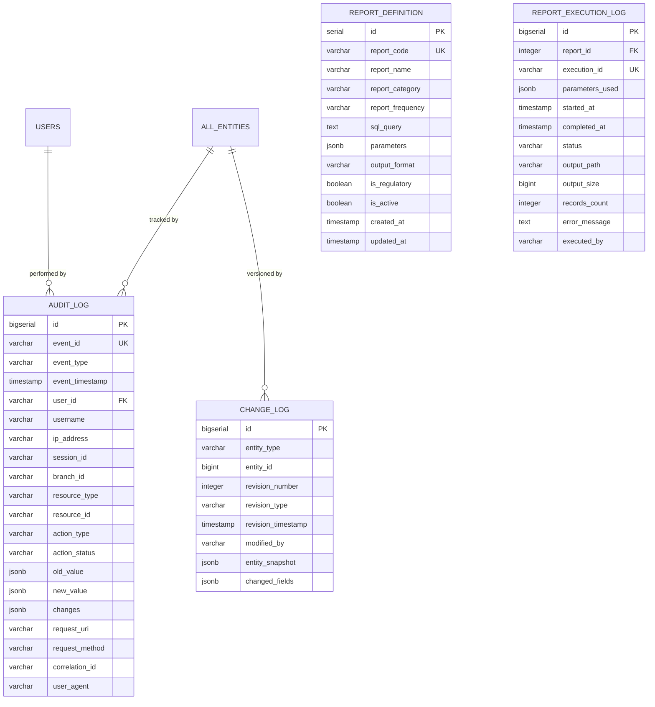
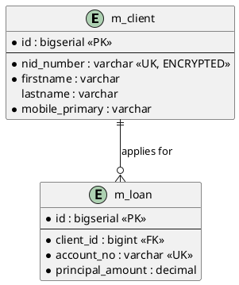

# Entity Relationship Diagrams (ERD)
## Unisoft Loan Management System (ULMS) v2.0

---

## Document Control

| Field | Value |
|-------|-------|
| **Document ID** | ULMS-ARCH-1.3.2 |
| **Document Title** | Entity Relationship Diagrams (ERD) |
| **Project Name** | Unisoft Loan Management System (ULMS) v2.0 |
| **Document Version** | 1.0 |
| **Date** | February 5, 2026 |
| **Prepared By** | Lead Developer |
| **Reviewed By** | Architecture Review Board |
| **Classification** | Confidential - Internal Use |
| **Status** | Approved for Implementation |

---

## Revision History

| Version | Date | Author | Description |
|---------|------|--------|-------------|
| 1.0 | 2026-02-05 | Lead Dev | Initial Entity Relationship Diagrams |

---

## Table of Contents

1. [Introduction](#1-introduction)
2. [ERD Notation Guide](#2-erd-notation-guide)
3. [Master ERD Overview](#3-master-erd-overview)
4. [Customer Management ERD](#4-customer-management-erd)
5. [Loan Origination ERD](#5-loan-origination-erd)
6. [Credit Assessment ERD](#6-credit-assessment-erd)
7. [Workflow & Approval ERD](#7-workflow--approval-erd)
8. [BRPD Compliance ERD](#8-brpd-compliance-erd)
9. [CIB Integration ERD](#9-cib-integration-erd)
10. [Document Management ERD](#10-document-management-erd)
11. [Audit & Reporting ERD](#11-audit--reporting-erd)
12. [Entity Relationship Summary](#12-entity-relationship-summary)

---

## 1. Introduction

### 1.1 Purpose

This document provides comprehensive Entity Relationship Diagrams (ERDs) for the ULMS v2.0 database schema. These diagrams serve as the visual reference for database design, showing entities, attributes, and relationships across all functional domains.

### 1.2 Scope

| Domain | Tables | ERD Section |
|--------|--------|-------------|
| Customer Management | 8 | Section 4 |
| Loan Origination | 15 | Section 5 |
| Credit Assessment | 5 | Section 6 |
| Workflow & Approval | 6 | Section 7 |
| BRPD Compliance | 5 | Section 8 |
| CIB Integration | 4 | Section 9 |
| Document Management | 3 | Section 10 |
| Audit & Reporting | 4 | Section 11 |

### 1.3 Schema Context

All ERDs represent tables within the per-tenant schema (`bank_XXX`). The `public` schema tables (tenants, users, configuration) are documented in the Database Schema Design Document (1.3.1).

---

## 2. ERD Notation Guide

### 2.1 Mermaid Diagram Notation

```
┌─────────────────────────────────────────────────────────────────────────────────────┐
│                         ERD NOTATION GUIDE                                           │
├─────────────────────────────────────────────────────────────────────────────────────┤
│                                                                                      │
│   RELATIONSHIP TYPES:                                                                │
│   ────────────────────                                                               │
│   ||──||  One-to-One (1:1)                                                          │
│   ||──o{  One-to-Many (1:N)                                                         │
│   }o──o{  Many-to-Many (M:N)                                                        │
│   ||──o|  One-to-Zero-or-One (1:0..1)                                               │
│                                                                                      │
│   CARDINALITY SYMBOLS:                                                               │
│   ────────────────────                                                               │
│   ||  Exactly one (mandatory)                                                        │
│   o|  Zero or one (optional)                                                         │
│   }|  One or more (mandatory)                                                        │
│   o{  Zero or more (optional)                                                        │
│                                                                                      │
│   ENTITY ATTRIBUTES:                                                                 │
│   ────────────────────                                                               │
│   PK  Primary Key                                                                    │
│   FK  Foreign Key                                                                    │
│   UK  Unique Key                                                                     │
│   *   Required/NOT NULL                                                              │
│                                                                                      │
└─────────────────────────────────────────────────────────────────────────────────────┘
```

### 2.2 Color Coding

| Color | Domain |
|-------|--------|
| Blue | Customer Management |
| Green | Loan Management |
| Orange | Credit Assessment |
| Purple | Workflow |
| Red | Compliance |
| Teal | Integration |

---

## 3. Master ERD Overview

### 3.1 High-Level Domain Relationships



### 3.2 Core Entity Summary

| Entity | Primary Key | Key Relationships | Estimated Volume |
|--------|-------------|-------------------|------------------|
| m_client | id | Loans, CIB, Documents | 500K - 5M |
| m_loan | id | Customer, Transactions, Classification | 100K - 1M |
| m_loan_transaction | id | Loan | 5M - 50M |
| cib_inquiry | id | Customer, Loan Application | 200K - 2M |
| loan_classification_history | id | Loan | 500K - 5M |
| audit_log | id | All entities | 10M - 100M |

---

## 4. Customer Management ERD

### 4.1 Customer Domain ERD



### 4.2 Customer Entity Descriptions

| Entity | Description | Key Fields |
|--------|-------------|------------|
| **m_client** | Customer master data | NID (encrypted), personal info, contact |
| **customer_address** | Present and permanent addresses | Address type, district, upazila |
| **customer_employment** | Employment and income details | Employer, income (encrypted), designation |
| **customer_document** | KYC document metadata | Document type, file path, verification |
| **customer_kyc_verification** | KYC verification audit | Verification type, status, date |
| **nid_verification_log** | NID verification via NIDW API | NID, response, photo match result |

### 4.3 Customer Relationships

| Relationship | Type | Description |
|--------------|------|-------------|
| m_client → customer_address | 1:N | Customer has multiple addresses |
| m_client → customer_employment | 1:N | Customer employment history |
| m_client → customer_document | 1:N | Customer KYC documents |
| m_client → m_loan | 1:N | Customer loan applications |
| m_client → cib_inquiry | 1:N | CIB inquiries for customer |

---

## 5. Loan Origination ERD

### 5.1 Loan Domain ERD



### 5.2 Loan Entity Descriptions

| Entity | Description | Key Fields |
|--------|-------------|------------|
| **m_loan** | Loan account master | Account no, principal, status, classification |
| **ref_loan_product** | Loan product configuration | Product code, interest rates, terms |
| **m_loan_repayment_schedule** | EMI schedule | Due date, amounts, payment status |
| **m_loan_transaction** | Payment transactions | Transaction type, amounts, date |
| **loan_collateral** | Collateral/security | Type, valuation, lien status |
| **loan_guarantor** | Guarantor information | NID, relationship, guarantee amount |
| **loan_charge** | Fees and charges | Charge type, amount, payment status |
| **loan_disbursement** | Disbursement records | Amount, payment mode, status |
| **loan_modification_history** | Rescheduling/restructuring | Old terms, new terms, reason |

### 5.3 Loan Status State Machine

```
┌─────────────────────────────────────────────────────────────────────────────────────┐
│                         LOAN STATUS STATE MACHINE                                    │
├─────────────────────────────────────────────────────────────────────────────────────┤
│                                                                                      │
│   ┌─────────┐   submit    ┌───────────┐   approve   ┌──────────┐                   │
│   │  DRAFT  │ ──────────▶ │ SUBMITTED │ ──────────▶ │ APPROVED │                   │
│   └─────────┘             └───────────┘             └──────────┘                   │
│                                 │                        │                          │
│                          reject │                        │ disburse                 │
│                                 ▼                        ▼                          │
│                           ┌──────────┐            ┌───────────┐                    │
│                           │ REJECTED │            │ DISBURSED │                    │
│                           └──────────┘            └───────────┘                    │
│                                                         │                          │
│                                                         │ activate                 │
│                                                         ▼                          │
│                                                    ┌─────────┐                     │
│                                                    │ ACTIVE  │                     │
│                                                    └─────────┘                     │
│                                                    │         │                      │
│                                          close     │         │ write_off           │
│                                                    ▼         ▼                      │
│                                             ┌────────┐ ┌────────────┐              │
│                                             │ CLOSED │ │ WRITTEN_OFF│              │
│                                             └────────┘ └────────────┘              │
│                                                                                      │
└─────────────────────────────────────────────────────────────────────────────────────┘
```

---

## 6. Credit Assessment ERD

### 6.1 Credit Assessment Domain ERD



### 6.2 Credit Assessment Entity Descriptions

| Entity | Description | Key Fields |
|--------|-------------|------------|
| **cib_inquiry** | CIB inquiry and response cache | Score, facilities, classification |
| **cib_facility_detail** | Individual facilities from CIB | Bank, amount, classification |
| **credit_score** | Credit scoring results | Score value, risk category, factors |
| **credit_limit** | Customer credit limits | Approved limit, utilization |

---

## 7. Workflow & Approval ERD

### 7.1 Workflow Domain ERD



### 7.2 Workflow Entity Descriptions

| Entity | Description | Key Fields |
|--------|-------------|------------|
| **workflow_task** | Active approval tasks | Task ID, assignee, SLA, status |
| **workflow_history** | Completed workflow activities | Activity, status change, performer |
| **approval_log** | Approval decision audit | Level, approver, decision, remarks |
| **ref_approval_matrix** | Approval authority configuration | Level, amount limits, roles |
| **delegation_log** | Task delegation records | From/to user, dates |
| **sla_breach_log** | SLA breach tracking | Breach time, escalation |

### 7.3 Approval Level Configuration

| Level | Role | Amount Range (BDT) | SLA Hours |
|-------|------|-------------------|-----------|
| L1 | Branch Manager | 0 - 500,000 | 4 |
| L2 | Regional Manager | 500,001 - 1,000,000 | 8 |
| L3 | Credit Head | 1,000,001 - 5,000,000 | 12 |
| L4 | Risk Committee | 5,000,001 - 10,000,000 | 24 |
| L5 | DMD | 10,000,001 - 50,000,000 | 48 |
| L6 | MD | 50,000,001 - 100,000,000 | 72 |
| L7 | Board/BOCC | > 100,000,000 | 168 |

---

## 8. BRPD Compliance ERD

### 8.1 BRPD Compliance Domain ERD



### 8.2 BRPD Classification Rules

| Classification | DPD Range | Provision Rate | Interest Treatment |
|----------------|-----------|----------------|-------------------|
| **STD-0** | 0 days | 1% | Accrual |
| **STD-1** | 1-30 days | 1% | Accrual |
| **STD-2** | 31-60 days | 1% | Accrual |
| **SMA** | 61-90 days | 5% | Accrual |
| **SS** | 91-180 days | 20% | Suspense (NPA) |
| **DF** | 181-365 days | 50% | Suspense |
| **B/L** | >365 days | 100% | Suspense/Write-off |

### 8.3 Compliance Entity Descriptions

| Entity | Description | Key Fields |
|--------|-------------|------------|
| **loan_classification_history** | Classification change audit | Previous/new classification, DPD |
| **loan_provision** | Provision amount tracking | Rate, general/specific provision |
| **interest_suspense** | Suspended interest records | Accrued, suspended, reversed |
| **gl_journal_entry** | GL posting records | Debit/credit accounts, amounts |
| **regulatory_report_log** | Report generation audit | Type, period, submission status |

---

## 9. CIB Integration ERD

### 9.1 CIB Integration Domain ERD



### 9.2 CIB Entity Descriptions

| Entity | Description | Key Fields |
|--------|-------------|------------|
| **cib_inquiry** | Real-time CIB inquiry | Score, facilities, worst classification |
| **cib_facility_detail** | Existing facilities from CIB | Institution, amounts, status |
| **cib_inquiry_history** | Inquiry frequency tracking | Monthly count, credit shopping flag |
| **cib_submission_log** | Batch submission to BB | Period, file, record counts |
| **cib_batch_record** | Individual batch records | Loan data, submission status |

### 9.3 CIB Report Types

| Report Type | Frequency | Description |
|-------------|-----------|-------------|
| **Subject Data** | Monthly | Customer demographic data |
| **Contract Data** | Monthly | Loan facility details |
| **Payment Data** | Monthly | Payment history |
| **Classification** | Monthly | Loan classification status |

---

## 10. Document Management ERD

### 10.1 Document Management Domain ERD



### 10.2 Document Types

| Type Code | Category | Mandatory KYC | Mandatory Loan |
|-----------|----------|---------------|----------------|
| NID_CARD | Identity | Yes | Yes |
| PASSPORT | Identity | No | No |
| PHOTO | Identity | Yes | Yes |
| INCOME_CERT | Financial | No | Yes |
| SALARY_SLIP | Financial | No | Yes (Salaried) |
| BANK_STMT | Financial | No | Yes |
| LAND_DOC | Collateral | No | Yes (Secured) |
| TRADE_LICENSE | Business | No | Yes (SME) |

---

## 11. Audit & Reporting ERD

### 11.1 Audit Domain ERD



### 11.2 Audit Entity Descriptions

| Entity | Description | Key Fields |
|--------|-------------|------------|
| **audit_log** | Comprehensive event audit | Event type, user, resource, changes |
| **change_log** | Entity version history (Envers) | Revision number, snapshot, changes |
| **report_definition** | Report configurations | SQL query, parameters, format |
| **report_execution_log** | Report generation audit | Execution time, status, output |

### 11.3 Audited Events

| Event Type | Description | Retention |
|------------|-------------|-----------|
| LOGIN | User login | 90 days |
| LOGOUT | User logout | 90 days |
| CREATE | Entity creation | 10 years |
| UPDATE | Entity modification | 10 years |
| DELETE | Entity deletion | 10 years |
| APPROVE | Approval action | 10 years |
| REJECT | Rejection action | 10 years |
| DISBURSE | Loan disbursement | 10 years |
| CLASSIFY | Classification change | 10 years |
| CIB_INQUIRY | CIB inquiry | 7 years |

---

## 12. Entity Relationship Summary

### 12.1 Table Count by Domain

| Domain | Tables | Primary Entities |
|--------|--------|------------------|
| Customer Management | 6 | m_client |
| Loan Origination | 10 | m_loan |
| Credit Assessment | 4 | cib_inquiry |
| Workflow & Approval | 6 | workflow_task |
| BRPD Compliance | 5 | loan_classification_history |
| CIB Integration | 5 | cib_inquiry, cib_submission_log |
| Document Management | 4 | customer_document, loan_document |
| Audit & Reporting | 4 | audit_log |
| Reference Data | 10 | ref_* tables |
| **Total** | **54** | - |

### 12.2 Key Foreign Key Relationships

| From Table | To Table | Relationship | FK Column |
|------------|----------|--------------|-----------|
| m_loan | m_client | N:1 | client_id |
| m_loan | ref_loan_product | N:1 | product_id |
| m_loan | ref_branch | N:1 | branch_id |
| m_loan_transaction | m_loan | N:1 | loan_id |
| m_loan_repayment_schedule | m_loan | N:1 | loan_id |
| loan_classification_history | m_loan | N:1 | loan_id |
| cib_inquiry | m_client | N:1 | client_id |
| cib_facility_detail | cib_inquiry | N:1 | cib_inquiry_id |
| workflow_task | m_loan | N:1 | loan_id |
| approval_log | m_loan | N:1 | loan_id |
| customer_document | m_client | N:1 | client_id |
| loan_document | m_loan | N:1 | loan_id |

### 12.3 Compliance Mapping

| ERD Domain | BRD Reference | SRS Reference | Compliance |
|------------|---------------|---------------|------------|
| Customer Management | BRD 6.1 | SRS 3.1 | NID encryption, KYC |
| Loan Origination | BRD 6.2-6.4 | SRS 3.2 | Workflow states |
| Credit Assessment | BRD 6.2.1 | SRS 3.3 | CIB integration |
| BRPD Compliance | BRD 6.6 | SRS 3.4 | 7-stage classification |
| Audit | BRD 8.4 | SRS 7.4 | 10-year retention |

---

## Appendices

### Appendix A: Mermaid ERD Rendering Instructions

To render Mermaid diagrams:
1. Use VS Code with Mermaid extension
2. Use online tool: https://mermaid.live/
3. Generate PNG/SVG for documentation

### Appendix B: PlantUML Alternative Notation



### Appendix C: References

1. PostgreSQL 16 Data Types Documentation
2. ULMS BRD v1.0
3. ULMS SRS v2.0
4. BRPD Circular 15/2024
5. Bangladesh Bank CIB Guidelines
6. [ARCH]_Database_Schema_Design_Document_v1.0.md
7. [STD]_NamingConventions_SQL_Database_v1.0.md

---

**Document End**

*ULMS v2.0 - Entity Relationship Diagrams v1.0*

*Unisoft Systems Limited - Confidential*

*This document provides comprehensive ERDs for all ULMS database domains with full regulatory compliance mapping.*
