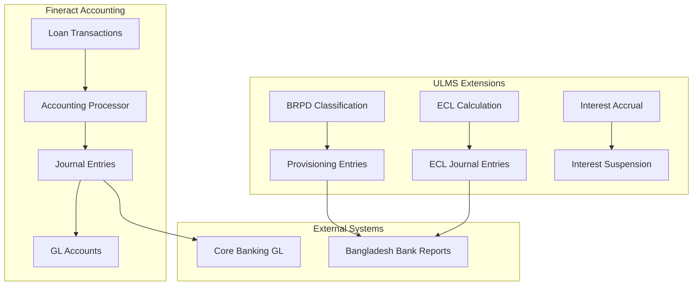

**Document Control**

| Field | Value |
|-------|-------|
| **Document Title** | Fineract Accounting Integration Guide |
| **Project Name** | Unisoft Loan Management System (ULMS) v2.0 |
| **Document Version** | 1.0 |
| **Date** | 2026-02-08 |
| **Prepared By** | Unisoft Technical Team |
| **Reviewed By** | Solution Architect |
| **Classification** | Internal |
| **Status** | Draft |

**Revision History**

| Version | Date | Author | Description |
|---------|------|--------|-------------|
| 1.0 | 2026-02-08 | Unisoft Team | Initial version |

---

# Fineract Accounting Integration Guide

## 1. Introduction

### 1.1 Purpose
This document describes the accounting integration patterns for ULMS v2.0, covering Fineract's accrual-based accounting, Bangladesh Bank reporting requirements, and IFRS-9 compliance.

### 1.2 Scope
- Journal entry generation
- Accrual accounting
- Provisioning entries
- IFRS-9 ECL accounting
- Interest suspension
- Integration with external GL systems

## 2. Accounting Architecture

### 2.1 Overview



### 2.2 Account Structure

| Account Type | GL Code | Description |
|-------------|---------|-------------|
| Loan Portfolio | 1-10001 | Outstanding loan principal |
| Interest Receivable | 1-10002 | Accrued interest |
| Interest Income | 4-10001 | Recognized interest income |
| Provision for Loan Loss | 2-10001 | Loan loss provisions |
| ECL Reserve | 2-10002 | IFRS-9 ECL reserve |
| Suspense Interest | 1-10003 | Suspended interest (non-performing) |
| Write-off Account | 5-10001 | Loan write-offs |

## 3. Journal Entry Generation

### 3.1 Loan Disbursement

```java
package org.apache.fineract.ulms.accounting;

import lombok.RequiredArgsConstructor;
import org.apache.fineract.accounting.journalentry.domain.JournalEntry;
import org.apache.fineract.accounting.journalentry.domain.JournalEntryType;
import org.apache.fineract.portfolio.loanaccount.domain.Loan;
import org.apache.fineract.portfolio.loanaccount.domain.LoanTransaction;
import org.springframework.stereotype.Component;

import java.math.BigDecimal;
import java.time.LocalDate;

@Component
@RequiredArgsConstructor
public class LoanDisbursementAccountingProcessor {
    
    /**
     * Generate journal entries for loan disbursement
     */
    public List<JournalEntry> processDisbursement(Loan loan, LoanTransaction transaction) {
        List<JournalEntry> entries = new ArrayList<>();
        BigDecimal amount = transaction.getAmount();
        LocalDate transactionDate = transaction.getTransactionDate();
        String currencyCode = loan.getCurrencyCode();
        
        // Debit: Loan Portfolio (Asset)
        entries.add(JournalEntry.builder()
            .glAccount(getLoanPortfolioAccount(loan))
            .debit(amount)
            .credit(BigDecimal.ZERO)
            .transactionDate(transactionDate)
            .currencyCode(currencyCode)
            .transactionId(transaction.getId())
            .description("Loan disbursement - " + loan.getAccountNumber())
            .build());
        
        // Credit: Cash/Bank (Asset)
        entries.add(JournalEntry.builder()
            .glAccount(getCashAccount(loan))
            .debit(BigDecimal.ZERO)
            .credit(amount)
            .transactionDate(transactionDate)
            .currencyCode(currencyCode)
            .transactionId(transaction.getId())
            .description("Loan disbursement - " + loan.getAccountNumber())
            .build());
        
        return entries;
    }
}
```

### 3.2 Interest Accrual

```java
package org.apache.fineract.ulms.accounting;

import lombok.RequiredArgsConstructor;
import org.apache.fineract.accounting.journalentry.domain.JournalEntry;
import org.apache.fineract.portfolio.loanaccount.domain.Loan;
import org.apache.fineract.ulms.domain.BangladeshLoanExtension;
import org.springframework.stereotype.Component;

import java.math.BigDecimal;
import java.time.LocalDate;

@Component
@RequiredArgsConstructor
public class InterestAccrualAccountingProcessor {
    
    private final BangladeshLoanRepository bangladeshLoanRepository;
    
    /**
     * Generate journal entries for interest accrual
     * Considers BRPD classification for interest suspension
     */
    public List<JournalEntry> processInterestAccrual(Loan loan, 
            BigDecimal interestAmount, LocalDate accrualDate) {
        
        List<JournalEntry> entries = new ArrayList<>();
        
        // Check loan classification
        BangladeshLoanExtension extension = bangladeshLoanRepository
            .findByLoanId(loan.getId())
            .orElseThrow();
        
        BrpdClassificationStage stage = extension.getClassificationStage();
        
        // If loan is Substandard (SS) or worse, suspend interest
        if (stage == BrpdClassificationStage.SS || 
            stage == BrpdClassificationStage.DF ||
            stage == BrpdClassificationStage.BL) {
            
            return processSuspendedInterest(loan, interestAmount, accrualDate);
        }
        
        // Normal interest accrual
        // Debit: Interest Receivable
        entries.add(JournalEntry.builder()
            .glAccount(getInterestReceivableAccount(loan))
            .debit(interestAmount)
            .transactionDate(accrualDate)
            .description("Interest accrual - " + loan.getAccountNumber())
            .build());
        
        // Credit: Interest Income
        entries.add(JournalEntry.builder()
            .glAccount(getInterestIncomeAccount(loan))
            .credit(interestAmount)
            .transactionDate(accrualDate)
            .description("Interest accrual - " + loan.getAccountNumber())
            .build());
        
        return entries;
    }
    
    /**
     * Process suspended interest for non-performing loans
     */
    private List<JournalEntry> processSuspendedInterest(Loan loan, 
            BigDecimal interestAmount, LocalDate accrualDate) {
        
        List<JournalEntry> entries = new ArrayList<>();
        
        // Debit: Suspense Interest (off-balance sheet tracking)
        entries.add(JournalEntry.builder()
            .glAccount(getSuspenseInterestAccount(loan))
            .debit(interestAmount)
            .transactionDate(accrualDate)
            .description("Suspended interest - " + loan.getAccountNumber() + 
                " [" + stage.getCode() + "]")
            .build());
        
        // No income recognition for suspended interest
        // Track in memorandum account
        
        return entries;
    }
}
```

## 4. Provisioning Entries

### 4.1 BRPD Classification-Based Provisioning

```java
package org.apache.fineract.ulms.accounting;

import lombok.RequiredArgsConstructor;
import lombok.extern.slf4j.Slf4j;
import org.apache.fineract.accounting.journalentry.domain.JournalEntry;
import org.apache.fineract.portfolio.loanaccount.domain.Loan;
import org.apache.fineract.ulms.domain.BrpdClassificationStage;
import org.apache.fineract.ulms.domain.ClassificationResult;
import org.apache.fineract.ulms.service.ProvisioningCalculationService;
import org.springframework.stereotype.Component;

import java.math.BigDecimal;
import java.time.LocalDate;
import java.util.ArrayList;
import java.util.List;

@Slf4j
@Component
@RequiredArgsConstructor
public class ProvisioningAccountingProcessor {
    
    private final ProvisioningCalculationService provisioningService;
    private final BangladeshLoanRepository loanRepository;
    
    /**
     * Generate provisioning entries based on BRPD classification
     */
    public List<JournalEntry> processProvisioningChange(Long loanId, 
            ClassificationResult newClassification, LocalDate effectiveDate) {
        
        List<JournalEntry> entries = new ArrayList<>();
        
        BangladeshLoanExtension extension = loanRepository.findByLoanId(loanId)
            .orElseThrow(() -> new LoanNotFoundException(loanId));
        
        BigDecimal outstanding = extension.getLoan().getSummary().getTotalOutstanding();
        BrpdClassificationStage newStage = newClassification.getCurrentStage();
        BrpdClassificationStage oldStage = extension.getClassificationStage();
        
        // Calculate provision amounts
        BigDecimal newProvision = outstanding.multiply(newStage.getProvisionRate());
        BigDecimal oldProvision = extension.getCurrentProvision();
        BigDecimal provisionChange = newProvision.subtract(oldProvision);
        
        if (provisionChange.compareTo(BigDecimal.ZERO) > 0) {
            // Increase provision
            entries.addAll(createIncreaseProvisionEntries(
                extension.getLoan(), provisionChange, effectiveDate, newStage));
        } else if (provisionChange.compareTo(BigDecimal.ZERO) < 0) {
            // Decrease provision
            entries.addAll(createDecreaseProvisionEntries(
                extension.getLoan(), provisionChange.abs(), effectiveDate, newStage));
        }
        
        // Update loan extension
        extension.setCurrentProvision(newProvision);
        extension.setClassificationStage(newStage);
        loanRepository.save(extension);
        
        return entries;
    }
    
    private List<JournalEntry> createIncreaseProvisionEntries(Loan loan, 
            BigDecimal amount, LocalDate date, BrpdClassificationStage stage) {
        
        List<JournalEntry> entries = new ArrayList<>();
        
        // Debit: Provision Expense (P&L)
        entries.add(JournalEntry.builder()
            .glAccount(getProvisionExpenseAccount(loan))
            .debit(amount)
            .transactionDate(date)
            .description("Loan provision - " + loan.getAccountNumber() + 
                " [" + stage.getCode() + "]")
            .build());
        
        // Credit: Provision for Loan Loss (Balance Sheet)
        entries.add(JournalEntry.builder()
            .glAccount(getProvisionAccount(loan))
            .credit(amount)
            .transactionDate(date)
            .description("Loan provision - " + loan.getAccountNumber() + 
                " [" + stage.getCode() + "]")
            .build());
        
        return entries;
    }
}
```

### 4.2 Provisioning Schedule

| Classification | Provision Rate | Journal Entry |
|---------------|----------------|---------------|
| STD-0 (0 DPD) | 1% | Dr. Provision Expense / Cr. Provision |
| STD-1 (1-30 DPD) | 1% | Dr. Provision Expense / Cr. Provision |
| STD-2 (31-60 DPD) | 1% | Dr. Provision Expense / Cr. Provision |
| SMA (61-90 DPD) | 5% | Dr. Provision Expense / Cr. Provision |
| SS (91-180 DPD) | 20% | Dr. Provision Expense / Cr. Provision |
| DF (181-365 DPD) | 50% | Dr. Provision Expense / Cr. Provision |
| B/L (>365 DPD) | 100% | Dr. Provision Expense / Cr. Provision |

## 5. IFRS-9 ECL Accounting

### 5.1 ECL Journal Entries

```java
package org.apache.fineract.ulms.accounting;

import lombok.RequiredArgsConstructor;
import org.apache.fineract.accounting.journalentry.domain.JournalEntry;
import org.apache.fineract.portfolio.loanaccount.domain.Loan;
import org.apache.fineract.ulms.domain.EclCalculationResult;
import org.apache.fineract.ulms.domain.Ifrs9Stage;
import org.springframework.stereotype.Component;

import java.math.BigDecimal;
import java.time.LocalDate;
import java.util.ArrayList;
import java.util.List;

@Component
@RequiredArgsConstructor
public class EclAccountingProcessor {
    
    /**
     * Process ECL changes for IFRS-9 compliance
     */
    public List<JournalEntry> processEclChange(Loan loan, 
            EclCalculationResult newEcl, EclCalculationResult oldEcl, 
            LocalDate effectiveDate) {
        
        List<JournalEntry> entries = new ArrayList<>();
        
        BigDecimal eclChange = newEcl.getTotalEcl().subtract(oldEcl.getTotalEcl());
        
        if (eclChange.compareTo(BigDecimal.ZERO) > 0) {
            // Increase ECL reserve
            entries.add(createEclIncreaseEntry(loan, eclChange, effectiveDate));
        } else if (eclChange.compareTo(BigDecimal.ZERO) < 0) {
            // Decrease ECL reserve (reversal)
            entries.add(createEclDecreaseEntry(loan, eclChange.abs(), effectiveDate));
        }
        
        // Stage transfer entries if applicable
        if (newEcl.getStage() != oldEcl.getStage()) {
            entries.addAll(createStageTransferEntries(loan, oldEcl.getStage(), 
                newEcl.getStage(), effectiveDate));
        }
        
        return entries;
    }
    
    private JournalEntry createEclIncreaseEntry(Loan loan, BigDecimal amount, 
            LocalDate date) {
        return JournalEntry.builder()
            .glAccount(getEclExpenseAccount(loan))
            .debit(amount)
            .transactionDate(date)
            .description("IFRS-9 ECL provision - " + loan.getAccountNumber())
            .build();
    }
    
    private List<JournalEntry> createStageTransferEntries(Loan loan, 
            Ifrs9Stage fromStage, Ifrs9Stage toStage, LocalDate date) {
        
        List<JournalEntry> entries = new ArrayList<>();
        
        // Stage 1 -> Stage 2: Significant increase in credit risk
        // Stage 2 -> Stage 3: Credit impaired
        
        entries.add(JournalEntry.builder()
            .glAccount(getStageTransferAccount(loan))
            .debit(BigDecimal.ZERO)
            .credit(BigDecimal.ZERO) // Memorandum entry
            .transactionDate(date)
            .description(String.format("IFRS-9 Stage transfer %s -> %s - %s",
                fromStage, toStage, loan.getAccountNumber()))
            .build());
        
        return entries;
    }
}
```

### 5.2 IFRS-9 Stage Accounting

| Stage | Description | Accounting Treatment |
|-------|-------------|---------------------|
| Stage 1 | 12-month ECL | Interest on gross carrying amount |
| Stage 2 | Lifetime ECL (not impaired) | Interest on gross carrying amount |
| Stage 3 | Lifetime ECL (credit impaired) | Interest on net carrying amount (post-ECL) |

## 6. External GL Integration

### 6.1 GL Export Service

```java
package org.apache.fineract.ulms.integration;

import lombok.RequiredArgsConstructor;
import lombok.extern.slf4j.Slf4j;
import org.apache.fineract.accounting.journalentry.domain.JournalEntry;
import org.apache.fineract.ulms.dto.GlExportDto;
import org.springframework.beans.factory.annotation.Value;
import org.springframework.http.ResponseEntity;
import org.springframework.stereotype.Service;
import org.springframework.web.client.RestTemplate;

import java.time.LocalDate;
import java.util.List;

@Slf4j
@Service
@RequiredArgsConstructor
public class CoreBankingGlExportService {
    
    private final RestTemplate restTemplate;
    private final JournalEntryRepository journalEntryRepository;
    
    @Value("${ulms.integration.cbs.gl-endpoint}")
    private String cbsGlEndpoint;
    
    /**
     * Export journal entries to Core Banking System
     */
    public GlExportResult exportToCbs(LocalDate date) {
        log.info("Exporting GL entries to CBS for date: {}", date);
        
        // Fetch pending journal entries
        List<JournalEntry> pendingEntries = journalEntryRepository
            .findByTransactionDateAndExportedFalse(date);
        
        // Transform to CBS format
        List<GlExportDto> cbsEntries = pendingEntries.stream()
            .map(this::transformToCbsFormat)
            .collect(Collectors.toList());
        
        // Send to CBS
        try {
            ResponseEntity<GlImportResponse> response = restTemplate.postForEntity(
                cbsGlEndpoint,
                cbsEntries,
                GlImportResponse.class
            );
            
            if (response.getStatusCode().is2xxSuccessful()) {
                // Mark entries as exported
                pendingEntries.forEach(entry -> entry.setExported(true));
                journalEntryRepository.saveAll(pendingEntries);
                
                return GlExportResult.success(pendingEntries.size());
            } else {
                return GlExportResult.failure("CBS returned error: " + response.getBody());
            }
            
        } catch (Exception e) {
            log.error("Failed to export GL entries to CBS", e);
            return GlExportResult.failure(e.getMessage());
        }
    }
    
    private GlExportDto transformToCbsFormat(JournalEntry entry) {
        return GlExportDto.builder()
            .transactionDate(entry.getTransactionDate())
            .glAccountCode(mapToCbsGlCode(entry.getGlAccount().getGlCode()))
            .debitAmount(entry.getDebit())
            .creditAmount(entry.getCredit())
            .narration(entry.getDescription())
            .referenceNumber(entry.getTransactionId())
            .branchCode(entry.getOffice().getExternalId())
            .currencyCode(entry.getCurrencyCode())
            .build();
    }
}
```

### 6.2 GL Mapping Configuration

```yaml
# application-accounting.yml
ulms:
  accounting:
    gl-mapping:
      # Fineract GL to CBS GL mapping
      fineract-to-cbs:
        "1-10001": "12001001"  # Loan Portfolio
        "1-10002": "12001002"  # Interest Receivable
        "4-10001": "41001001"  # Interest Income
        "2-10001": "22001001"  # Provision for Loan Loss
        "2-10002": "22001002"  # ECL Reserve
        "5-10001": "51001001"  # Write-off Account
    
    export:
      cbs:
        enabled: true
        endpoint: "https://cbs.bank.com.bd/api/v1/gl/import"
        batch-size: 100
        retry-attempts: 3
        schedule: "0 30 23 * * ?"  # 23:30 daily
```

## 7. Bangladesh Bank Reporting

### 7.1 Scheduled Items Report

```java
package org.apache.fineract.ulms.reporting;

import lombok.RequiredArgsConstructor;
import org.apache.fineract.ulms.dto.ScheduledItemsReportDto;
import org.springframework.stereotype.Service;

import java.time.LocalDate;
import java.util.List;

@Service
@RequiredArgsConstructor
public class ScheduledItemsReportService {
    
    private final BangladeshLoanRepository loanRepository;
    private final JournalEntryRepository journalEntryRepository;
    
    /**
     * Generate Bangladesh Bank Scheduled Items report
     * Format as per BRPD requirements
     */
    public ScheduledItemsReport generateReport(LocalDate reportDate) {
        ScheduledItemsReport report = new ScheduledItemsReport();
        report.setReportDate(reportDate);
        
        // 1. Loans and Advances
        List<ScheduledItemsReportDto> loans = loanRepository
            .findActiveLoansForReporting(reportDate);
        report.setLoansAndAdvances(loans);
        
        // 2. Provisions
        BigDecimal totalProvision = calculateTotalProvision(reportDate);
        report.setTotalProvision(totalProvision);
        
        // 3. ECL Reserve
        BigDecimal eclReserve = calculateEclReserve(reportDate);
        report.setEclReserve(eclReserve);
        
        // 4. Suspended Interest
        BigDecimal suspendedInterest = calculateSuspendedInterest(reportDate);
        report.setSuspendedInterest(suspendedInterest);
        
        // 5. Write-offs
        BigDecimal writeOffs = calculateWriteOffs(reportDate);
        report.setWriteOffs(writeOffs);
        
        return report;
    }
    
    private BigDecimal calculateTotalProvision(LocalDate date) {
        return journalEntryRepository
            .sumCreditsByAccountAndDate("2-10001", date);
    }
}
```

---

## Appendices

### A.1 Sample Journal Entries

#### Loan Disbursement (BDT 1,000,000)
```
Dr. Loan Portfolio (1-10001)        1,000,000
    Cr. Cash/Bank (1-00001)                 1,000,000
```

#### Monthly Interest Accrual (BDT 15,000)
```
Dr. Interest Receivable (1-10002)      15,000
    Cr. Interest Income (4-10001)             15,000
```

#### Provisioning (SS Classification, 20%)
```
Dr. Provision Expense (5-10002)       200,000
    Cr. Provision for Loan Loss (2-10001)     200,000
```

#### ECL Adjustment
```
Dr. ECL Expense (5-10003)              50,000
    Cr. ECL Reserve (2-10002)                 50,000
```

### A.2 Accounting Codes Reference

| Code | Account Name | Type |
|------|--------------|------|
| 1-10001 | Loan Portfolio | Asset |
| 1-10002 | Interest Receivable | Asset |
| 1-10003 | Suspense Interest | Asset |
| 2-10001 | Provision for Loan Loss | Liability |
| 2-10002 | ECL Reserve | Liability |
| 4-10001 | Interest Income | Income |
| 5-10001 | Write-off Account | Expense |
| 5-10002 | Provision Expense | Expense |
| 5-10003 | ECL Expense | Expense |
