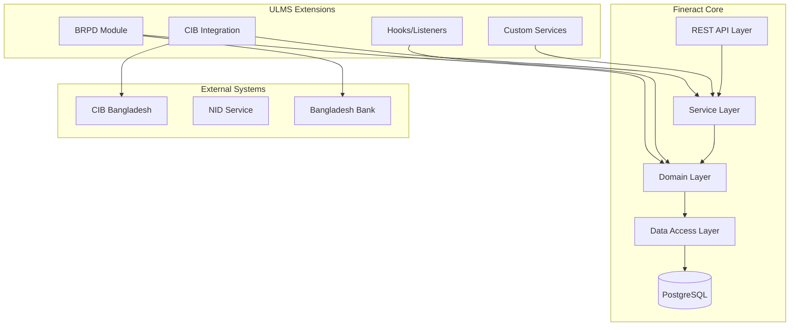

**Document Control**

| Field | Value |
|-------|-------|
| **Document Title** | Fineract Extension Development Guide |
| **Project Name** | Unisoft Loan Management System (ULMS) v2.0 |
| **Document Version** | 1.0 |
| **Date** | 2026-02-08 |
| **Prepared By** | Unisoft Technical Team |
| **Reviewed By** | Solution Architect |
| **Classification** | Internal |
| **Status** | Draft |

**Revision History**

| Version | Date | Author | Description |
|---------|------|--------|-------------|
| 1.0 | 2026-02-08 | Unisoft Team | Initial version |

---

# Fineract Extension Development Guide

## 1. Introduction

### 1.1 Purpose
This document provides comprehensive guidelines for extending Apache Fineract Community Edition (CE) to meet Bangladesh banking requirements for ULMS v2.0.

### 1.2 Scope
Covers custom service development, hook integration, and Bangladesh-specific extensions for Fineract 1.10.

### 1.3 Target Audience
- Backend Developers
- Integration Specialists
- Technical Architects

## 2. Fineract Architecture Overview

### 2.1 Core Components



### 2.2 Technology Stack

| Component | Technology | Version |
|-----------|------------|---------|
| Core Platform | Apache Fineract | 1.10.0 |
| Language | Java | 21 LTS |
| Framework | Spring Boot | 3.2.x |
| Build Tool | Gradle | 8.x |
| Database | PostgreSQL | 16.x |
| ORM | Hibernate | 6.x |

## 3. Extension Development Patterns

### 3.1 Custom Service Development

#### 3.1.1 Service Interface Definition

```java
package org.apache.fineract.ulms.services;

import java.util.List;
import org.apache.fineract.ulms.domain.BangladeshLoanApplication;

/**
 * Bangladesh-specific loan service interface
 * Extends standard Fineract loan functionality
 */
public interface BangladeshLoanService {
    
    /**
     * Validate loan application against BRPD requirements
     */
    LoanValidationResult validateBrpdCompliance(Long loanId);
    
    /**
     * Calculate ECL (Expected Credit Loss) per IFRS-9
     */
    BigDecimal calculateEcl(Long loanId, LocalDate calculationDate);
    
    /**
     * Apply Bangladesh-specific loan classification
     */
    ClassificationResult classifyLoan(Long loanId, LocalDate classificationDate);
    
    /**
     * Check CIB status before disbursement
     */
    CibCheckResult performPreDisbursementCibCheck(Long loanId);
}
```

#### 3.1.2 Service Implementation

```java
package org.apache.fineract.ulms.services.impl;

import lombok.RequiredArgsConstructor;
import lombok.extern.slf4j.Slf4j;
import org.apache.fineract.infrastructure.core.service.DateUtils;
import org.apache.fineract.ulms.domain.BangladeshLoanApplication;
import org.apache.fineract.ulms.domain.ClassificationResult;
import org.apache.fineract.ulms.repository.BangladeshLoanRepository;
import org.apache.fineract.ulms.services.BangladeshLoanService;
import org.apache.fineract.ulms.services.BrpdClassificationService;
import org.apache.fineract.ulms.services.CibIntegrationService;
import org.springframework.stereotype.Service;
import org.springframework.transaction.annotation.Transactional;

@Slf4j
@Service
@RequiredArgsConstructor
public class BangladeshLoanServiceImpl implements BangladeshLoanService {
    
    private final BangladeshLoanRepository loanRepository;
    private final BrpdClassificationService classificationService;
    private final CibIntegrationService cibService;
    private final EclCalculationService eclService;
    
    @Override
    @Transactional(readOnly = true)
    public LoanValidationResult validateBrpdCompliance(Long loanId) {
        log.debug("Validating BRPD compliance for loan: {}", loanId);
        
        BangladeshLoanApplication loan = loanRepository.findById(loanId)
            .orElseThrow(() -> new LoanNotFoundException(loanId));
        
        // Validate required BRPD fields
        List<String> violations = new ArrayList<>();
        
        if (loan.getPurposeCode() == null) {
            violations.add("BRPD loan purpose code is required");
        }
        
        if (loan.getEconomicSectorCode() == null) {
            violations.add("Economic sector code is required");
        }
        
        if (loan.getSanctionDate() == null) {
            violations.add("Sanction date is required for reporting");
        }
        
        return LoanValidationResult.builder()
            .valid(violations.isEmpty())
            .violations(violations)
            .build();
    }
    
    @Override
    @Transactional(readOnly = true)
    public BigDecimal calculateEcl(Long loanId, LocalDate calculationDate) {
        log.debug("Calculating ECL for loan: {} as of {}", loanId, calculationDate);
        
        BangladeshLoanApplication loan = loanRepository.findById(loanId)
            .orElseThrow(() -> new LoanNotFoundException(loanId));
        
        // IFRS-9 ECL calculation
        ClassificationResult classification = classificationService
            .classifyLoan(loanId, calculationDate);
        
        return eclService.calculate(
            loan.getOutstandingPrincipal(),
            loan.getOutstandingInterest(),
            classification.getStage(),
            loan.getProbabilityOfDefault(),
            loan.getLossGivenDefault()
        );
    }
    
    @Override
    @Transactional
    public ClassificationResult classifyLoan(Long loanId, LocalDate classificationDate) {
        log.debug("Classifying loan: {} as of {}", loanId, classificationDate);
        return classificationService.classifyLoan(loanId, classificationDate);
    }
    
    @Override
    @Transactional(readOnly = true)
    public CibCheckResult performPreDisbursementCibCheck(Long loanId) {
        log.debug("Performing pre-disbursement CIB check for loan: {}", loanId);
        
        BangladeshLoanApplication loan = loanRepository.findById(loanId)
            .orElseThrow(() -> new LoanNotFoundException(loanId));
        
        // Check CIB status for all borrowers/guarantors
        List<CibReport> cibReports = cibService.fetchCibReports(
            loan.getBorrowerNid(),
            loan.getCoBorrowerNids(),
            loan.getGuarantorNids()
        );
        
        boolean hasDefault = cibReports.stream()
            .anyMatch(CibReport::hasDefaultHistory);
        
        return CibCheckResult.builder()
            .approved(!hasDefault)
            .cibReports(cibReports)
            .checkedAt(DateUtils.getLocalDateTimeOfTenant())
            .build();
    }
}
```

### 3.2 Domain Model Extensions

#### 3.2.1 Bangladesh-Specific Loan Entity

```java
package org.apache.fineract.ulms.domain;

import jakarta.persistence.*;
import lombok.Data;
import lombok.EqualsAndHashCode;
import org.apache.fineract.portfolio.loanaccount.domain.Loan;

@Entity
@Table(name = "ulms_bangladesh_loan_extension")
@Data
@EqualsAndHashCode(callSuper = true)
public class BangladeshLoanExtension extends AbstractPersistableCustom {
    
    @OneToOne(fetch = FetchType.LAZY)
    @JoinColumn(name = "loan_id", nullable = false, unique = true)
    private Loan loan;
    
    // BRPD Reporting Fields
    @Column(name = "brpd_purpose_code", length = 10)
    private String brpdPurposeCode;
    
    @Column(name = "economic_sector_code", length = 10)
    private String economicSectorCode;
    
    @Column(name = "economic_sub_sector_code", length = 10)
    private String economicSubSectorCode;
    
    @Column(name = "occupation_code", length = 10)
    private String occupationCode;
    
    @Column(name = "security_type_code", length = 5)
    private String securityTypeCode;
    
    // Classification Fields
    @Column(name = "classification_stage", length = 10)
    @Enumerated(EnumType.STRING)
    private BrpdClassificationStage classificationStage;
    
    @Column(name = "classification_date")
    private LocalDate classificationDate;
    
    @Column(name = "days_past_due")
    private Integer daysPastDue;
    
    // IFRS-9 Fields
    @Column(name = "ifrs9_stage", length = 5)
    @Enumerated(EnumType.STRING)
    private Ifrs9Stage ifrs9Stage;
    
    @Column(name = "ecl_amount", precision = 19, scale = 6)
    private BigDecimal eclAmount;
    
    @Column(name = "probability_of_default", precision = 5, scale = 4)
    private BigDecimal probabilityOfDefault;
    
    @Column(name = "loss_given_default", precision = 5, scale = 4)
    private BigDecimal lossGivenDefault;
    
    // CIB Fields
    @Column(name = "cib_report_id")
    private String cibReportId;
    
    @Column(name = "cib_check_date")
    private LocalDateTime cibCheckDate;
    
    @Column(name = "cib_status", length = 20)
    @Enumerated(EnumType.STRING)
    private CibStatus cibStatus;
    
    // NID Verification
    @Column(name = "nid_verified")
    private Boolean nidVerified;
    
    @Column(name = "nid_verification_date")
    private LocalDateTime nidVerificationDate;
    
    // Audit Fields
    @Column(name = "created_by", nullable = false)
    private String createdBy;
    
    @Column(name = "created_date", nullable = false)
    private LocalDateTime createdDate;
    
    @Column(name = "last_modified_by")
    private String lastModifiedBy;
    
    @Column(name = "last_modified_date")
    private LocalDateTime lastModifiedDate;
}
```

#### 3.2.2 BRPD Classification Enum

```java
package org.apache.fineract.ulms.domain;

public enum BrpdClassificationStage {
    STD_0("STD-0", "Standard (Current)", 0, new BigDecimal("0.01")),
    STD_1("STD-1", "Standard (Watch)", 1, 30, new BigDecimal("0.01")),
    STD_2("STD-2", "Standard (Caution)", 31, 60, new BigDecimal("0.01")),
    SMA("SMA", "Special Mention Account", 61, 90, new BigDecimal("0.05")),
    SS("SS", "Substandard", 91, 180, new BigDecimal("0.20")),
    DF("DF", "Doubtful", 181, 365, new BigDecimal("0.50")),
    BL("B/L", "Bad/Loss", 366, Integer.MAX_VALUE, new BigDecimal("1.00"));
    
    private final String code;
    private final String description;
    private final int minDpd;
    private final int maxDpd;
    private final BigDecimal provisionRate;
    
    BrpdClassificationStage(String code, String description, int minDpd, int maxDpd, BigDecimal provisionRate) {
        this.code = code;
        this.description = description;
        this.minDpd = minDpd;
        this.maxDpd = maxDpd;
        this.provisionRate = provisionRate;
    }
    
    BrpdClassificationStage(String code, String description, int exactDpd, BigDecimal provisionRate) {
        this(code, description, exactDpd, exactDpd, provisionRate);
    }
    
    public static BrpdClassificationStage fromDpd(int dpd) {
        for (BrpdClassificationStage stage : values()) {
            if (dpd >= stage.minDpd && dpd <= stage.maxDpd) {
                return stage;
            }
        }
        return STD_0;
    }
}
```

## 4. Hook and Event Integration

### 4.1 Custom Hook Registration

```java
package org.apache.fineract.ulms.hooks;

import lombok.RequiredArgsConstructor;
import lombok.extern.slf4j.Slf4j;
import org.apache.fineract.commands.event.BaseCustomHookEventProcessor;
import org.apache.fineract.infrastructure.core.api.JsonCommand;
import org.apache.fineract.infrastructure.core.data.CommandProcessingResult;
import org.apache.fineract.portfolio.loanaccount.domain.Loan;
import org.apache.fineract.portfolio.loanaccount.domain.LoanRepositoryWrapper;
import org.apache.fineract.ulms.services.BangladeshLoanService;
import org.apache.fineract.ulms.services.CibIntegrationService;
import org.springframework.stereotype.Component;

@Slf4j
@Component
@RequiredArgsConstructor
public class PreDisbursementCibCheckHook extends BaseCustomHookEventProcessor {
    
    private final BangladeshLoanService bangladeshLoanService;
    private final CibIntegrationService cibService;
    private final LoanRepositoryWrapper loanRepository;
    
    @Override
    public String getName() {
        return "Pre-Disbursement CIB Check";
    }
    
    @Override
    public String getDescription() {
        return "Validates CIB status before loan disbursement (Bangladesh requirement)";
    }
    
    @Override
    public CommandProcessingResult process(final JsonCommand command, final Long loanId) {
        log.info("Executing pre-disbursement CIB check for loan: {}", loanId);
        
        // Perform CIB check
        CibCheckResult result = bangladeshLoanService.performPreDisbursementCibCheck(loanId);
        
        if (!result.isApproved()) {
            log.warn("CIB check failed for loan: {}", loanId);
            throw new CibCheckFailedException(
                "Loan disbursement blocked due to adverse CIB report"
            );
        }
        
        log.info("CIB check passed for loan: {}", loanId);
        return CommandProcessingResult.empty();
    }
    
    @Override
    public String getEntityName() {
        return "LOAN";
    }
    
    @Override
    public String getActionName() {
        return "DISBURSE";
    }
}
```

### 4.2 Event Listener for Classification Updates

```java
package org.apache.fineract.ulms.events;

import lombok.RequiredArgsConstructor;
import lombok.extern.slf4j.Slf4j;
import org.apache.fineract.infrastructure.event.business.BusinessEvent;
import org.apache.fineract.infrastructure.event.business.BusinessEventListener;
import org.apache.fineract.infrastructure.event.business.domain.loan.LoanRepaymentEvent;
import org.apache.fineract.ulms.services.BrpdClassificationService;
import org.springframework.stereotype.Component;

@Slf4j
@Component
@RequiredArgsConstructor
public class LoanRepaymentClassificationListener implements BusinessEventListener<BusinessEvent<LoanRepaymentEvent>> {
    
    private final BrpdClassificationService classificationService;
    
    @Override
    public void onBusinessEvent(BusinessEvent<LoanRepaymentEvent> event) {
        LoanRepaymentEvent repaymentEvent = event.get();
        Long loanId = repaymentEvent.getLoanId();
        
        log.debug("Processing repayment event for loan: {}", loanId);
        
        // Trigger reclassification after repayment
        classificationService.triggerReclassification(loanId);
    }
}
```

## 5. REST API Extensions

### 5.1 Custom Controller

```java
package org.apache.fineract.ulms.api;

import io.swagger.v3.oas.annotations.Operation;
import io.swagger.v3.oas.annotations.Parameter;
import io.swagger.v3.oas.annotations.tags.Tag;
import lombok.RequiredArgsConstructor;
import org.apache.fineract.infrastructure.core.service.Page;
import org.apache.fineract.infrastructure.security.service.PlatformSecurityContext;
import org.apache.fineract.ulms.data.BangladeshLoanData;
import org.apache.fineract.ulms.data.BrpdClassificationData;
import org.apache.fineract.ulms.data.EclCalculationData;
import org.apache.fineract.ulms.service.BangladeshLoanReadPlatformService;
import org.springframework.format.annotation.DateTimeFormat;
import org.springframework.http.ResponseEntity;
import org.springframework.web.bind.annotation.*;

import java.time.LocalDate;
import java.util.List;

@RestController
@RequestMapping("/v1/ulms/bangladesh-loans")
@RequiredArgsConstructor
@Tag(name = "Bangladesh Loan Management", description = "Bangladesh-specific loan operations")
public class BangladeshLoanApiResource {
    
    private final PlatformSecurityContext context;
    private final BangladeshLoanReadPlatformService readService;
    
    @GetMapping("/{loanId}/classification")
    @Operation(summary = "Get BRPD classification for a loan")
    public ResponseEntity<BrpdClassificationData> getClassification(
            @PathVariable @Parameter(description = "loanId") Long loanId,
            @RequestParam(required = false) @DateTimeFormat(iso = DateTimeFormat.ISO.DATE) 
                @Parameter(description = "Classification date (defaults to today)") LocalDate date) {
        
        context.authenticatedUser().validateHasReadPermission("BANGLADESHLOAN");
        
        LocalDate classificationDate = date != null ? date : LocalDate.now();
        BrpdClassificationData classification = readService.retrieveClassification(loanId, classificationDate);
        
        return ResponseEntity.ok(classification);
    }
    
    @GetMapping("/{loanId}/ecl")
    @Operation(summary = "Calculate IFRS-9 ECL for a loan")
    public ResponseEntity<EclCalculationData> calculateEcl(
            @PathVariable Long loanId,
            @RequestParam(required = false) @DateTimeFormat(iso = DateTimeFormat.ISO.DATE) LocalDate date) {
        
        context.authenticatedUser().validateHasReadPermission("BANGLADESHLOAN");
        
        LocalDate calculationDate = date != null ? date : LocalDate.now();
        EclCalculationData ecl = readService.calculateEcl(loanId, calculationDate);
        
        return ResponseEntity.ok(ecl);
    }
    
    @GetMapping("/brpd-report")
    @Operation(summary = "Get loans for BRPD reporting")
    public ResponseEntity<Page<BangladeshLoanData>> getBrpdReportLoans(
            @RequestParam @DateTimeFormat(iso = DateTimeFormat.ISO.DATE) LocalDate reportDate,
            @RequestParam(defaultValue = "0") Integer offset,
            @RequestParam(defaultValue = "100") Integer limit) {
        
        context.authenticatedUser().validateHasReadPermission("BANGLADESHLOAN");
        
        Page<BangladeshLoanData> loans = readService.retrieveBrpdReportLoans(reportDate, offset, limit);
        return ResponseEntity.ok(loans);
    }
}
```

## 6. Database Migration Scripts

### 6.1 Extension Tables

```sql
-- V1__ULMS_Bangladesh_Loan_Extension.sql
CREATE TABLE IF NOT EXISTS ulms_bangladesh_loan_extension (
    id BIGINT PRIMARY KEY AUTO_INCREMENT,
    loan_id BIGINT NOT NULL,
    
    -- BRPD Reporting Fields
    brpd_purpose_code VARCHAR(10),
    economic_sector_code VARCHAR(10),
    economic_sub_sector_code VARCHAR(10),
    occupation_code VARCHAR(10),
    security_type_code VARCHAR(5),
    
    -- Classification Fields
    classification_stage VARCHAR(10),
    classification_date DATE,
    days_past_due INT,
    
    -- IFRS-9 Fields
    ifrs9_stage VARCHAR(5),
    ecl_amount DECIMAL(19,6),
    probability_of_default DECIMAL(5,4),
    loss_given_default DECIMAL(5,4),
    
    -- CIB Fields
    cib_report_id VARCHAR(100),
    cib_check_date TIMESTAMP,
    cib_status VARCHAR(20),
    
    -- NID Verification
    nid_verified BOOLEAN DEFAULT FALSE,
    nid_verification_date TIMESTAMP,
    
    -- Audit Fields
    created_by VARCHAR(100) NOT NULL,
    created_date TIMESTAMP NOT NULL DEFAULT CURRENT_TIMESTAMP,
    last_modified_by VARCHAR(100),
    last_modified_date TIMESTAMP,
    
    -- Constraints
    CONSTRAINT uk_ulms_bangladesh_loan_extension_loan UNIQUE (loan_id),
    CONSTRAINT fk_ulms_bangladesh_loan_extension_loan 
        FOREIGN KEY (loan_id) REFERENCES m_loan(id),
    CONSTRAINT chk_classification_stage 
        CHECK (classification_stage IN ('STD-0', 'STD-1', 'STD-2', 'SMA', 'SS', 'DF', 'B/L')),
    CONSTRAINT chk_ifrs9_stage 
        CHECK (ifrs9_stage IN ('STAGE_1', 'STAGE_2', 'STAGE_3')),
    CONSTRAINT chk_cib_status 
        CHECK (cib_status IN ('PENDING', 'VALID', 'EXPIRED', 'FAILED'))
);

CREATE INDEX idx_ulms_bangladesh_loan_extension_classification 
    ON ulms_bangladesh_loan_extension(classification_stage, classification_date);

CREATE INDEX idx_ulms_bangladesh_loan_extension_cib 
    ON ulms_bangladesh_loan_extension(cib_status, cib_check_date);

CREATE INDEX idx_ulms_bangladesh_loan_extension_ifrs9 
    ON ulms_bangladesh_loan_extension(ifrs9_stage);
```

## 7. Build Configuration

### 7.1 Gradle Dependencies

```groovy
// build.gradle additions for ULMS extensions

dependencies {
    // Fineract Core
    implementation project(':fineract-core')
    implementation project(':fineract-provider')
    
    // ULMS-specific dependencies
    implementation 'org.mapstruct:mapstruct:1.5.5.Final'
    annotationProcessor 'org.mapstruct:mapstruct-processor:1.5.5.Final'
    
    // Validation
    implementation 'org.springframework.boot:spring-boot-starter-validation'
    
    // Caching
    implementation 'org.springframework.boot:spring-boot-starter-cache'
    implementation 'com.github.ben-manes.caffeine:caffeine:3.1.8'
    
    // Testing
    testImplementation 'org.testcontainers:postgresql:1.19.3'
    testImplementation 'org.testcontainers:junit-jupiter:1.19.3'
}
```

## 8. Testing Extensions

### 8.1 Unit Test Example

```java
package org.apache.fineract.ulms.services.impl;

import org.apache.fineract.ulms.domain.BangladeshLoanExtension;
import org.apache.fineract.ulms.domain.BrpdClassificationStage;
import org.apache.fineract.ulms.repository.BangladeshLoanRepository;
import org.junit.jupiter.api.BeforeEach;
import org.junit.jupiter.api.Test;
import org.junit.jupiter.api.extension.ExtendWith;
import org.mockito.InjectMocks;
import org.mockito.Mock;
import org.mockito.junit.jupiter.MockitoExtension;

import java.math.BigDecimal;
import java.time.LocalDate;
import java.util.Optional;

import static org.assertj.core.api.Assertions.assertThat;
import static org.mockito.Mockito.when;

@ExtendWith(MockitoExtension.class)
class BangladeshLoanServiceImplTest {
    
    @Mock
    private BangladeshLoanRepository loanRepository;
    
    @Mock
    private BrpdClassificationService classificationService;
    
    @InjectMocks
    private BangladeshLoanServiceImpl service;
    
    @Test
    void shouldValidateBrpdCompliance() {
        // Given
        Long loanId = 1L;
        BangladeshLoanExtension loan = new BangladeshLoanExtension();
        loan.setBrpdPurposeCode("01");
        loan.setEconomicSectorCode("A01");
        loan.setSanctionDate(LocalDate.now());
        
        when(loanRepository.findById(loanId)).thenReturn(Optional.of(loan));
        
        // When
        LoanValidationResult result = service.validateBrpdCompliance(loanId);
        
        // Then
        assertThat(result.isValid()).isTrue();
        assertThat(result.getViolations()).isEmpty();
    }
    
    @Test
    void shouldFailValidationWhenRequiredFieldsMissing() {
        // Given
        Long loanId = 1L;
        BangladeshLoanExtension loan = new BangladeshLoanExtension();
        // Missing required fields
        
        when(loanRepository.findById(loanId)).thenReturn(Optional.of(loan));
        
        // When
        LoanValidationResult result = service.validateBrpdCompliance(loanId);
        
        // Then
        assertThat(result.isValid()).isFalse();
        assertThat(result.getViolations()).hasSize(3);
    }
}
```

## 9. Deployment Notes

### 9.1 Extension Packaging

```bash
# Build ULMS Fineract extensions
./gradlew :fineract-ulms:bootJar

# Deploy to application server
scp build/libs/fineract-ulms-1.0.0.jar user@server:/opt/fineract/extensions/
```

### 9.2 Configuration

```yaml
# application-ulms.yml
ulms:
  bangladesh:
    brpd:
      classification-cutoff-time: "23:00"
      default-provision-rate: 0.01
    cib:
      enabled: true
      pre-disbursement-check: true
      cache-ttl-hours: 24
    ifrs9:
      ecl-calculation-method: "probability-weighted"
      staging-assessment: "collective"
```

---

## Appendices

### A.1 Reference Documents
- Apache Fineract Developer Guide
- BRPD Circular 15/2024
- Bangladesh Bank CIB Integration Guide
- IFRS-9 Implementation Guidelines

### A.2 Acronyms
- BRPD: Banking Regulation and Policy Department
- CIB: Credit Information Bureau
- ECL: Expected Credit Loss
- DPD: Days Past Due
