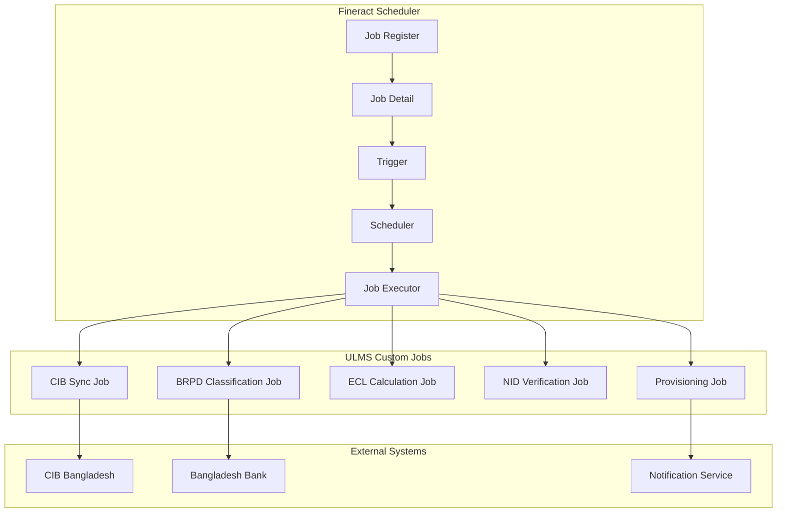

**Document Control**

| Field | Value |
|-------|-------|
| **Document Title** | Fineract Scheduler Customization Guide |
| **Project Name** | Unisoft Loan Management System (ULMS) v2.0 |
| **Document Version** | 1.0 |
| **Date** | 2026-02-08 |
| **Prepared By** | Unisoft Technical Team |
| **Reviewed By** | Solution Architect |
| **Classification** | Internal |
| **Status** | Draft |

**Revision History**

| Version | Date | Author | Description |
|---------|------|--------|-------------|
| 1.0 | 2026-02-08 | Unisoft Team | Initial version |

---

# Fineract Scheduler Customization Guide

## 1. Introduction

### 1.1 Purpose
This document details the customization of Apache Fineract's job scheduler for Bangladesh banking requirements, including BRPD classification, CIB updates, and ECL calculations.

### 1.2 Scope
- Custom job development
- CRON scheduling
- Batch job orchestration
- Error handling and recovery
- Monitoring and alerting

## 2. Fineract Scheduler Architecture

### 2.1 Core Scheduler Components



### 2.2 Scheduler Configuration

| Component | Technology | Purpose |
|-----------|------------|---------|
| Scheduler | Quartz | Job scheduling framework |
| Job Store | JDBC | Persistent job storage |
| Thread Pool | ThreadPoolTaskExecutor | Concurrent job execution |
| Listener | JobListener | Job lifecycle events |

## 3. Custom Job Development

### 3.1 BRPD Classification Job

```java
package org.apache.fineract.ulms.jobs;

import lombok.RequiredArgsConstructor;
import lombok.extern.slf4j.Slf4j;
import org.apache.fineract.infrastructure.core.service.DateUtils;
import org.apache.fineract.infrastructure.jobs.annotation.CronTarget;
import org.apache.fineract.infrastructure.jobs.service.JobName;
import org.apache.fineract.ulms.service.BrpdClassificationService;
import org.springframework.batch.core.Job;
import org.springframework.batch.core.JobParameters;
import org.springframework.batch.core.JobParametersBuilder;
import org.springframework.batch.core.launch.JobLauncher;
import org.springframework.stereotype.Component;

import java.time.LocalDate;
import java.time.format.DateTimeFormatter;

@Slf4j
@Component
@RequiredArgsConstructor
public class BrpdClassificationJob {
    
    private final JobLauncher jobLauncher;
    private final Job brpdClassificationBatchJob;
    private final BrpdClassificationService classificationService;
    
    /**
     * Daily BRPD classification job
     * Runs at 23:00 every day (Bangladesh time)
     */
    @CronTarget(jobName = JobName.BRPD_CLASSIFICATION)
    public void execute() {
        LocalDate classificationDate = DateUtils.getLocalDateOfTenant();
        log.info("Starting BRPD classification job for date: {}", classificationDate);
        
        try {
            JobParameters jobParameters = new JobParametersBuilder()
                .addString("classificationDate", classificationDate.format(DateTimeFormatter.ISO_DATE))
                .addLong("timestamp", System.currentTimeMillis())
                .toJobParameters();
            
            var execution = jobLauncher.run(brpdClassificationBatchJob, jobParameters);
            
            log.info("BRPD classification job completed with status: {}", 
                execution.getStatus());
                
        } catch (Exception e) {
            log.error("BRPD classification job failed", e);
            throw new BrpdClassificationException("Classification job execution failed", e);
        }
    }
}
```

### 3.2 Spring Batch Job Configuration

```java
package org.apache.fineract.ulms.config;

import lombok.RequiredArgsConstructor;
import org.apache.fineract.ulms.domain.BangladeshLoanExtension;
import org.apache.fineract.ulms.processor.BrpdClassificationItemProcessor;
import org.apache.fineract.ulms.reader.ActiveLoanItemReader;
import org.apache.fineract.ulms.writer.ClassificationResultItemWriter;
import org.springframework.batch.core.Job;
import org.springframework.batch.core.Step;
import org.springframework.batch.core.configuration.annotation.EnableBatchProcessing;
import org.springframework.batch.core.job.builder.JobBuilder;
import org.springframework.batch.core.repository.JobRepository;
import org.springframework.batch.core.step.builder.StepBuilder;
import org.springframework.batch.item.ItemProcessor;
import org.springframework.batch.item.ItemReader;
import org.springframework.batch.item.ItemWriter;
import org.springframework.context.annotation.Bean;
import org.springframework.context.annotation.Configuration;
import org.springframework.transaction.PlatformTransactionManager;

@Configuration
@EnableBatchProcessing
@RequiredArgsConstructor
public class BrpdBatchJobConfig {
    
    private final JobRepository jobRepository;
    private final PlatformTransactionManager transactionManager;
    
    @Bean
    public Job brpdClassificationBatchJob(
            Step brpdClassificationStep,
            BrpdJobExecutionListener listener) {
        
        return new JobBuilder("brpdClassificationJob", jobRepository)
            .listener(listener)
            .start(brpdClassificationStep)
            .build();
    }
    
    @Bean
    public Step brpdClassificationStep(
            ItemReader<BangladeshLoanExtension> reader,
            ItemProcessor<BangladeshLoanExtension, ClassificationResult> processor,
            ItemWriter<ClassificationResult> writer) {
        
        return new StepBuilder("brpdClassificationStep", jobRepository)
            .<BangladeshLoanExtension, ClassificationResult>chunk(100, transactionManager)
            .reader(reader)
            .processor(processor)
            .writer(writer)
            .faultTolerant()
            .skipLimit(10)
            .skip(BrpdClassificationException.class)
            .retryLimit(3)
            .retry(TransientDataAccessException.class)
            .listener(new BrpdStepExecutionListener())
            .build();
    }
    
    @Bean
    public ItemReader<BangladeshLoanExtension> activeLoanReader(
            BangladeshLoanRepository repository) {
        return new ActiveLoanItemReader(repository);
    }
    
    @Bean
    public ItemProcessor<BangladeshLoanExtension, ClassificationResult> 
            brpdClassificationProcessor(BrpdClassificationService service) {
        return new BrpdClassificationItemProcessor(service);
    }
    
    @Bean
    public ItemWriter<ClassificationResult> classificationResultWriter(
            ClassificationResultRepository repository) {
        return new ClassificationResultItemWriter(repository);
    }
}
```

### 3.3 Item Processor Implementation

```java
package org.apache.fineract.ulms.processor;

import lombok.RequiredArgsConstructor;
import lombok.extern.slf4j.Slf4j;
import org.apache.fineract.ulms.domain.BangladeshLoanExtension;
import org.apache.fineract.ulms.domain.BrpdClassificationStage;
import org.apache.fineract.ulms.domain.ClassificationResult;
import org.apache.fineract.ulms.service.BrpdClassificationService;
import org.springframework.batch.item.ItemProcessor;

import java.time.LocalDate;

@Slf4j
@RequiredArgsConstructor
public class BrpdClassificationItemProcessor 
    implements ItemProcessor<BangladeshLoanExtension, ClassificationResult> {
    
    private final BrpdClassificationService classificationService;
    private LocalDate classificationDate;
    
    @Override
    public ClassificationResult process(BangladeshLoanExtension loan) throws Exception {
        if (classificationDate == null) {
            classificationDate = LocalDate.now(); // From job parameters in real impl
        }
        
        log.debug("Processing classification for loan: {}", loan.getLoan().getId());
        
        try {
            // Calculate days past due
            int dpd = classificationService.calculateDaysPastDue(loan.getLoan());
            
            // Determine classification stage
            BrpdClassificationStage newStage = BrpdClassificationStage.fromDpd(dpd);
            BrpdClassificationStage currentStage = loan.getClassificationStage();
            
            // Create classification result
            return ClassificationResult.builder()
                .loanId(loan.getLoan().getId())
                .previousStage(currentStage)
                .currentStage(newStage)
                .daysPastDue(dpd)
                .classificationDate(classificationDate)
                .provisionAmount(calculateProvision(loan, newStage))
                .stageChanged(newStage != currentStage)
                .build();
                
        } catch (Exception e) {
            log.error("Failed to classify loan: {}", loan.getLoan().getId(), e);
            throw new BrpdClassificationException(
                "Classification failed for loan: " + loan.getLoan().getId(), e);
        }
    }
    
    private BigDecimal calculateProvision(BangladeshLoanExtension loan, 
            BrpdClassificationStage stage) {
        BigDecimal outstanding = loan.getLoan().getSummary().getTotalOutstanding();
        return outstanding.multiply(stage.getProvisionRate());
    }
}
```

## 4. CIB Synchronization Job

### 4.1 CIB Upload Job

```java
package org.apache.fineract.ulms.jobs;

import lombok.RequiredArgsConstructor;
import lombok.extern.slf4j.Slf4j;
import org.apache.fineract.infrastructure.jobs.annotation.CronTarget;
import org.apache.fineract.infrastructure.jobs.service.JobName;
import org.apache.fineract.ulms.service.CibUploadService;
import org.springframework.stereotype.Component;

import java.time.LocalDate;
import java.time.YearMonth;

@Slf4j
@Component
@RequiredArgsConstructor
public class CibUploadJob {
    
    private final CibUploadService cibUploadService;
    
    /**
     * Monthly CIB data upload job
     * Runs on 5th of every month at 02:00
     */
    @CronTarget(jobName = JobName.CIB_MONTHLY_UPLOAD)
    public void executeMonthlyUpload() {
        YearMonth reportMonth = YearMonth.now().minusMonths(1);
        log.info("Starting CIB monthly upload for: {}", reportMonth);
        
        try {
            CibUploadResult result = cibUploadService.uploadMonthlyData(reportMonth);
            
            log.info("CIB upload completed: {} records uploaded, {} failed",
                result.getSuccessCount(), result.getFailureCount());
                
            if (result.hasFailures()) {
                log.warn("CIB upload had {} failures", result.getFailureCount());
                // Send alert to operations team
            }
            
        } catch (Exception e) {
            log.error("CIB monthly upload failed", e);
            throw new CibUploadException("Monthly upload failed", e);
        }
    }
    
    /**
     * Daily incremental CIB update
     * Runs at 01:00 daily
     */
    @CronTarget(jobName = JobName.CIB_DAILY_UPDATE)
    public void executeDailyUpdate() {
        LocalDate updateDate = LocalDate.now().minusDays(1);
        log.info("Starting CIB daily update for: {}", updateDate);
        
        try {
            cibUploadService.uploadDailyChanges(updateDate);
            log.info("CIB daily update completed");
        } catch (Exception e) {
            log.error("CIB daily update failed", e);
            throw new CibUploadException("Daily update failed", e);
        }
    }
}
```

## 5. ECL Calculation Job

### 5.1 IFRS-9 ECL Batch Job

```java
package org.apache.fineract.ulms.jobs;

import lombok.RequiredArgsConstructor;
import lombok.extern.slf4j.Slf4j;
import org.apache.fineract.infrastructure.jobs.annotation.CronTarget;
import org.apache.fineract.infrastructure.jobs.service.JobName;
import org.apache.fineract.ulms.service.EclCalculationService;
import org.springframework.stereotype.Component;

import java.time.LocalDate;

@Slf4j
@Component
@RequiredArgsConstructor
public class EclCalculationJob {
    
    private final EclCalculationService eclService;
    
    /**
     * Monthly ECL calculation for IFRS-9 compliance
     * Runs on 1st of every month at 03:00
     */
    @CronTarget(jobName = JobName.IFRS9_ECL_CALCULATION)
    public void executeMonthlyEclCalculation() {
        LocalDate calculationDate = LocalDate.now();
        log.info("Starting IFRS-9 ECL calculation for: {}", calculationDate);
        
        try {
            EclCalculationResult result = eclService.calculatePortfolioEcl(calculationDate);
            
            log.info("ECL calculation completed:
                Stage 1: {} loans, BDT {}
                Stage 2: {} loans, BDT {}
                Stage 3: {} loans, BDT {}
                Total ECL: BDT {}",
                result.getStage1Count(), result.getStage1Ecl(),
                result.getStage2Count(), result.getStage2Ecl(),
                result.getStage3Count(), result.getStage3Ecl(),
                result.getTotalEcl());
                
            // Generate report for finance team
            eclService.generateEclReport(result, calculationDate);
            
        } catch (Exception e) {
            log.error("ECL calculation failed", e);
            throw new EclCalculationException("ECL calculation job failed", e);
        }
    }
}
```

## 6. CRON Schedule Configuration

### 6.1 Job Scheduling

```java
package org.apache.fineract.ulms.config;

import org.apache.fineract.infrastructure.jobs.service.JobName;
import org.springframework.context.annotation.Bean;
import org.springframework.context.annotation.Configuration;

@Configuration
public class UlmsJobConfiguration {
    
    /**
     * BRPD Classification - Daily at 23:00
     */
    @Bean
    public JobDefinition brpdClassificationJob() {
        return JobDefinition.builder()
            .name(JobName.BRPD_CLASSIFICATION)
            .cronExpression("0 0 23 * * ?")
            .description("Daily BRPD loan classification")
            .build();
    }
    
    /**
     * CIB Monthly Upload - 5th of every month at 02:00
     */
    @Bean
    public JobDefinition cibMonthlyUploadJob() {
        return JobDefinition.builder()
            .name(JobName.CIB_MONTHLY_UPLOAD)
            .cronExpression("0 0 2 5 * ?")
            .description("Monthly CIB data upload")
            .build();
    }
    
    /**
     * CIB Daily Update - Every day at 01:00
     */
    @Bean
    public JobDefinition cibDailyUpdateJob() {
        return JobDefinition.builder()
            .name(JobName.CIB_DAILY_UPDATE)
            .cronExpression("0 0 1 * * ?")
            .description("Daily CIB incremental update")
            .build();
    }
    
    /**
     * IFRS-9 ECL Calculation - 1st of every month at 03:00
     */
    @Bean
    public JobDefinition eclCalculationJob() {
        return JobDefinition.builder()
            .name(JobName.IFRS9_ECL_CALCULATION)
            .cronExpression("0 0 3 1 * ?")
            .description("Monthly IFRS-9 ECL calculation")
            .build();
    }
    
    /**
     * NID Verification Cleanup - Every Sunday at 00:00
     */
    @Bean
    public JobDefinition nidVerificationCleanupJob() {
        return JobDefinition.builder()
            .name(JobName.NID_VERIFICATION_CLEANUP)
            .cronExpression("0 0 0 ? * SUN")
            .description("Weekly NID verification cleanup")
            .build();
    }
    
    /**
     * Provisioning Update - Daily at 22:00
     */
    @Bean
    public JobDefinition provisioningUpdateJob() {
        return JobDefinition.builder()
            .name(JobName.PROVISIONING_UPDATE)
            .cronExpression("0 0 22 * * ?")
            .description("Daily provisioning update")
            .build();
    }
}
```

### 6.2 Job Schedule Summary

| Job Name | CRON Expression | Schedule | Description |
|----------|-----------------|----------|-------------|
| BRPD_CLASSIFICATION | `0 0 23 * * ?` | Daily 23:00 | Loan classification per BRPD 15/2024 |
| CIB_MONTHLY_UPLOAD | `0 0 2 5 * ?` | Monthly 5th 02:00 | Full CIB data upload |
| CIB_DAILY_UPDATE | `0 0 1 * * ?` | Daily 01:00 | Incremental CIB update |
| IFRS9_ECL_CALCULATION | `0 0 3 1 * ?` | Monthly 1st 03:00 | IFRS-9 ECL calculation |
| NID_VERIFICATION_CLEANUP | `0 0 0 ? * SUN` | Weekly Sunday 00:00 | NID cache cleanup |
| PROVISIONING_UPDATE | `0 0 22 * * ?` | Daily 22:00 | Provisioning entry update |

## 7. Job Monitoring and Alerting

### 7.1 Job Listener

```java
package org.apache.fineract.ulms.listener;

import lombok.RequiredArgsConstructor;
import lombok.extern.slf4j.Slf4j;
import org.apache.fineract.ulms.service.JobNotificationService;
import org.springframework.batch.core.JobExecution;
import org.springframework.batch.core.JobExecutionListener;
import org.springframework.stereotype.Component;

@Slf4j
@Component
@RequiredArgsConstructor
public class UlmsJobExecutionListener implements JobExecutionListener {
    
    private final JobNotificationService notificationService;
    
    @Override
    public void beforeJob(JobExecution jobExecution) {
        String jobName = jobExecution.getJobInstance().getJobName();
        log.info("Starting job: {}", jobName);
        
        notificationService.notifyJobStarted(jobName);
    }
    
    @Override
    public void afterJob(JobExecution jobExecution) {
        String jobName = jobExecution.getJobInstance().getJobName();
        var status = jobExecution.getStatus();
        
        log.info("Job {} completed with status: {}", jobName, status);
        
        switch (status) {
            case COMPLETED:
                notificationService.notifyJobCompleted(jobName, jobExecution);
                break;
            case FAILED:
                notificationService.notifyJobFailed(jobName, jobExecution);
                break;
            default:
                log.warn("Job {} ended with unexpected status: {}", jobName, status);
        }
    }
}
```

### 7.2 Alert Configuration

```yaml
# application-scheduler.yml
ulms:
  scheduler:
    alerts:
      enabled: true
      channels:
        - email
        - sms
        - slack
      recipients:
        email: operations@unisoft.com.bd
        sms: +8801709642404
        slack: #operations-alerts
      rules:
        - job: BRPD_CLASSIFICATION
          on-failure: immediate
          on-success: daily-summary
        - job: CIB_MONTHLY_UPLOAD
          on-failure: immediate
          on-success: immediate
        - job: IFRS9_ECL_CALCULATION
          on-failure: immediate
          on-success: immediate
```

## 8. Error Handling and Recovery

### 8.1 Retry Configuration

```java
package org.apache.fineract.ulms.config;

import org.springframework.context.annotation.Bean;
import org.springframework.context.annotation.Configuration;
import org.springframework.retry.backoff.ExponentialBackOffPolicy;
import org.springframework.retry.policy.SimpleRetryPolicy;
import org.springframework.retry.support.RetryTemplate;

@Configuration
public class JobRetryConfiguration {
    
    @Bean
    public RetryTemplate cibRetryTemplate() {
        RetryTemplate retryTemplate = new RetryTemplate();
        
        // Retry 3 times with exponential backoff
        ExponentialBackOffPolicy backOffPolicy = new ExponentialBackOffPolicy();
        backOffPolicy.setInitialInterval(5000);  // 5 seconds
        backOffPolicy.setMultiplier(2.0);
        backOffPolicy.setMaxInterval(60000);     // Max 1 minute
        
        SimpleRetryPolicy retryPolicy = new SimpleRetryPolicy();
        retryPolicy.setMaxAttempts(3);
        
        retryTemplate.setBackOffPolicy(backOffPolicy);
        retryTemplate.setRetryPolicy(retryPolicy);
        
        return retryTemplate;
    }
}
```

### 8.2 Dead Letter Queue

```java
package org.apache.fineract.ulms.service;

import lombok.RequiredArgsConstructor;
import org.apache.fineract.ulms.domain.FailedJobRecord;
import org.springframework.stereotype.Service;

import java.time.LocalDateTime;

@Service
@RequiredArgsConstructor
public class JobDeadLetterService {
    
    private final FailedJobRecordRepository repository;
    
    public void recordFailure(String jobName, Long entityId, String errorMessage, String payload) {
        FailedJobRecord record = FailedJobRecord.builder()
            .jobName(jobName)
            .entityId(entityId)
            .errorMessage(errorMessage)
            .payload(payload)
            .failedAt(LocalDateTime.now())
            .retryCount(0)
            .status(FailedJobStatus.PENDING_RETRY)
            .build();
        
        repository.save(record);
    }
    
    public void retryFailedRecords(String jobName) {
        var failedRecords = repository.findByJobNameAndStatus(jobName, FailedJobStatus.PENDING_RETRY);
        
        for (FailedJobRecord record : failedRecords) {
            try {
                // Attempt retry based on job type
                retryRecord(record);
                record.setStatus(FailedJobStatus.RESOLVED);
            } catch (Exception e) {
                record.incrementRetryCount();
                if (record.getRetryCount() >= 3) {
                    record.setStatus(FailedJobStatus.FAILED_PERMANENTLY);
                }
            }
            repository.save(record);
        }
    }
}
```

---

## Appendices

### A.1 Job Configuration Properties

```properties
# Scheduler thread pool
fineract.scheduler.threadpool.size=10

# Job store configuration
spring.batch.jdbc.initialize-schema=always
spring.batch.job.enabled=false

# Timezone (Bangladesh)
ulms.scheduler.timezone=Asia/Dhaka
```

### A.2 Troubleshooting Guide

| Issue | Cause | Solution |
|-------|-------|----------|
| Job not triggering | CRON expression wrong | Verify expression with cron validator |
| Concurrent execution | Job not idempotent | Add job locking mechanism |
| Memory issues | Large batch size | Reduce chunk size, add pagination |
| DB connection pool | Long-running jobs | Increase pool size or reduce concurrency |
