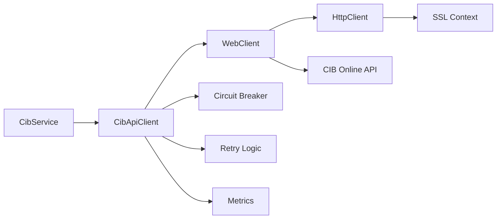

**Document Control**

| Field | Value |
|-------|-------|
| **Document Title** | CIB API Client Design |
| **Project Name** | Unisoft Loan Management System (ULMS) v2.0 |
| **Document Version** | 1.0 |
| **Date** | 2026-02-08 |
| **Prepared By** | Unisoft Technical Team |
| **Reviewed By** | Solution Architect |
| **Classification** | Internal |
| **Status** | Draft |

**Revision History**

| Version | Date | Author | Description |
|---------|------|--------|-------------|
| 1.0 | 2026-02-08 | Unisoft Team | Initial version |

---

# CIB API Client Design

## 1. Overview

### 1.1 Design Goals
- Reactive, non-blocking API client using WebClient
- Resilient with circuit breaker and retry patterns
- Secure with mutual TLS authentication
- Observable with metrics and tracing

### 1.2 Client Architecture



## 2. API Client Implementation

### 2.1 CibApiClient Interface

```java
package com.unisoft.ulms.cib.client;

import reactor.core.publisher.Mono;

/**
 * Reactive client for Bangladesh Bank CIB Online API
 */
public interface CibApiClient {
    
    /**
     * Perform individual CIB inquiry
     */
    Mono<CibIndividualReport> inquireIndividual(CibIndividualInquiryRequest request);
    
    /**
     * Perform company CIB inquiry
     */
    Mono<CibCompanyReport> inquireCompany(CibCompanyInquiryRequest request);
    
    /**
     * Submit batch upload
     */
    Mono<CibBatchResponse> submitBatch(CibBatchUploadRequest request);
    
    /**
     * Check batch status
     */
    Mono<CibBatchStatus> getBatchStatus(String batchId);
    
    /**
     * Download report file
     */
    Mono<byte[]> downloadReport(String reportId);
}
```

### 2.2 CibApiClient Implementation

```java
package com.unisoft.ulms.cib.client;

import lombok.RequiredArgsConstructor;
import lombok.extern.slf4j.Slf4j;
import org.springframework.core.io.buffer.DataBuffer;
import org.springframework.core.io.buffer.DataBufferUtils;
import org.springframework.http.HttpStatus;
import org.springframework.http.MediaType;
import org.springframework.stereotype.Component;
import org.springframework.web.reactive.function.client.WebClient;
import reactor.core.publisher.Flux;
import reactor.core.publisher.Mono;

import java.nio.charset.StandardCharsets;

@Slf4j
@Component
@RequiredArgsConstructor
public class CibApiClientImpl implements CibApiClient {
    
    private final WebClient cibWebClient;
    private final CibAuthProvider authProvider;
    
    private static final String INDIVIDUAL_INQUIRY_PATH = "/inquiry/individual";
    private static final String COMPANY_INQUIRY_PATH = "/inquiry/company";
    private static final String BATCH_UPLOAD_PATH = "/batch/upload";
    private static final String BATCH_STATUS_PATH = "/batch/status/{batchId}";
    private static final String REPORT_DOWNLOAD_PATH = "/report/download/{reportId}";
    
    @Override
    public Mono<CibIndividualReport> inquireIndividual(CibIndividualInquiryRequest request) {
        log.debug("CIB individual inquiry for NID: {}", maskNid(request.getNid()));
        
        return authProvider.getAccessToken()
            .flatMap(token -> cibWebClient.post()
                .uri(INDIVIDUAL_INQUIRY_PATH)
                .header("Authorization", "Bearer " + token)
                .bodyValue(request)
                .retrieve()
                .onStatus(HttpStatus::isError, this::handleErrorResponse)
                .bodyToMono(CibIndividualApiResponse.class)
                .map(this::mapToReport)
                .doOnNext(report -> log.debug("CIB inquiry successful, score: {}", 
                    report.getCibScore()))
                .doOnError(error -> log.error("CIB inquiry failed: {}", 
                    error.getMessage())));
    }
    
    @Override
    public Mono<CibCompanyReport> inquireCompany(CibCompanyInquiryRequest request) {
        log.debug("CIB company inquiry for BIN: {}", request.getBin());
        
        return authProvider.getAccessToken()
            .flatMap(token -> cibWebClient.post()
                .uri(COMPANY_INQUIRY_PATH)
                .header("Authorization", "Bearer " + token)
                .bodyValue(request)
                .retrieve()
                .onStatus(HttpStatus::isError, this::handleErrorResponse)
                .bodyToMono(CibCompanyApiResponse.class)
                .map(this::mapToCompanyReport));
    }
    
    @Override
    public Mono<CibBatchResponse> submitBatch(CibBatchUploadRequest request) {
        log.info("Submitting CIB batch upload with {} records", request.getRecords().size());
        
        return authProvider.getAccessToken()
            .flatMap(token -> cibWebClient.post()
                .uri(BATCH_UPLOAD_PATH)
                .header("Authorization", "Bearer " + token)
                .contentType(MediaType.APPLICATION_JSON)
                .bodyValue(request)
                .retrieve()
                .onStatus(HttpStatus::isError, this::handleErrorResponse)
                .bodyToMono(CibBatchResponse.class)
                .doOnNext(response -> log.info("CIB batch submitted, ID: {}", 
                    response.getBatchId())));
    }
    
    @Override
    public Mono<CibBatchStatus> getBatchStatus(String batchId) {
        log.debug("Checking CIB batch status: {}", batchId);
        
        return authProvider.getAccessToken()
            .flatMap(token -> cibWebClient.get()
                .uri(BATCH_STATUS_PATH, batchId)
                .header("Authorization", "Bearer " + token)
                .retrieve()
                .onStatus(HttpStatus::isError, this::handleErrorResponse)
                .bodyToMono(CibBatchStatus.class));
    }
    
    @Override
    public Mono<byte[]> downloadReport(String reportId) {
        log.debug("Downloading CIB report: {}", reportId);
        
        return authProvider.getAccessToken()
            .flatMap(token -> cibWebClient.get()
                .uri(REPORT_DOWNLOAD_PATH, reportId)
                .header("Authorization", "Bearer " + token)
                .accept(MediaType.APPLICATION_OCTET_STREAM)
                .retrieve()
                .onStatus(HttpStatus::isError, this::handleErrorResponse)
                .bodyToFlux(DataBuffer.class)
                .flatMap(DataBufferUtils::release)
                .collectList()
                .map(this::concatenateBuffers));
    }
    
    private Mono<Throwable> handleErrorResponse(
            reactor.core.publisher.ClientResponse response) {
        
        return response.bodyToMono(String.class)
            .flatMap(errorBody -> {
                HttpStatus status = (HttpStatus) response.statusCode();
                log.error("CIB API error: {} - {}", status, errorBody);
                
                CibApiException exception = switch (status) {
                    case UNAUTHORIZED -> new CibAuthenticationException(
                        "CIB authentication failed", errorBody);
                    case FORBIDDEN -> new CibAuthorizationException(
                        "CIB access denied", errorBody);
                    case TOO_MANY_REQUESTS -> new CibRateLimitException(
                        "CIB rate limit exceeded", errorBody);
                    case NOT_FOUND -> new CibNotFoundException(
                        "CIB resource not found", errorBody);
                    case BAD_REQUEST -> new CibValidationException(
                        "CIB validation failed", errorBody);
                    default -> new CibApiException(
                        "CIB API error: " + status, errorBody);
                };
                
                return Mono.error(exception);
            });
    }
    
    private CibIndividualReport mapToReport(CibIndividualApiResponse response) {
        return CibIndividualReport.builder()
            .reportId(response.getReportId())
            .nid(response.getSubjectInfo().getNid())
            .name(response.getSubjectInfo().getName())
            .cibScore(response.getCreditScore().getScore())
            .scoreCategory(response.getCreditScore().getCategory())
            .summary(mapSummary(response.getSummary()))
            .facilities(mapFacilities(response.getFacilities()))
            .defaultHistory(mapDefaults(response.getDefaults()))
            .recentInquiries(mapInquiries(response.getInquiries()))
            .generatedAt(response.getGeneratedAt())
            .expiresAt(response.getValidUntil())
            .reportHash(response.getHash())
            .build();
    }
    
    private String maskNid(String nid) {
        if (nid == null || nid.length() < 8) return "****";
        return nid.substring(0, 4) + "****" + nid.substring(nid.length() - 4);
    }
    
    private byte[] concatenateBuffers(List<DataBuffer> buffers) {
        int totalSize = buffers.stream().mapToInt(DataBuffer::readableByteCount).sum();
        byte[] result = new byte[totalSize];
        int offset = 0;
        for (DataBuffer buffer : buffers) {
            int length = buffer.readableByteCount();
            buffer.read(result, offset, length);
            offset += length;
        }
        return result;
    }
}
```

## 3. Authentication Provider

### 3.1 Token Management

```java
package com.unisoft.ulms.cib.client;

import lombok.RequiredArgsConstructor;
import lombok.extern.slf4j.Slf4j;
import org.springframework.stereotype.Component;
import org.springframework.web.reactive.function.client.WebClient;
import reactor.core.publisher.Mono;

import java.time.Duration;
import java.time.Instant;
import java.util.concurrent.atomic.AtomicReference;

@Slf4j
@Component
@RequiredArgsConstructor
public class CibAuthProvider {
    
    private final WebClient cibWebClient;
    private final CibProperties properties;
    
    private final AtomicReference<CibAuthToken> tokenCache = 
        new AtomicReference<>();
    
    private static final String TOKEN_PATH = "/auth/token";
    
    /**
     * Get valid access token, refreshing if necessary
     */
    public Mono<String> getAccessToken() {
        CibAuthToken cached = tokenCache.get();
        
        if (cached != null && !isExpired(cached)) {
            return Mono.just(cached.getAccessToken());
        }
        
        return refreshToken()
            .map(CibAuthToken::getAccessToken);
    }
    
    /**
     * Force token refresh
     */
    public Mono<CibAuthToken> refreshToken() {
        log.debug("Refreshing CIB access token");
        
        TokenRequest request = TokenRequest.builder()
            .grantType("client_credentials")
            .clientId(properties.getClientId())
            .clientSecret(properties.getApiKey())
            .scope("cib:read cib:write")
            .build();
        
        return cibWebClient.post()
            .uri(TOKEN_PATH)
            .bodyValue(request)
            .retrieve()
            .bodyToMono(TokenResponse.class)
            .map(this::mapToAuthToken)
            .doOnNext(token -> {
                tokenCache.set(token);
                log.debug("CIB token refreshed, expires at: {}", token.getExpiresAt());
            })
            .doOnError(error -> log.error("Failed to refresh CIB token: {}", 
                error.getMessage()));
    }
    
    private boolean isExpired(CibAuthToken token) {
        // Refresh 5 minutes before expiry
        return Instant.now().plus(Duration.ofMinutes(5))
            .isAfter(token.getExpiresAt());
    }
    
    private CibAuthToken mapToAuthToken(TokenResponse response) {
        return CibAuthToken.builder()
            .accessToken(response.getAccessToken())
            .tokenType(response.getTokenType())
            .expiresAt(Instant.now().plusSeconds(response.getExpiresIn()))
            .scope(response.getScope())
            .build();
    }
}
```

## 4. Request/Response Models

### 4.1 Individual Inquiry Models

```java
@Data
@Builder
public class CibIndividualInquiryRequest {
    
    @JsonProperty("nid")
    private String nid;
    
    @JsonProperty("name")
    private String name;
    
    @JsonProperty("father_name")
    private String fatherName;
    
    @JsonProperty("mother_name")
    private String motherName;
    
    @JsonProperty("date_of_birth")
    private String dateOfBirth;
    
    @JsonProperty("inquiry_purpose")
    private String inquiryPurpose;
    
    @JsonProperty("reference_id")
    private String referenceId;
}

@Data
public class CibIndividualApiResponse {
    
    @JsonProperty("report_id")
    private String reportId;
    
    @JsonProperty("subject_info")
    private SubjectInfo subjectInfo;
    
    @JsonProperty("credit_score")
    private CreditScore creditScore;
    
    @JsonProperty("summary")
    private Summary summary;
    
    @JsonProperty("facilities")
    private List<Facility> facilities;
    
    @JsonProperty("defaults")
    private List<DefaultRecord> defaults;
    
    @JsonProperty("inquiries")
    private List<InquiryRecord> inquiries;
    
    @JsonProperty("generated_at")
    private LocalDateTime generatedAt;
    
    @JsonProperty("valid_until")
    private LocalDateTime validUntil;
    
    @JsonProperty("hash")
    private String hash;
}

@Data
public class CreditScore {
    @JsonProperty("score")
    private Integer score;
    
    @JsonProperty("category")
    private String category;
    
    @JsonProperty("factors")
    private List<String> factors;
}
```

### 4.2 Batch Upload Models

```java
@Data
@Builder
public class CibBatchUploadRequest {
    
    @JsonProperty("batch_type")
    private String batchType; // "MONTHLY", "DAILY"
    
    @JsonProperty("reporting_month")
    private String reportingMonth; // "YYYY-MM"
    
    @JsonProperty("institution_code")
    private String institutionCode;
    
    @JsonProperty("records")
    private List<BatchRecord> records;
}

@Data
@Builder
public class BatchRecord {
    
    @JsonProperty("record_type")
    private String recordType; // "FACILITY", "GUARANTOR"
    
    @JsonProperty("facility_id")
    private String facilityId;
    
    @JsonProperty("borrower_nid")
    private String borrowerNid;
    
    @JsonProperty("borrower_name")
    private String borrowerName;
    
    @JsonProperty("facility_type")
    private String facilityType;
    
    @JsonProperty("sanction_date")
    private String sanctionDate;
    
    @JsonProperty("sanction_amount")
    private BigDecimal sanctionAmount;
    
    @JsonProperty("outstanding_amount")
    private BigDecimal outstandingAmount;
    
    @JsonProperty("overdue_amount")
    private BigDecimal overdueAmount;
    
    @JsonProperty("classification")
    private String classification; // "STD", "SMA", "SS", "DF", "BL"
    
    @JsonProperty("status")
    private String status; // "ACTIVE", "CLOSED", "WRITTEN_OFF"
}
```

## 5. Error Handling

### 5.1 Exception Hierarchy

```java
// Base exception
public class CibApiException extends RuntimeException {
    private final String errorCode;
    private final String errorBody;
    
    public CibApiException(String message, String errorBody) {
        super(message);
        this.errorBody = errorBody;
        this.errorCode = extractErrorCode(errorBody);
    }
}

// Specific exceptions
public class CibAuthenticationException extends CibApiException {
    public CibAuthenticationException(String message, String errorBody) {
        super(message, errorBody);
    }
}

public class CibRateLimitException extends CibApiException {
    private final int retryAfterSeconds;
    
    public CibRateLimitException(String message, String errorBody) {
        super(message, errorBody);
        this.retryAfterSeconds = extractRetryAfter(errorBody);
    }
}

public class CibNotFoundException extends CibApiException {
    public CibNotFoundException(String message, String errorBody) {
        super(message, errorBody);
    }
}

public class CibValidationException extends CibApiException {
    private final List<FieldError> fieldErrors;
    
    public CibValidationException(String message, String errorBody) {
        super(message, errorBody);
        this.fieldErrors = parseFieldErrors(errorBody);
    }
}
```

---

## Appendices

### A.1 API Endpoints Summary

| Method | Endpoint | Request | Response |
|--------|----------|---------|----------|
| POST | /auth/token | TokenRequest | TokenResponse |
| POST | /inquiry/individual | IndividualInquiryRequest | IndividualReport |
| POST | /inquiry/company | CompanyInquiryRequest | CompanyReport |
| POST | /batch/upload | BatchUploadRequest | BatchResponse |
| GET | /batch/status/{batchId} | - | BatchStatus |
| GET | /report/download/{reportId} | - | byte[] |

### A.2 HTTP Status Codes

| Status | Meaning | Action |
|--------|---------|--------|
| 200 | Success | Process response |
| 400 | Bad Request | Log and return validation error |
| 401 | Unauthorized | Refresh token and retry |
| 403 | Forbidden | Alert admin, check permissions |
| 404 | Not Found | Return empty result |
| 429 | Rate Limited | Exponential backoff retry |
| 500 | Server Error | Retry with backoff |
| 503 | Service Unavailable | Circuit breaker open |
