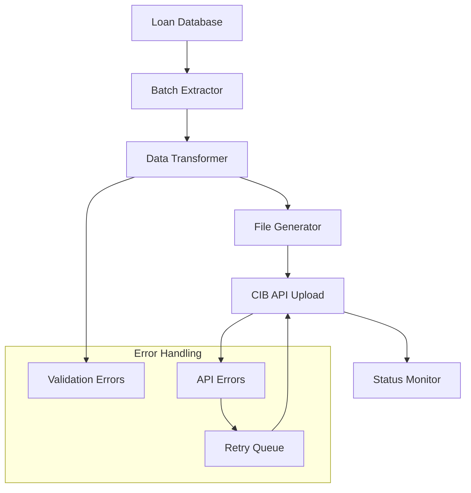
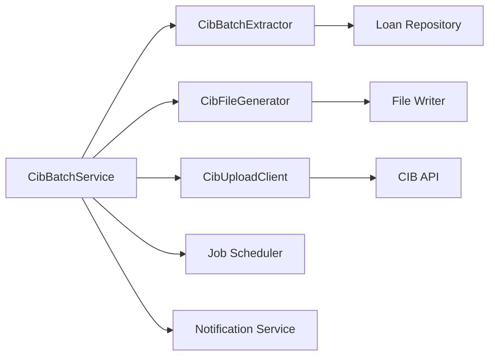

**Document Control**

| Field | Value |
|-------|-------|
| **Document Title** | CIB Batch Processing Design |
| **Project Name** | Unisoft Loan Management System (ULMS) v2.0 |
| **Document Version** | 1.0 |
| **Date** | 2026-02-08 |
| **Prepared By** | Unisoft Technical Team |
| **Reviewed By** | Solution Architect |
| **Classification** | Internal |
| **Status** | Draft |

**Revision History**

| Version | Date | Author | Description |
|---------|------|--------|-------------|
| 1.0 | 2026-02-08 | Unisoft Team | Initial version |

---

# CIB Batch Processing Design

## 1. Overview

### 1.1 Purpose
Design for monthly and daily batch data upload to Bangladesh Bank CIB Online system as per regulatory requirements.

### 1.2 Batch Types

| Batch Type | Frequency | Records | Purpose |
|------------|-----------|---------|---------|
| Monthly Full | 5th of month | All active loans | Complete portfolio snapshot |
| Daily Incremental | Daily | Changes only | Daily updates |
| Correction | Ad-hoc | Specific records | Error corrections |

## 2. Architecture

### 2.1 Batch Processing Flow



### 2.2 Component Design



## 3. Data Extraction

### 3.1 Monthly Batch Extraction

```java
package com.unisoft.ulms.cib.batch;

import lombok.RequiredArgsConstructor;
import org.springframework.data.domain.Page;
import org.springframework.data.domain.Pageable;
import org.springframework.stereotype.Component;

import java.time.YearMonth;
import java.util.stream.Stream;

@Component
@RequiredArgsConstructor
public class CibBatchExtractor {
    
    private final LoanRepository loanRepository;
    private static final int BATCH_SIZE = 1000;
    
    /**
     * Extract all active loans for monthly reporting
     */
    public Stream<BatchLoanRecord> extractMonthlyBatch(YearMonth reportingMonth) {
        return Stream.iterate(
            0,
            page -> loanRepository.findActiveLoansForCib(
                reportingMonth.atEndOfMonth(), 
                Pageable.ofSize(BATCH_SIZE).withPage(page)
            ).hasNext(),
            page -> page + 1
        )
        .flatMap(page -> loanRepository
            .findActiveLoansForCib(reportingMonth.atEndOfMonth(), 
                Pageable.ofSize(BATCH_SIZE).withPage(page))
            .getContent()
            .stream())
        .map(this::transformToBatchRecord);
    }
    
    /**
     * Extract daily changes
     */
    public Stream<BatchLoanRecord> extractDailyBatch(LocalDate date) {
        return loanRepository.findLoansChangedOn(date, Pageable.unpaged())
            .getContent()
            .stream()
            .map(this::transformToBatchRecord);
    }
    
    private BatchLoanRecord transformToBatchRecord(Loan loan) {
        return BatchLoanRecord.builder()
            .recordType(determineRecordType(loan))
            .facilityId(loan.getExternalId())
            .borrowerNid(loan.getClient().getNid())
            .borrowerName(loan.getClient().getDisplayName())
            .facilityType(mapFacilityType(loan.getLoanProduct()))
            .sanctionDate(loan.getApprovedOnDate())
            .sanctionAmount(loan.getPrincipalAmount())
            .outstandingAmount(loan.getSummary().getTotalOutstanding())
            .overdueAmount(loan.getSummary().getTotalOverdue())
            .daysPastDue(calculateDpd(loan))
            .classification(loan.getClassification())
            .status(mapLoanStatus(loan.getStatus()))
            .build();
    }
    
    private String determineRecordType(Loan loan) {
        if (loan.hasGuarantor()) {
            return "GUARANTOR";
        }
        return "FACILITY";
    }
}
```

### 3.2 SQL Extraction Query

```sql
-- Monthly batch extraction query
SELECT 
    l.external_id as facility_id,
    c.nid as borrower_nid,
    c.fullname as borrower_name,
    lp.name as facility_type,
    l.approvedon_date as sanction_date,
    l.principal_amount as sanction_amount,
    ls.principal_outstanding as outstanding_amount,
    COALESCE(ls.total_overdue, 0) as overdue_amount,
    COALESCE(ls.days_past_due, 0) as days_past_due,
    ble.classification_stage as classification,
    l.loan_status_id as status
FROM m_loan l
JOIN m_client c ON l.client_id = c.id
JOIN m_product_loan lp ON l.product_id = lp.id
LEFT JOIN m_loan_summary ls ON l.id = ls.loan_id
LEFT JOIN ulms_bangladesh_loan_extension ble ON l.id = ble.loan_id
WHERE l.loan_status_id IN (300, 600, 700)  -- Active, Closed, Written-off
    AND (l.closedon_date IS NULL OR l.closedon_date >= :reportingMonthStart)
ORDER BY l.id;
```

## 4. File Generation

### 4.1 JSON Batch File Format

```java
package com.unisoft.ulms.cib.batch;

import com.fasterxml.jackson.databind.ObjectWriter;
import com.fasterxml.jackson.databind.SequenceWriter;
import lombok.RequiredArgsConstructor;
import lombok.SneakyThrows;
import org.springframework.stereotype.Component;

import java.io.File;
import java.io.FileOutputStream;
import java.nio.file.Path;
import java.time.YearMonth;
import java.time.format.DateTimeFormatter;
import java.util.stream.Stream;
import java.util.zip.GZIPOutputStream;

@Component
@RequiredArgsConstructor
public class CibFileGenerator {
    
    private final ObjectWriter objectWriter;
    private static final DateTimeFormatter MONTH_FORMATTER = 
        DateTimeFormatter.ofPattern("yyyyMM");
    
    /**
     * Generate CIB batch file
     */
    @SneakyThrows
    public Path generateBatchFile(YearMonth reportingMonth, 
            Stream<BatchLoanRecord> records) {
        
        String filename = String.format("CIB_BATCH_%s_%s.json.gz",
            reportingMonth.format(MONTH_FORMATTER),
            System.currentTimeMillis());
        
        Path filePath = Path.of("/tmp/cib-batches", filename);
        filePath.getParent().toFile().mkdirs();
        
        try (FileOutputStream fos = new FileOutputStream(filePath.toFile());
             GZIPOutputStream gzos = new GZIPOutputStream(fos)) {
            
            SequenceWriter writer = objectWriter
                .forType(BatchLoanRecord.class)
                .writeValuesAsArray(gzos);
            
            records.forEach(record -> {
                try {
                    writer.write(record);
                } catch (Exception e) {
                    log.error("Failed to write record: {}", record.getFacilityId(), e);
                }
            });
            
            writer.close();
        }
        
        return filePath;
    }
    
    /**
     * Calculate file checksum
     */
    public String calculateChecksum(Path filePath) throws Exception {
        MessageDigest digest = MessageDigest.getInstance("SHA-256");
        
        try (InputStream is = Files.newInputStream(filePath)) {
            byte[] buffer = new byte[8192];
            int read;
            while ((read = is.read(buffer)) > 0) {
                digest.update(buffer, 0, read);
            }
        }
        
        return Base64.getEncoder().encodeToString(digest.digest());
    }
}
```

### 4.2 Batch File Structure

```json
{
  "header": {
    "institutionCode": "001234",
    "reportingMonth": "2026-01",
    "batchType": "MONTHLY",
    "generatedAt": "2026-02-05T02:00:00Z",
    "totalRecords": 15000,
    "fileVersion": "1.0"
  },
  "records": [
    {
      "recordType": "FACILITY",
      "facilityId": "LN-2025-001234",
      "borrowerNid": "1234567890",
      "borrowerName": "MOHAMMAD ALI",
      "facilityType": "PERSONAL LOAN",
      "sanctionDate": "2025-06-15",
      "sanctionAmount": 500000.00,
      "outstandingAmount": 350000.00,
      "overdueAmount": 0.00,
      "daysPastDue": 0,
      "classification": "STD-0",
      "status": "ACTIVE"
    }
  ],
  "footer": {
    "totalSanctionAmount": 750000000.00,
    "totalOutstanding": 500000000.00,
    "totalOverdue": 25000000.00,
    "recordCount": 15000
  }
}
```

## 5. Upload Process

### 5.1 Batch Upload Service

```java
package com.unisoft.ulms.cib.batch;

import lombok.RequiredArgsConstructor;
import lombok.extern.slf4j.Slf4j;
import org.springframework.stereotype.Service;
import org.springframework.transaction.annotation.Transactional;

import java.nio.file.Path;
import java.time.YearMonth;

@Slf4j
@Service
@RequiredArgsConstructor
public class CibBatchUploadService {
    
    private final CibBatchExtractor extractor;
    private final CibFileGenerator fileGenerator;
    private final CibApiClient apiClient;
    private final CibBatchRepository batchRepository;
    private final NotificationService notificationService;
    
    /**
     * Execute monthly batch upload
     */
    @Transactional
    public CibBatchResult executeMonthlyUpload(YearMonth reportingMonth) {
        log.info("Starting CIB monthly upload for {}", reportingMonth);
        
        // Create batch record
        CibBatchRecord batch = createBatchRecord(reportingMonth);
        
        try {
            // Extract data
            Stream<BatchLoanRecord> records = extractor.extractMonthlyBatch(reportingMonth);
            long recordCount = records.count();
            
            batch.setTotalRecords((int) recordCount);
            batchRepository.save(batch);
            
            // Regenerate stream for file creation
            records = extractor.extractMonthlyBatch(reportingMonth);
            
            // Generate file
            Path batchFile = fileGenerator.generateBatchFile(reportingMonth, records);
            String checksum = fileGenerator.calculateChecksum(batchFile);
            
            batch.setFilePath(batchFile.toString());
            batch.setChecksum(checksum);
            batch.setStatus(BatchStatus.FILE_GENERATED);
            batchRepository.save(batch);
            
            // Upload to CIB
            CibBatchResponse response = apiClient.submitBatch(
                batchFile, checksum, reportingMonth);
            
            batch.setCibBatchId(response.getBatchId());
            batch.setStatus(BatchStatus.UPLOADED);
            batch.setSubmittedAt(LocalDateTime.now());
            batchRepository.save(batch);
            
            // Schedule status check
            scheduleStatusCheck(batch);
            
            log.info("CIB monthly upload submitted: {}", response.getBatchId());
            
            return CibBatchResult.success(response.getBatchId(), recordCount);
            
        } catch (Exception e) {
            log.error("CIB monthly upload failed", e);
            batch.setStatus(BatchStatus.FAILED);
            batch.setErrorMessage(e.getMessage());
            batchRepository.save(batch);
            
            notificationService.sendAlert("CIB Batch Upload Failed", 
                String.format("Monthly upload for %s failed: %s", 
                    reportingMonth, e.getMessage()));
            
            throw new CibBatchException("Batch upload failed", e);
        }
    }
    
    /**
     * Check and update batch status
     */
    public void checkBatchStatus(String batchId) {
        CibBatchRecord batch = batchRepository.findByCibBatchId(batchId)
            .orElseThrow(() -> new BatchNotFoundException(batchId));
        
        CibBatchStatus status = apiClient.getBatchStatus(batchId);
        
        batch.setProcessedRecords(status.getProcessedRecords());
        batch.setSuccessRecords(status.getSuccessRecords());
        batch.setFailedRecords(status.getFailedRecords());
        
        switch (status.getStatus()) {
            case COMPLETED:
                batch.setStatus(BatchStatus.COMPLETED);
                batch.setCompletedAt(status.getCompletedAt());
                notifyCompletion(batch);
                break;
            case FAILED:
                batch.setStatus(BatchStatus.FAILED);
                notifyFailure(batch);
                break;
            case PROCESSING:
                scheduleStatusCheck(batch); // Check again later
                break;
        }
        
        batchRepository.save(batch);
    }
    
    private void scheduleStatusCheck(CibBatchRecord batch) {
        // Schedule delayed check using scheduler
    }
}
```

## 6. Scheduling Configuration

```java
package com.unisoft.ulms.cib.config;

import com.unisoft.ulms.cib.batch.CibBatchUploadService;
import lombok.RequiredArgsConstructor;
import org.springframework.context.annotation.Configuration;
import org.springframework.scheduling.annotation.Scheduled;

import java.time.YearMonth;

@Configuration
@RequiredArgsConstructor
public class CibBatchScheduler {
    
    private final CibBatchUploadService batchService;
    
    /**
     * Monthly CIB upload - 5th of month at 02:00
     */
    @Scheduled(cron = "0 0 2 5 * ?")
    public void scheduledMonthlyUpload() {
        YearMonth lastMonth = YearMonth.now().minusMonths(1);
        batchService.executeMonthlyUpload(lastMonth);
    }
    
    /**
     * Daily incremental update - Every day at 01:00
     */
    @Scheduled(cron = "0 0 1 * * ?")
    public void scheduledDailyUpdate() {
        batchService.executeDailyUpload(LocalDate.now().minusDays(1));
    }
    
    /**
     * Check pending batch statuses - Every 30 minutes
     */
    @Scheduled(fixedDelay = 1800000)
    public void checkPendingBatches() {
        batchService.checkPendingBatchStatuses();
    }
}
```

## 7. Error Handling and Recovery

### 7.1 Retry Strategy

| Error Type | Retry Count | Delay | Action |
|------------|-------------|-------|--------|
| Network Timeout | 3 | 5s exponential | Retry with backoff |
| Rate Limit (429) | 5 | 60s | Wait and retry |
| Validation Error | 0 | - | Alert, fix data, manual retry |
| Authentication | 0 | - | Alert admin immediately |
| Server Error (5xx) | 3 | 10s exponential | Retry with backoff |

### 7.2 Dead Letter Queue

```java
@Component
@RequiredArgsConstructor
public class CibBatchDlqHandler {
    
    private final FailedBatchRecordRepository failedRecordRepository;
    
    public void handleFailedRecord(BatchLoanRecord record, String error) {
        FailedBatchRecord failed = FailedBatchRecord.builder()
            .facilityId(record.getFacilityId())
            .recordData(record)
            .errorMessage(error)
            .failedAt(LocalDateTime.now())
            .retryCount(0)
            .status(FailedStatus.PENDING)
            .build();
        
        failedRecordRepository.save(failed);
    }
    
    @Scheduled(cron = "0 0 */6 * * ?") // Every 6 hours
    public void retryFailedRecords() {
        List<FailedBatchRecord> pending = failedRecordRepository
            .findByStatusAndRetryCountLessThan(FailedStatus.PENDING, 3);
        
        for (FailedBatchRecord record : pending) {
            try {
                // Attempt reprocessing
                reprocessRecord(record);
                record.setStatus(FailedStatus.RESOLVED);
            } catch (Exception e) {
                record.incrementRetryCount();
                if (record.getRetryCount() >= 3) {
                    record.setStatus(FailedStatus.MANUAL_REVIEW);
                }
            }
            failedRecordRepository.save(record);
        }
    }
}
```

---

## Appendices

### A.1 Batch Record Count Estimates

| Bank Size | Active Loans | Monthly File Size | Upload Time |
|-----------|--------------|-------------------|-------------|
| Small | < 10,000 | ~5 MB | < 5 min |
| Medium | 10,000 - 50,000 | ~25 MB | < 15 min |
| Large | 50,000 - 200,000 | ~100 MB | < 30 min |
| Major | > 200,000 | ~500 MB | < 60 min |

### A.2 CIB Batch Upload SLA

| Metric | Target |
|--------|--------|
| File generation | < 30 minutes |
| Upload time | < 15 minutes |
| Processing time | < 4 hours |
| End-to-end | < 6 hours |
