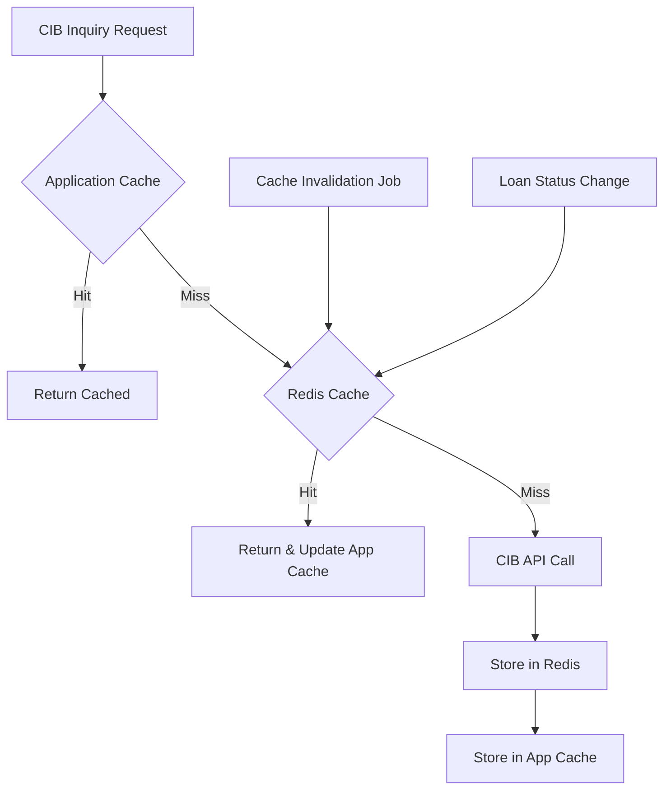

**Document Control**

| Field | Value |
|-------|-------|
| **Document Title** | CIB Caching Strategy |
| **Project Name** | Unisoft Loan Management System (ULMS) v2.0 |
| **Document Version** | 1.0 |
| **Date** | 2026-02-08 |
| **Prepared By** | Unisoft Technical Team |
| **Reviewed By** | Solution Architect |
| **Classification** | Internal |
| **Status** | Draft |

**Revision History**

| Version | Date | Author | Description |
|---------|------|--------|-------------|
| 1.0 | 2026-02-08 | Unisoft Team | Initial version |

---

# CIB Caching Strategy

## 1. Overview

### 1.1 Purpose
Optimize CIB inquiry performance and reduce API costs through intelligent caching of CIB responses while ensuring data freshness and compliance.

### 1.2 Caching Objectives
- Reduce CIB API calls by 70-80%
- Achieve < 100ms response for cached inquiries
- Ensure data freshness per regulatory requirements
- Minimize Bangladesh Bank CIB charges

## 2. Caching Architecture

### 2.1 Cache Layers



### 2.2 Cache Types

| Cache Type | Technology | TTL | Use Case |
|------------|------------|-----|----------|
| Application Cache | Caffeine | 1 hour | Frequently accessed |
| Distributed Cache | Redis | 24 hours | Cross-instance sharing |
| Stale Cache | Redis | 7 days | Fallback during outages |

## 3. Cache Key Design

### 3.1 Key Structure

```
# Individual CIB Report
cib:individual:{nid}:v1

# Company CIB Report  
cib:company:{bin}:v1

# Loan Application Composite
cib:loanapp:{loanApplicationId}:v1

# NID Validation
cib:nid:{nid}:validation:v1
```

### 3.2 Key Generation

```java
@Component
public class CibCacheKeyGenerator {
    
    private static final String INDIVIDUAL_PREFIX = "cib:individual";
    private static final String COMPANY_PREFIX = "cib:company";
    private static final String LOAN_APP_PREFIX = "cib:loanapp";
    private static final String NID_PREFIX = "cib:nid";
    private static final String VERSION = "v1";
    
    public String individualReportKey(String nid) {
        return String.format("%s:%s:%s", INDIVIDUAL_PREFIX, nid, VERSION);
    }
    
    public String companyReportKey(String bin) {
        return String.format("%s:%s:%s", COMPANY_PREFIX, bin, VERSION);
    }
    
    public String loanApplicationKey(Long loanApplicationId) {
        return String.format("%s:%d:%s", LOAN_APP_PREFIX, loanApplicationId, VERSION);
    }
    
    public String nidValidationKey(String nid) {
        return String.format("%s:%s:validation:%s", NID_PREFIX, nid, VERSION);
    }
    
    /**
     * Pattern for cache eviction by NID
     */
    public String individualReportPattern(String nid) {
        return String.format("%s:%s:*", INDIVIDUAL_PREFIX, nid);
    }
}
```

## 4. Cache Implementation

### 4.1 Redis Configuration

```java
@Configuration
@EnableCaching
public class CibCacheConfig {
    
    @Bean
    public RedisCacheManager cibCacheManager(
            ReactiveRedisConnectionFactory connectionFactory) {
        
        return RedisCacheManager.builder(connectionFactory)
            .cacheDefaults(RedisCacheConfiguration.defaultCacheConfig()
                .entryTtl(Duration.ofHours(24))
                .serializeKeysWith(RedisSerializationContext.SerializationPair
                    .fromSerializer(new StringRedisSerializer()))
                .serializeValuesWith(RedisSerializationContext.SerializationPair
                    .fromSerializer(new GenericJackson2JsonRedisSerializer())))
            .withCacheConfiguration("cibIndividualReports",
                RedisCacheConfiguration.defaultCacheConfig()
                    .entryTtl(Duration.ofHours(24)))
            .withCacheConfiguration("cibCompanyReports",
                RedisCacheConfiguration.defaultCacheConfig()
                    .entryTtl(Duration.ofHours(24)))
            .withCacheConfiguration("cibStaleReports",
                RedisCacheConfiguration.defaultCacheConfig()
                    .entryTtl(Duration.ofDays(7)))
            .build();
    }
    
    @Bean
    public ReactiveRedisTemplate<String, CibIndividualReport> cibReportRedisTemplate(
            ReactiveRedisConnectionFactory factory) {
        
        Jackson2JsonRedisSerializer<CibIndividualReport> serializer = 
            new Jackson2JsonRedisSerializer<>(CibIndividualReport.class);
        
        RedisSerializationContext<String, CibIndividualReport> context = 
            RedisSerializationContext.<String, CibIndividualReport>newSerializationContext(
                new StringRedisSerializer())
                .value(serializer)
                .build();
        
        return new ReactiveRedisTemplate<>(factory, context);
    }
}
```

### 4.2 Cache Service Implementation

```java
@Service
@RequiredArgsConstructor
@Slf4j
public class CibCacheService {
    
    private final ReactiveRedisTemplate<String, CibIndividualReport> reportRedisTemplate;
    private final ReactiveRedisTemplate<String, NidValidationResult> validationRedisTemplate;
    private final CibCacheKeyGenerator keyGenerator;
    
    private static final Duration DEFAULT_TTL = Duration.ofHours(24);
    private static final Duration STALE_TTL = Duration.ofDays(7);
    
    // ==================== Individual Report Cache ====================
    
    public Mono<CibIndividualReport> getIndividualReport(String nid) {
        String key = keyGenerator.individualReportKey(nid);
        
        return reportRedisTemplate.opsForValue()
            .get(key)
            .doOnNext(report -> log.debug("Cache hit for NID: {}", maskNid(nid)))
            .filter(this::isValid)
            .switchIfEmpty(Mono.defer(() -> {
                log.debug("Cache miss for NID: {}", maskNid(nid));
                return Mono.empty();
            }));
    }
    
    public Mono<CibIndividualReport> getIndividualReportStale(String nid) {
        String key = keyGenerator.individualReportKey(nid);
        
        return reportRedisTemplate.opsForValue()
            .get(key)
            .doOnNext(report -> log.warn("Returning stale cache for NID: {}", maskNid(nid)));
    }
    
    public Mono<Boolean> cacheIndividualReport(String nid, CibIndividualReport report) {
        String key = keyGenerator.individualReportKey(nid);
        
        return reportRedisTemplate.opsForValue()
            .set(key, report, DEFAULT_TTL)
            .doOnSuccess(success -> {
                if (success) {
                    log.debug("Cached CIB report for NID: {}", maskNid(nid));
                }
            });
    }
    
    public Mono<Long> invalidateIndividualReport(String nid) {
        String pattern = keyGenerator.individualReportPattern(nid);
        
        return reportRedisTemplate.keys(pattern)
            .collectList()
            .flatMap(keys -> {
                if (keys.isEmpty()) {
                    return Mono.just(0L);
                }
                return reportRedisTemplate.delete(keys.toArray(new String[0]));
            })
            .doOnSuccess(count -> log.info("Invalidated {} cache entries for NID: {}",
                count, maskNid(nid)));
    }
    
    // ==================== NID Validation Cache ====================
    
    public Mono<NidValidationResult> getNidValidation(String nid) {
        String key = keyGenerator.nidValidationKey(nid);
        
        return validationRedisTemplate.opsForValue()
            .get(key)
            .filter(result -> !isExpired(result));
    }
    
    public Mono<Boolean> cacheNidValidation(String nid, NidValidationResult result) {
        String key = keyGenerator.nidValidationKey(nid);
        return validationRedisTemplate.opsForValue().set(key, result, DEFAULT_TTL);
    }
    
    // ==================== Batch Operations ====================
    
    public Mono<Long> invalidateByLoanApplication(Long loanApplicationId) {
        String key = keyGenerator.loanApplicationKey(loanApplicationId);
        return reportRedisTemplate.delete(key);
    }
    
    public Mono<Long> invalidateAll() {
        return reportRedisTemplate.keys("cib:*")
            .collectList()
            .flatMap(keys -> {
                if (keys.isEmpty()) return Mono.just(0L);
                return reportRedisTemplate.delete(keys.toArray(new String[0]));
            })
            .doOnSuccess(count -> log.info("Invalidated all {} CIB cache entries", count));
    }
    
    // ==================== Helper Methods ====================
    
    private boolean isValid(CibIndividualReport report) {
        return report.getExpiresAt() == null || 
               report.getExpiresAt().isAfter(LocalDateTime.now());
    }
    
    private boolean isExpired(NidValidationResult result) {
        return result.getValidatedAt().plusDays(30).isBefore(LocalDateTime.now());
    }
    
    private String maskNid(String nid) {
        if (nid == null || nid.length() < 8) return "****";
        return nid.substring(0, 4) + "****" + nid.substring(nid.length() - 4);
    }
}
```

### 4.3 Local Application Cache

```java
@Configuration
public class CibLocalCacheConfig {
    
    @Bean
    public CacheManager cibLocalCacheManager() {
        CaffeineCacheManager cacheManager = new CaffeineCacheManager();
        cacheManager.setCaffeine(Caffeine.newBuilder()
            .maximumSize(10000)
            .expireAfterWrite(Duration.ofHours(1))
            .recordStats());
        return cacheManager;
    }
    
    @Cacheable(value = "cibIndividualReports", 
               key = "#nid", 
               unless = "#result == null")
    public CibIndividualReport getFromLocalCache(String nid) {
        // This method is used to define cache behavior
        return null;
    }
}
```

## 5. Cache Invalidation Strategies

### 5.1 Event-Based Invalidation

```java
@Component
@RequiredArgsConstructor
public class CibCacheInvalidationListener {
    
    private final CibCacheService cacheService;
    
    /**
     * Invalidate cache when loan is disbursed
     * (CIB status changes after disbursement)
     */
    @EventListener
    public void onLoanDisbursed(LoanDisbursedEvent event) {
        Loan loan = event.getLoan();
        
        // Invalidate borrower cache
        cacheService.invalidateIndividualReport(
            loan.getClient().getNid());
        
        // Invalidate co-borrowers
        loan.getCoBorrowers().forEach(coBorrower -> 
            cacheService.invalidateIndividualReport(coBorrower.getNid()));
        
        // Invalidate guarantors
        loan.getGuarantors().forEach(guarantor -> 
            cacheService.invalidateIndividualReport(guarantor.getNid()));
    }
    
    /**
     * Invalidate cache when loan becomes non-performing
     */
    @EventListener
    public void onLoanClassified(LoanClassifiedEvent event) {
        if (event.getNewClassification().isNonPerforming()) {
            cacheService.invalidateIndividualReport(
                event.getLoan().getClient().getNid());
        }
    }
    
    /**
     * Invalidate cache when payment is made
     * (May improve credit score)
     */
    @EventListener
    public void onLoanRepayment(LoanRepaymentEvent event) {
        // Delayed invalidation - score may not update immediately
        cacheService.invalidateIndividualReport(
            event.getLoan().getClient().getNid()).delayElement(
                Duration.ofHours(1));
    }
}
```

### 5.2 Scheduled Invalidation

```java
@Component
@RequiredArgsConstructor
public class CibCacheMaintenanceJob {
    
    private final CibCacheService cacheService;
    private final CibRequestRepository requestRepository;
    
    /**
     * Clear expired entries daily at midnight
     */
    @Scheduled(cron = "0 0 0 * * ?")
    public void clearExpiredEntries() {
        log.info("Running CIB cache maintenance");
        
        // Redis handles TTL expiration automatically
        // This job can be used for additional cleanup if needed
        
        // Clear old request history (keep 90 days)
        LocalDateTime cutoff = LocalDateTime.now().minusDays(90);
        requestRepository.deleteByRequestTimeBefore(cutoff);
        
        log.info("CIB cache maintenance completed");
    }
    
    /**
     * Force refresh of frequently accessed but old reports
     */
    @Scheduled(cron = "0 0 2 * * ?")
    public void refreshStaleReports() {
        // Implementation for proactive refresh
    }
}
```

## 6. Cache Metrics and Monitoring

### 6.1 Cache Statistics

```java
@Component
@RequiredArgsConstructor
public class CibCacheMetrics {
    
    private final MeterRegistry meterRegistry;
    private final ReactiveRedisConnectionFactory redisFactory;
    
    @PostConstruct
    public void registerMetrics() {
        // Hit rate gauge
        Gauge.builder("cib.cache.hit.rate", this, 
                m -> calculateHitRate())
            .description("CIB cache hit rate")
            .register(meterRegistry);
        
        // Cache size gauge
        Gauge.builder("cib.cache.size", this,
                m -> getCacheSize())
            .description("Number of entries in CIB cache")
            .register(meterRegistry);
        
        // TTL average
        Gauge.builder("cib.cache.ttl.avg", this,
                m -> getAverageTtl())
            .description("Average TTL of cache entries")
            .register(meterRegistry);
    }
    
    private double calculateHitRate() {
        CacheStats stats = getCacheStats();
        long hits = stats.hitCount();
        long misses = stats.missCount();
        return (double) hits / (hits + misses);
    }
}
```

### 6.2 Alert Configuration

```yaml
# Alert when cache hit rate drops
alerts:
  cib-cache:
    - name: low-hit-rate
      condition: cib.cache.hit.rate < 0.7
      duration: 5m
      severity: warning
      message: "CIB cache hit rate below 70%"
    
    - name: cache-full
      condition: cib.cache.size > 9000
      severity: critical
      message: "CIB cache approaching maximum size"
```

## 7. Caching Best Practices

### 7.1 Caching Guidelines

| Scenario | Cache? | TTL | Notes |
|----------|--------|-----|-------|
| Pre-disbursement check | Yes | 1 hour | May change quickly |
| Annual review | Yes | 24 hours | Stable for review period |
| Guarantor check | Yes | 6 hours | Moderate volatility |
| NID validation | Yes | 30 days | Rarely changes |
| Batch report lookup | Yes | 1 hour | Post-lookup caching |
| CIB score only | Yes | 12 hours | Score changes slowly |

### 7.2 Cache Warming

```java
@Component
@RequiredArgsConstructor
public class CibCacheWarmer {
    
    private final CibCacheService cacheService;
    private final CibApiClient apiClient;
    private final LoanRepository loanRepository;
    
    /**
     * Warm cache for active loan portfolio
     * Runs during low-traffic hours
     */
    @Scheduled(cron = "0 0 3 * * SUN") // Sunday 3 AM
    public void warmCacheForActiveLoans() {
        log.info("Starting CIB cache warming");
        
        loanRepository.findActiveLoanNids()
            .buffer(100)
            .flatMap(nids -> Flux.fromIterable(nids)
                .flatMap(nid -> apiClient.inquireIndividual(
                    CibIndividualInquiryRequest.builder()
                        .nid(nid)
                        .inquiryPurpose(InquiryPurpose.ANNUAL_REVIEW)
                        .build())
                    .flatMap(report -> cacheService.cacheIndividualReport(nid, report))
                    .onErrorResume(e -> {
                        log.warn("Failed to warm cache for NID: {}", nid);
                        return Mono.empty();
                    })
                    .subscribeOn(Schedulers.boundedElastic()),
                    10) // Concurrency 10
            )
            .subscribe();
        
        log.info("CIB cache warming initiated");
    }
}
```

---

## Appendices

### A.1 Cache Size Estimates

| Entry Type | Size (KB) | 10K Entries | 100K Entries |
|------------|-----------|-------------|--------------|
| Individual Report | ~5 | ~50 MB | ~500 MB |
| Company Report | ~10 | ~100 MB | ~1 GB |
| NID Validation | ~1 | ~10 MB | ~100 MB |

### A.2 Redis Memory Configuration

```conf
# redis.conf for CIB cache
maxmemory 2gb
maxmemory-policy allkeys-lru
```
